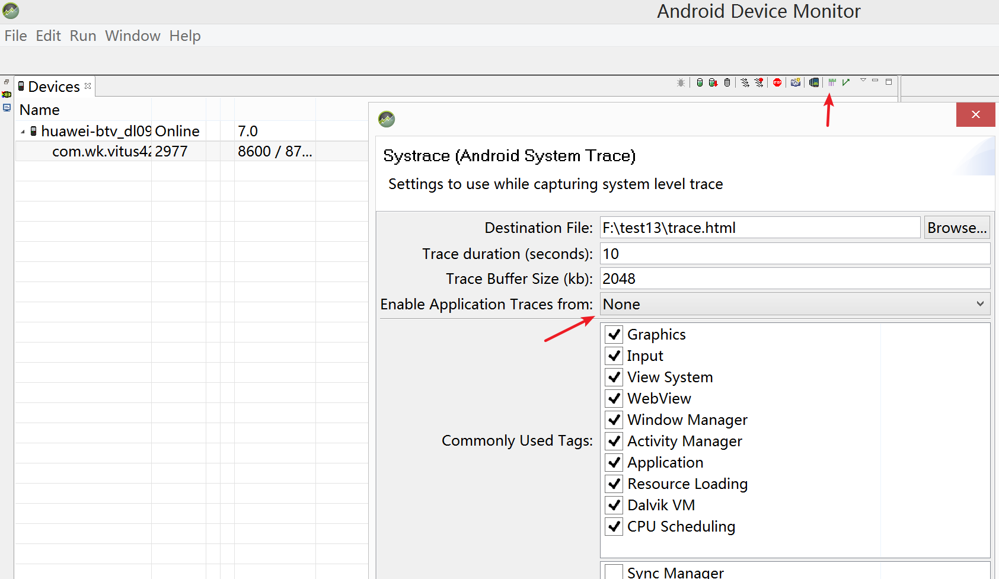
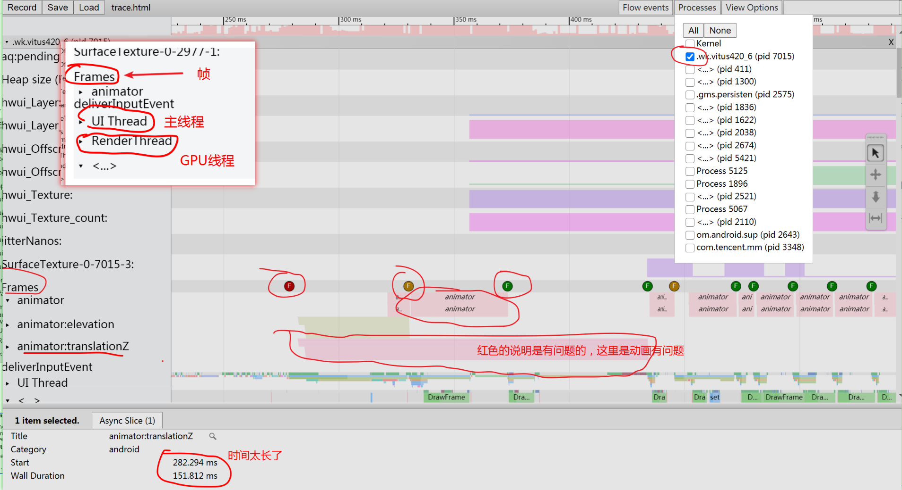
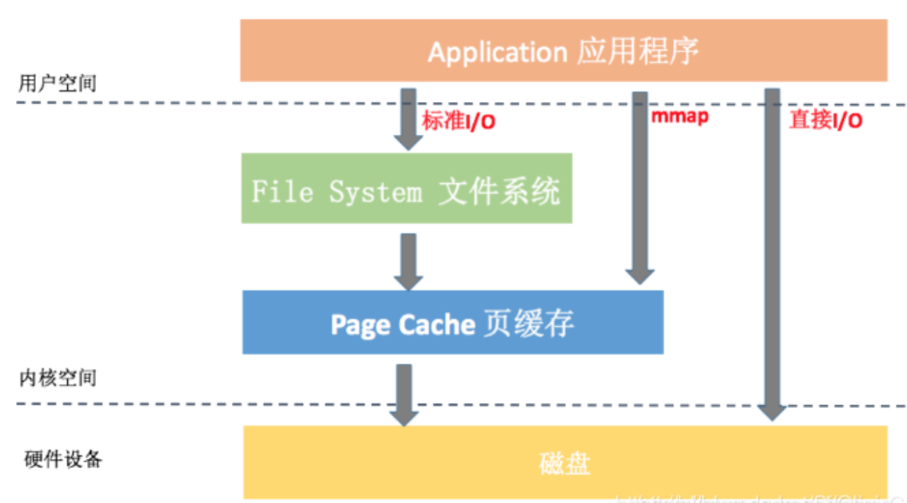

# App 优化 , APM
应用的性能优化，需要建立一套成体系的性能优化方案，
这套方案被业界称为 APM (Application Performance Manange)。


# 绘制优化 （完成）
```text
在 Android 的每个 View 都会经过 Measure 和 Layout 
来确定当前需要绘制的View所在的大小和位置，
然后通过 Draw 绘制到 surface 上。
在 Android 系统中整体的绘制源码是在 ViewRootImpl.performTraversals()方法，
通过这个方法可以看出 Measure 和 Layout 都是递归来获取View的大小和位置，
并且以深度作为优先级。
显然，层级越深，元素越多，耗时就越长。

所以，绘制优化最终的问题会转化为 布局优化 和卡顿优化。
```

##  绘制类型
```text
Android 支持两种绘制方式 ，即 软件绘制（CPU）、硬件绘制（GPU）

硬件加速从 Android 3.0 开始支持，它在UI显示和绘制效率方面远高于软件绘制。
但它的局限如下：
耗电：GPU功耗高于CPU。
兼容性：不兼容某些接口和函数。
内存大：使用 OpenGL 的接口需要占用较大内存。
```


# 布局优化  (完成)
```text
布局优化的核心问题就是要解决因布局渲染性能不佳而导致的应用卡顿问题。
卡顿优化可以看做是卡顿优化的子集。
```

##  卡顿分析工具 Systrace ，查看耗时/掉帧
```text
Systrace 是 Android4.1 中 新增的性能数据采样和分析工具。
它可帮助开发者收集 Android 关键子系统（如 SurfaceFlinger/ Kernel/Input/Display 
等 Framework 部分关键模块、服务，View系统等）的运行信息，
从而帮助开发者更直观的分析系统瓶颈，改进性能。

Systrace 的原理是在系统的一些关键链路插入一些信息(称之为Label)
( 系统的渲染的关键步骤都有framework预置的label )，
通过Label的开始和结束来确定某个核心过程的执行时间，
然后把这些Label信息收集起来得到系统关键路径的运行时间信息，
进而得到整个系统的运行性能信息。

系统版本越高，Android Framework中添加的系统可用Label就越多，
能够支持和分析的系统模块也就越多；
因此，在可能的情况下，尽可能使用高版本的Android系统来进行分析；
然后对待分析的App也有一个限制——需要是debuggable的。

// 打开 Systrace 
由于Androidstudio 不方便找到或者找不到 Systrace的入口，
所以建议 去 F:\sdk2\tools\monitor.bat  双击打开

在启动trace前指定采集哪些系统预置的标签。 
Graphics: Graphic系统的相关信息，包括SerfaceFlinger，
VSYNC消息，Texture，RenderThread等；用来分析卡顿。
View System: View绘制系统的相关信息，比如onMeasure，onLayout等；用来分析卡顿。
Activity Manager:  ActivityManager调用的相关信息；用来分析Activity的启动过程。
Dalvik VM: 虚拟机相关信息，比如GC停顿等。
CPU Scheduling: CPU调度的信息；你能看到CPU在每个时间段在运行什么线程；线程调度情况，比如锁信息。

在 Chrome浏览器  地址栏输入 chrome://tracing ，
(没启动这个服务，trace.html 打开有时是空白的)
然后将生成的trace.html文件拖进来，或者通过load按钮导入。
常用快捷键说明：
W: 放大横轴，用于查看耗时方法细节；
S: 缩小横轴，用于查看整体情况；
A： 将面板左移； （左右的方向键也可以移动）
D: 将面板右移；
M: 高亮某一段耗时内容。

找到自己APP包名的进程
右侧有一行写有F的圈圈，表示每个Frame的综合评价。
如果是绿色，表示这一帧的渲染是ok的。如果是红色或者黄色，表示渲染超时了。 
点击这个F圆圈，在下部的窗口中会展示一些详细信息。
如果这一帧的渲染没有任何问题，下面的内容是空的；
如果这一帧有问题，会展示Alert信息。

但是要注意的是 Systrace 只是能看到出错的类型和修改思路，
并不能像在Androidstudio里面如果报错可以精确到具体的代码行。
```





## 布局优化 常规方案
### 减少层级
```text
由于Android的碎片化程度很高，所以使用 RelativeLayout 能使构建的布局适应性更强。
约束布局 ConstraintLayout 比 RelativeLayout 相比，能消除一些冗余布局。
```

### 布局复用
```
```

###  避免过度绘制
```text
导致过度绘制的主要原因是：
XML布局：控件有重叠且都有设置背景。
View自绘：View.OnDraw里面同一个区域被绘制多次。

过度绘制检测工具
打开手机开发者选项中的Show GPU Overdraw选项，
会有不同的颜色来表示过度绘制次数，
依次是无、蓝、绿、淡红、深红，分别对应0-4次过度绘制。
```

### 合理的刷新机制
```text
1、减少刷新次数
控制刷新频率、避免没有必要的刷新。

2、缩小刷新区域
如自定义View一般采用 invalidate 方法刷新，可以用以下重载方法刷新要刷新的区域：
invalidate(Rect dirty);
invalidate(int left, int top, int right, int bottom);

3、避免后台线程的影响
如通过监听 ListView的onScrollStateChanged事件，
在滚动时暂停图片下载线程工作，结束后再开始，可以提高ListView的滚动平滑度。
```


## 布局优化 第三方框架方案
```text
可以采用一些第三方的UI库，例如
1、facebook 的异步布局框架 Litho

2、掌阅的 X2C 
•读取xml很耗时
•递归解析xml较耗时
•反射生成对象的耗时是new的3倍以上
X2C方案 在编译生成APK期间，将需要翻译的layout翻译生成对应的java文件，
这样对于开发人员来说写布局还是写原来的xml，
但对于程序来说，运行时加载的是对应的java文件。
```


## 布局优化 用到了哪些工具
```text
1、线下工具 LayoutInspector 、 Systrace

2、利用 系统 api Choreographer 的 FrameCallback 回调接口 监控 fps ，然后上传到自己服务器。
fpsviewer 就是基于 Choreographer 开发的。
此外我们还可以用第三方的监控服务 ，例如 微信的 matrix 。
```

## 布局为什么可能会卡顿，你又是如何优化的？
```text
以下四点可能会导致布局卡顿：
1、系统会将我们的Xml文件通过IO的方式映射的方式加载到我们的内存当中，而IO的过程可能会导致卡顿。
针对布局加载Xml文件的优化，我们使用了异步Inflate的方式，即 AsyncLayoutInflater。
它的核心原理是在子线程中对我们的Layout进行加载，而加载完成之后会将View通过Handler发送到主线程来使用。
所以不会阻塞我们的主线程，加载的时间全部是在异步线程中进行消耗的。

2、布局加载的过程是一个反射的过程，而反射的过程也会可能会导致卡顿。
我们发现了一个从根源解决上述痛点的方式，即使用X2C框架。
它的一个核心原理就是在开发过程我们还是使用的XML进行编写布局，
但是在编译的时候它会使用APT的方式将XML布局转换为Java的方式进行布局，
通过这样的方式去写布局，它有以下优点：
①、它省去了使用IO的方式去加载XML布局的耗时过程。
②、它是采用Java代码直接new的方式去创建控件对象，所以它也没有反射带来的性能损耗。
这样就从根本上解决了布局加载过程中带来的问题。

3、这个布局的层级如果比较深，那么进行布局遍历的过程就会比较耗时。
我们可以使用 ConstraintLayout 去减少我们界面布局的嵌套层级，如果原始布局层级越深，
它能减少的层级就越多。而使用它也能避免嵌套RelativeLayout布局导致的重绘次数过多。

4、最后，不合理的嵌套RelativeLayout布局也会导致重绘的次数过多。
我们可以使用 AspectJ 框架（即AOP）和 LayoutInflaterCompat.setFactory2 
的方式分别去建立线下全局的布局加载速度和控件加载速度的监控体系。
发现不合理的嵌套从而进行优化。
```

## 做完布局优化有哪些成果产出？
```text
1、首先，我们建立了一个体系化的监控手段，
针对线下，我们使用AOP或者ARTHook，可以很方便地获取到每一个布局的加载耗时以及每一个控件的加载耗时。
针对线上，我们通过 Choreographer.getInstance().postFrameCallback的方式收集到了FPS，
这样我们可以知道用户在哪些界面出现了丢帧的情况。

2、在每一个版本上线之前，我们都会对我们的核心路径进行一次Review，
确保我们的FPS、布局加载时间、布局层级等达到一个合理的状态。
```


# 卡顿优化 （完成）
```text
卡顿的按场景可以分成：UI绘制、应用启动、页面跳转、事件响应。

造成卡顿的根本原因可以分为两大类：
1、界面绘制
页面复杂 、绘制层级深 、刷新不合理

2、数据处理
数据处理在UI线程 、
占用CPU高，导致主线程拿不到时间片
内存增加导致GC频繁，从而引起卡顿
```


##  UI流畅度优化 、界面卡顿 排查及优化
Skipped 60 frames!  The application may be doing too much work on its main thread.
```text
在大部分Android平台的设备上，Android系统是 16ms (1000 /60 = 16.67 ) 刷新一次，也就是一秒钟60帧。 
要达到这种刷新速度就要求在ui线程中处理的任务时间必须要小于16ms，如果ui线程中处理时间长，
就会导致跳过帧的渲染，也就是导致界面看起来不流畅，卡顿。
```

## 卡顿引起的具体原因
```text
1、cpu 占用过高，容易卡顿 。一般是 后台线程处理的东西太繁忙。
注意逻辑的优化，线程不要空跑。

2、主线程 绘制时间过长。
UI的层级别太大 ，不要冗余嵌套 
```

## 卡顿检测 Choreographer
```text
使用 Androidstudio 自带的 工具，和一些第三方的监控工具 例如 BlockCanary 就差不多了。

// FPS ( Frames Per Second )
即 Frame Rate，单位 fps，是指 gpu 生成帧的速率 ，Android中更帧率相关的类是 SurfaceFlinger 。
SurfaceFlinger (SurfaceFlinger.h) 是Android的一个 native进程 ，
接受多个来源的图形显示数据，将他们合成，然后发送到显示设备。

// VSync (Synchronization ) ,垂直同步 信号。
Android系统每隔16ms发出 VSync 信号，触发对UI进行渲染，
Android 4.1 开始引入 VSync 机制，用来同步渲染，
让 UI 和 SurfaceFlinger 可以按硬件产生的 VSync 节奏进行工作。

WkHeartBeatTool wkHeartBeatTool =  new WkHeartBeatTool();
wkHeartBeatTool.startTheBeatAction(new HeartBeatTask() {
    @Override
    public void run() {
        // 一秒钟统计一次 ，如果小于 60 ，就说明掉帧了
        WkLogTool.showLog("fps===="+count);
        count= 0 ;
    }
} ,1000);

// Choreographer 编舞者 ，统计一秒内 count 的数量 ，
Choreographer.getInstance()
        .postFrameCallback( new Choreographer.FrameCallback() {
            // frameTimeNanos: The time in nanoseconds when the frame started being rendered,
            @Override
            public void doFrame(long frameTimeNanos) {
                count++ ;
                Choreographer.getInstance().postFrameCallback(this);
            }
        });
```


## 排查 线上App ,用户反馈卡顿的问题
```text
1、记录用户的使用机型和使用场景。例如操作流程、网络环境
2、加入卡顿检测机制，有第三方的 SDK 也可以自己写 ，
将卡顿时的堆栈信息记录并回传，定位分析。
```


# 启动优化 （完成）
启动速度是用户对我们App的第一体验，如果启动速度过慢，用户第一印象就会很差。

## 启动卡顿常见现象
```text
1、点击图标很久都不响应
这是因为预览窗口被禁用或设置为透明。

2、首页显示太慢
因为初始化任务太多。

3、首页显示后无法进行操作
太多延迟初始化任务占用主线程CPU时间片。
```

## 查看 APP 启动耗时
```text
1、在Android Studio Logcat中过滤关键字“ Displayed ” (线下使用，时间精确)
会打印出对应的 activity 启动耗时时间 。

2、用 adb 查看  (时间不是特别精确)
// adb shell am start -W 包名/Activity全路径
adb shell am start -W com.aivin.myapp/com.test.activity.MainActivity
会打印出以下三个参数
ThisTime: 1138 // 最后一个Activity启动耗时
TotalTime: 1138  // 所有耗时，包括创建进程 + Application初始化 + Activity初始化到界面显示的过程。
WaitTime: 1153 // AMS 启动Activity的总耗时, 即系统启动应用耗时。

3、 代码打点/函数插桩 （可控部分插入时间统计代码） 
这里严格说来并不是APP的启动耗时，而是只能统计到核心部分的耗时操作。

3、AOP 切面编程 打点
AOP(Aspect Oriented Programming) ，
Android 端有 第三方工具 AspectJX 。
在android中配置aspectj比较麻烦，
可以直接参考这个 
https://github.com/HujiangTechnology/gradle_plugin_android_aspectjx
```

## 启动速度分析工具 — TraceView
```text
1、使用方法1
代码中添加：Debug.startMethodTracing()、检测方法、Debug.stopMethodTracing()。
运行过一段时间后，将生成的 .trace 导出到电脑，
然后用 Android Studio的 Profiler 进行加载后进行分析。
load from file...

2、或者直接将手机连接上电脑，直接调试，用 Android Studio的 Profiler 进行实时查看。
打开 Profiler  ->  CPU   ->    点击 Record   ->  点击 Stop  ->  
查看Profiler下方Top Down/Bottom Up 区域，以找出耗时的热点方法。
```

2017华语辩论老友赛  完整辩词

## 冷启动
```text
冷启动就是从0开始启动 App 。
从点击应用图标到UI界面完全显示且用户可操作的全部过程。

用户进行了一个点击操作，这个点击事件它会触发一个 IPC 的操作，
之后便会执行到 Process 的 start 方法中，这个方法是用于进程创建的，
接着便会执行到 ActivityThread 的 main 方法，这个方法可以看做是我们单个App进程的入口，
相当于Java进程的main方法，在其中会执行消息循环的创建与主线程 Handler 的创建，
创建完成之后，就会执行到 bindApplication 方法，在这里使用了反射去创建 Application 
以及调用了 Application相关的生命周期，Application结束之后，
便会执行Activity的生命周期，在Activity生命周期结束之后，
最后，就会执行到 ViewRootImpl，这时才会进行真正的一个页面的绘制。

// 冷启动涉及的相关任务
 ->  启动App  ->  加载空白Window  -> 创建进程
 ->  创建Application ->  启动主线程  ->  创建 MainActivity
 ->  加载布局 ->  布置屏幕  -> 首帧绘制
通常到了界面首帧绘制完成后，我们就可以认为启动已经结束了。
```

### 冷启动优化
```text
优化方向主要就是 Application 和 Activity 的生命周期 这个阶段。
1、Application中对 第三方的SDK进行异步或延时初始化 。
2、做一个闪屏界面。在展示的这段时间里，去加载下一页需要的资源。
```


## 热启动优化
```text
直接从后台切换到前台。

// 热启动优化
在app 退出时 不要finish ，而是 moveTaskToBack ，即模拟 HOME按键的事件 。
```
 
## 温启动优化
```text
当启动应用时，后台已有该应用的进程，
在已有进程的情况下，会从已有的进程中来启动应用 。
只会重走 Activity 的生命周期，而不会重走进程的创建，
也不走 Application 的创建与生命周期等。
```

## 启动优化 方案总结
### 闪屏页优化
```text
消除启动时的白屏/黑屏，市面上大部分App都采用了这种方法，非常简单，
但是这只是一个障眼法，并不会缩短实际冷启动时间。
```


### 懒加载第三方库
```text
对项目中用到的库进行按需初始化，特别是针对于一些应用启动时不需要初始化的库，
可以等到用时才进行加载，减少启动时间。
```


### 延迟初始化
```text
利用 IdleHandler特性 (闲时机制)  ，在CPU空闲时执行，对延迟任务进行初始化。
```


### 异步初始化
```text
核心思想是子线程分担主线程任务，并行减少时间。
如果有依赖关系，可以使用 CountDownLatch 来控制等待最后完成。
```


### 对 Multidex 进行预加载优化 ( 减少 ANR ，并不是减少启动速度)
之所以写在这里，是为了兼顾一下其他博客的节奏。
```text
dex的install过程比较复杂，容易引起ANR的发生。
注意：很多博客说 对 Multidex 进行优化是可以减少启动时间，其实是减少 ANR 的。 
方法思路一般有两种，1是开子线程去加载，2 是开子进程去加载 
https://github.com/hnyer/MultiDexTest
```


### 类预加载优化、Activity 预加载
```text
省略加载类的时间，做到极致。但是大部分APP业务都做不完，没这个必要做这些。
```


### WebView 启动优化
```text
因为 WebView 第一次创建比较耗时，所以可以预先创建WebView，提前将其初始化。
而且要使用WebView缓存池，用到WebView的地方都从缓存池取，缓存池中没有缓存再创建。
本地预置 html 和 css ，WebView创建的时候先预加载本地html，之后通过js脚本填充内容部分。
减少 html 和css 从网络下载的等待时间。
```


### 页面数据预加载
```text
在主页空闲时，将其它页面的数据先准备好，
等到打开该页面时，就直接从内存或数据库取数据并显示。
尤其是针对那些需要从网络读取的内容。
例如pc端的浏览器，有的会有一个预加载功能。
```


### 主页的绘制优化
```text
针对布局和绘制进行优化，减少加载和渲染时间。
```


### 启动阶段抑制GC （普通APP 难搞、成本高，难度大）
```text
启动时 GC 抑制，允许堆一直增长，直到开发人员主动停止 GC 抑制或者 OOM 停止 GC 抑制，
这是一种"空间换时间"策略，用更多的内存消耗来换取启动时间的缩短，
这种策略可行有两个前提：
一是设备厂商没有加密内存中的 Dalvik 库文件，
二是设备厂商没有改动 Google 的 Dalvik 源码（或者少量的改动），
理论上通过白名单的方式可以覆盖所有设备，但是实现和维护成本都非常高。
```


###  CPU锁频（普通APP 难搞，没权限）
```text
一个设备的CPU通常都是4核或者8核，
但是应用在一般情况下对CPU的利用率并不高，可能只有30%或者50%，
如果我们在启动速度暴力拉伸CPU频率，以此提高CPU的利用率，
那么，应用的启动速度会提升不少。

在Android系统中，CPU相关的信息存储在/sys/devices/system/cpu目录的文件中，
通过对该目录下的特定文件进行写值，
实现对CPU频率等状态信息的更改。
```


### IO优化 
```text
1、启动过程不建议出现网络IO。
2、只读取启动中用到的数据。
```


### 数据重排 
```text
Dex 文件用到的类和APK里面各种资源文件都比较小，
读取频繁，且磁盘地址分布范围比较广。
我们可以利用Linux文件IO流程中的page cache机制
将它们按照读取顺序重新排列在一起，以减少真实的磁盘IO次数。

1、使用 Facebook 的 ReDex 的Interdex调整类在Dex中的排列顺序。
2、资源文件重排  （普通APP用不上）
最佳方案是修改内核源码，实现统计、度量、自动化，其次也可以使用Hook框架进行统计得出资源加载顺序列表。
```


### 1
```text

```


### 1
```text

```


### 1
```text

```

 

 


 


# IO 优化  （完成）
```text
使用事务进行批量数据操作： 
数据库操作的本质是对磁盘文件的操作，
频繁操作文件是一个耗时操作，影响数据库的存取速度。
使用事务会降低数据库文件的开关频率，从而节约操作时间。
```

## IO 相关的概念
```text
虚拟文件系统（VFS） ：
屏蔽具体的文件系统，为应用程序的操作提供统一的接口;

页缓存（Page Cache）:
文件系统对数据的缓存，目的是提升内存命中率;

Buffer Cache : 
磁盘对数据的缓存，目的是合并部分文件系统的 I/O 请求、降低磁盘 I/O 的次数,
后来它也合并到 Page Cache 中的 Buffer Page 了;
```


## I/O 有时候为什么会突然很慢？
```text
1、内存不足。
内存不足的时候，系统会回收 Page Cache 和 Buffer Cache 的内存，
大部分的写操作会直接落盘，导致性能低下； 

2、写入放大。
写入放大（ Write amplification，简称WA ）是闪存和固态硬盘（SSD）中一种不良的现象，
即实际写入的物理数据量是写入数据量的多倍。 [1]
闪存重复写入需要先进行擦除，擦除操作的基本单元是 block 块，
一个 page 页的写入操作将会引起整个块数据的迁移，这就是典型的写入放大现象，
低端机或者使用比较久的设备，由于磁盘碎片多、剩余空间少，非常容易出现写入放大的现象。 

3、配置不够。
低端机的 CPU 和闪存的性能相对也较差，在高负载的情况下容易出现瓶颈。
```

## I/O 性能评估指标
```text
// 磁盘吞吐量
每秒磁盘I/O的流量，即磁盘写入加上读出的数据的大小。

//存储 IOPS ( Input/Output Operations Per Second )
磁盘IOPS是指一秒内磁盘进行多少次I/O读写；
```


## io 类型

标准IO 、 MMAP 、直接IO ;
BIO 、 NIO
```text
// BIO ( Blocking I/O  )  
一个线程里只能处理一个socket，就算accept了多个也没用，
前一个socket被阻塞了，后面的是无法被执行到的。

// NIO ( Non-blocking I/O): 
NIO是一种同步非阻塞的I/O模型，在Java 1.4 中引入了NIO框架，对应 java.nio 包。
使用非阻塞IO的话，一到两个线程基本上就够了，因为线程不会产生阻塞，
好比一下接收A请求的数据，另一下接收B请求的数据，等等，
就是不停地东奔西跑，直接到把数据接收完了。
```




## IO 监控工具
```text
腾讯开源工具 Matrix ，
https://github.com/Tencent/matrix#matrix_cn
IO Canary 性能、泄漏全面监控，对 IO 质量心中有数
```


## IO优化措施
### 对大文件使用 mmap 或者 nio 方式。
```text
 ...
```


### 安装包不压缩。
```text
对启动过程需要的文件，我们可以指定在安装包中不压缩，
这样也会加快启动速度，但带来的影响是安装包体积增大。
```


### Buffer 复用 
```text
我们可以利用 Okio 开源库，
它内部的 ByteString 和 Buffer 通过重用等技巧，
很大程度上减少 CPU 和内存的消耗。
```


###  存储结构和算法的优化 
```text
通过算法或者数据结构的优化，让我们可以尽量的少 I/O 甚至完全没有 I/O, 
比如一些配置文件从启动完全解析，改成读取时才解析对应的项；
替换掉 XML、JSON 这些格式比较冗余、性能比较较差的数据结构;
```
 

 

# 存储优化 （完成）
## 需要优化存储的原因
```text
1、储存耗时较长
2、线程不安全
3、有潜在的 ANR 
4、不支持跨进程。
```
 

## 常用的存储方案
### SharedPreferences
```text
用来存储一些比较小的键值对集合 。简单，轻量。
多线程安全，但是跨进程不安全
```


### ContentProvider
```text
四大组件之一，提供不同进程甚至不同应用程序之间共享数据的机制；
```


### DataStore
```text
DataStore 是 Jetpack 中的一员。
```


### MMKV
```text
腾讯开源的第三方工具。口碑还不错。
```

### SQLite
```text
数据库存储
```

### 文件存储
```text

```

 


 

## 存储优化的方向
### 稳健正确性优化
```text
是否能无错误地进行读取和恢复。
是否完善支持多线程和多进程的场景。
```

### 存储时间开销优化
```text
包括CPU时间和IO时间。
如编解码或加解密过于复杂，会影响CPU时间；
```


### 存储空间开销优化
```text
相同数据使用不同编码方式，占用的存储空间也会不同；（如 XML > JSON > Protocol Buffer）
还可引入压缩策略进一步减小存储空间.如 zip 、 lzma
还需考虑内存空间占用量，是否会导致大量GC，OOM等
```


### 存储数据安全优化
```text
一些敏感数据需加密，防止别人查看。
根据敏感度，数据量大小的不同，选择不同的加密方式。
```


### 存储兼容性优化
```text
需要考虑 向前向后兼容，老数据在升级时是否能迁移过来，新数据在老版本能否降级使用 。
存储的数据是否方便迁移到其他平台。
```


### 开发时间成本优化
```text
有些存储方案虽高大上，但业务落地成本高，尽量做到无缝接入，缩减开发成本 。
```


# 网络优化 （完成）
## 网络优化的意义
```text
等待网络是我们 App 最大的性能瓶颈，
再怎么优化绘制、内存、卡顿或其它方面，也抵不上网络优化,
而网络优化最核心的处理方式就是 
消除和减少不必要的网络延迟，把传输的字节数降到最少。
```

## 网络性能指标
###  速率
```text
// 速率 
即 bps <==>  bit/s
为什么电信拉的 100M 光纤，测试峰值速度只有 12M 每秒？
网络常用单位是 Mbps ，因此这里的 100M 指的是 100 Mbps。
100 M/S = 100 Mbps = 100 Mbit/s
100 Mbit/s = （100/8）MB/s = 12.5 MB/s
```

### 时延
```text
// 发送时延
发送时延 = 数据长度（bit）/ 发送速率（bit/s）

// 传输时延
传播时延 = 传输路径距离 / 传播速率（bit/s）

// 排队时延
数据包在网络设备中等待被处理的时间，
例如路由器需要一个一个处理完前面的数据包才能处理后面的。

// 处理时延
数据包到达设备或者目的机器被处理所需的时间。
总时延 = 发送时延 + 排队时延 + 传播时延 + 处理时延
```


###  往返时间 RTT （Route-Trip Time）
```text
评估网络质量的一项重要指标。
表示数据报文在端到端通信中来回一次的时间。
通常使用 ping 命令查看 RTT
```

### 带宽
```text
逻辑或物理通通信路径的最大吞吐量。
```

## 网络监听优化常用工具
### Network Profiler
```text
使用 Androidstudio 自带的 监控工具 Profiler，其中有 网络监控模块。
```


### 第三方抓包工具  charles ( 小茶壶 )
```text
https://www.charlesproxy.com/download/
```


### 第三方抓包工具 Wireshark
```text
https://www.wireshark.org
```


###  Linux 命令工具 TcpDump
```text
yum install -y tcpdump
```


###  Facebook 的工具 Stetho
```text
http://facebook.github.io/stetho/
Stetho 是Facebook推出的一款
使用 Chrome 来调试Android Application的工具。
最主要的用途：查看数据库、查看网络
```


### NetworkStatsManager  ( Android api )
```text
Android 6.0（API23）中新增加 NetworkStatsManager，
提供网络使用历史统计信息， 可查询指定时间间隔内的统计信息。
```


### TrafficStats ( Android api )
```text
android2.2 加入了 TrafficStats类，
可以轻松获取流量信息，
TrafficStats 类也是读取 Linux 提供的文件对象系统类型的文本进行解析。

// 从开机开始Mobile网络接收的字节总数，不包括Wifi
getMobileRxBytes()        
// 从开机开始所有网络接收的字节总数，包括Wifi
getTotalRxBytes()     
// 从开机开始Mobile网络发送的字节总数，不包括Wifi
getMobileTxBytes()        
// 从开机开始所有网络发送的字节总数，包括Wifi
getTotalTxBytes()         
```


## 网络优化纬度
### 针对 硬件 软件成本 优化
```text
带宽、服务器数量、CDN、耗电
```


### 针对 流量消耗监控 并针对优化
```text
精确获取网络流量的消耗量，解决整体均值掩盖单点异常流量的问题。
1、精准获取一段时间的流量消耗、网络类型、前后台。
2、用户流量消耗均值、异常率（消耗多、次数多）。
3、完整链路全监控、主动上报。
```


### 针对 网络请求质量、成功率优化
```text
1、请求时长、业务成功率、失败率、TOP 失败接口，
导致请求失败的原因通常有两种情况：
①、弱信号：
可以简单看成手机信号只有一两格的时候，
这时不仅仅是信令发出去困难，还可能导致不断切换网络、基站。
App 只能在应用层做重试，因为弱信号一般都是一时的。

②、拥塞网络
可以类比为堵车、排队的场景，数据包排队，信令也在排队。
这时 App 不断重试，只会使得拥塞网络更为严重。
我们只能让自己的非核心业务不要去排队，并让核心业务的数据量更少，协议来回更少。

2、在弱网、网络不稳定时，要最大程度上保证网络的连通性。
```


### 网络信息安全优化
```text
要确保交互的信息不被第三方劫持、窃听甚至篡改。
```


 
 


## 网络优化办法
```text
TCP 的瓶颈都是延迟，而非带宽。
1、TCP 三次握手增加了整整一次往返时间;
2、TCP 流量及拥塞控制会影响所有连接的吞吐量;
3、TCP 的吞吐量由当前拥塞窗口大小控制。
```

### 搭建或者购买 CND 内容分发服务
```text
CDN ( Content Delivery Network  )
通过在不同的地区部署服务器，把数据放到接近客户端的地方，
可以减少网络往返的延迟，从而显著提升 TCP 性能。
```


###  连接重用 (tcp)
```text
三次握手带来的延迟使得每创建一个新 TCP 连接都要付出很大代价。
而这也决定了提高 TCP 应用性能的关键，在于想办法重用连接。
```


### 使用 TFO(TCP Fast Open)  -(tcp)
```text
TFO 致力于减少新建 TCP 连接带来的性能损失。
但却只能在某些情况下有效。
注意 TFO 需要客户端和服务器共同支持。
```


### TCP窗口流量控制​ (tcp)
```text
TCP在传输数据时和 windows size 关系密切，本身窗口用来控制流量，
在传输数据时，发送方数据超过接收方就会丢包，
流量控制要求数据传输双方在每次交互时声明各自的接收窗口「rwnd」大小，
用来表示自己最大能保存多少数据，这主要是针对接收方而言的，
通俗点儿说就是让发送方知道接收方能吃几碗饭，如果窗口衰减到零，
也就是发送方不能再发了，那么就说明吃饱了，
必须消化消化，如果硬撑胀漏了，那就是丢包了。
```


### 慢启动 (tcp)
```text
虽然流量控制可以避免发送方过载接收方，但是却无法避免过载网络，
这是因为接收窗口「rwnd」只反映了服务器个体的情况，却无法反映网络整体的情况。
为了避免网络过载，慢启动引入了拥塞窗口「cwnd」的概念，
用来表示发送方在得到接收方确认前 最大允许传输的未经确认的数据。
「cwnd」同「rwnd」相比不同的是：它只是发送方的一个内部参数，无需通知给接收方，
其初始值往往比较小，然后随着数据包被接收方确认，窗口成倍扩大，
有点类似于拳击比赛，开始时不了解敌情，往往是次拳试探，
慢慢心里有底了，开始逐渐加大重拳进攻的力度。
在慢启动的过程中，随着「cwnd」的增加，可能会出现网络过载，
其外在表现就是丢包，一旦出现此类问题，
「cwnd」的大小会迅速衰减，以便网络能够缓过来
```


### 压缩优化交互的数据 (jons 、byte、图片 文件)
```text
1、消除不必要的数据传输，减少下载不必要的资源，
选择合适的交互格式、选择合适格式的图片等。

2、通过压缩算法把要发送的比特数降到最低，
可以使用 gzip 对post 数据进行压缩。
```

### 数据缓存
```text
服务端返回加上过期时间，避免每次重新获取。 
节约流量且大幅提高数据访问速度，更好的用户体验。
```


### 移动网络采用 “爆发传输数据并转为空闲”
```text
因为移动无线接口专门为爆发性传输做过优化，
所以我们应该要尽可能多、快地下载数据，
然后让无线模块转为空闲。
这样既可以获得最大的网络吞吐量，也能节约电量。

例如如果需要大型音频或视频文件，
优先考虑下载整个文件，而不要以比特为单位地流式下载。
```


### 大数量量优先考虑放 WiFi 场景下载
```text
Wi-Fi 连接下的大数据量传输更省电，
而且在通信过程中也不需要 RRC，
相对于 4G 网络，所以速度也会更快。

RRC (Radio Resource Control) ,无线资源控制层 
```


### 谨慎使用 base64 编码
```text
Base64编码会使数据量变大。
从 base64 编码规则得知，通过Base64编码，
即字节增加了33.3%，数据量相应变大。
https://base64.us
```

### 流量统计、流量兜底能力
```text
如果发现流量异常，我们可以通过后台服务器终止协议交互，以避免问题恶化。
```


# 内存优化 (完成)
```text
1、别频繁GC
2、控制好对象的引用，防止对象一直无法释放。

需要注意的是，出现OOM是因为内存溢出导致，
但是这种情况不一定会发生在相对应的代码处，
也不一定是出现OOM的代码使用内存有问题，而是刚好执行到这段代码。

内存泄漏就是在当前应用周期内不再使用的对象被 GC Roots 引用，
导致不能回收，使实际可使用内存变小。
```


## 内存优化的作用
```text
1、减少OOM，提高应用稳定性。
2、减少卡顿，提高应用流畅度。
3、减少内存占用，提高应用后台运行时的存活率。
```

## 常见内存泄漏场景
### 资源性对象未关闭
```text
对于资源性对象不再使用时，应该立即调用它的close()函数，将其关闭，然后再置为null。
例如Bitmap等资源未关闭会造成内存泄漏，此时我们应该在 Activity 销毁时及时关闭。
```

###  注册对象未注销
```text
例如 BraodcastReceiver 、EventBus 未注销造成的内存泄漏，
我们应该在Activity销毁时及时注销。
```

###  类的静态变量持有大数据对象
```text
尽量避免使用静态变量存储数据，特别是大数据对象，建议使用数据库存储。
```


###  单例造成的内存泄漏
```text
优先使用Application的Context，
如需使用Activity的Context，可以在传入Context时使用弱引用进行封装 。
```

### Handler 内存泄漏
请查看 Handle 详解 这一块。


### AsyncTask 内存泄露
```text
AsyncTask 的内存泄漏的原因跟 Handle 原因类似。
由于 持有外部类 activity 的强引用 ，
如果 activity 退出时， AsyncTask 还在执行操作，导致 activity 无法释放。
解决办法有2个：
1、在退出是 手动调用  asyncTask.execute() 
2、static + WeakReference 
private static class MyTask extends AsyncTask<Bundle, Integer, Bundle> {
    private final WeakReference<MainActivity> weakReference;
    private MyTask(MainActivity activity) {
        weakReference = new WeakReference<>(activity);
    }
    @Override
    protected Bundle doInBackground(Bundle... bundles) {
        return bundle; // 耗时操作
    }
    @Override
    protected void onPostExecute(Bundle bundle) {
        if (weakReference.get() == null){
            return;
        }
        weakReference.get().handleResult(bundle);
    }
}
```


###  容器中的对象没清理造成的内存泄漏
```text
及时将集合里的东西clear，然后置为null，再退出。
否则会造成集合越来越大，万一静态集合忘记退出和清空了，会造成内存泄漏。
```


### WebView Bug 造成内存泄漏
```text
WebView 因为bug ，都存在内存泄漏的问题。
我们可以为 WebView开启一个独立的进程，使用AIDL与应用的主进程进行通信，
WebView所在的进程可以根据业务的需要选择合适的时机进行销毁，
达到正常释放内存的目的。
```


### ListView 使用不当造成内存泄漏
```text
如果不使用缓存 convertView 的话，调用getView时每次都会重新创建View，
这样之前的View可能还没有销毁，
加之不断的新建View势必会造成内存泄露。
```


## 内存优化方案
###  减少自动装箱和拆箱 ，Autoboxing and unboxing 
```text
Integer total = 99;//自动装箱
int totalprim = total; //自动拆箱
在自动装箱转化时，都会产生一个新的对象，这样就会产生更多的内存和性能开销。
```


### 内存复用
```text
1、资源复用：通用的字符串、颜色定义、简单页面布局的复用。
2、视图复用：可以使用ViewHolder实现ConvertView复用。
3、对象池：显示创建对象池，实现复用逻辑，对相同的类型数据使用同一块内存空间。
4、Bitmap对象的复用： 使用 inBitmap 选项
```


### 使用最优的数据类型
```text
1、 ArrayMap 比 HashMap 更省内存。  
 
2、使用 IntDef 和 @IntDef @StringDe 替代枚举类型
枚举最大的优点是类型安全 ，但是很消耗内存。
```


### 使用合理的缓存策略 LruCache (Least Recently Used)
```text
它内部维护了一个队列，每当从中取出一个值时，该值就移动到队列的头部。
当缓存已满而继续添加时，会将队列尾部的值移除，方便GC。
LruCache用于内存缓存，在避免程序发生OOM和提高执行效率有着良好表现。
```


### 图片内存优化
```text
具体跳转到 “图片加载详解” 一章查看。
```


### 列表 item 被回收不可见时释放掉对图片的引用
```text
ListView：因此每次item被回收后再次利用都会重新绑定数据，
只需在ImageView onDetachFromWindow的时候释放掉图片引用即可。

RecyclerView：因为被回收不可见时第一选择是放进mCacheView中，
这里item被复用并不会只需bindViewHolder来重新绑定数据，
只有被回收进mRecyclePool中后拿出来复用才会重新绑定数据，
因此重写Recycler.Adapter中的onViewRecycled()方法
来使item被回收进RecyclePool的时候去释放图片引用。
```

### 禁用字符串的拼接
```text
我们可以在字符串拼接的时候使用StringBuffer，StringBuilder。
代替 字符串拼接。
```

### 自定义View中的内存优化
```text
在 onDraw 方法等频繁调用的函数里面不要执行对象的创建，
一般来说，都应该在自定义View的构造器中创建对象。
```


### final 优化 (不同意)
```text
我看到有博客说是 用 static final 修饰字段会优化内存。
但是在参考了一些其他资料后，没有发现 final 跟内存优化有关。

使用final方法的原因有2个， 
1、锁定，禁止再修改
2、高效。编译器在遇到调用 final 时会转入内嵌机制，提高执行效率。 

调用一个函数除了函数本身的执行时间之外，还需要额外的时间去寻找这个函数。
所以减少函数调用次数就等于降低了性能消耗。
编译器直接将 final 函数体内嵌到了调用函数的地方，这样的结果是节省了寻找函数的时间。
```


 
 


# 包体积优化 (完成)
## 优化 APK 体积的意义
```text
1、瘦身优化最主要的好处是对应用 下载转化率 的影响，
如果你的 App 与其它同类型的 App 相比 Apk 体积要更小的话，
那么你的 App 下载率就可能要高一些。
包体积越小，用户下载等待的时间会越短，下载转换成功率就越高。

2、有些应用商店对APP的大小有限制，
以谷歌应用商店为例，就有150M 的限制。
With Android App Bundles, the compressed download size restriction is now 150MB 。（2021-3-17 记录，以后可能会改）

3、一些渠道合作商的要求，比如预装应用，限制APP大小或者根据大小收费。

4、apk 过大 对用户的使用体验有影响。
文件的拷贝、解压、初始化 会消耗比较常的时间，让用户等待过久。
同时也占用过大的SD空间，例如王者荣耀占用空间四五个G，是我卸载它的原因。
```

## apk 的组成
```text
1、代码相关 classes.dex
2、资源相关：res、assets ，存放图片和音频等。 优化空间较大，尤其是图片。
3、lib 、So 相关。这一块的优化空间比较大。   
```

## APK 体积优化方案
### Proguard 代码混淆 (建议)
```text
Android 有自带的混淆工具 Proguard  。
将类中的字段、方法、类的名称改成简短无意义的名字。
例如 ActivityMainBinding 被混淆替换成了 一个字母 a .
混淆后，增加代码被反编译的难度，一定程度上保证代码的安全。
并且减少了代码的体积。

同时 Proguard 可以检测并移除未使用到的类、方法、字段以及指令、
冗余代码，并能够对字节码进行深度优化。
```

###  R8 代码混淆
https://r8.googlesource.com/r8
```text
R8 是 Proguard 压缩与优化部分的替代品，并且它仍然使用与 Proguard 一样的 keep 规则。

当使用 Android Gradle 插件 3.4.0 或更高版本构建项目时，
不再使用 ProGuard 来执行编译时代码优化，而是与 R8 编译器协同工作来处理编译时任务 。

R8 与 Proguard 比较 ，
R8 在 inline 内联容器类中更有效，并且在删除未使用的类，字段和方法上则更具侵略性。
并且 ，R8 进行了 ProGuard 尚未提供的一些 Kotlin 的特定的优化。

release {
    // 启用代码收缩、混淆和优化。
    minifyEnabled true
    // 启用资源缩减
    shrinkResources true
    // proguard-android-optimize.txt 这是默认的配置文件，包含一些通用的混淆规则，在sdk/tools/proguard目录下
    // proguard-rules.pro 供开发者自定义混淆规则
    proguardFiles getDefaultProguardFile('proguard-android-optimize.txt'), 'proguard-rules.pro'
}

# google 推荐的混淆算法
-optimizations !code/simplification/arithmetic,!code/simplification/cast,!field/*,!class/merging/*
# 指定执行几次优化，默认情况下，只执行一次优化。
-optimizationpasses 5
# 允许改变作用域的 ，例如将 public 改成 private ，如果是对外的lib，不要配置
-allowaccessmodification
# 不做预校验，预校验是作用在Java平台上的，Android平台上不需要这项功能
-dontpreverify
# 混淆时不使用大小写混合类名
-dontusemixedcaseclassnames
#不忽略库中的非public的类
-dontskipnonpubliclibraryclasses
# 输出详细信息
-verbose
#使指定的类不输出警告信息
-dontwarn android.support.**
# 保留指定的属性，不混淆
-keepattributes *Annotation*
# 保持指定包下的类名 不混淆
-keep public class com.google.vending.licensing.ILicensingService
-keep public class com.android.vending.licensing.ILicensingService
-keep class android.support.annotation.Keep
#保持指定包下的类名以及类里面的内容
-keep @android.support.annotation.Keep class * {*;}
#保持指定包下的类名，不包括子包下的类名

# 如果拥有某成员，保留类和类成员 ，防止被混淆
-keepclasseswithmembernames class * {
    native <methods>;
}

# 类成员 防止被移除或者被混淆
-keepclassmembers class * extends android.app.Activity {
   public void *(android.view.View);
}

-keepclassmembers public class * extends android.view.View {
   void set*(***);
   *** get*();
}

-keepclassmembers enum * {
    public static **[] values();
    public static ** valueOf(java.lang.String);
}

-keepclassmembers class * implements android.os.Parcelable {
  public static final android.os.Parcelable$Creator CREATOR;
}

-keepclassmembers class **.R$* {
    public static <fields>;
}

# 如果拥有某成员，保留类和类成员 ，防止被移除或者被混淆
-keepclasseswithmembers class * {
    @android.support.annotation.Keep <methods>;
}

-keepclasseswithmembers class * {
    @android.support.annotation.Keep <fields>;
}

-keepclasseswithmembers class * {
    @android.support.annotation.Keep <init>(...);
}
```


### 使用 D8 编译器
```text
Google 在 Android Studio 3.1 版本中引入 D8 编译器作为默认的 DEX 字节码文件编译器。
通过在 gradle.properties 中新增 android.enableD8=true 开启 D8 编译器。

D8 编译器特点是：
编译更快、时间更短；
DEX 编译时占用内容更小；
.dex 文件大小更小；
D8 编译的 .dex 文件拥有相同或者是更好的运行时性能；
```

### redex 去除 debug 信息与行号信息 
```text
-keepattributes SourceFile,LineNumberTable ,
如果在混淆开启后，开启了这个语句，就会保留 dex 中的  debug 和 行号信息,用于混淆后定位错误位置。

所以我们可以想办法去掉行 dex 中的debug 和行号信息来减小 apk 体积。
有什么方式可以去掉  debugItem，同时又能让 crash 上报的时候能拿到正确的行号呢？
我们可以尝试直接修改 Dex 文件，保留一小块  debugItem，
让系统查找行号的时候指令集行号和源文件行号保持一致。
具体操作可以使用第三方工具，redex 。
```


### redex ， Dex 分包优化
```text
当 app 的方法数超过65536个，就要采用 mutildex 进行分包，
但是此时每一个 Dex 可能会调用到其它 Dex 中的方法，这种 跨 Dex 调用的方式会造成许多冗余信息。
为了减少跨 Dex 调用的情况，我们必须 尽量将有调用关系的类和方法分配到同一个 Dex 中。

ReDex 的 CrossDexDefMinimizer 类分析了类之间的调用关系，
并使用了贪心算法去计算局部的最优解（编译效果和dex优化效果之间的某一个平衡点）。
使用 "InterDexPass" 配置项可以把互相引用的类尽量放在同个 Dex

我们可以使用 facebook 提供的 redex 来进行优化
https://github.com/facebook/redex
ReDex 可以分包优化、去除 debug 信息及行号信息。
```

### XZ Utils 进行 Dex 压缩
```text
https://tukaani.org/xz/ 
有些大公司(facebook ?)在用 xz utils 对 Dex 进行压缩优化，
不过难度较大。
```

### 去掉冗余的第三方库 (建议)
```text
比如有些库会提供 图片加载、网络访问、数据等，
但是你只需要要用到 数据库，你就可以将其他的没用上的库去掉。
可以 只引入部分需要的代码，而不是将整个包的代码都引入进来。
很多库的代码结构都设计的比较好，比如 Fresco，它将图片加载的各个功能，如 webp、gif 功能进行了剥离，
它们都处于单个的库当中。

同时注意同一个APP中尽量不要有相同的库，
比如不要有两个图片加载库。
```

### 删除无用代码、无用资源 (建议)
```text
可以借助 lint 工具等 检测出无用的代码和资源，删除减少包体积。

文件相同，文件名不同。可以通过MD5 去识别。
```


### 自带的 资源去重 配置 
```text
// 防止同名资源
1、从源头控制，配置 resourcePrefix 指定前缀，
xml资源会红色提示(但是不影响运行)你要加前缀。
图片资源没有提示，需要有意识地添加。
android {
    resourcePrefix "app_"
}

2、图片相同，名字不一样。文件去重 方法。
这里写了一个 Md5文件去重 示例。
https://gitee.com/Aivin_CodeShare/android_tool_code/raw/master/md5%E6%96%87%E4%BB%B6%E5%8E%BB%E9%87%8D/CalcMD5.java
```

### 图片压缩、图片格式 (建议)
```text
可以使用 https://tingpng.com/ 压缩图片大小。

图片格式不同，也会导致大小相差较大。
可以根据以下规则进行优先选择。
VectorDrawable（矢量图）-> WebP ->Png（有透明通道） -> jpg（无alpha通道）
```

###  删除 Java access 方法 
```text
可以参考  西瓜技术团队 的文章 “西瓜视频apk瘦身之 Java access 方法删除”

Java语言的封装性要求一个类的私有成员不能被其他类直接访问，
然而内部类和其外部类可以直接访问对方的私有成员，这个现象显然违反了Java封装性的要求，
因此为了能提供内部类和其外部类直接访问对方的私有成员的能力，又不违反封装性要求，
Java编译器在编译过程中自动生成package可见性的静态access$xxx方法，
并且在需要访问对方私有成员的地方改为调用对应的access方法

access方法的影响
1、dex文件格式对类、方法、字段的数目有限制，超过65535就得分包。
因此额外生成的access方法数的增加会导致app对multidex依赖的增强。
2、大量的access方法会使得代码体积增加，apk文件也会变大，在西瓜视频中未优化前access方法增加了几百k的包大小；
3、access方法调用会有额外开销（比如要分配栈帧），对性能也有一定的影响。

解决办法：
1、选择使用 ASM在编译时自动删除 access方法
2、ReDex 也提供了 access-marking 这个功能去除代码中的 Access 方法 。
```

### 代码编写方面的优化 
```text
每一个枚举值都是一个对象, 在使用它时会增加额外的内存消耗 ，同时也会增加 DEX文件的大小 。
所以 android官方文档建议尽量避免使用枚举。
```

### R文件常量内联，R文件瘦身  （减少体积有限，一两M就很厉害了）
```text
我们可以通过内联 R Field 来进一步对代码进行瘦身，
此外它也解决了 R Field 过多导致 MultiDex 65536 的问题。

R.layout.activity_main 实际上对应的是一个 int 型的常量值，
那么如果我们编译打包时，将所有这些对 R 类的引用直接替换成常量值，
替换一个就会减少一个 R文件中的字段，R文件体积就会变小。
例如 setContentView(213196283) 效果也是一样的。

R.java  类里有2种数据类型，一种是 static final int 类型的，这种常量在运行时是不会修改的，
另一种是 static final int[] 类型的，虽然它也是常量，但它是一个数组类型，
并不能直接删除替换，所以打包进 apk 的 R 文件中，
理论上除了 static final int[] 类型的字段，其他都可以全部删除掉。

一个工程如果有多个 模块，会对应多个R文件，
如果工程比较大，R文件也会比较大，甚至会有几个M。
R文件的 Field 过多时 可能会导致 MultiDex 65536 的问题。

可以使用地方的一些工具 快速实现R文件内联瘦身，例如 抖音的 ByteX
https://github.com/bytedance/ByteX

ProGuard 也会对R文件进行混淆，
但是现在很多应用或者SDK里都有通过反射调用来获取资源，
比如大家最常用的统计SDK友盟统计、友盟分享等，
就要求 R 文件不能混淆掉，否则会报错，
所以我们常用的做法是开启混淆，但 keep 住 R 文件
```

###  resConfigs 去除无用语言资源 （建议）
```text
例如使用了 AppCompat，如果不做任何配置的话，最终 APK 包中会包含 AppCompat 中所有已翻译语言字符串，
无论应用的其余部分是否翻译为同一语言。
对此，我们可以 通过 resConfig 来配置使用哪些语言，从而让构建工具移除指定语言之外的所有资源。

defaultConfig {
    resConfigs "en"
}
```


### 资源在线化
```text
一些图片等资源 可以放服务器，结合预加载技术，可以减少apk打包大小。
```

###  统一应用风格，减少 xml 配置文件 和图片 （建议）
```text
如设定统一的 字体、尺寸、颜色和按钮按压效果、分割线 shape、selector 背景等。
```

### 剪裁 so 库 （建议）
```text
如果用到第三方的库的某个功能，可以把不需要的部分剪裁掉，
减少 so 的体积，例如 ffmpeg 中 可以通过选择配置，编译出自己想要功能的so 即可。

过滤掉不常用 CPU 平台的 so 。 
abiFilters "armeabi" ，“xxx”
```

###  XZ Utils  压缩 so 
```text
Native Library 同 Dex 一样,也可以使用 XZ Utils 进行压缩，
对于 Native Library 的压缩，我们 只需要去加载启动过程相关的 Library，
而其它的都可以在应用首次启动时进行解压。
``` 

### So 动态下载
```text
可以参考 腾讯的技术文章 “动态下发 so 库在 Android APK 安装包瘦身方面的应用”
https://mp.weixin.qq.com/s/X58fK02imnNkvUMFt23OAg
```

###  插件化思路
```text
如果我们 App 当中的每一个功能都是一个插件，并且都是可以从服务器下发下来的，那 App 的包体积肯定会小很多。
```


# 电池耗电优化 (完成)
```text
手机耗电是通过使用相应的硬件模块来消耗电能。
CPU、屏幕、WIFI、数据网络、GPS、音视频通话在日常耗电量中占比最大。
```

## Android系统做的 省电优化
```text
1、Android 4.4 新增“硬件传感器批处理”支持
“硬件传感器批处理”(需要硬件支持)可以显著降低传感器持续活动所消耗的电量。
因为我们有时并不需要非常快的数据更新频率，比如GPS定位不需要一秒十几次位置更新。  
所以我们通过 API 可以指定系统向应用传输批量传感器事件的频率。
系统会将一段时间内发生的所有事件保存起来，然后一次性将它们传输到应用，
而不是在每个事件发生时将其传输到你的应用。
这样处理只降低了传输的频率并不会减少次数。

2、Android4.4 新增 AlarmManager “对齐唤醒”API支持，
简单的说就是每隔一段时间后台程序唤醒一次，比如你的QQ、微信在后台运行，如果你没有开启智能唤醒，
那么QQ有消息了后台马上唤醒，微信有消息了也马上唤醒，这样就会非常耗电。
对齐唤醒就是每隔一段时间唤醒一次，能省电不少。

3、Android 5.0 ，加入了 Volta 项目 ，
这个项目可以对电池进行更精细的管理，能够大大降低操作系统对于电池电量的持续消耗。

4、Android5.0 进入 任务调度机制 JobScheduler ，省电原理类似于 Android4.4加的 闹钟对齐唤醒。

5、Android6.0 加入 Doze 休眠低功耗模式 。
在 Doze 模式下，系统通过限制app访问网络和其对CPU使用来达到省电的目的，
app的网络访问功能会被禁用，同时延时执行作业，异步任务及标准闹钟事件。
为了保证app的工作，系统会周期地退出Doze模式，以保证app完成那些被延时的任务。

6、Android6.0 加入 App Standby（ app待命模式）。
这个概念则是针对于应用的，当App进入AppStandby状态后，也会受到网络等状态的限制。
此处不列出具体触发和退出条件 。

7、Android7.0 删除了三个隐式广播，减少无用功耗。

8、Android8.0 增加 “后台执行限制”。
每次在后台运行时，应用都会消耗一部分有限的设备资源，例如内存和CPU。
后台执行限制包括 后台服务限制和 广播限制。

9、Android8.0 增加 “后台位置限制”。
```


## 耗电分析工具
### Energy Profiler
```text
设备系统在 Android 8.0 以上的系统 使用 Energy Profiler
Androidstudio 中 view -> Tool Windows --> Profiler
其中会分栏显示 CPU 、 MEMORY 、NETWORK  、ENERGY
其中 ENERGY 就是电量的消耗情况。
```

### battery-historian 电量分析工具
android 8.0 以下使用 battery-historian 
```text
https://github.com/google/battery-historian 
在本地搭建 battery-historian 工具有两种方法
第一种是用 dock 方式，第二种是 编译编码方式。
具体步骤参考了 https://blog.csdn.net/cui130/article/details/103934363 
但是可能是因为网络的问题
走到 go get -d -u github.com/google/battery-historian/...  无法下载了...
go get -d -u github.com/google/battery-historian/...
go get github.com/google/battery-historian/...: module github.com/google/battery-historian: Get "https://proxy.golang.org/github.com/google/battery-historian/@v/list": dial tcp 172.217.161.145:443: connectex: A connection attempt failed because the connected party did not properly respond after a period of time, or established connection failed because connected host has failed to respond.

以后有空再用编译源码的方式去弄了，
暂时先用一个在线的服务
https://bathist.ef.lc/

// 获取手机电量报告信息
adb shell dumpsys batterystats --enable full-wake-history //允许记录电池日志
adb shell dumpsys batterystats --reset   // 清空日志

adb bugreport bugreport.zip    //  7.0 和更高版本的开发设备中获得 bug 报告
adb bugreport > bugreport.txt  // 6.0或更低版本的设备

将导出的文件上传到 工具里进行分析 https://bathist.ef.lc/
```

## 检查统计 单个App的耗电情况
```text
battery-historian 、Energy Profiler 中均可以根据包名 选择指定的APP进行分析。
```

## 省电优化方案
### 优化后台耗电
```text
避免后台长时间获取 WakeLock、WIFI 和蓝牙的扫描等。
WakeLock 是android系统中一种锁的机制，只要有进程持有这个锁，系统就无法进入休眠状态。
WakeLock 要记得释放。
```

### 制定 符合系统的耗电规则 
```text
1、Alarm Manager wakeup 不能唤醒过多：
当手机不在充电状态， wakeup 唤醒次数 每小时不能大于 10 次。

2、不能频繁使用局部唤醒锁，
当手机不在充电状态，partial wake lock 持有不能超过1小时。

3、后台网络使用量不能过高
当手机不在充电状态而且应用在后台，每小时网络使用量不要超过 50MB。

4、、后台 WiFi scans 不能过多
当手机不在充电状态而且应用在后台，每小时 WiFi scans 不能 大于4次。
```

### CPU 时间片优化
```text
Android 手机包括 AP 和 BP 两个 CPU。
AP 即 Application Processor，所有的用户界面以及 App 都是运行在 AP 上的。
BP 即 Baseband Processor，手机射频都是运行在这个 CPU 上的。
我们所说的耗电，PowerProfile 文件里面的 CPU，指的是 AP。

CPU 耗电通常有两种情况：
1、长期频繁唤醒。
原本可以仅仅在 BP 上运行， 但是因为唤醒，AP 就会运作 增加耗电量。

2、CPU 长期高负荷。
例如 App 退到后台的时候没有停止动画，或者程序有不退出的死循环等等，导致 CPU 满频、满核地跑。

3、一些计算不够优化
例如浮点运算比整数运算更消耗 CPU 时间片，耗电也会增加。
一些图像算法比较耗时，可以换个更优的算法也可以大大降低cpu使用。

所以常用优化 CPU 时间片的方式有：
1、定位并解决 CPU 占用率异常方法。
2、减少应用在后台的唤醒和运行。
```

### 网络耗电优化
```text
通常情况下，使用 WIFI 连接网络时的功耗要低于使用移动网络的功耗。
使用移动网络传输数据，电量的消耗有以下3种状态：
Full power ：高功率状态，移动网络连接被激活，允许设备以最大的传输速率进行操作。
Low power ：低功耗状态，对电量的消耗差不多是 Full power 状态下的 50%。
Standby ：空闲态，没有数据连接需要传输，电量消耗最少。

所以为了避免网络连接所带来的电量消耗，我们可以采用如下几种方案：
1、尽量在 WIFI 环境下进行数据传输，在使用 WIFI 传输数据时，
应该尽可能增大每个包的大小（不超过最大传输单元 MTU ），并降低发包的频率。

2、在蜂窝移动网络下需要对请求时机及次数控制，
可以延迟执行的网络请求稍后一起发送，最好做到批量执行，尽量避免频繁的间隔网络请求，
以尽量多地保持在 Standby 状态。

3、使用 JSON 和 Protobuf 进行数据压缩，减少网络使用时间。

4、禁止使用轮询功能：轮询会导致网络请求一直处于被激活的状态，耗电过高。
```

### 定位耗电优化 、传感器耗电优化 、蓝牙耗电优化等
```text
1、根据场景谨慎选择定位模式。
对定位准确度没那么高的场景可以选择低精度模式。

2、可以考虑网络定位代替 GPS。

3、使用后务必及时关闭，减少更新频率，
例如定位开启一定时间后超过某个阈值可以执行一个兜底策略：强制关闭 GPS。
```

### 界面耗电优化
```text
1、离开界面后停止相关活动，例如关闭动画。

2、耗电操作判断前后台，如果是后台则不执行相关操作。
```


# 稳定性 优化 (完成)

## 崩溃率 、DAU
```text
DAU ( Daily Active User )，日活跃用户数量。
崩溃率 是奔溃次数或人数除以 DAU 。
```


##  稳定的纬度 
```text
稳定的纬度：
1、崩溃角度
非常重要，出现闪退现象会导致用户体验非常差。
容错机制，发生异常尽量不要闪退，而是给出提示。
不要随意使用try catch去隐藏问题：而应该从源头 了解崩溃的本质原因，保证后面的运行流程。
 
2、性能稳定
启动速度、流畅卡顿程度、内存占用、耗电量、界面绘制速度、网络流量、 
保证业务功能可用。ANR 响应超时、 能持续运行多长时间

3、业务可用性纬度。
保证APP主流程 和核心路径的稳定可用性。确保核心业务高可用。因为核心业务覆盖的人群最多。
其他方面只有经常用的人才有可能触发。
保证业务可用的高效可用，性能不能相差起伏太大。
```

## 稳定优化的方向
```text
解决方案：
1、预防为主、监控修复为辅
①、开发阶段 ，采用成熟稳定方案、加强编码能力；
对APP的 cpu、内存、进程线程数、网络流量、耗电量、log记录、启动页耗时 等信息记录和分析

②测试阶段：加强机型覆盖测试、压力测试、特殊场景测试(例如无网络、故意下发错乱数据等)；
从用户角度入手，尽量模拟真实使用场景、测试验证。不要从开发者角度进行测试。
线下大规模覆盖测试、发现问题 解决问题；

③发布阶段：进行灰度发布、多轮发布 ；
发布前多测试、捕获异常上传并分析 、发新包修复或者热修复。 
如果新发布的功能出现BUG，可以通过远程开关进行关闭功能模块，不让该功能显示。
 
④ 运维阶段： 版本回退策略、热修复、发布新版本
线上定位问题 定位机型。
发生崩溃异常时，需要远程上报相关信息，包括 报错信息、机型、系统版本、APP版本、渠道等。
```


## 稳定监控工具
```text
1、例如Android 自带的 monkey 
2、 腾讯的 Bugly 
3、阿里的  mobileperf  
```

## APP单元测试
### 单元测试
```text
// 黑盒测试
一般而言，都是自己或者测试做做黑盒测试，模仿用户使用场景 使用即可。
我问过很多人，他们基本都是这样测试后就上线了。

// 白盒测试
1、对于一些 要求严谨的大型 app ，例如 微信 支付宝，肯定是要做白盒测试了。
黑盒测试无法完全覆盖，一旦出错，损失无法承受 ，当然，这种级别的测试，都有专门的测试人员。

2、有一些大型的app ,编译时间比较长，或者路径比较深。采用手动点击试验看效果的方法，会比较浪费时间。
为了免去编译安装的等待时间，要引入白盒测试，缩短自测的时间。

// TDD ( Test-Driven Development ) 测试驱动开发 
```

###  单元测试 JUnit4 方案
Androidstudio 自带。
```text
测试运行在本地开发环境的Java虚拟机上，无需连接Android设备或模拟器。
因此，无法获得Android相关的API，只能测试只使用Java API的一些功能。

@Test	表示此方法为测试方法
@Before	在每个测试方法前执行，可做初始化操作
@After	在每个测试方法后执行，可做释放资源操作
@Ignore	忽略的测试方法

assertEquals	断言传入的预期值与实际值是相等的
assertArrayEquals	断言传入的预期数组与实际数组是相等的
assertNull	断言传入的对象是为空
assertTrue	断言条件为真
assertSame	断言两个对象引用同一个对象，相当于“==”
assertThat	断言实际值是否满足指定的条件

@Ignore("等会再测")
@Test
public void getAppVersion(){  }

@Test
public void valueAdd() {
    MyDeviceTool tool = new MyDeviceTool() ;
    int sum = tool.valueAdd(10 ,5);
    assertEquals(5 ,sum);
}
```

### 单元测试 Instrumentation 方案
```text
需要将整个项目打包成apk，上传到模拟器或真机上，就跟运行了一次app 。
最近的文章(20201222)讲到 Androidstudio +Instrumentation 比较少，
Androidstudio3.4.1 默认生成的代码中也没有 Instrumentation 相关配置，
是被替代了吗，暂时去看看其他的方案。
```

### 单元测试 robolectric 方案
With Robolectric, your tests run in a simulated Android environment inside a JVM, 
without the overhead of an emulator.
```text
http://robolectric.org
https://github.com/robolectric/robolectric

// 配置
testImplementation 'junit:junit:4.12'
testImplementation 'org.robolectric:robolectric:4.1'
testImplementation 'org.robolectric:shadows-multidex:4.1'

testOptions {
    unitTests {
        includeAndroidResources = true
    }
}
    
// 会提示下载文件失败，你可以手动下载一下。
Downloading: org/robolectric/android-all/9-robolectric-4913185-2/android-all-9-robolectric-4913185-2.jar 
from repository sonatype at https://oss.sonatype.org/content/groups/public/
Transferring 118099K from sonatype

下载地址就是按提示拼接一下,将下载好的文件放到 android-all-9-robolectric-4913185-2.jar.tmp 目录下 ，
用 everything 全局搜索一下。
---->
https://oss.sonatype.org/content/groups/public/org/robolectric/android-all/9-robolectric-4913185-2/android-all-9-robolectric-4913185-2.jar

// 简单示范
@RunWith(RobolectricTestRunner.class)
@Config( sdk = 28)
public class TestShow {
    @Test
    public void myTest(){
        Context context =  RuntimeEnvironment.application.getApplicationContext() ;
        MyDeviceTool myDeviceTool =  new MyDeviceTool();
        String packageName =myDeviceTool.getPackageName(context) ;
        WkLogTool.showLog("packageName="+packageName);
    }
}

我用的较少，一般只是用来测试一下逻辑。
```
 
 
## crash 崩溃解决办法
```text
1、(线上) 常规Crash
发版时或者通过热修复解决

2、系统级 Crash 尝试Hook绕过

3、疑难 Crash重点突破或更换方案
目前技术能力暂时无法解决的就想办法规避问题，更换实现方案
```
 
## 如果发生了异常情况，怎么止损
```text
1、有异常情况，紧急关闭功能的入口，让App处于可控的状态。
2、热修复。
3、兜底策略，如果监测到连续多次在同一个地方奔溃，可以拦截此流程，
给予用户相关提示，不要一直崩溃。然后再上报错误。
``` 
 
 
 


# 提问 （持续更新）

## 如何技术选型  
```text
首先要确保一点：技术选型是稳定压倒一切、先验证后使用。
不稳定的技术或框架，在后期会带来很多的麻烦，

此项技术是否要被采纳，可以考虑以下因素
1、该技术是否成熟，是否已经被广泛应用和验证过。
一些技术随着开发版本的推进，API会大幅改变，甚至不再维护旧版本，导致旧版本中的BUG无人修复，逼迫你升级。
新技术可能会有很多未知的BUG，如果你深度使用后遇到一个Bug，你自己无法解决 也没人解决过，你会非常难受。
还有一些新技术可能会影响你的APP上架。

2、该技术是谁发起和主持的，权威性如何，后续更新如何，是否有版权风险。
可能会有一些技术精英会开源一个框架，但是并没有形成一个好的社区来维护，后期可能导致项目更新缓慢，甚至停更。
有些可能会慢慢地演化成开源版和收费版，你想要的功能只在收费版中提供。影响你的预算。

3、该技术的复杂性如何、学习成本 、以后替换的成本如何。
在一些工期比较紧的项目中，如果采用新技术，因为团队成员需要学习成本，可能无法把控开发进度。

4、使用该技术是否带来过多的冗余模块，对程序的健壮性是否有影响。
例如一些工具类想做得大且全，但是你引入它只是为了使用它的一个小模块，此时要好好考虑和验证下。
如果出现 依赖冲突、安装包增大等问题，你又对该技术不太熟悉，无法进行优化和排查，
会给项目带来很多不稳定因素。

5、对技术进行考虑时不仅仅要看到它的优点，更要看到它的不足点，改技术在宣传时，它一般是对缺点避而不谈的，
所以你要留心并验证。
```


## 导致 代码质量问题 的原因
```text
1、新手 ，经验和能力不足
2、人员的调动和更换，导致对业务的理解有偏差
3、没有一个约定的 代码规范 ，导致沟通和维护困难
```

## 如何保证代码质量
```text
1、架构师搭建、设置 合理优秀的基础框架。
2、要求 开发者 单元测试、代码自测。bug率跟绩效挂钩。

3、代码 评审、复查、 review 
代码提交后，由其他人 一般是水平更高的人来评审代码，
评审点可以放在 代码是否符合约定的代码规范、 设计思路和逻辑、性能 ，
必要时要进行重构，实行老人带动新人成长 
一般而言， 采用 以小组为单位，组长责任制的代码复查形式。
小组长不要分配太多的开发任务，而是以指导设计、评审代码为主。

4、定期开总结大会，做分享，团队成员能力共同提高 
```


## 如何 提高 线上代码 质量
```text
1、上线前先做好本地测试，加入 bugly等获取异常信息，以便排查修复
2、支持热更新 ，无感知修复小bug
3、全局异常捕捉，防止APP崩溃。
```

 
## 如何自定义 Lint
```text
Android Lint 是 ADT 16 引入的一个代码扫描工具 ，
通过对代码进行静态分析，可以帮助开发者发现代码质量问题和提出一些改进建议。
Lint 已经被集成在 AS 中。
原生 Lint 有时无法满足自己的需求，例如团队的编码规范。所以有时需要进行自定义 Lint 。

自定义lint 的方案目前主要有两种。
1、第一种当然是 谷歌官方的，https://sites.google.com/a/android.com/tools/tips/lint-custom-rules 
不过这种方案有点不妥，这种方案配置的 lint 规则会 影响机器上所有的Android工程。
拷贝到了 .android/lint 文件夹下了。所以一般采用第二种方案。

2、第二种方案是 LinkedIn (就是那个领英) 的，https://engineering.linkedin.com/android/writing-custom-lint-checks-gradle
将lint.jar放到一个 aar 中。将需要 lint 检测的项目中引入这个 aar，仅对当前工程有效。
```

###  demo ( LinkedIn 方案) 
```text
参考博客写的demo ，以 aar方式引用出了点问题。(只生效一次，暂时不知道原因)
暂时只用 java lib 的方式 引用。
具体的使用请参考代码 https://gitee.com/hnyer/aivin_lint_demo 

目前有的效果有 
枚举检测、图片大小检测、系统日志检测、命名规范检测、xml 字段名命名检测
手动创建线程检测、系统吐司检测、xml硬编码检测、代码中硬编码检测
```

