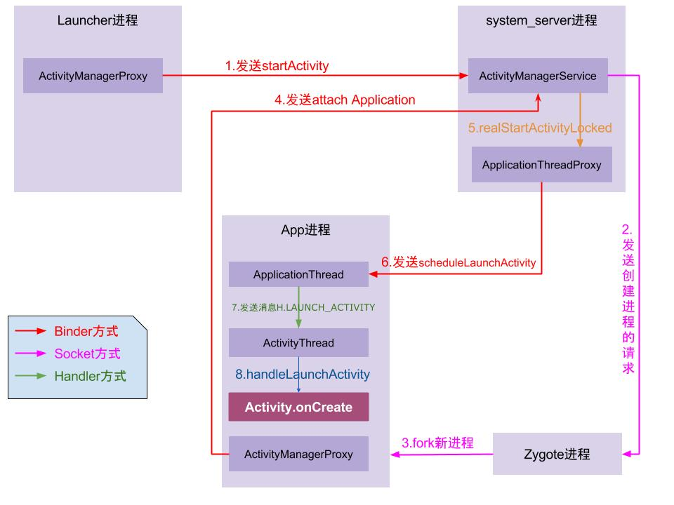

# android 相关 启动流程
本文的分析都是 基于 android-7.1.1-r1 的源码。 有些类可能在高版中会被废弃。
例如 自 API 26(android8.0 ) ，代理类 ActivityManagerProxy 已经被删除。

##  init 进程
```text
它是内核启动的第一个用户级进程,它的进程号总是1 。
init的入口函数 
// system/core/init/init.cpp
int main(int argc, char** argv) { 
 property_init();  // 对属性进行初始化
 start_property_service();  // 启动属性服务
 parser.ParseConfig("/init.rc");  // 解析init.rc配置文件并启动zygote进程
} 
```

## zygote 进程 ，受精卵 进程
```text
zygote 由 init进程 通过 fork 的方式创建启动的。
zygote 是Android系统上所有应用进程的父进程，我们系统上app的进程都是由这个zygote分裂出来的。
```

## SystemServer 进程
```text
zygote 进程 fork 出 SystemServer 进程

android\internal\os\ZygoteInit.java 
public static void main(String argv[]) {
 startSystemServer(abiList, socketName); // 启动 SystemServer 进程 ，根据反射 fork 出
}
```

## PackageManagerService 服务 、PMS  
```text
由 SystemServer 服务启动 。
// SystemServer.java , startBootstrapServices() 
mPackageManagerService = PackageManagerService.main(... );
```

## ActivityManagerService 服务 、 AMS
```text
由 SystemServer 服务启动 。 所有的APP应用都需要 与 AMS 打交道.

// SystemServer.java , startBootstrapServices() 
mActivityManagerService = mSystemServiceManager.startService( ActivityManagerService.Lifecycle.class).getService();
```

## Launcher 启动流程 、 Launcher3 app
```text
Launcher app 由 AMS 启动 。
// ActivityManagerService.java  , 
Intent getHomeIntent() {
// 启动  <category android:name="android.intent.category.HOME" /> 的 桌面程序
 intent.addCategory(Intent.CATEGORY_HOME); 
}
```


## Launcher APP 启动流程
```text
1、内核启动  
2、内核启动 init 进程
3、init 进程  fork  Zygote 进程
4、zygote 进程 fork 出 SystemServer 进程
5、SystemServer 服务 启动  AMS   、 PackageManagerService 服务
6、AMS  启动 Launcher app  
```


## 点击桌面 app 图标 到打开 APP的流程
```text
1、点击App图标，Launcher 用 Binder 跨进程 向 SystemServer 进程发起 startActivity 请求 
2、SystemServer 进程接收到请求后，向 zygote 进程发送创建进程的请求 
3、zygote 进程 fork 出新的子进程（即App进程） 
4、App进程  通过 Binder 向 SystemServer 进程发起 attachApplication() 请求 
5、SystemServer 进程在收到请求后，进行一系列准备工作后，
再通过 Binder 向App进程 发送 scheduleLaunchActivity()  请求；
6、App进程 的 binder 线程  ApplicationThread 在收到请求后，
通过handler向主线程发送 LAUNCH_ACTIVITY 消息；
7、主线程在收到 Message 后，通过 handler 机制 创建目标Activity，并回调 Activity.onCreate() 等方法。
```


## Activity 启动流程 、startActivity 启动过程
整个流程有点复杂，不看着源码讲有点麻烦。可以参考这篇博客 http://gityuan.com/2016/03/12/start-activity/ 
 


## 相关类
### Instrumentation  .java
```text
每个 Activity 都持有 Instrumentation 对象的一个引用，
但是整个进程只会存在一个 Instrumentation 对象。

Instrumentation 这个类里面的方法大多数和 Application 和 Activity 有关，
这个类就是完成对 Application 和 Activity 初始化和生命周期的工具类 ,是一个大管家。
```

### ActivityThread 
在 ActivityThread .java 中定义
```text
负责与 AMS 交互。 
```

### ApplicationThread  
在 ActivityThread .java 中定义
```text
```

###  ActivityStack 
###  ActivityStackSupervisor 
### ActivityManagerProxy
### ApplicationThreadProxy

## 如何判断一个 APP 在前台还是后台
借用系统 ActivityLifecycleCallbacks 的回调来进行判断。
进入后台后，有一些机型貌似弹不出toast，比如华为M3 。
暂时没找到解决办法，我试过一些银行的APP 和所得税APP，同样也弹不出来。
```text
 // 原理：程序中任何一个activity处于后台时(onStope)都将触发提醒。 
 // 所以，如果顶层activity中onStope方法被执行，则认为程序处于后台。
public class MyAppLifecycleHandler implements Application.ActivityLifecycleCallbacks {
    private int started = 0;
    private int stopped = 0;
    private String lastActivitName ;
    private boolean flag = true;

    public MyAppLifecycleHandler(String name){
        lastActivitName= name ;
    }

    @Override
    public void onActivityCreated(Activity activity, Bundle savedInstanceState) {  }

    @Override
    public void onActivitySaveInstanceState(Activity activity, Bundle outState) {  }

    @Override
    public void onActivityResumed(Activity activity) {  }

    @Override
    public void onActivityPaused(Activity activity) {  }

    @Override
    public void onActivityStarted(Activity activity) {
        ++started;
    }

    @Override
    public void onActivityStopped(final Activity activity) {
        ++stopped;
        if (!isApplicationInBackground()){
            return;
        }

        flag = true;
        new Handler().postDelayed(new Runnable() {
            @Override
            public void run() {
                if ( flag ) {
                    Toast.makeText(activity, "WkPlayer被切换至后台", Toast.LENGTH_SHORT).show();
                }
            }
            // 延时的作用是用来等待一下，看 onActivityDestroyed 是否被执行了。
        } ,500) ;
    }

    @Override
    public void onActivityDestroyed(Activity activity) {
        if (lastActivitName.contains(activity.getClass().getSimpleName())) {
            flag = false;
        }
    }

    private boolean isApplicationInBackground() {
        return started == stopped;
    }
}
// Application 中调用
MyAppLifecycleHandler lifecycleHandler = new MyAppLifecycleHandler( FileExplorerActivity.class.getSimpleName() ) ;
unregisterActivityLifecycleCallbacks(lifecycleHandler);
registerActivityLifecycleCallbacks(  lifecycleHandler ) ;
```


 


