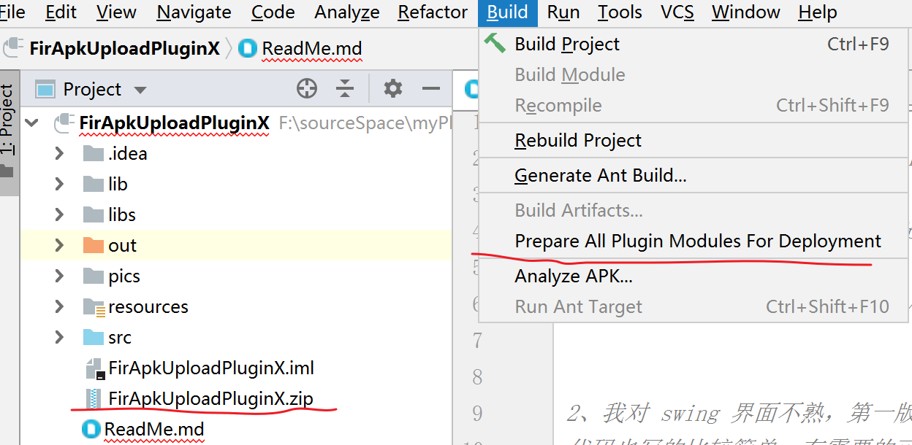

# Androidstudio插件开发


## 插件打包
```text
build -> Prepare All Plugin Modules For Deployment
执行成功插件会默认在项目根目录下。
无依赖的插件是JAR包，带有依赖的插件是ZIP格式。
```



## 插件发布
```text
注册账号，上传到 https://plugins.jetbrains.com/
提交后一般需要两天的审核期，审核通过后可以在Androidstudio的插件中查到。

发布的时候，可能会遇到报错不让提交
Plugin has no dependencies. Please check the documentation 
解决方案是：
在plugin.xml文件中添加
<depends>com.intellij.modules.lang</depends>
```


## 插件源码开发
```text
1、使用 IntelliJ 社区版就可以(我用的是 ideaIC-2018.3.6.win)
注意 IntelliJ 版本如果过高，可能要求jdk11，但是很多人还在用 jdk8，
所以用 较低版本的 IntelliJ 即可。

2、创建工程类型选  Intelli Platform Plugin

3、插件UI界面的编写推荐使用插件 JFormDesigner，
这是个收费插件，网上有破解版。
插件界面用的是 Java的 swing 框架，如果你对swing 不熟悉，可以使用这个插件进行可视化开发。
另外，intelliJ 可能默认开启了自带“UI Designer”插件 ( 可视化操作 .form 文件)，
但是这个插件不好用，可以直接禁用它。

其他的一些工程配置可以直接搜索百度或者参考我这个demo
https://gitee.com/hnyer/FirApkUploadPluginX
```

## JFormDesigner 插件破解
```text
JFormDesigner 是一个第三方收费插件 ，可以可视化开发 swing 界面。
我的组合是 ideaIC-2018.3.6.win + JFormDesigner-7.0.3-intellij-idea

将 JFormDesigner\lib\JFormDesigner-Idea.jar 解压出来，然后用注册机进行注册，获得注册码。
插件文件在我的阿里云盘有保存。
```