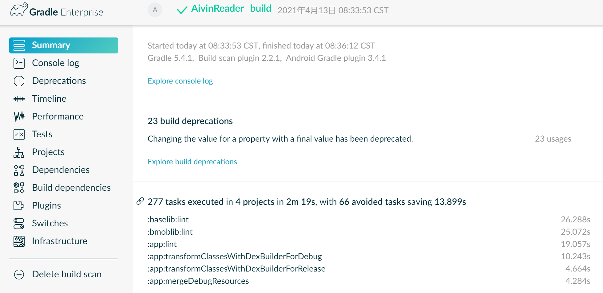
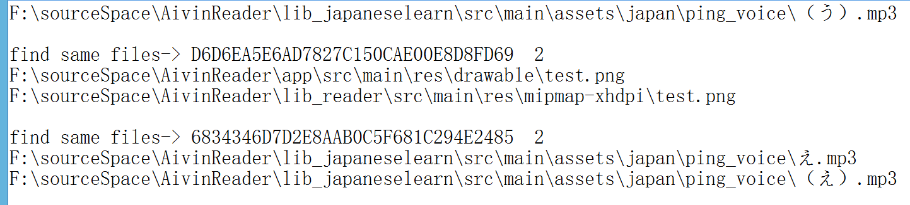

# 代码混淆
[混淆规则 guardsquare](https://www.guardsquare.com/en/proguard)

##  androidstudio 混淆配置  
```text
// build.gradle 文件下 (这是系统默认生成的，可以修改)
1、导入 xxx\tools\proguard\proguard-android.txt 。 这里面是一些比较常规的不能被混淆的代码规则。
2、导入当前工程里面的 proguard-rules.pro 。这里是一些自定义的混淆规则。
proguardFiles getDefaultProguardFile('proguard-android.txt'), 'proguard-rules.pro'

//是否开启混淆 true or false
minifyEnabled true
```

##  不能混淆的内容
混淆了这些内容，会导致出错。
```text  
1、 自定义控件
2、 枚举
3、 第三方库中的类 （作者一般会标明）
4、 运用了反射的类
5、 使用了 Gson 之类的工具的实体类
6、 WebView 的 JS 的接口方法
7、 Parcelable 的子类和 Creator 静态成员变量不混淆
```

## 设置 不参与混淆
```text
# 保持该包下的类名 (子包下的会被混淆)
-keep class cn.wk.test.*
# 把本包和所含子包下的类名都保持
-keep class cn.wk.test.**
# 保持类名和里面的内容不被混淆
-keep class com.example.bean.** { *; }
```

## 自用的 aar 混淆
```text
# 代码混淆压缩比，在0~7之间，默认为5,一般不下需要修改
-optimizationpasses 5
# 混淆时不使用大小写混合，混淆后的类名为小写
-dontusemixedcaseclassnames
#  不混淆第三方引用的库  不忽略library里面非public修饰的类  ？？？
-dontskipnonpubliclibraryclasses
# 指定不忽略非public类里面的成员和方法
-dontskipnonpubliclibraryclassmembers
# 不做预检验， 去掉这一步可以加快混淆速度
-dontpreverify
# 把所有信息都输出，而不仅仅是输出出错信息
-verbose
#apk 包内所有 class 的内部结构 ??
-dump class_files.txt
# 列出了没有被混淆的类和成员
-printseeds seeds.txt
#列出从 apk 中删除的代码
-printusage unused.txt
#混淆前后的映射
-printmapping mapping.txt
# 混淆时所采用的算法 ，后面的参数是一个过滤器
# 这个过滤器是谷歌推荐的算法，一般不改变
-optimizations !code/simplification/artithmetic,!field/*,!class/merging/*
#保留Annotation不混淆
-keepattributes *Annotation*,InnerClasses
# 避免混淆泛型
-keepattributes Signature
# 保留异常
-keepattributes Exceptions
# 抛出异常时保留代码行号
-keepattributes SourceFile,LineNumberTable
#  不打印指定类的警告信息
-ignorewarnings

#==================================【项目配置】==================================
# 保留所有的本地native方法不被混淆
-keepclasseswithmembernames class * {
    native <methods>;
}

# 保留了继承自Activity、Application (四大组件等)这些类的子类
-keep public class * extends android.app.Activity
-keep public class * extends android.app.Application
-keep public class * extends android.app.Service
-keep public class * extends android.content.BroadcastReceiver
-keep public class * extends android.content.ContentProvider
-keep public class * extends android.app.backup.BackupAgentHelper
-keep public class * extends android.preference.Preference
-keep public class * extends android.view.View
-keep public class com.android.vending.licensing.ILicensingService
-keep public class * extends android.database.sqlite.SQLiteOpenHelper{*;}

# 如果有引用android-support-v4.jar包，可以添加下面这行
-keep public class com.null.test.ui.fragment.** {*;}
#如果引用了v4或者v7包
-dontwarn android.support.**
# 保留Activity中的方法参数是view的方法
-keepclassmembers class * extends android.app.Activity {
    public void * (android.view.View);
}

# 枚举类不能被混淆
-keepclassmembers enum * {
    public static **[] values();
    public static ** valueOf(java.lang.String);
}

#   不混淆反射
-keepattributes EnclosingMethod

# 保留自定义控件(继承自View)不能被混淆
-keep public class * extends android.view.View {
    public <init>(android.content.Context);
    public <init>(android.content.Context, android.util.AttributeSet);
    public <init>(android.content.Context, android.util.AttributeSet, int);
    public void set*(***);
    *** get* ();
}
# 保留Parcelable序列化的类不能被混淆
-keep class * implements android.os.Parcelable{
    public static final android.os.Parcelable$Creator *;
}
# 保留Serializable 序列化的类不被混淆
-keepclassmembers class * implements java.io.Serializable {
   static final long serialVersionUID;
   private static final java.io.ObjectStreamField[] serialPersistentFields;
   !static !transient <fields>;
   private void writeObject(java.io.ObjectOutputStream);
   private void readObject(java.io.ObjectInputStream);
   java.lang.Object writeReplace();
   java.lang.Object readResolve();
}
# 对R文件下的所有类及其方法，都不能被混淆
-keepclassmembers class **.R$* {
    *;
}
# 对于带有回调函数onXXEvent的，不能混淆
-keepclassmembers class * {
    void *(**On*Event);
}

#==================================【根据自己的项目（自己写的代码），配置需要 忽略混淆的类==================================
-keep class org.litepal.** { *; }
-keep class com.walkera.wktools.** { *; }
#==================================【根据自己的项目（自己引用的第三方jar），配置需要 忽略混淆的类==================================
# ant.jar
#-libraryjars libs/ant.jar
-keep class  org.apache.** { *; }
# ftp4j.jar
#-libraryjars ./libs/ftp4j-1.7.2.jar
-keep class  it.sauronsoftware.** { *; }
# guava.jar
#-libraryjars ./libs/guava-17.0.jar
-keep class  com.google.** { *; }
# netty.jar
#-libraryjars ./libs/netty-all-4.0.25.Final.jar
-keep class  io.netty.** { *; }
# nineoldandroids.jar
#-libraryjars ./libs/nineoldandroids-2.4.0.jar
-keep class  com.nineoldandroids.** { *; }
```

# Gradle 配置
## Gradle 是什么
```text
Gradle 是一款强大的 构建工具 ，而不是语言。
它使用了 Groovy 这个语言，创造了一种 DSL ，但它本身不是语言。
```

## gradle 打印日志 调试信息
```text
 println "hello gradle" 或 println ("hello gradle")
然后在 Gradle 或 Build Console 中可以输出内容
```

## 输出 gradle 编译的详细信息
```text
gradlew compileDebug --stacktrace
gradlew compileDebug --info
gradlew compileDebug --debug
gradlew compileDebug --scan
```

## gradle 编码GBK的不可映射字符
```text
在模块的 build.gradle 中加入:
tasks.withType(JavaCompile) {
    options.encoding = "UTF-8"
}
```

## Gradle 基础命令
```text
// gradlew -v   
查看 gradle 版本

// gradlew clean
删除 build 文件夹 

// gradlew clean build --refresh-dependencies
强制更新最新依赖，清除构建后再构建

// gradlew build
编译 打包 (debug 和 release) 

// gradlew build --info
编译打包并打印日志

// gradlew build --profile
编译并输出性能报告，一般在构建工程根目录 build/reports/profile

//  gradlew build --info --debug --stacktrace
调试模式构建并打印堆栈日志

// gradlew assembleRelease
// gradlew aR  (简化版命令 )
编译并打 Release 的包    
     
// gradlew assembleDebug
编译并打 Debug 包    

// gradlew installDebug
debug 模式打包并安装

// gradlew installRelease
Release 模式打包并安装

// gradlew uninstallRelease
卸载 Release 模式包

// gradlew assemble
debug 、release 模式全部渠道打包
 
//  gradlew app:dependencies  > xxx.txt
查找 app模块的依赖关系，并输出到 xxx.txt文件中。

// gradlew -q xxx
运行xxx 插件  ，-q是quiet，不会生成gradle的日志信息。
```

## gradle - apk重命名
```text
android {
 applicationVariants.all{
        variant -> variant.outputs.all { output ->
            def releaseTime =  new Date().format("yyyyMMdd-HHmm", TimeZone.getTimeZone("GMT+08:00")) ;
            def outputFile = output.outputFile
            if(outputFile != null && outputFile.name.endsWith('.apk')) {
                def newName = "WkReader-${variant.buildType.name}-2.0.1.${releaseTime}.apk"
                outputFileName = newName
            }//
        }
    } //
}
```


## gradle - 将apk拷贝到指定目录
在项目根目录的 build.gradle 下添加
```text
subprojects(){
    def releaseTasks = project.getTasksByName("assembleRelease",false)
    def debugTasks = project.getTasksByName("assembleDebug",false)
    copyApkFile(releaseTasks, project)
    copyApkFile(debugTasks, project)
}

def copyApkFile(Set<Task> tasks , Project project) {
    for (task in tasks) { // 删除上一次的 build 文件夹
        def apkDirFile = new File(project.getProjectDir().getAbsolutePath() + "/build/outputs/apk")
        if (apkDirFile.exists()) {
            delete( project.getProjectDir().getAbsolutePath() + "/build/outputs/")
        }
        task.doLast {  // 拷贝 apk 到指定目录
            if (apkDirFile.exists()) {
                FileTree tree = fileTree(dir: apkDirFile.absolutePath)
                tree.each {
                    File myFile -> println ">>> myFile.name="+myFile.name
                    if(myFile.name.endsWith(".apk")){
                        copy{
                            from myFile.absolutePath
                            into "F:\\apks2"
                        }
                    }
                }
            }
        }
    }
}
```


## gradle - 自动签名
```text
android {
    def keystorePropertiesFile = rootProject.file("keystore.properties")
    def keystoreProperties = new Properties()
    keystoreProperties.load(new FileInputStream(keystorePropertiesFile))

    signingConfigs {
        wk2017 {
            storeFile file(keystoreProperties['storeFile'])
            storePassword keystoreProperties['storePassword']
            keyAlias keystoreProperties['keyAlias']
            keyPassword keystoreProperties['keyPassword']
        }
    }

    defaultConfig {
        signingConfig signingConfigs.wk2017
    }

    buildTypes {
        release {
            signingConfig signingConfigs.wk2017
        }
        debug {
            signingConfig signingConfigs.wk2017
        }
    }
}
```


##  gradle - 版本统一管理配置
```text
1、新建 配置文件 myconfig.gradle
ext {
    appLibversions = [
            lib_compileSdkVersion      : 28,
            lib_minSdkVersion      : 22 ,
            lib_targetSdkVersion      : 28 ,
            lib_versionCode      : 12 ,
            lib_versionName      : "1.0.0.20210419"

    ]
    // 第三方依赖
    my_libdependencies = [
            lib_recyclerview: "com.simplecityapps:recyclerview-fastscroll:2.0.1"
    ]

}

2、让配置生效 ，在根目录下的 build.gradle 添加
apply from: 'myconfig.gradle'

3、引用配置中的变量
def appLibversions = rootProject.ext.appLibversions
compileSdkVersion appLibversions.lib_compileSdkVersion
buildToolsVersion "28.0.3"
defaultConfig {
    applicationId "com.wk.reader"
    minSdkVersion appLibversions.lib_minSdkVersion
    targetSdkVersion appLibversions.lib_targetSdkVersion
    versionCode appLibversions.lib_versionCode
    versionName  appLibversions.lib_versionName
}
```


## Gradle 打多渠道包
```text
1、在 build.gradle 文件下的 android 标签下配置 
productFlavors{ 
// 渠道1，免费版
    freeVersion{
        applicationId "com.wk.freereader"
        buildConfigField ("String", "BaseApi", '"http://baidu.com"')
        resValue ("string", "tipTest", '"这是免费版"')
        manifestPlaceholders = [
                app_nameflavors: "@string/app_name_free" ,
                app_logoflavors: "@mipmap/ic_launcher"
        ]
    }
// 渠道2，专业版
proVersion{
    applicationId "com.wk.proreader"
    buildConfigField ("String", "BaseApi", '"http://baidu.com"')
    resValue ("string", "tipTest", '"这是专业版"')
    manifestPlaceholders = [
            app_nameflavors: "@string/app_name_pro" ,
            app_logoflavors: "@mipmap/ic_launcher"
    ]
}
} //

2、如果报错 ERROR: All flavors must now belong to a named flavor dimension.
在 defaultConfig 标签下配置  flavorDimensions "default" 即可。

3、配置简单说明
// 直接让不同的 apk 包名生效，
applicationId "com.wk.freereader"
// BuildConfig 中会生成对应的变量，在Java代码中可以调用 ，类型-变量名-变量值
buildConfigField ("String", "BaseApi", '"http://baidu.com"')
// 系统会生成对应的 xml 风格的变量名 ，在xml 中可以调用 
resValue ("string", "tipTest", '"这是免费版"')
manifestPlaceholders = [
// 占位符 android:label="${app_nameflavors}"
app_nameflavors: "@string/app_name_free" ,
// 占位符  android:icon="${app_logoflavors}"
app_logoflavors: "@mipmap/ic_launcher"
]

通过在代码中 调用 BuildConfig 中的变量，可以动态控制一些值，
比如域名、默认配置等等。

4、要想让占位符生效，需要在 main 同级目录下
新建渠道包同名的文件夹，里面放置资源文件
```


## Gradle 生命周期监控 (不知道用来做什么)
在 settings.gradle 中添加，
```text
gradle.addBuildListener(new BuildListener() {
    void buildStarted(Gradle var1) {
    // 这个函数没有触发，暂时不知道原因
       println 'Gradle 开始构建'
    }
    void settingsEvaluated(Settings var1) {
        println 'settings.gradle 代码执行完毕, Project 还未初始化'
    }
    void projectsLoaded(Gradle var1) {
        println '项目结构加载完成 ，可访问根项目：' + var1.gradle.rootProject
    }
    void projectsEvaluated(Gradle var1) {
        println '所有项目评估完成，配置阶段结束'
    }
    void buildFinished(BuildResult var1) {
        println 'Gradle 构建结束 '
    }
})
```


## Gradle 耗时监控
在 settings.gradle 中添加 
```text
long beginOfSetting = System.currentTimeMillis()
def beginOfConfig
def configHasBegin = false
def beginOfProjectConfig = new HashMap()
def beginOfProjectExcute

gradle.projectsLoaded {
    println '耗时信息>>> 初始化阶段 耗时：' + (System.currentTimeMillis() -beginOfSetting) + 'ms'
}

gradle.beforeProject { project ->
    if (!configHasBegin) {
        configHasBegin = true
        beginOfConfig = System.currentTimeMillis()
    }
    beginOfProjectConfig.put(project, System.currentTimeMillis())
}

gradle.afterProject { project ->
    def begin = beginOfProjectConfig.get(project)
    println '耗时信息>>> 配置阶段 ' + project + '耗时：' +   (System.currentTimeMillis() - begin) + 'ms'
}

gradle.taskGraph.whenReady {
    println '耗时信息>>> 配置阶段 总共耗时：' + (System.currentTimeMillis() -  beginOfConfig) + 'ms'
    beginOfProjectExcute = System.currentTimeMillis()
}

gradle.taskGraph.beforeTask { task ->
    task.doFirst {  task.ext.beginOfTask = System.currentTimeMillis()
    }

    task.doLast {
        println '耗时信息>>> 执行阶段，' + task + '耗时：' +  (System.currentTimeMillis() - task.beginOfTask) + 'ms'
    }
}

gradle.buildFinished {
    println '耗时信息>>> 执行阶段，耗时：' + (System.currentTimeMillis() -  beginOfProjectExcute) + 'ms'
}
```


## Gradle 相关API 和配置
### getAllprojects ()
获取所有 project 的实例。
```text
在根目录下的 build.gradle 添加
def getProjects() {
    println "getAllprojects>> Root Project Start "
    this.getAllprojects().eachWithIndex { Project project, int index ->
        if (index == 0) {
            println "getAllprojects>> Root Project is $project"
        } else {
            println "getAllprojects>> child Project is $project"
        }
    }
}
this.getProjects()
```


### getSubprojects ()
获取当前工程下所有子 project 的实例
```text
def getSubProjects() {
    println " getSubProjects>> Sub Project Start "
    this.getSubprojects().each { Project project ->
        println "getSubProjects>> child Project is $project"
    }
}
this.getSubProjects()
```         


### getParentProject ()
获取当前 project 的父类
```text
def getParentProject(){
    def name=this.getParent().name
    println "getParentProject >> the parent project name is :${name}"
}
getParentProject()
```


### getRootProject ()
获取当前的 project 实例
```text
def getRootPro() {
    def rootProjectName = this.getRootProject().name
    println "getRootProject >> root project is $rootProjectName"
}
this.getRootPro()
```


### getRootDir() 、 getBuildDir() 、getProjectDir()
```text
println "the root file path is:" + getRootDir().absolutePath
println "this build file path is:" + getBuildDir().absolutePath
println "this Project file path is:" + getProjectDir().absolutePath

the root file path is:F:\sourceSpace\AivinReader
this build file path is:F:\sourceSpace\AivinReader\app\build
this Project file path is:F:\sourceSpace\AivinReader\app
```


### project 配置
```text
表示的是指定工程的实例，然后可以在闭包中对其进行操作。
```


### allprojects 配置
```text
表示用于配置当前 project 及其旗下的每一个子 project 。
```


### subprojects 配置
```text
统一配置当前 project 下的所有子 project 。
```


### gradle 文件操作
```text
// 获取单个文件内容
this.getMyFile("config.gradle")
def getMyFile(String path) {
    try {
        def mFile = file(path)
        println('getfile>>'+ mFile.text);
    } catch (GradleException e) {
        println e.toString()
        return null
    }
}

// 获取多个文件内容
this.getMyFileS("config.gradle", "build.gradle")
def getMyFileS(String path1, String path2) {
    try {
        def mFiles = files(path1, path2)
        println('getfiles>>'+ mFiles[0].text + mFiles[1].text );
    } catch (GradleException e) {
        println e.toString()
        return null
    }
}
```

## gradle 诊断报告工具
### Profile report
```text
我们一般会使用如下命令来生成一份本地的构建分析报告：
gradlew assembleDebug --profile
xxx/build/reports/profile/profile-xxx.html
可以查看各个模块、依赖、任务的执行时间。 
```

### Build Scan
```text
一个更细致的构建汇报工具，
gradlew build --scan
命令执行完成后，需要将一些信息上传到 https://scans.gradle.com 上，
然后填写一个 email 地址接收最后的 scan 报告。
```




## Gradle 打包提速方案
### Gradle 升级到 最新的版本
```text
将 Gradle 和 Android Gradle Plugin 的版本升至最新，
所带来的的构建速度的提升效果是显而易见的，
特别是当之前你所使用的版本很低的时候。
```


### Gradle 开启离线模式
```text
打开 Android Studio 的离线模式后，
所有的编译操作都会走本地缓存 ,
这将会极大地缩短编译时间。
尤其是中国大陆的网络访问外网龟速的情况下。
```


###  增加 Androidstudio 的内存空间 、并行的处理器核心数 
```text
在性能好的电脑上给 AS 一个大的内存，会让 as 有更好的表现。
maxProcessCount // cpu核心数
```


### 删除不必要的 Moudle 、合并部分 Module
```text
过多的 Moudle 会使项目中 Module 的依赖关系变得复杂，
Gradle 在编译构建的时候会去检测各个 Module 之间的依赖关系，
它会去梳理这些 Module 之间的依赖关系，
以避免 Module 之间相互引用而带来的各种问题。
除了删除不必要的 Moudle 或合并部分 Module 的方式外，
我们也可以将稳定的底层 Module 打包成 aar，
上传到公司的本地 Maven 仓库，通过远程方式依赖。
```


### 删除 项目中的无用资源
```text
1、如果我们不需要写单元测试代码，可以直接删除 test 目录。
2、如果我们不需要写 UI 测试代码，也可以直接删除 androidTest 目录。
3、此外，如果 Moudle 中只有纯代码，可以直接删除 res 目录。

在 Android Studio 中提供 Remove Unused Resource 功能，
将一些无用的图片 等资源删除，
减少 gradle 分析时间。
```


### 优化第三方库的引用
```text
1、使用更小的库去替换现有的同类型的三方库。
2、使用 exclude 来排除三方库中某些不需要或者是重复的依赖。
3、使用 debugImplementation 来依赖仅在 debug 期间才会使用的库，
如一些线下的性能检测工具。 
```


### resConfigs 去除多余的语言资源 
```text
如果你使用的库包含语言资源(例如使用的是AppCompat或 Google Play服务)， 
则APK将包括这些库中消息的所有已翻译语言字符串，
无论应用的其余部分是否翻译为同一语言。

如果你想只保留应用正式支持的语言，则可以利用 resConfigs 属性指定这些语言。
系统会移除未指定语言的所有资源。
```


### 使用增量编译 (新版gradle 已经开启 ，属性已经废弃)
```text
在 Gradle 4.10 版本之后便默认使用了增量编译 。
```

## Gradle 常用注解
https://docs.gradle.org/current/javadoc/org/gradle/api/tasks/package-summary.html
### @Input
```text
// 在代码中定义
@Input
public void checkString(boolean flag) {
    this.strings = flag;
}
    
// 在 build.gradle 中使用  
// checkResources 是 task 的名字
checkResources{
    checkString true
}
```


### @TaskAction
```text
Marks a method as the action to run when the task is executed.
```


 


## Gradle plugin ( Gradle 插件) 
### 插件方式1  Build script
```text
把插件写在 build.gradle 文件里，
一般用于简单的逻辑，仅仅在该 build.gradle 文件里可见。
比如做一些简单的版本统一管理，apk重命名等
```


### 插件方式2 buildSrc 项目 
demo 地址在 https://gitee.com/Aivin_CodeShare/android_tool_code/tree/master/buildsrc

```text
仅仅对该项目中可见，适用于逻辑较为复杂，但又不须要外部可见的插件。
1、Module 的名字一定要是 buildSrc
2、修改 module的 build.gradle文件内容为：
apply plugin: 'groovy'
apply plugin: 'maven'
dependencies {
    compile gradleApi()
    compile localGroovy()
}
repositories {
    mavenCentral()
}

3、在main目录下新建groovy目录，在groovy目录下创建包名目录。
Gradle插件本身用的是groovy语言，groovy 和 Java可以互通，我们可以直接用Java来写。

4、在包名目录下新建名为 xxx 的groovy文件,
5、在main目录下新建resources目录，在resources目录里新建META-INF目录，
再在META-INF里面新建gradle-plugins目录。

6、gradle-plugins目录里面新建properties文件，
如 aivingradleplugin.properties,注意这个文件可以随意命名,但是后面使用这个插件的时候，
apply plugin:'aivingradleplugin'。

7、properties 文件里指明Gradle插件的具体实现类：
implementation-class=com.aivin.buildsrc.AivinPluginX

// 使用方法
1、在项目的根目录下的 build.gradle 下引入这个 插件 
apply plugin:'aivingradleplugin'

2、配置一些参数
// fileMd5CheckTask 是 task名字 ，isOpenFileMd5Check 是被 @Input 标记注解的变量
fileMd5CheckTask{ 
    isOpenFileMd5Check true
}

3、在命令行输入命令即可
gradlew fileMd5CheckTask
// checkResources 是在代码中定义的 task 名字
// GeekTask task = project.getTasks().create("fileMd5CheckTask", GeekTask.class)

4、如果其他项目引入你的 buildSrc 报错 Duplicate root element buildSrc ,
是因为 buildSrc 被 Androidstudio 篡改成了 小写的 buildsrc ，手动改成 “buildSrc”即可
```




### 插件方式3  独立项目
```text
一个独立的 Groovy 和 Java 项目，
能够把这个项目打包成 Jar 文件包，
将文件包公布到托管平台上，供其它人使用。
这种方式我暂时用不上，没有去测试，有需要再弄。
```


# Androidstudio 插件开发
## 环境配置
```text
1、使用 IntelliJ IDEA 进行开发 
创建 Intelli Platform Plugin 项目
创建项目时可能找不到sdk，选择 IntelliJ IDEA 的根目录即可。
 
2、如果开发的 plugin 拖放到 Androidstudio报错 
com.intellij.diagnostic.PluginException: While loading class FirApkAction: 
FirApkAction has been compiled by a more recent version of the Java Runtime (class file version 55.0), 
this version of the Java Runtime only recognizes class file versions up to 52.0 
[Plugin: com.aivin.firapkuploadplugin] [Plugin: com.aivin.firapkuploadplugin]

这是由于 IntelliJ IDEA 版本过高导致的，我用的是 IntelliJ IDEA2021，结果需要 jdk11，
但是 Androidstudio 用的是 jdk8 ，打不开 jdk11编译出来的jar包。
最后我下载安装 ideaIC-2018.3.6.win 版本即可解决。
```


# 渠道包
## 为什么需要打渠道包
```text
1、为了区分用户从哪个 渠道下载的，比如官网、应用宝、华为、小米等商店，
因为一般是分渠道进行推广的，这样就能统计出每个渠道的推广效果进而进行调整。

2、可以针对每个不同渠道的 APP配置不同的 APP名字 和APP logo、包名。
例如 搜狗输入法小米版、搜狗输入法华为版。
```

##  多渠道 打包 方案
目前公司APP集中于官网发布，暂时用不上。需要的时候再来更新具体使用方法。
```text
1、gradle 官方方案。
2、其他一些第三方的插件，例如美团就有一个 
Walle（瓦力）https://github.com/Meituan-Dianping/walle

gralde默认的配置，缺点是每个渠道包都会重新编译一次，编译速度慢。
对大量的多渠道打包推荐用美团的walle 
```

# Sqlite 数据库升级
```text
public class XXXHelper extends SQLiteOpenHelper {
    /**
     * 1、在第一次打开数据库的时候才会走
     * 2、在清除数据之后再次运行-->打开数据库，这个方法会走
     * 3、没有清除数据，不会走这个方法
     * 4、数据库升级的时候这个方法不会走
     */
    @Override
    public void onCreate(SQLiteDatabase db) {   }
    /**
     * 1、这个方法只有当数据库已经存在，而且版本升高的时候，才会调用
     * 2、第一次创建数据库的时候，这个方法不会走
     * 3、清除数据后再次运行(相当于第一次创建)这个方法也不会走
     */
    @Override
    public void onUpgrade(SQLiteDatabase db, int oldVersion, int newVersion) {   }
}

onCreate() onUpgrade() 是数据库创建和升级的重要函数，在里面进行 sql 语句操作即可。
只是 在升级的逻辑会比较麻烦和繁琐， 因为升级情况会比较多，
比如用户可能是从 版本1 、2、3、4... 升级到版本10的，要针对这几种情况都要做相应的逻辑。

如果不想写sql 语句，可以使用 郭霖 开源的 LitePal Android 数据库。
封装的比较好 ，增删改查、数据库升级 事务操作都有。
```


# appkey 、 token 保证数据安全
```text
1、token
token 是客服端登录成功后，服务器生成并下发给APP的。
token 可以采用不可逆加密方式生成，有较短的有效期。
客户端直接保存在本地就可以了。请求数据时，带着token，
服务器根据客户端上传的token 和保存在服务器上的对应客户端当前的token ，
进行对比，来判断token是否有效。

2、appkey
有一些sdk，需要在 Application 进行初始化，需要授权 appkey ，
此时我们对 appkey 不能加密，那么怎么防止别人反编译我们的apk 获得这个 appkey 去篡改数据 ？
一般的做法就是服务器会将 appkey 和APP签名绑定好。 app 签名由开发者在后台手动填写。
签名不对的，认为是非法APP在调用，可以拒绝服务。
例如 高德地图 采用 key 和 apk 的  SHA1 绑定方案  。
bmob sdk 采用 key 和apk 签名绑定方案。

如果不采用 APP签名和appkey 绑定的方式，解决不了这个问题，
你即使将 appkey 写入 jni 的so 中，别人只要拦截到了 就照样可以使用。
```


## apk 签名获取
```text
keytool -list -v -keystore xxx.keystore 
然后输入密码，
MD5:  80:60:94:3E:7C:97:xxx:0F:C9:B1:67:4C
SHA1: B8:94:EC:79:72:DD:91:0E:19:D6:CD:xxx:C2:0C:BA:31
SHA256: D5:3B:CB:D7:1D:B3:64:89:D6:FAxxxxxDB:3B:1B:4E:F0:FE:05:E4:15:BD

其中，把 MD5 的值把 冒号去掉，然后转为小写，就是apk的签名 
8060943e7c973xxx15fb0fc9b1674c
```


 
