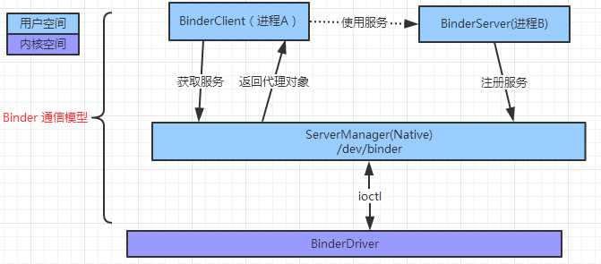

# Binder详解
```text
从英文字面上意思看，Binder 具有粘结剂的意思，那么它把什么东西粘结在一起呢？
在Android系统的Binder机制中，Binder由 Client、Server、Service Manager 和Binder驱动组成。
Binder就是一种把这四个组件粘合在一起的粘结剂了。
```

## 为什么要采用Binder
```text
Linux 现有的进程通信手段有以下几种：
1、管道 ; 2、消息队列; 3、共享内存; 4、套接字;  5、信号量。

Linux 已经有多种跨进程通信方式，Android基于Linux的，Android为何还要采用Binder？
注：( Binder 不是Android提出来的一套新的进程间通信机制，它是基于OpenBinder实现的)

这是主要从以下几个原因考虑的：
1、效率。
对于消息队列、 Socket 和  管道来说， 
数据先从发送方的缓存区拷贝到内核开辟的缓存区中，
再从内 核缓存区拷贝到接收方的缓存区，一共两次拷贝。

2、稳定性
因为共享内存需要处理并发同步问题，容易出现死锁和资源竞争，稳定性较差。

3、安全性
传统 Linux IPC 的接收方无法获得对方进程可靠的 UID/PID，从而无法鉴别对方身份。
而 binder方式做了改进，建立私有通道，更安全。
```

方式|缺点|优点|数据拷贝次数
---|---|---|---
共享内存|控制机制复杂||0
Binder||可以建立私有通道、有UID鉴别身份|1
socket|开销大、效率低||2
管道、消息队列|效率低||2


## Binder 架构
```text
Binder是一种架构 ,定义了一种通信机制。
这种架构提供了 服务端接口、Binder驱动、客户端接口 三个模块。

Binder使用 Client-Server 通信方式 (C/S架构)，安全性好，简单高效，再加上其面向对象的设计思想，
独特的接收缓存管理和线程池管理方式，成为Android进程间通信的中流砥柱。

Binder的通信模型有4个角色：
Binder Client 、Binder Server 、ServiceManager 、Binder Driver  

这4个角色的关系和互联网类似：
Server 是服务器，Client 是客户终端，
ServiceManager 是域名服务器 ，Binder Driver 是路由器。
```

### Binder Client 
```text
使用数据。
调用其他进程中的相关服务。由开发者实现。
```

### Binder Server 
```text
提供数据 。
提供相关的服务。由开发者实现。
```

### ServiceManager  
```text
提供了 查询服务 和 注册服务 的功能。
Android系统已经实现。 
Service Manager是一个守护进程。
```

### Binder Driver 
```text
Binder 驱动，将数据从进程B的用户空间中拷贝到进程A的用户空间。
尽管名叫“驱动” ，实际上和硬件设备没有任何关系，
存在于内核空间中。Android系统已经实现。
```



# 相关 类、方法 、概念
```text
1、Native端：
IBinder 、BBinder 、BpBinder 、IPCThread 、ProcessState、IInterface 、JavaBBinder

jni端：
android_util_Binder.cpp

2、Java端：
IBinder 、 Binder、BinderProxy（Binder的一个内部类）、 
Stub、 Proxy 、ServiceManager（Java源码 被@hide了）

3、Binder Driver 端：
binder_proc、 binder_thread、 binder_node 、ioctl（是一个函数）
```

## Binder实体
是 binder_node结构体的对象。

## 实名 Binder
注册了名字的Binder。

##  匿名 Binder
```text
Server 端可以通过已经建立的 Binder 连接将创建的 Binder 实体传给 Client 。
由于这个 Binder 没有向 ServiceManager 注册名字，所以是个匿名Binder。 

匿名Binder 为通信双方建立一条私密通道，只要 Server 没有把匿名Binder发给别的进程，
别的进程就无法通过穷举或猜测等任何方式获得该Binder的引用。
```

## Binder引用
每一个Binder引用都是某一个Binder实体的引用。

## 0号引用
```text
我们可能会发现一个细节：
ServiceManager 是一个进程，Server 是另一个进程 ，
Server向 ServiceManager 注册 Binder 必然会涉及进程间通信。

当前实现的是进程间通信却又要用到进程间通信，这就好象蛋可以孵出鸡前提却是要找只鸡来孵蛋。 
Binder 的实现比较巧妙：系统给 ServiceManager 创建一个特殊专门的 Binder实体。 
它没有名字也不需要注册。
一个 Server 若要向 ServiceManager 注册自己 Binder 就必需通过0这个引用号和 ServiceManager 的Binder通信。
```


# 为什么Binder只进行了一次数据拷贝？ 、mmap()
```text
先把数据拷贝到内核的缓存区，然后再从内核的缓存区拷贝给接收方。
这样做会产生两次数据的拷贝。
linux中的管道通信就是采取这种方式。

但是 binder 进一步优化，
数据从 发送方的缓存区 拷贝到内核的缓存区，
而 接收方的缓存区 与内核的缓存区被是映射到同一块物理地址的，因此只需要一次拷贝即可。

mmap() 分配的内存除了映射进了接收方进程里，还映射进了内核空间。
所以调用 copy_from_user() 将数据拷贝进内核空间也相当于拷贝进了接收方的用户空间 。
```


# binder 怎么验证 pid  ( 比传统 验证方式 更安全)
```text
传统 Linux IPC 的接收方无法获得对方进程可靠的 UID/PID，从而无法鉴别对方身份。

pid 验证流程 暂时还未学习。
```

# Binder通信命令字
```text
BINDER_WRITE_READ |该命令向Binder写入或读取数据 
BINDER_SET_MAX_THREADS |该命令告知Binder驱动接收方线程池中最大的线程数 
BINDER_SET_CONTEXT_MGR|将当前进程注册为SMgr。 
BINDER_THREAD_EXIT|通知Binder驱动当前线程退出了。 
BINDER_VERSION|获得Binder驱动的版本号 

BC_TRANSACTION|Client向Server发送请求数据 
BC_REPLY|Server向Client发送回复数据 
BC_ACQUIRE_RESULT、 
BC_ATTEMPT_ACQUIRE 
BC_FREE_BUFFER| 释放一块映射的内存 
BC_INCREFS、BC_ACQUIRE 、BC_RELEASE 、BC_DECREFS|增加或减少Binder的引用计数  
BC_INCREFS_DONE 、BC_ACQUIRE_DONE|处理完毕反馈信息  
BC_REGISTER_LOOPER|通知驱动线程池中一个线程已经创建了 
BC_ENTER_LOOPER|通知驱动该线程已经进入主循环，可以接收数据  
BC_EXIT_LOOPER|通知驱动该线程退出主循环，不再接收数据 
BC_REQUEST_DEATH_NOTIFICATION| 要求驱动在Binder实体销毁得到通知 
BC_DEAD_BINDER_DONE|收到销毁通知的进程在删除引用后用本命令告知驱动 

BR_ERROR|发生内部错误 
BR_OK 、BR_NOOP|操作完成 
BR_SPAWN_LOOPER|向接收方发送该命令要求创建更多线程以备接收数据 
BR_TRANSACTION 、BR_REPLY|表示当前接收的数据是请求还是回复
BR_ACQUIRE_RESULT 、BR_ATTEMPT_ACQUIRE 、BR_FINISHED
BR_DEAD_REPLY|交互过程中如果发现对方进程或线程已经死亡则返回该消息
BR_TRANSACTION_COMPLETE|发送数据包后，收到该消息做为成功发送的反馈
BR_INCREFS 、BR_ACQUIRE 、BR_RELEASE 、BR_DECREFS|用于管理强/弱指针的引用计数
BR_DEAD_BINDER 、BR_CLEAR_DEATH_NOTIFICATION_DONE|收到死亡通知书
BR_FAILED_REPLY|如果发送非法引用号则返回该消息
```


#  Binder 接收/发送 数据包的标准格式
```text
union 
{ 
    size_t handle;void *ptr;
} target;
// 指明发送目的地

 
void *cookie;
存放的是创建Binder实体时由该接收方自定义的任意数值，
做为与Binder指针相关的额外信息存放在驱动中。

unsigned int code;
存放收发双方约定的命令码

unsigned int flags;
与交互相关的标志位

pid_t sender_pid;、uid_t sender_euid;
该成员存放发送方的进程ID和用户ID，由驱动负责填入

size_t data_size;
缓冲区存放的数据长度。
size_t offsets_size;
偏移位置

union { 
    struct { 
    const void buffer; 
    const void offsets; 
} ptr; 
 uint8_t buf[8]; 
} data;
// 放要发送或接收到的数据,
```

 

# 补充一些 架构图 
## Binder 通信模型、 Binder 架构

 
## Binder 机制


## Binder 驱动


## Binder 进程与线程


## ServiceManager启动


## ServiceManager 注册服务


## ServiceManager 获取服务


## 进行一次完整通讯


