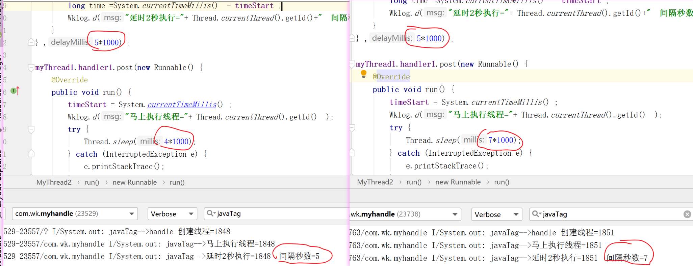

# Handle、Looper 、Message、MessageQueue 模型


简单的说：一个线程开启一个无限循环模式，不断遍历自己的消息列表，如果有消息就挨个拿出来做处理，如果列表没消息，自己就堵塞（相当于wait，让出cpu资源给其他线程），其他线程如果想让该线程做什么事，就往该线程的消息队列插入消息，该线程会不断从队列里拿出消息做处理。 

```text
Looper.prepare() --> sThreadLocal.set(new Looper(quitAllowed));
 Looper.loop()
 
 // 记住这点就不会弄错执行线程的问题
handleMessage 最终在哪个线程执行 , 要看 Looper 是由哪个 线程创建的。
```

##  Message
定义了消息必要的描述和属性数据。
```text
public final class Message implements Parcelable{
    public int what;//用来标识一个消息.区分来源
    public int arg1; //简单消息
    public int arg2;
    public Object obj; //任意类型数据
    public Messenger replyTo;
    Bundle data;//存储复杂点的对象
    Handler target;//发送和处理消息关联的 Handler
    Runnable callback; //消息的回调
    ......
}

// 获取 Message 的方式
Message message ;
message= new Message();

// Return a new Message instance from the global pool.
// Allows us to avoid allocating new objects in many cases.
message= Message.obtain();
message= Message.obtain( message ) ;
message= Message.obtain( handler ) ;
message= Message.obtain( handler, what) ;
message= Message.obtain( handler ,runnable) ;

// 效果跟  Message.obtain( handler ) 一样 ，因为最终也是执行到了 Message.obtain( handler )
message= handler.obtainMessage();
message= handler.obtainMessage( what);
```

## MessageQueue
消息队列 ,提供入队、出队等功能。系统只会自动给主线程建立 MessageQueue。
(子线程也可以有 MessageQueue，只是需要调用 Looper.prepare();  )
```text
boolean enqueueMessage(Message msg, long when)
Message next()
```

## Handle
负责 Message 的发送和执行处理等。
```text
handler.post(runnable) ;
handler.postAtTime(runnable ,0) ;
handler.postDelayed( runnable ,0) ;
handler.sendMessage(message);
handler.sendEmptyMessage( 1 );
handler.sendMessageDelayed(message, 0);
//  以上 6个函数 都最后会 被执行到 sendMessageAtTime()
handler.sendMessageAtTime(message ,0) ;
// 插入到消息队列最前面
handler.postAtFrontOfQueue(runnable) ;
```

## Looper
循环器，扮演 MessageQueue 和 Handler 之间桥梁的角色，循环取出 MessageQueue 里面的Message，并交付给 Handler 进行处理。

```text
Looper 在prepare中通过ThreadLocal保证了每个线程Looper对象的唯一性， 对于每个线程，有唯一的Looper对象和MessageQueue队列。
loop() 中有一个死循环 for (;;)  ，会不断调用 MessageQueue 的next()，当有消息就处理，否则就阻塞等待。

Looper.loop(); // 死循环 判断是否有需要处理的 Message
public static void loop(){
    final Looper me = myLooper();
    final MessageQueue queue = me.mQueue;
    for (;;)    {
        Message msg = queue.next();       //如果没有消息则阻塞。
        msg.target.dispatchMessage(msg); //将消息进行分发 处理 
    }
}
```

##   HandlerThread
```text
HandlerThread extends Thread..
HandlerThread 是一个内部实现了 Looper循环的线程 。

Android中多线程的场景很多，为了解决多线程问题，Android提供了很多方案。
线程池整体量级有些偏重，
HandlerThread 是一种轻量的多线程解决方案。

mHandler = new Handler(  mHandlerThread.getLooper()){
    public void handleMessage(Message msg){
        // 这里是子线程 ，可以执行耗时操作
        activity.runOnUiThread(new Runnable() {
            @Override
            public void run() {
                // 这里是主线程
            }
        });
    }
};

mHandler.sendEmptyMessage(MSG_UPDATE_INFO);
mHandler.removeMessages(MSG_UPDATE_INFO);
mHandlerThread.quit();
```

## ThreadLocal
从ThreadLocal这个名字看，它带着浓浓的“本地线程”的味道；
其实 ThreadLocal并不是用来操作什么本地线程而是用于实现不同线程的数据副本。
每一个线程都可以独立地改变自己的副本并且不会影响其它线程所持有的对应的副本。
```text
在 Looper.java 中 有使用到 ThreadLocal 的这特性。
static final ThreadLocal<Looper> sThreadLocal = new ThreadLocal<Looper>();
//将新创建的对象的引用保存到各线程的自己的一个map中 
sThreadLocal.set(new Looper(quitAllowed));

public static Looper myLooper() {
// 各线程从自己的map中取出放进去的对象，
// 因此取出来的是各自自己线程中的对象 ,使得每个 thread 都有自己独立的 handle
    return sThreadLocal.get();  
 }
```


## 一个线程有几个Looper
```text
因为在调用 Looper.prepare() 给当前线程新建 Looper 时有判断 , 所以 只能有一个 Looper
private static void prepare(boolean quitAllowed){
    if (sThreadLocal.get() != null)  {
        throw new RuntimeException("Only one Looper may be created per thread"); 
    }
    sThreadLocal.set(new Looper(quitAllowed));
}
```

## 判断是否是主线程
```text
通过判断两个线程的 Looper 是否是同一个。
return  Looper.myLooper() == Looper.getMainLooper();
```


## Can't create handler inside thread that has not called Looper.prepare()
```text
在子线程中 直接调用 Handler handler=new Handler() ,会提示这个错误。
因为 在 Handle 的构造函数中 对 Looper 进行检查 

mLooper = Looper.myLooper();
if (mLooper == null) {
    throw new RuntimeException( "Can't create handler inside thread " + Thread.currentThread()  + " that has not called Looper.prepare()");
}

所以需要 手动调用  Looper.prepare()
private static void prepare(boolean quitAllowed) {
    if (sThreadLocal.get() != null) {
        throw new RuntimeException("Only one Looper may be created per thread");
    }
    sThreadLocal.set(new Looper(quitAllowed)); // 通过 ThreadLocal 给当前线程设置 looper
}

而且需要手动调用 Looper.loop() ,开启 handle 对应 looper 的死循环  for (;;)
```

## 为什么主线程中 新建Handle 不要手动调用 Looper.prepare() 和 Looper.loop()
```text
因为在 ActivityThread.java 中的  public static void main(String[] args) 函数中
系统已经 启用了  Looper.prepareMainLooper() 、Looper.loop() 
```

## 主线程中的Looper.loop()一直无限循环为什么不会造成ANR
```text
为什么当主线程处于死循环的 Message msg = queue.next() 这句会阻塞线程的代码的时候不会产生 ANR 异常, 

1、当没有消息的时候会阻塞
2、其他线程有消息发过来，它马上就会被唤醒，去分发message。
所以 阻塞是有的，但是不会报ANR 。
因为ANR的根本原因是在等待的时间内没有回应，
你都没有 Message 要处理，我当然不需要任何回应。 
```

## ANR (Application Not Responding )原理
```text
ANR的监控和处理，是在系统层做的。
系统服务发出一条指令后会在约定的时间等待返回，
如果在约定时间内没有返回，系统就会给出 ANR 提示。
```

## 为什么 Handler 有潜在内存泄露
```text
在 Activity 中 用这种内部类的方式 新建 handle， handle就会持有外部类 activity 的引用，
Handler handler = new Handler() { ... };

同理 ，Runnable 也会拥有 外部类 activity 的引用
handler.postDelayed(new Runnable() {   public void run() { ... }   })
Runnable 被封装成 Message 被 MessageQueue 持有，所以 activity 被 MessageQueue 间接持有了。
activity 退出时，如果延时时间还没到，所以 activity 无法被释放掉。

至于为什么 内部类会持有外部类的引用，可以查阅其他资料 ，这里不讲解。
```

## 通过 WeakReference 解决 handle 内存泄漏 
```text
private static class MyHandler1 extends Handler {
    //WeakReference 当GC执行时，无论当前内存是否充足，都会将弱引用关联的对象回收掉。
    private final WeakReference<InfoHudViewHolder> weakReference;

    public MyHandler1(InfoHudViewHolder controller) {
        weakReference = new WeakReference<>(controller );
    }

    @Override
    public void handleMessage(Message msg) {
        InfoHudViewHolder holder = weakReference.get() ;
        if(holder==null){
            return;
        }
    }
}
// 使用
MyHandler  myHandler =new MyHandler(this) ;
```


## 为什么 在子线程中调用 activity.runOnUiThread() 也可以更新UI
```text
new Thread(new Runnable() {  activity.runOnUiThread(new Runnable() ... )  }).start();

public final void runOnUiThread(Runnable action) {
    if (Thread.currentThread() != mUiThread) { 
    // 在子线程中调用activity.runOnUiThread( ... ) 的情况 
        mHandler.post(action);
    } else {
    // 在主线程中调用activity.runOnUiThread( ... ) 的情况 
        action.run();
    }
}

从源码可以得知 ，如果调用 runOnUiThread()的线程就是主线程，就立马执行。
如果是在子线程中调用，就会把 Runnable 封装成 Message ，进入消息队列，
最后会转发给 创建 mHandler 所在的线程执行 ，Handler mHandler = new Handler();
mHandler 是系统在 Activity.java 中创建，所以最后会在主线程中执行了。
```
 
## 为什么 在子线程中调用 handler.post(new Runnable...)  也可以更新UI
```text
// 前提条件 ： handler是在 主线程中新建的 
new Thread(new Runnable() {  handler.post(new Runnable() { // 更新 UI  }   ).start();

跟踪源码发现 执行 post 后 ，会经过 一系列函数 ，将 Runnable 包装成 Message ，
最后分发回  handler所依附线程(主线程)中运行。

private static Message getPostMessage(Runnable r) {
    Message m = Message.obtain(); // 包装 Runnable 给 Message
    m.callback = r;
    return m;
}

public void dispatchMessage(@NonNull Message msg) {
    if (msg.callback != null) {
        handleCallback(msg); //  执行 Runnable 的run 函数
    }  
}
    
private static void handleCallback(Message message) {
    message.callback.run();
}
```

## handler 为什么可以更新UI 、为什么可以实现线程间通信
```text
现在有A、B两个线程，在A线程中创建了handler，然后在B线程中调用 A线程的 handler发送一个message。

当A线程创建handler的时候，同时创建了 MessageQueue 与 Looper，
Looper在A线程中被调用，进入 for (;;) 循环 ，轮询 MessageQueue 是否有需要处理的消息。

在B线程使用 A线程中的 handler发送一个message ,将message插入到handler对应的MessageQueue中，
Looper发现有message插入到MessageQueue中，便取出message执行相应的逻辑，

因为Looper.loop() 是在A线程中启动的，对应的 MessageQueue 和 Looper 都是属于 A线程的 ，
所以  Handle 的方法 handleMessage() 是在 A线程中执行。
```

##  Runnable 是一定运行在子线程中吗
```text
Runnable 运行在子线程中是错误的观念。
runnable只是创建了一个执行任务的对象，但是它本身并不会创建一个新的子线程。
最终的执行线程是要看 所依附的线程 。

1、举例 handler.post(runnable)
// The runnable will be run on the thread to which this handler is  attached. 
public final boolean post(@NonNull Runnable r) {
   return  sendMessageDelayed(getPostMessage(r), 0);
}

2、举例view.post(runnable)
The runnable will be run on the user interface thread.
```

##  一个 Message ，Handler 可以 post 两次吗
```text
不能，Message 在进入 queue 的时候会标记 inUse  ,
msg 被回收后，重新 obtain的时候 inUse 标记会清除，这时候可以再次 post
```


##  MessageQueue 如何对 Message 排序的
```text
通过时间排序 。
public final boolean postDelayed(@NonNull Runnable r, long delayMillis) {
    return sendMessageDelayed(getPostMessage(r), delayMillis);
}
    
public final boolean sendMessageDelayed(@NonNull Message msg, long delayMillis) {
    ...
    // SystemClock.uptimeMillis()  Returns milliseconds since boot, not counting time spent in deep sleep
    return sendMessageAtTime(msg, SystemClock.uptimeMillis() + delayMillis);
}
        
boolean enqueueMessage(Message msg, long when) {
    synchronized (this) {
        ...
        msg.when = when;
        Message p = mMessages; // 下一条信息
        boolean needWake;
        // 根据 when 进行顺序排序，将消息插入到其中
        if (p == null || when == 0 || when < p.when) {
            // 当前队列插在队首
            msg.next = p;
            mMessages = msg;
            needWake = mBlocked;
        } else {
            Message prev;
            for (;;) {
                // 根据 执行时间 when ，将 当前消息排在对应的位置 
                prev = p;
                p = p.next;
                if (p == null || when < p.when) {
                    break;
                }
                if (needWake && p.isAsynchronous()) {
                    needWake = false;
                }
            }
            // 插入操作
            msg.next = p;  
            prev.next = msg;
        }
         // 唤醒队列进行取消息
        if (needWake) {
            nativeWake(mPtr);
        }
    }
    return true;
}
```

## Handler.postDelayed()是如何 实现实现延时执行的  
```text
会马上进入队列的，而不是等时间到了再加入队列。 Handler 不是自己处理 Delay，而是交给了MessageQueue处理。

大概流程如下：
1、postDelay 一个延时10秒钟的A消息进队，MessageQueue调用 nativePollOnce ()阻塞，Looper阻塞；
2、紧接着post 一个B消息进队，判断现在A时间还没到、正在阻塞，把B插入消息队列的头部（A的前面），
然后调用nativeWake()方法唤醒线程；
3、MessageQueue.next()方法被唤醒后，读取消息链表，第一个消息B无延时，直接返回给Looper，执行B消息。
4、Looper for(;;) 处理完这个消息再次调用next()方法，MessageQueue继续读取消息链表，
假如消息A还没到时间，继续阻塞；直到阻塞时间到或者下一次有Message进队再次唤醒；

这样就实现了延时。
```

##  Handler.postDelayed() 的延时方法是一定非常精准吗
```text
这种方式是不精准的。
Message的执行时机是在加入队列时就计算好的。
sendMessageAtTime(msg, SystemClock.uptimeMillis() + delayMillis);

然后 Looper.looper()函数中的 for (;;) 是串行执行的，执行了上一条后再去判断下一个Message 是否要执行。
(handle 和 Looper 是处于一个线程，所以执行一条才能下一条)。

举个夸张的例子， 
myThread1.handler1.postDelayed(new Runnable() {
    @Override
    public void run() {
        long time =System.currentTimeMillis()  - timeStart ;
        Wklog.d("延时5秒执行="+ Thread.currentThread().getId()+"  间隔描述="+ (time/1000));
    }
} ,5*1000) ;

myThread1.handler1.post(new Runnable() {
    @Override
    public void run() {
        timeStart = System.currentTimeMillis() ;
        Wklog.d("马上执行线程="+ Thread.currentThread().getId()  );
        Thread.sleep(3*1000);
        //Thread.sleep(7*1000);
        }
    }
}) ;

handler1.postDelayed 按计划是延时5秒执行的，
handler1.post 是马上执行的 。
如果 post的 Handle在5秒内执行完毕， postDelayed的Runable 还是按照原计划 5秒后执行，
如果 post的 Handle 超过5秒执行完毕， postDelayed的Runable 就不能实现延时5秒了，而是7秒了。

因为，本来应该在 for(;;)判断是否要执行下一条的时间里 却在执行 耗时操作，错过了。
```



## MessageQueue 中为什么不用 wait 而用 epoll 进行等待呢
```text
在旧版本中，是用的wait 实现等待。
后来需要处理 native 层的一些事情，改成 select 再改成 epoll
private native void nativePollOnce(long ptr, int timeoutMillis)
实现等待 。

https://android.googlesource.com/platform/frameworks/base/+/46b9ac0ae2162309774a7478cd9d4e578747bfc2%5E%21/#F16  
```

## 如何退出 Looper 循环 、退出 Handle
```text
handler.getLooper().quit(); // 我手动调用这个代码
// Looper.java
public void quit() {
    mQueue.quit(false);
}

// MessageQueue.java 
void quit(boolean safe) {
    synchronized (this) {
        if (mQuitting) {
            return;
        }
        mQuitting = true; // 1、标记可以退出
        if (safe) {
            removeAllFutureMessagesLocked(); // 2、删除相关数据
        } else {
            removeAllMessagesLocked();
        }
        nativeWake(mPtr); // 3、唤醒线程
    }
}

然后再来看 Looper.java 中的 loop() 函数
public static void loop() {
    for (;;) {
        Message msg = queue.next(); // might block ，
        if (msg == null) {
            // 6、nex 返回空 ，退出 loop循环 
            return;
        }
        msg.recycleUnchecked();
    }
}

// MessageQueue.java 
Message next() {
    for (;;) {
        // nativePollOnce 用于“等待”, 直到下一条消息可用为止
        // 4、被step3唤醒 ，继续往下执行
        nativePollOnce(ptr, nextPollTimeoutMillis);
        synchronized (this) {
            if (mQuitting) { // 5、mQuitting 在 step 1被设置为 true了 ，所以返回 null
                dispose();
                return null;
            }
    }
``` 

##  主线程 的 looper 能否 quit()
```text
void quit(boolean safe) {
    if (!mQuitAllowed) {
        throw new IllegalStateException("Main thread not allowed to quit.");
    }
   }
从源码可知，主线程的Looper 禁止开发者 quit 。
因为主线程中的 handle 要处理很多事情，退出之后 整个APP就没得玩了。

private class H extends Handler｛
    public void handleMessage(Message msg) {
    switch (msg.what) {
        case LAUNCH_ACTIVITY 
        case RELAUNCH_ACTIVITY: {
        case PAUSE_ACTIVITY: {
        case PAUSE_ACTIVITY_FINISHING: 
        case STOP_ACTIVITY_SHOW: 
        case STOP_ACTIVITY_HIDE:  
        case LOCAL_VOICE_INTERACTION_STARTED:
        ...
```

## Handler 如何确保线程安全
```text
// 与 handle 对应的 MessageQueue ，Message 进入队列 synchronized 上锁了
boolean enqueueMessage(Message msg, long when) { // MessageQueue.java 
    synchronized (this) {
            
// Looper 中获取 Message 时 MessageQueue 的next 也被上锁了
for (;;) { // Looper.java 
  Message msg = queue.next(); 

Message next() { // MessageQueue.java  
 synchronized (this) { ...  }   }
```

## Handle 屏障消息 、同步屏障
```text
Message分为3种：普通消息（同步消息）、屏障消息（同步屏障）和异步消息。
我们通常使用的都是普通消息，而屏障消息就是在消息队列中插入一个屏障，
在屏障之后的所有普通消息都会被挡着，不能被处理。屏障不会挡住异步消息，
因此可以这样认为：屏障消息就是为了确保异步消息的优先级，
设置了屏障后，只能处理其后的异步消息，同步消息会被挡住，除非撤销屏障。

屏障消息和普通消息的区别在于屏障没有 tartget，普通消息有 target 是因为它需要将消息分发给对应的 target，
而屏障不需要被分发，它就是用来挡住普通消息来保证异步消息优先处理的。

插入和移除屏障消息 用反射调用 MessageQueue.java 中的私有方法 postSyncBarrier() 、removeSyncBarrier()
注意一点  插入普通消息会唤醒消息队列，但是插入屏障不会。

Message message = Message.obtain(); // 默认是 同步消息
message.setAsynchronous(true); // 设置为 异步消息

// 插入同步屏障消息
MessageQueue queue=handler.getLooper().getQueue();//  android 6.0 才有
Method method=MessageQueue.class.getDeclaredMethod("postSyncBarrier");
method.setAccessible(true);
int token= (int) method.invoke(queue);// token用来移除屏障

MessageQueue queue=handler.getLooper().getQueue();
Method method=MessageQueue.class.getDeclaredMethod("removeSyncBarrier",int.class);
method.setAccessible(true);
method.invoke(queue,token);

所谓消息屏障和异步消息是一种插队机制。
viewrootimpl 在 scheduletraversal 的时候在在messagequeue的头部放一个target为null的message，
messagequeue的next方法在取下一个消息的时候，发现头部是这样的message，
会忽略普通消息，在列表中只找标记了异步的消息，如果找不到，
即使列表中有其他正常的message都不会去处理。
而系统中发送异步消息的地方，是Choreographer中收到vsync信号的地方。
这样做的效果是，一旦调用了requestlayout等方法，用户的其它代码所发送的消息，
即使发送得更早，都会等layout代码优先执行
```

## 手写 handle 机制 实现 线程间通信
handle 不仅仅只用于 主线程 和子线程的通信 ，也可以实现 子线程和子线程的通信 。
可以参考我的 demo  https://gitee.com/hnyer/my-handle  


 