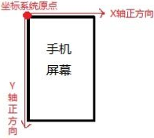
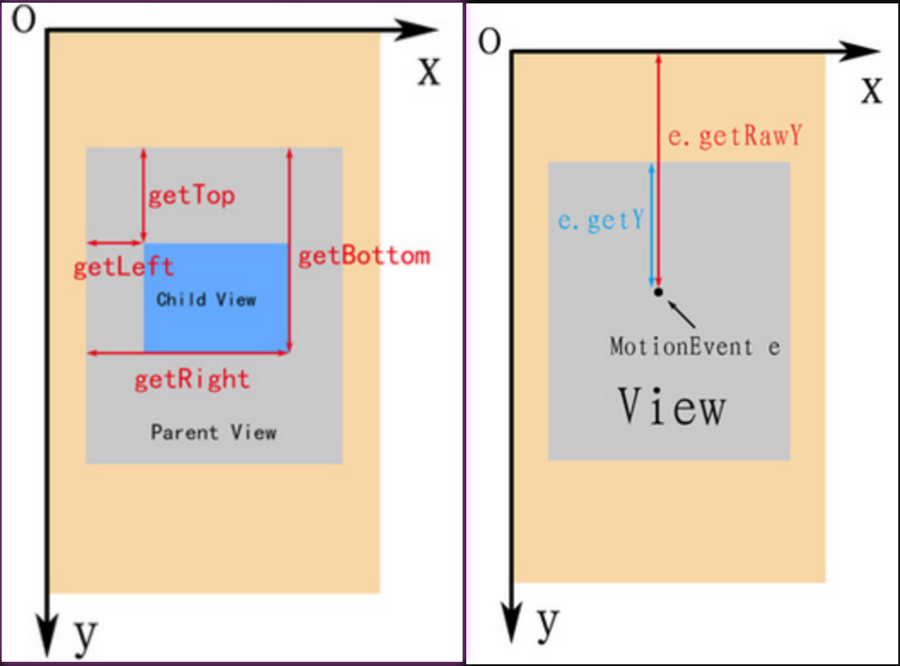

# 屏幕坐标系
```text
在Android系统中，屏幕的左上角是坐标系统的原点（0,0）坐标。
原点向右延伸是X轴正方向，原点向下延伸是Y轴正方向。
```




# View坐标系
```text
View坐标系以父视图的左上角为坐标原点。
getTop();   //获取子View左上角距父View顶部的距离
getLeft();  //获取子View左上角距父View左侧的距离
getBottom();//获取子View右下角距父View顶部的距离
getRight(); //获取子View右下角距父View左侧的距离
event.getX(); //触摸点相对于其所在视图坐标的坐标    
event.getY();
event.getRawX();//触摸点相对于屏幕的坐标
event.getRawY();
```


 


