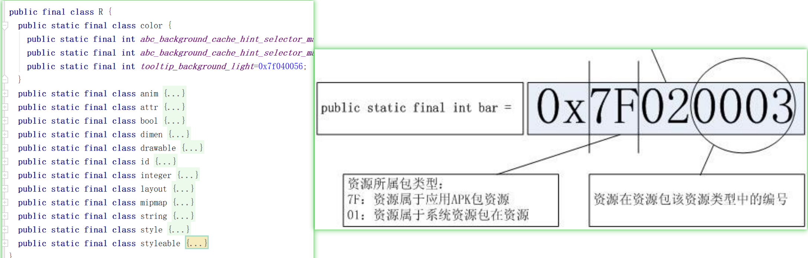

#  虚拟机对比
## JVM
Java Virtual Machine。基于栈 ，运行java字节码。

## DVM 
```text
Dalvik Virtual Machine 。
运行自谷歌定义的 .dex字节码格式。
Dalvik 基于寄存器的架构， 更适合资源紧张的系统。
```

## ART 
```text
Android runtime 。
Android 4.4 开始加入 ART模式。
ART下，应用在第一次安装的时候，字节码就会预编译成机器码，首次启动会变慢，
但是以后每次启动执行的时候，都可以直接运行。（空间换时间）
```

# R.java 文件结构 

```text
R.java 定义了res目录中全部资源的id ，
系统会对工程中的 字符串、图片、xml等资源进行搜索生成一个索引文件，
每一个资源对应一个唯一的ID。
将 id 作为 key，去 resource.arsc 里面去查找对应的真正的资源。
这个 ID，用 32 位的 int 表示。格式为 PPTTNNNN。

前 8 位 PP (Package) 表示资源所属包类型，0x7f 表示应用 Apk 包资源，0x01 表示系统包资源。
中间 8 位 TT(Type) 代表资源 id 的类型
0x02：drawable
0x03：layout
0x04：values
0x05：xml
0x06：raw
0x07：color
0x08：menu
最后 16 位表示资源在此类型里面的编号。
```

## R文件的设计目的是啥，为什么不直接使用资源路径
```text
用 R.java 来映射资源文件 ，大概有以下一些优点。
1、编程工具会对res下的资源进行扫描，删除或增加都会自动更新R文件，
维护一个最新的R文件，相当于维护这一个索引，智能提示提高开发者的开发速度。

2、方便引入非文件资源，例如 字符串和颜色配置等。
3、将每个资源都映射成一个32的int (比很长的文件名节省空间) 。 

其他的等待补充。
```

# .dex 文件 为什么不能超过 65535 个方法
```text
UNEXPECTED TOP-LEVEL EXCEPTION:  
java.lang.IllegalArgumentException: method ID not in [0, 0xffff]: 65536

Java源文件在打包成一个DEX文件，这个文件就是优化过的、Dalvik虚拟机可执行的文件，
Dalvik虚拟机在执行DEX文件时，它使用了 short 这个类型（16 bit）索引DEX文件中的方法，
这意味着单个DEX文件可以被定义的方法最多只能是65535个，当超过这个数量时就会发生编译错误。
```


# 双缓冲
```text
两个线程配合完成某一项工作，一个线程做A部分（例如绘制UI），
另一个线程做B事情（例如读取资源，计算数据）。 

常见的例子：
1、TCP数据传输， 数据的收发速度不一致可能导致数据的丢失。
数据线发送到缓冲区中，然后从缓冲区中取走。
有效地防止了数据的丢失。

2、复杂图像绘制过程中。 
线程A将一帧的计算结果放在缓冲区中，线程绘制完当前帧后再去缓冲区中取下一帧完整的绘制资源。 
这样就可以避免画面闪烁结果。

很多图形操作都很复杂，需要大量的计算，很难访问一次显示缓冲区就能写入待显示的完整图形数据，
通常需要多次访问显示缓冲区，每次访问时写入最新计算的图形数据。
而这样造成的后果是一个需要复杂计算的图形，你看到的效果可能是一部分一部分地显示出来的，造成很大的闪烁不连贯。
```


# 硬件加速
```text
图形的绘制如果是 GPU处理的就是 硬件加速绘制，如果是 CPU 处理的 就是软件绘制。
硬件加速使用 GPU 进行View上的绘制操作。

硬件加速可以在以下四个级别开启或关闭：
Application ：  为整个 APP开启
<application android:hardwareAccelerated="true" ...>

Activity：  activity 范围
<activity android:hardwareAccelerated="false" />

Window： window 范围
getWindow().setFlags( WindowManager.LayoutParams.FLAG_HARDWARE_ACCELERATED

View：  view 范围
oneView.setLayerType(View.LAYER_TYPE_SOFTWARE, null);
```

并非所有的2D绘图操作支持硬件加速。所以硬件加速的开关分为四个层次。
以下是已知不支持硬件加速的绘图操作(需要最新的请查阅[官网](https://developer.android.google.cn/guide/topics/graphics/hardware-accel.html))


## 支持硬件加速情况

Canvas | 第一次支持 | Paint | 第一次支持
-|-
drawBitmapMesh() (colors array) | 18 |setAntiAlias() (for text)	|18
drawPicture()	 | 23 |setAntiAlias() (for lines)|	16
drawPosText() | 16 |setFilterBitmap()|	17
drawTextOnPath() | 16 |setLinearText()|	✗
drawVertices() | ✗ |setMaskFilter()|	✗
setDrawFilter() | 16 |setPathEffect() (for lines)	|✗
clipPath() | 18 |setRasterizer()	|✗
clipRegion() | 18 |setShadowLayer() (other than text)	|✗
clipRect(Region.Op.XOR) | 18 |setStrokeCap() (for lines)	|18
clipRect(Region.Op.Difference) | 18 |setStrokeCap() (for points)	|19
clipRect(Region.Op.ReverseDifference) | 18 |setSubpixelText()	|✗
clipRect() with rotation/perspective| 18 | |


Xfermode | 第一次支持 |Shader | 第一次支持
-|-
PorterDuff.Mode.DARKEN (framebuffer)	|✗|ComposeShader inside ComposeShader	|✗
PorterDuff.Mode.LIGHTEN (framebuffer)|	✗|Same type shaders inside ComposeShader	|✗
PorterDuff.Mode.OVERLAY (framebuffer)|	✗  | Local matrix on ComposeShader	|18


Drawing operation to be scaled	|第一次支持
-|-
drawText()	|18
drawPosText()	|✗
drawTextOnPath()	|✗
Simple Shapes*	|17
Complex Shapes*	|✗
drawPath()	|✗
Shadow layer	|✗

# SharedPreferences
一些简单的、无安全风险的键值对数据，可以通过 SharedPreferences 保存。
SharedPreferences 是一个轻量级的xml键值对文件 。
```text
文件保存在 /data/data/<package name>/shared_prefs 中，明文可见。
用真机中的文件夹管理器一般看不到，可以用过 Androidstudio 去看。

在 SharedPreferencesImpl.java 中
private void startLoadFromDisk() {
    new Thread("SharedPreferencesImpl-load") {
    ...
            loadFromDisk(); // 开启子线程读取
    }.start();
}
```

## SharedPreferences  apply 和  commit 的区别
```text
apply()：提交后同步写入内存，然后异步写入磁盘，没有返回值。
commit()：需要等异步回写磁盘完成后才返回，有返回值。
如果频繁操作的话 apply 的性能会优于 commit 。 
```

## SharedPreferences   是线程安全的吗 
```text
SharedPreferences 是线程安全的，因为内部有 synchronized 关键字保障。
```


## SharedPreferences 是进程安全的吗？ 如何保证进程安全  
```text
因为 SharedPreferences 会从内存取值，但是进程间内存不是共享的，所以不是多进程安全的。
// SharedPreferencesImpl.java
public String getString(String key, @Nullable String defValue) {
    synchronized (mLock) {
        awaitLoadedLocked();
        String v = (String)mMap.get(key); // 从内存取值
        return v != null ? v : defValue;
    }
}

SharedPreferences sharedPreferences =
context.getSharedPreferences("xxxName", Context.MODE_MULTI_PROCESS);
// 因为对多进程支持不完善，MODE_MULTI_PROCESS (也不可靠) 模式也已经被废弃，
//  官方推荐 ContentProvider 或者 第三方框架 MMKV
```


# Application 
```text
// Application 中显示 Dialog (AlertDialog) 
借助 ActivityLifecycleCallbacks 的生命周期回调 获得 Context
new AlertDialog.Builder(mContext);   

// 通过 Application  传值 缺点 
```
 
 #  ListView 动态改变高度
 ```text
 public void setListViewHeightBasedOnChildren2(ListView listView) {
     ListAdapter listAdapter = listView.getAdapter();
     if (listAdapter == null) {
         return;
     }
     int totalHeight = 0;
     for (int i = 0; i < listAdapter.getCount(); i++) {
         View listItem = listAdapter.getView(i, null, listView);
         // 对 子View item 不做限制，要多大就报上来多大
         listItem.measure(View.MeasureSpec.UNSPECIFIED, View.MeasureSpec.UNSPECIFIED);
         totalHeight += listItem.getMeasuredHeight();
     }
 
     ViewGroup.LayoutParams params = listView.getLayoutParams();
     params.height = totalHeight + (listView.getDividerHeight() * (listAdapter.getCount() -1));
     listView.setLayoutParams(params);
 }
 ```


# RecyclerView
```text
implementation 'com.android.support:appcompat-v7:24.2.1'
implementation 'androidx.recyclerview:recyclerview:1.0.0'
在添加依赖的时候，要用小写字母去搜索。
```

##  RecyclerView 与 listview 的区别
```text
RecyclerView 是 listview 的升级版，具有更高灵活、扩展 。

1、RecyclerView 默认实现了 线性布局、网格布局、流式布局。
2、RecyclerView 取消了 setEmptyView() 、 addHeaderView() 、 addFooterView() 对应的 UI效果需要自己去实现。
3、RecyclerView 提供了 局部刷新的 接口  notifyItemChanged(position) 
4、RecyclerView 提供了部分 动画效果。listview 完全靠自定义 。
5、RecyclerView 实现嵌套滚动机制 。
```
 

##  RecyclerView ItemDecoration 间隔线
```text
recyclerView.addItemDecoration(xx);
https://gitee.com/Aivin_CodeShare/android_tool_code/raw/master/RecyclerView/RecyclerViewMarginDecoration.java
```
 

## RecyclerView 添加动画
默认实现一些基础动画。
```text

```

## RecyclerView 局部刷新 原理
```text

```

## RecyclerView 缓存 机制
默认已经实现了 View的复用，不需要类似 if(convertView == null) 的实现 
```text

```

## RecyclerView 复用 机制
默认已经实现了 View的复用，不需要类似 if(convertView == null) 的实现 
```text

```

##  RecyclerView 回收机制
```text

```


 

##  RecyclerView 嵌套滑动 机制
Android 5.0推出了嵌套滑动机制，在之前，一旦子View处理了触摸事件，
父View就没有机会再处理这次的触摸事件，而嵌套滑动机制解决了这个问题
```text

```

##  RecyclerView 多种 type场景下怎么避免滑动卡顿
```text

```


##  RecyclerView 万能适配器
以上是讲解 recyclerview 的原理，实际使用中 可以使用 一些封装过的 第三方 适配器，提高开发速度。
```text
https://github.com/CymChad/BaseRecyclerViewAdapterHelper
```

##  RecyclerView  +  RadioGroup RadioButton 防止数据错乱 处理
```text
https://gitee.com/Aivin_CodeShare/android_tool_code/raw/master/PreFlightCheckAdapter.java
``` 

 
# 序列化
```text
序列化，将内存中保存的是对象以二进制数据流的形式进行处理，
可以实现对象的保存或者是网络传输。
与序列化相对的是反序列化，它将流转换为对象。
```

## Bunder 传递对象为什么需要序列化
```text
因为 Bunder + intent 是支持跨进程传递的，
而 Android 进程间是不支持 对象传递的，
所以要将对象序列化成二进制。
```

## serialVersionUID 的作用
```text
serialVersionUID 主要是一种安全机制。

序列化的时候系统会把当前类的 serialVersionUID 写入序列化文件中，
当反序列化的时候系统会去检测文件中的serialVersionUID,看他是否和当前类的一致，如果一致，
说明序列化类的版本和当前类的版本是相同的，这个时候成功反序列化，
否则说明当前类和序列化的类相比发生某些变换，这个时候无法正常反序列化，会报错。
 
如果不手动指定 serialVersionUID ，那么将对象序列化时系统生成一个 serialVersionUID值 一起持久化了。
此时如果你给这个对象增加了一个属性，再次持久化时，此时生成 serialVersionUID 值是不一样的。

如果你不想进行这样严格的校验，你手动手动 serialVersionUID =1L ，那么即使你新增或者减少了属性，
反序列化的时候也不会报错，只是被忽略或者默认置为0 。 
 
Androidstudio中生成  serialVersionUID的方法。
preferences->Inspections->serialization issues->Serializable class without 'serialVersionUID' 勾上 。
此时会提示生成严格验证的 serialVersionUID的方法 。如果不想严格校验可以直接写成1 。
```

## Serializable 与 Parcelable 的区别
```text
Serializable 是一种标识接口,是一个空接口。
对某个类实现 Serializable 后，Java便会对这个对象进行序列化操作。
这种方法使用了反射原理，序列化的过程较慢。
会在序列化的时候创建许多的临时对象，可能会引起频繁的GC。
使用起来简单但是开销很大，序列化和反序列化过程需要大量I/O操作。
Serializable 主要用于持久化存储对象 ，保存在磁盘或者网络传输。

Parcelable 方式的实现原理是将一个完整的对象进行分解， 
而分解后的每一部分都是Intent所支持的数据类型，这样也就实现传递对象的功能了。
因为我们已经清楚地知道了序列化的过程，而不需要使用反射来推断。
为了这种高效分解组合，我们需要按要求进行一些代码书写。

Parcelable 是直接在内存中读写 ，
无法将数据进行持久化 ，只能用于程序内内存间进行对象传输 。

在 Androidstudio 中，我们可以使用 插件 " Parcelable code generator " 
来自动生成一些代码。减少代码书写量。
``` 