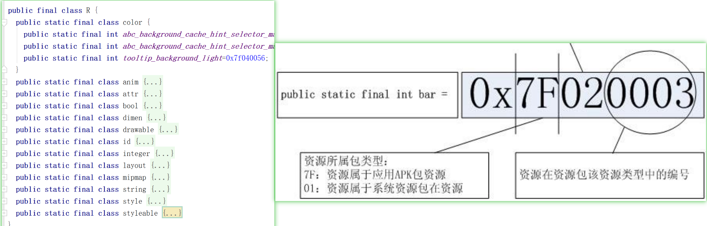

#  虚拟机对比
## JVM
Java Virtual Machine。基于栈 ，运行java字节码。

## DVM 
```text
Dalvik Virtual Machine 。
运行自谷歌定义的 .dex字节码格式。
Dalvik 基于寄存器的架构， 更适合资源紧张的系统。
```

## ART 
```text
ART , Android runtime 。
Android 4.4 开始加入 ART模式 , 从 Android 5.0 开始 ART 就全面取代了 Dalvik。 
ART下，应用在第一次安装的时候，字节码就会预编译成机器码，首次启动会变慢，
但是以后每次启动执行的时候，都可以直接运行。（空间换时间）
```


# R.java 文件结构 

```text
R.java 定义了res目录中全部资源的id ，
系统会对工程中的 字符串、图片、xml等资源进行搜索生成一个索引文件，
每一个资源对应一个唯一的ID。
将 id 作为 key，去 resource.arsc 里面去查找对应的真正的资源。
这个 ID，用 32 位的 int 表示。格式为 PPTTNNNN。

前 8 位 PP (Package) 表示资源所属包类型，0x7f 表示应用 Apk 包资源，0x01 表示系统包资源。
中间 8 位 TT(Type) 代表资源 id 的类型
0x02：drawable
0x03：layout
0x04：values
0x05：xml
0x06：raw
0x07：color
0x08：menu
最后 16 位表示资源在此类型里面的编号。
```

## R文件的设计目的是啥，为什么不直接使用资源路径
```text
用 R.java 来映射资源文件 ，大概有以下一些优点。
1、编程工具会对res下的资源进行扫描，删除或增加都会自动更新R文件，
维护一个最新的R文件，相当于维护这一个索引，智能提示提高开发者的开发速度。

2、方便引入非文件资源，例如 字符串和颜色配置等。
3、将每个资源都映射成一个32的int (比很长的文件名节省空间) 。 

其他的等待补充。
```

## R 文件的位置
```text
两种情况
1、编码调试阶段 ，在Androidstudio查看 ，
2、打成 apk 后，R文件的位置
```


# .dex 文件 为什么不能超过 65535 个方法
```text
UNEXPECTED TOP-LEVEL EXCEPTION:  
java.lang.IllegalArgumentException: method ID not in [0, 0xffff]: 65536

Java源文件在打包成一个DEX文件，这个文件就是优化过的、Dalvik虚拟机可执行的文件，
Dalvik虚拟机在执行DEX文件时，它使用了 short 这个类型（16 bit）索引DEX文件中的方法，
这意味着单个DEX文件可以被定义的方法最多只能是65535个，当超过这个数量时就会发生编译错误。
```


# 双缓冲
```text
两个线程配合完成某一项工作，一个线程做A部分（例如绘制UI），
另一个线程做B事情（例如读取资源，计算数据）。 

常见的例子：
1、TCP数据传输， 数据的收发速度不一致可能导致数据的丢失。
数据线发送到缓冲区中，然后从缓冲区中取走。
有效地防止了数据的丢失。

2、复杂图像绘制过程中。 
线程A将一帧的计算结果放在缓冲区中，线程绘制完当前帧后再去缓冲区中取下一帧完整的绘制资源。 
这样就可以避免画面闪烁结果。

很多图形操作都很复杂，需要大量的计算，很难访问一次显示缓冲区就能写入待显示的完整图形数据，
通常需要多次访问显示缓冲区，每次访问时写入最新计算的图形数据。
而这样造成的后果是一个需要复杂计算的图形，你看到的效果可能是一部分一部分地显示出来的，造成很大的闪烁不连贯。
```


# 硬件加速
```text
图形的绘制如果是 GPU处理的就是 硬件加速绘制，如果是 CPU 处理的 就是软件绘制。
硬件加速使用 GPU 进行View上的绘制操作。

硬件加速可以在以下四个级别开启或关闭：
Application ：  为整个 APP开启
<application android:hardwareAccelerated="true" ...>

Activity：  activity 范围
<activity android:hardwareAccelerated="false" />

Window： window 范围
getWindow().setFlags( WindowManager.LayoutParams.FLAG_HARDWARE_ACCELERATED

View：  view 范围
oneView.setLayerType(View.LAYER_TYPE_SOFTWARE, null);
```

并非所有的2D绘图操作支持硬件加速。所以硬件加速的开关分为四个层次。
以下是已知不支持硬件加速的绘图操作(需要最新的请查阅[官网](https://developer.android.google.cn/guide/topics/graphics/hardware-accel.html))


## 支持硬件加速情况

Canvas | 第一次支持 | Paint | 第一次支持
-|-
drawBitmapMesh() (colors array) | 18 |setAntiAlias() (for text)	|18
drawPicture()	 | 23 |setAntiAlias() (for lines)|	16
drawPosText() | 16 |setFilterBitmap()|	17
drawTextOnPath() | 16 |setLinearText()|	✗
drawVertices() | ✗ |setMaskFilter()|	✗
setDrawFilter() | 16 |setPathEffect() (for lines)	|✗
clipPath() | 18 |setRasterizer()	|✗
clipRegion() | 18 |setShadowLayer() (other than text)	|✗
clipRect(Region.Op.XOR) | 18 |setStrokeCap() (for lines)	|18
clipRect(Region.Op.Difference) | 18 |setStrokeCap() (for points)	|19
clipRect(Region.Op.ReverseDifference) | 18 |setSubpixelText()	|✗
clipRect() with rotation/perspective| 18 | |


Xfermode | 第一次支持 |Shader | 第一次支持
-|-
PorterDuff.Mode.DARKEN (framebuffer)	|✗|ComposeShader inside ComposeShader	|✗
PorterDuff.Mode.LIGHTEN (framebuffer)|	✗|Same type shaders inside ComposeShader	|✗
PorterDuff.Mode.OVERLAY (framebuffer)|	✗  | Local matrix on ComposeShader	|18


Drawing operation to be scaled	|第一次支持
-|-
drawText()	|18
drawPosText()	|✗
drawTextOnPath()	|✗
Simple Shapes*	|17
Complex Shapes*	|✗
drawPath()	|✗
Shadow layer	|✗


# fork 是什么意思
```text
经常会听到 fork 一个进程，初学者有时不太理解。

fork() 函数用于从一个已经存在的进程内创建一个新的进程，
使用 fork() 得到的子进程是父进程的复制品，
子进程完全复制了父进程的资源，
包括进程上下文、代码区、数据区、堆区、栈区、内存信息、打开文件的文件描述符、
信号处理函数、进程优先级、进程组号、当前工作目录、根目录、资源限制和控制终端等信息，
而子进程与父进程的区别有进程号、资源使用情况和计时器等。

从基本作用上来理解， fork 跟 Java里的深克隆类似。
都是从一个目标完全复制一份新的对象出来。

github 上也有有一个 fork ，
感觉也类似，就是从别人的代码那里，
复制一份一模一样的代码到你的账号上。
```

# hook 是什么意思
```text
hook 的中文翻译是钩子。
在windows系统中，一切皆消息，比如按了一下键盘，也是一个消息。
Hook的意思是勾住 ，也就是在消息过去之前，可以先把消息勾住，
不让其传递，你可以优先处理。

hook 技术就是提供了一个方案，
能够针对不同的消息或者API在执行前，先执行你的操作，
你的操作也称为“钩子函数”，
所以有的时候程序员在讨论的时候，也经常会说，可以先hook住，再处理，
也即在执行某某操作之前，优先处理一下
```


 
# 序列化
```text
序列化，将内存中保存的是对象以二进制数据流的形式进行处理，
可以实现对象的保存或者是网络传输。
与序列化相对的是反序列化，它将流转换为对象。
```

## Bunder 传递对象为什么需要序列化
```text
因为 Bunder + intent 是支持跨进程传递的，
而 Android 进程间是不支持 对象传递的，
所以要将对象序列化成二进制。
```

## serialVersionUID 的作用
```text
serialVersionUID 主要是一种安全机制。

序列化的时候系统会把当前类的 serialVersionUID 写入序列化文件中，
当反序列化的时候系统会去检测文件中的serialVersionUID,看他是否和当前类的一致，如果一致，
说明序列化类的版本和当前类的版本是相同的，这个时候成功反序列化，
否则说明当前类和序列化的类相比发生某些变换，这个时候无法正常反序列化，会报错。
 
如果不手动指定 serialVersionUID ，那么将对象序列化时系统生成一个 serialVersionUID值 一起持久化了。
此时如果你给这个对象增加了一个属性，再次持久化时，此时生成 serialVersionUID 值是不一样的。

如果你不想进行这样严格的校验，你手动手动 serialVersionUID =1L ，那么即使你新增或者减少了属性，
反序列化的时候也不会报错，只是被忽略或者默认置为0 。 
 
Androidstudio中生成  serialVersionUID的方法。
preferences->Inspections->serialization issues->Serializable class without 'serialVersionUID' 勾上 。
此时会提示生成严格验证的 serialVersionUID的方法 。如果不想严格校验可以直接写成1 。
```

## Serializable 与 Parcelable 的区别
```text
Serializable 是一种标识接口,是一个空接口。
对某个类实现 Serializable 后，Java便会对这个对象进行序列化操作。
这种方法使用了反射原理，序列化的过程较慢。
会在序列化的时候创建许多的临时对象，可能会引起频繁的GC。
使用起来简单但是开销很大，序列化和反序列化过程需要大量I/O操作。
Serializable 主要用于持久化存储对象 ，保存在磁盘或者网络传输。

Parcelable 方式的实现原理是将一个完整的对象进行分解， 
而分解后的每一部分都是Intent所支持的数据类型，这样也就实现传递对象的功能了。
因为我们已经清楚地知道了序列化的过程，而不需要使用反射来推断。
为了这种高效分解组合，我们需要按要求进行一些代码书写。

Parcelable 是直接在内存中读写 ，
无法将数据进行持久化 ，只能用于程序内内存间进行对象传输 。

在 Androidstudio 中，我们可以使用 插件 " Parcelable code generator " 
来自动生成一些代码。减少代码书写量。
``` 


# Activity 与 AppCompatActivity 区别
```text
随着 Android系统的更新，增加了一些新的特性，
所以后续慢慢地推出了  FragmentActivity 、AppCompatActivity  。
AppCompatActivity 加入了很多新特性，并且向下兼容(兼容老设备,旧系统版本)。

AppCompatActivity extends FragmentActivity 
FragmentActivity extends ComponentActivity 
ComponentActivity extends Activity

// Activity
Activity是最基础的一个，是其它类的直接或间接父类。
Activity中 只能使用系统自带的 FragmentTabHost+Fragment  ， 
用 getFragmentManager() 来控制Activity和Fragment之间的交互。

// FragmentActivity
在v4包中引 入 FragmentActivity ，
FragmentActivity 间接继承自Activity，并提供了对v4包中 support Fragment的支持。
在 FragmentActivity 中必须使用 getSupportFragmentManager() 来处理support Fragment的交互。

// AppCompatActivity
AppCompatActivity 继承自FragmentActivity，同时取代了ActionBarActivity。
AppCompatActivity 支持 ActionBar 功能，同时更推荐使用 ToolBar。
而且 AppCompatActivity 为支持Material Design风格控件提供了便利。

另外：与 Activity 相比较， AppCompatActivity 的 theme 只能用 android:theme=”@style/AppTheme ，而不能用android:style。 
否则会提示错误： Caused by: java.lang.IllegalStateException: 
You need to use a Theme.AppCompat theme (or descendant) with this activity.
```


# android 严苛模式 、严格模式
```text
在代码中配置严苛模式，用来帮助我们更容易找到违规的代码。
比如在主线程中访问网络、访问磁盘、Activity的泄露 等不合理的操作。

// 线程策略
StrictMode.ThreadPolicy threadPolicy = new StrictMode.ThreadPolicy.Builder()
        .detectAll() // 检测所有潜在的违例
        .detectCustomSlowCalls()// 自定义耗时操作
        .detectDiskReads() // 读磁盘
        .detectDiskWrites() // 写磁盘
        .detectNetwork() // 检查网络
        .detectResourceMismatches() // 检查资源类型是否匹配
        .penaltyLog() // 将警告输出到LogCat
        .penaltyFlashScreen()// 屏幕闪烁
        .penaltyDropBox() // 将违规信息记录到 dropbox 系统日志目录中（/data/system/dropbox）
        .penaltyDeath() // 当触发违规条件时，直接Crash掉当前应用程序。
        .penaltyDialog() // 弹出dialog
        .penaltyDeathOnNetwork()// 当触发网络违规时，Crash掉当前应用程序
        .build();

// Vm 策略
StrictMode.VmPolicy vmPolicy = new StrictMode.VmPolicy.Builder()
        .detectAll() // 检测所有潜在的
        .detectActivityLeaks()// 检测Activity的泄露
        .detectCleartextNetwork() //检测明文的网络
        .detectFileUriExposure() //  检测file:// 或 content://
        .detectLeakedClosableObjects()  // 未关闭的Closable对象泄露
        .detectLeakedRegistrationObjects() // 检测需要注册类型是否解注
        .detectLeakedSqlLiteObjects() // 泄露的Sqlite对象
        .setClassInstanceLimit(Stutent.class ,10)// 检测实例数量
        .penaltyLog() //  将警告输出到LogCat
        .penaltyDropBox() // 将违规信息记录到 dropbox 系统日志目录中（/data/system/dropbox）
        .penaltyDeath() // 当触发违规条件时，直接Crash掉当前应用程序。
        .build();

StrictMode.setThreadPolicy(threadPolicy );
StrictMode.setVmPolicy(vmPolicy  );
```


# 线程休眠方法
```text
Thread.sleep()  // 抛异常 ,可能会被中断  
SystemClock.sleep( ) // 不能被中断 ，Android 推荐用这个
LockSupport.parkNanos(1);//  LockSupport.unpark(thread);       
object.wait() // object.notifyAll();  不推荐使用
```


# Android 拖拽效果
```text
以前没看过这个知识点，以为绘制那个虚影有点麻烦。
其实 Android api 有提供一个简单的 api view.startDrag( ) ，会自动生成虚影。
在实际项目中，配合处理一下 拖动事件的监听和坐标的处理即可。
可以参考一下这个项目 
https://gitee.com/hnyer/RemoteControlView
--------------------

public void startDrag(View view ,DraggableInfo draggableInfo ){
    Intent intent = new Intent();
    intent.putExtra(MyConfig.KEY_DATA, draggableInfo);
    //用 ClipData 来跨 activity 传值
    ClipData dragData = ClipData.newIntent(MyConfig.KEY_Value, intent);
    View.DragShadowBuilder myShadow = new View.DragShadowBuilder(view);
    // 震动 (不需要震动权限)
    view.performHapticFeedback(HapticFeedbackConstants.LONG_PRESS, HapticFeedbackConstants.FLAG_IGNORE_GLOBAL_SETTING);
    // 执行startDrag后 ，系统就会生成view的拖拽影子
    if (Build.VERSION.SDK_INT >= Build.VERSION_CODES.N) {
        view.startDragAndDrop(dragData, myShadow, null, 0);
    }else{
        view.startDrag(dragData, myShadow, null, 0);
    }
}
// 给一个控件添加拖动监听，可以监听到被拖动的那个控件的拖动事件和坐标
frameLayout.setOnDragListener(onDragListener);
private  View.OnDragListener onDragListener = new OnDragListener() {
    public boolean onDrag(View v, DragEvent event) {
        final int action = event.getAction();
        switch(action) {
            case DragEvent.ACTION_DRAG_STARTED:  // 开始拖动
                break;
            case DragEvent.ACTION_DRAG_ENTERED:  //  进入
                break;
            case DragEvent.ACTION_DRAG_EXITED:  //  移出
                break;
            case DragEvent.ACTION_DRAG_ENDED:  // 停止拖动
                break;
            case DragEvent.ACTION_DRAG_LOCATION: // 停留
                break;
            case DragEvent.ACTION_DROP: // 释放拖动
                break;
        }
        return true;
    }
};
```


# 子控件超出父控件
```text
android:layout_gravity="bottom"   // 子控件配置
android:clipChildren="false"  // 父容器配置

至于 clipChildren = false 带来的超出部分无法点击的问题，
可以通过 手指触摸点和子容器的坐标点来判断。
如果在坐标范围内，就模拟手指点击。
```


# 控件阴影
```text
完整版的 https://github.com/lihangleo2/ShadowLayout
如果只是简单使用，使用这个文件即可
https://gitee.com/hnyer/PopuwindowDemo/raw/master/app/src/main/java/com/aivin/popuwindowdemo/widget/ShadowLayout.java
```


# 仿 ios 风格的开关
```text
https://github.com/kyleduo/SwitchButton
代码比较少，就两个文件。可以拷贝自己的代码中。
新版本的 isPressed 已经可以正确判断来自用户切换。
boolean isByUser = buttonView.isPressed() ;
```


# Android 11 Scoped Storage
## 作用域存储
```text
Scoped Storage： 域存储、分区存储、沙盒存储 。

Google 在 Android 10 就加入了作用域存储功能(沙盒机制)。
每个应用程序只能有权在自己的外置存储空间关联目录下读取和创建文件。
关联目录对应的路径如下：/storage/emulated/0/Android/data/<包名>/files
这个目录中的文件会被计入到应用程序的占用空间当中，同时也会随着应用程序的卸载而被删除。

为了给开发者一定的缓冲时间进行适配，我们可以在 Android10中 进行 
<application android:requestLegacyExternalStorage="true"> 既可不用进行适配。
但是从 Android11开始，已经强制使用 沙盒机制，不适的将无法访问。 

Android11 没法遍历 /sdcard/目录 。
无法在 sd 目录下新建和读写文件夹。以前那种在sd卡根目录下创建一个目录进行读写的做法已经行不通了。

Android 11开始，将强制开启分区存储，我们就无法再以绝对路径的方式去读写非沙盒目录下的文件
```

## 存储访问框架 SAF
```text
Android 4.4 引入了 ASF(Android Storage Access Framework) ，相当于系统内置了文件选择器。
```


## APP相关的存储目录
```text
cacheDir	       /data/user/0/<包名>/cache
dataDir	           /data/user/0/<包名>
filesDir	       /data/user/0/<包名>/files
codeCacheDir	   /data/user/0/<包名>/code_cache
noBackupFilesDir   /data/user/0/<包名>/no_backup
obbDir	           /storage/emulated/0/Android/obb/<包名>
externalCacheDir   /storage/emulated/0/Android/data/<包名>/cache
externalFilesDir   /storage/emulated/0/Android/data/<包名>/files/Download
```


## 适配方案
```text
1、App自身产生的文件应该存放在自己的目录下：
/sdcard/Android/data/packagename/ 
/data/data/packagename/
这两个目录本App无需申请访问权限即可申请，其它App无法访问本App的目录。

2、公有存储空间里的文件需要通过Uri构造输入输出流访问，
Uri获取方式有两种：MediaStore 和 SAF。
公有目录指的是系统根目录下的 Download 、 DCIM 、 Documents 、 Screenshots 、Music 等文件夹。

Scoped Storage 规定，
每个应用程序都有权限向 MediaStore 贡献数据，比如说插入一张图片到手机相册当中。
也有权限读取其他应用程序所贡献的数据，比如说获取手机相册中的所有图片。
但是，禁止修改其他应用程序所贡献的数据,
如果你确实需要修改其他应用提供的文件，例如你要对一张图片原图进行ps修改，
你可以通过对这些文件进行授权，
createWriteRequest()  //用于请求对多个文件的写入权限。
createFavoriteRequest()  //用于请求将多个文件加入到Favorite（收藏）的权限。
createTrashRequest()  //用于请求将多个文件移至回收站的权限。
createDeleteRequest() // 用于请求将多个文件删除的权限。

3、访问其它目录(特殊性质的APP)
比如根目录下 一个 /sdcard/abctest 
在 Android 11上要申请访问所有文件的权限 MANAGE_EXTERNAL_STORAGE  ---- 这个结论还有点问题，我需要再看下博客
(普通的应用申请这个权限,应用商店是不给你通过的 ,Most apps are not allowed to use MANAGE_EXTERNAL_STORAGE)。 
注意 其他应用的 Android/data/ 和 android/obb  目录 你无论如何是访问不了的了。
```


