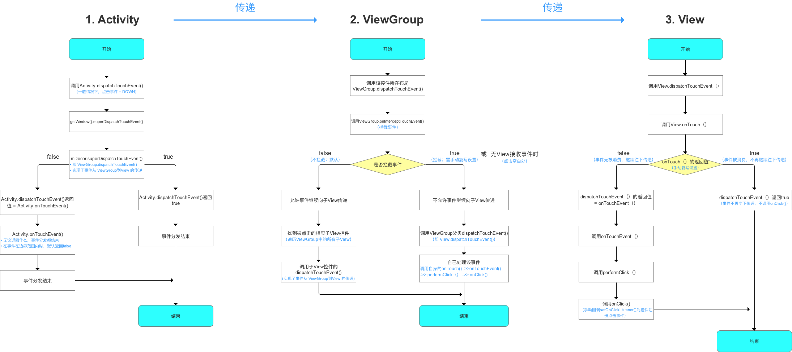

# 事件分发理解
一个事件包括三个部分： ACTION_DOWN 、ACTION_MOVE、ACTION_UP 。
如果事件被拦截了导致 ACTION_DOWN都没能接收到，后面两个步骤肯定是没有的。

## 事件类型 
```text
MotionEvent.ACTION_DOWN //按下View(所有事件的开始)
MotionEvent.ACTION_UP //抬起View 
MotionEvent.ACTION_MOVE
MotionEvent.ACTION_CANCEL  // 非人为原因，事件取消
```

## 事件分发的主要对象
```text
1、Activity 
通过其他回调方法与Window、View交互
2、View  
3、ViewGroup // (ViewGroup extends View) 
```

## 跟事件相关的常用方法
```text
// Activity
dispatchTouchEvent(MotionEvent ev) //  当事件传递给当前对象时，最先被调用
onTouchEvent(MotionEvent event)  //   被 dispatchTouchEvent 被调用

// View 
dispatchTouchEvent(MotionEvent ev) //  当事件传递给当前对象时，最先被调用
onTouchEvent(MotionEvent event)  //   被 dispatchTouchEvent 被调用

//ViewGroup  //(ViewGroup extends View) 
dispatchTouchEvent(MotionEvent ev) //  当事件传递给当前对象时，最先被调用
onTouchEvent(MotionEvent event)  //   被 dispatchTouchEvent 被调用
onInterceptTouchEvent(MotionEvent ev) // 用来决定是否拦截事件。只有在ViewGroup才有这个方法。被 dispatchTouchEvent 调用。
```


## 事件分发、消费顺序
```text
事件如果被上级拦截(return true)，下级就无法收到。
事件如果被下级消费掉(return true)，就不会继续往上传。

分发顺序
Activity –> 外层ViewGroup –> 内层ViewGroup –> View

消费顺序
View  –>  内层ViewGroup  –>  外层ViewGroup  –>  Activity
```

### Activity事件分发详情
```text
事件开始  
-->  
Activity.dispatchTouchEvent{ getWindow().superDispatchTouchEvent(ev)  } 
-->  
PhoneWindow(Window).superDispatchTouchEvent{ return mDecor.superDispatchTouchEvent(event) }
-->  
DecorView(FrameLayout).superDispatchTouchEvent{
 return super.dispatchTrackballEvent(event) // super是ViewGroup，所以Activity 跟Goup连接起来了
}
-->  
如果ViewGroup把事件消耗掉，返回true ，Activity的dispatchTouchEvent 就直接返回true ，事件结束。 
否则就去调用Activity的onTouchEvent ，然后事件结束。
```

### View事件分发详情
```text
dispatchTouchEvent( )  
-->   
onTouch (setOnTouchListener)
如果onTouch消耗掉事件，返回true   -->   事件结束
如果onTouch 不处理事件，返回 false  -->   onTouchEvent   -->   performClick   -->  onClick(setOnClickListener)--> 事件结束
```


### ViewGroup事件分发详情
```text
dispatchTouchEvent()   -->    onInterceptTouchEvent()    -->  ...
```
 
 ### 事件分发图解
 