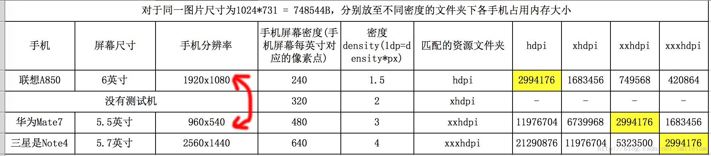

# 相关概念和算法
## 什么是 三级缓存
```text
1、内存缓存，优先加载，速度最快
2、本地磁盘缓存，次优先加载，速度快
3、网络缓存，最后加载，速度慢，消耗流量
```

## LruCache 缓存算法
```text
Least Recently Used Cache /近期最少使用 。
核心思想是当缓存满时，会优先淘汰那些近期最少使用的缓存对象。
```


## Bitmap 复用池
```text
使用 inBitmap 选项, 需要获取图片时 , 优先从 Bitmap 复用池中查找已存在的 Bitmap 对象 ;
假如 Bitmap 对象长时间不使用 , 就会从 LruCache 内存缓存中移除 , 放入到 Bitmap 复用池中 
```

# 相关提问

## Bitmap 内存 和 drawable 目录的关系
```text
drawable	屏幕密度
ldpi	    120
mdpi	    160
hdpi	    240
xhdpi	    320
xxhdpi	    480

drawable 目录 会影响原图缩放比，进而影响 bitmap 的内存占用。
缩放比K  = 设备dpi / drawable目录所代表的 dpi
```


## 图片占用内存 的计算规则
```text
同一个图片在不同屏幕密度下会缩放。
缩放比K  = 设备dpi / drawable目录所代表的 dpi

Bitmap 占用内存 = (K*原图长度 ) *  (K*原图宽度)  * 1个像素占用的字节数

单位px占用的字节数 跟图片的编码格式有关：
ALPHA_8   : 每个像素占用 1byte 内存 -(用 一个 8 bit 存储)
ARGB_4444 : 每个像素占用 2byte 内存 -(alpha red green blue 各4个 bit  ->  (4*4)/8 =2 ) 
RGB_565   : 每个像素占用 2byte 内存 -(red 5 bit green 6 bit blue 5 bit  -> (5+6+5)/8 =2 )
ARGB_8888 : 每个像素占用 4byte 内存 -(alpha red green blue 各8 bit ->  (4*8)/8 =4 ) 
```

## 图片 从 xhdpi 放到 xxhdp ，内存为什么会减小
```text
缩放比K  = 设备dpi / drawable目录所代表的 dpi ，
所以 缩放比会变小 ，根据内存计算规则，所以会减小。
```



## 图片 占用 磁盘 存储空间计算
```text
并没有像占用内存空间一样有个明确的公式。
而且要明确占用磁盘空间和占用内存空间完全是不同的概念，
例如占用磁盘10kb的图片 占用的内存空间需要1M。
不要尝试通过压缩图片磁盘存储大小来缓解OOM的问题。

占用 磁盘的大小 跟图片的分辨率和 压缩算法有关，
同样的一张图片，等质量压缩后的大小可能相差很大。
例如 https://tinypng.com/ 就提供了非常好的压缩体验。
```

##  Android 大图、长图 加载
```text
给一张 10M的“清明上河图”，如果直接加载，很可能会直接 OOM ，
如果通过配置压缩率 inSampleSize 压缩展示，那么图片就会很模糊。

此时我们可以通过其他方案来展示高清大图，例如先展示一张较小的缩率图，
然后通过手指选定，加载局部的大图，手指移动时加载的大图区域也跟着移动。
例如京东和淘宝的网页上高清商品图就是这种方式。
总之就是，只加载需要显示的部分，要看哪里就加载哪里。

配合 Android 的 BitmapRegionDecoder 可以实现这种方案。
```


## Bitmap 内存复用 (options.inBitmap   options.inMutable )
```text
inBitmap 生效的规则
1、inBitmap 只能在 3.0 才有 。
1、在Android 4.4之前，只能重用相同大小的 Bitmap 内存区域；
4.4之后只要复用内存空间的 Bitmap 对象大小比 inBitmap 指向的内存空间要小即可。
 
2、 新申请的Bitmap与旧的Bitmap必须有相同的解码格式。如果前面的Bitmap是8888，
那么就不能支持4444与565格式的Bitmap了。

BitmapFactory.Options options;
Bitmap inBitmap  ;
void init(Context context , int resId){
    options = new BitmapFactory.Options() ;
    options.inMutable =true; // 允许复用，必须配套使用
    inBitmap =BitmapFactory.decodeResource( context.getResources(), R.drawable.resId, options) ;
}

void getBitmap(Context context ,int resId ){
    options.inBitmap = inBitmap; // 指定复用
    Bitmap bitmap = BitmapFactory.decodeResource(context.getResources(), resId, options);
}
```


## inJustDecodeBounds 减小内存开销
```text
用来获取图片的大小信息的同时不占用内存。
例如我们只要获取图片本身的大小，直接decodeResource 加载 ，那么会返回一个 Bitmap 
会浪费内存，但是设置 inJustDecodeBounds = true ，那么返回的 bitmap 是空的，并不会消耗内存。

Bitmap  getImage(Context context) {
     BitmapFactory.Options options = new BitmapFactory.Options();
     options.inJustDecodeBounds = true ; // 标记只获取图片信息，并不去加载bitmap 到内存
     BitmapFactory.decodeResource(context.getResources(), R.drawable.test2, options) ;
     //获取图片的长宽
     options.inSampleSize = getImageSampleSize(options.outWidth, options.outHeight) ;
     options.inJustDecodeBounds = false ;//  关闭标记
     return BitmapFactory.decodeResource(context.getResources(), R.drawable.test2, options);
 }
```

##  Bitmap 不改变图片质量的情况下,如何减少内存
```text
根据 内存占用公式得知，影响内存的因素 有图片的长宽 和图片的质量。
无论是改变图片的长宽尺寸 还是压缩图片质量 都会影响最终的显示效果，
所以在不影响质量的前提下，可以采用内存复用的方案。inBitmap  。
```


## 图片显示不全、变形怎么处理
```text
图片显示变形的原因是因为 imageview 的长宽比 和 图片的长宽比不一致导致的。
例如 正方形的照片要显示成 长方形，肯定会变形。

显示不全的现象是因为长宽比不一致，为了避免变形采取的 scaleType="centerCrop" 。

为了避免显示不全和变形的问题，一般是从源头来解决，
例如：宽度固定，然后根据长宽比动态计算出 imageview的 高度，
或者长宽都固定，此时就要用 centerInside ,然后两边留白处理。
```

## 如何跨进程传递大图
```text
1、如果对效率没要求，可以通过 存储文件的方式。
限把图片保存到SD卡，然后只传递 路径。然后根据路径加载文件。

2、通过 Intent 直接传递  (不推荐)
intent.putExtra("myBitmap" ,bitmap) ;
问题是  Bitmap 太大会抛 TransactionTooLargeException 异常。

为什么 Intent 传值会有大小限制。
应用进程在启动 Binder 机制时会映射一块 1M 大小的内存，
所有正在进行的 Binder 事务共享这 1M 的缓冲区 。
当使用 Intent 进行 IPC 时申请的缓存超过 1M - 其他事务占用的内存时，
就会申请失败抛 TransactionTooLargeException 异常了。

3、Bundle + AIDL  (推荐)
bundle.putBinder("myBitmap", new IRemoteGetBitmap.Stub() {
    public Bitmap getBitMap() throws RemoteException {
        return mBitmap;
    }
});
intent.putExtras(bundle);

较大的 bitmap 直接通过 Intent 传递容易抛异常，
是因为 Intent 启动组件时，系统禁掉了文件描述符 FileDescriptor  机制 , 
bitmap 无法利用共享内存，只能拷贝到 Binder 映射的缓冲区，导致缓冲区超限, 触发异常; 
而通过 putBinder 的方式，避免了 Intent 禁用描述符的影响, 
可以利用共享内存，所以能高效传输图片。
```

# 图片格式
## webP
```text
在保证图片视觉不失真前提下缩小体积，对于节省带宽和apk体积十分重要。
然而目前对于 JPEG、PNG、GIF 等常用图片格式的优化已几乎达到极致，
因此Google于2010年提出了 WebP ，给图片的优化提供了新的可能。

WebP为网络图片提供了无损和有损压缩能力，有损和无损 都支持透明通道。
谷歌于2014年提出了 动态WebP，拓展WebP使其支持动图能力。
动态WebP相比 GIF 支持更丰富的色彩，并且也占用更小空间。

Android 4.0 开始支持有损的WebP图像，
Android 4.3 开始支持无损和透明的WebP图像。

Androidstudio 自带 图片转换 webP 和 .9 格式的图片。
可以将 PNG、JPG、BMP 或静态GIF 图像转换为WebP格式 。
暂时不支持 ico 格式的图片转换。
```

# SVG (Scalable Vector Graphics)
```text
矢量图 ，在各种设备上能实现自然伸缩或扩展而不影响图片质量。
1、加载、解析 svg文件  ，获得 path 数据
2、将path数据转换为 Path 对象。谷歌官方有现成的工具类 PathParser.java。
3、将解析出来的所有path绘制出来
4、判断点击点是否在当前path范围内。
public boolean isInArea(Path mPath ,float x, float y){
    RectF r=new RectF();
    mPath.computeBounds(r, true);
    Region re=new Region();
    re.setPath(mPath, new Region((int)r.left,(int)r.top,(int)r.right,(int)r.bottom));
    return  re.contains((int)x, (int)y);
}
```
##  SVG 绘制不规则图形 
https://github.com/hnyer/taiwanDemo


 
# vector
```text
vector 是Android 中的矢量图使用方案。
Android 5.0发布的时候，Vector只支持Android 5.0+。
不过自从AppCompat 23.2之后，Google做了兼容处理 ，
只需要引用com.android.support:appcompat-v7:23.2.0以上的版本
就适用于Android 2.1以上的所有系统 。
```
## vector 标签
```text
width            // 图形宽度
height           // 图形高度
viewportHeight   // 画布高度
viewportWidth    // 画布宽度
group            // 对Path进行分组
path 对应一个Path
    name // path名字
    fillAlpha//填充透明度
    fillColor //填充颜色
    strokeColor//线条颜色 
    pathData //path指令
    strokeWidth//线条宽度
```

## vector 绘制不规则图形 
https://github.com/hnyer/RegionDetector


 

# 图片加载工具 
## Glide 优点
```text
https://github.com/bumptech/glide
Glide 可以设置 最大内存缓存空间大小、最大磁盘缓存空间大小、 缓存失效时间。

1、Glide.with(xxx)方法 接受 Context、Activity 、 Fragment 。
建议使用后面两个。因为图片加载会和Activity 、Fragment的生命周期保持一致。
2、支持加载 gif 格式。
```

## Glide3.x 使用
```text
RequestOptions requestOptions = new RequestOptions()
         .placeholder(R.mipmap.icon_us)
         //.diskCacheStrategy(DiskCacheStrategy.NONE)
         //.skipMemoryCache(true)
         // 缓存失效策略 ，key 不一样 缓存就会失效
         .apply(RequestOptions.signatureOf(new ObjectKey(getSignatureKey())))
         .error(R.mipmap.icon_us);
         
 Glide.with(activity)
         // 根据路径、File 加载
         .load(filePath)
         .apply(requestOptions)
         .into(userImg);

private long   getSignatureKey()  {
   ///long key = System.currentTimeMillis() / INVALID_TIME
   long key = System.currentTimeMillis()  ;
   return key ;
}

// 当通过get访问接口 ，直接返回图片流的时候。 可以直接加载这个接口也可以显示。
// 不需要去加载接口返回的值。
```

## glide 4.x 的变化
glide4.x 和 glide3.x 的api 有一些变化。
```text
/** The default value for DecodeFormat. */
public static final DecodeFormat DEFAULT = PREFER_ARGB_8888;
glide4.x 默认加载格式 是 PREFER_ARGB_8888 。
glide3.x 的默认格式貌似是 565，如果遇到一些 带有透明度的图片导致效果不对的时候，
设置一下加载格式就行了。

// 设置自定义缓存签名
请参考 AivinReader 中的代码 
 Glide.with(activity)
    .asGif()
    .signature(new MySignature( imageUrl )) // 传入自定义签名
    
// 获取缓存的名字 （glide 生成缓存的时候也使用的 SHA-256 方法？ 没看源码，猜测的 ）    
public String getSafeKey(Key key) {
    String safeKey= System.currentTimeMillis()+"";
    MessageDigest messageDigest = MessageDigest.getInstance("SHA-256");
    key.updateDiskCacheKey(messageDigest);
    safeKey = Util.sha256BytesToHex(messageDigest.digest());
    return safeKey;
}

// 配置缓存地址
/**
 * 这个类不要删除 ，通过 注解的方式给 Glide 设置 缓存路径等的。 否则会使用默认路径。
 */
@GlideModule
public class MyGlide extends AppGlideModule {
    public static String diskCachePath =null ;
    @Override
    public void applyOptions(Context context, GlideBuilder builder) {
        int diskCacheSizeBytes = 1024 * 1024 * 100;
        appRootPath = context.getCacheDir().getPath();
        diskCachePath = getStorageDirectory();
        builder.setDiskCache( new DiskLruCacheFactory( diskCachePath, diskCacheSizeBytes )  );

    }
    private String sdRootPath = Environment.getExternalStorageDirectory().getPath();
    private String appRootPath = null;
    private String getStorageDirectory() {
        String path = Environment.getExternalStorageState().equals(Environment.MEDIA_MOUNTED) ?
                sdRootPath : appRootPath;
         path+= "/z_wkReaderGlideDisk123456" ;
         return path ;
    }
}

// 根据签名获取sd中的缓存
public static File getGlideCacheFile(Context context, String url) {
    MySignature mySignature = new MySignature(url);
    String safeKey = new SafeKeyGenerator().getSafeKey( mySignature);
    File file = new File(MyGlide.diskCachePath);// 注意此处缓存的路径要跟 glide 设置的缓存路径一致
    DiskLruCache diskLruCache = DiskLruCache.open(file, 1, 1, DiskCache.Factory.DEFAULT_DISK_CACHE_SIZE);
    DiskLruCache.Value value = diskLruCache.get(safeKey);
    if (value != null) {
        return value.getFile(0);
    }
    return null;
}

// 缓存的生效时间设置
貌似是没有api直接设置的
我们可以通过签名的方式自己去判断，如果超过一定时间，
就让签名变化即可。
```

