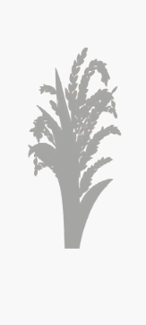

# Application 
```text
// Application 中显示 Dialog (AlertDialog) 
借助 ActivityLifecycleCallbacks 的生命周期回调 获得 Context
new AlertDialog.Builder(mContext);   

// 通过 Application  传值 缺点 
```

# EditText
## EditText 默认不获取焦点
```text
1、解决 在 PopupWindow 中 ，EditText 有时无法获取输入法焦点。
在 PopupWindow 中设置一下  this.setFocusable(true);

2、让 EditText 默认不获取焦点
在 EditText 的父容器中加入以下两个配置，让其抢夺到焦点。
android:focusableInTouchMode="true"
android:focusable="true"
```

## EditText 按下回车键隐藏光标 和收起键盘
```text
private void closeInputMethod(EditText theEditText) {
    theEditText.setCursorVisible(false); //关闭光标
    InputMethodManager imm = (InputMethodManager) context.getSystemService(Context.INPUT_METHOD_SERVICE);
    boolean isOpen = imm.isActive();
    if (isOpen) {
        imm.hideSoftInputFromWindow(theEditText.getWindowToken(), InputMethodManager.HIDE_NOT_ALWAYS);
    }
}
```


# TextView
## drawablePadding
```text
// 在 xml 中配置
<TextView
    android:drawableStart="@mipmap/icon_itemvideo_normal"
    android:drawablePadding="20dp"
    android:layout_width="match_parent"
    android:layout_height="match_parent" />
    
// 用代码配置    
private void setDrawable(TextView textView ,int drawableId){
    Drawable drawable= mContext.getResources().getDrawable(drawableId);
    drawable.setBounds(0, 0, drawable.getMinimumWidth(), drawable.getMinimumHeight());
    textView.setCompoundDrawables(drawable,null,null,null);
}
```


## drawable 和文字都居中 
```text
/**
<com.example.unlockview.HXDrawableCenterTextView
    android:layout_width="300dp"
    android:layout_height="100dp"
    android:background="@drawable/dispatch_round_corner_btn_green"
    android:drawableLeft="@mipmap/icon_create_add"
    android:drawablePadding="30dp"
    android:gravity="start|center_vertical"
    android:text="添加"
    android:textColor="@color/white" />

 注意 android:gravity 的设置，要 start
 */
public class HXDrawableCenterTextView extends AppCompatTextView {

    public HXDrawableCenterTextView(Context context, @Nullable AttributeSet attrs) {
        super(context, attrs);
    }

    @Override
    protected void onLayout(boolean changed, int left, int top, int right, int bottom) {
        super.onLayout(changed, left, top, right, bottom);
    }


    @Override
    protected void onDraw(Canvas canvas) {
        translateView(canvas);
        super.onDraw(canvas);
    }

    private void translateView(Canvas canvas){
        Drawable[] drawables = getCompoundDrawables();
        if(drawables==null){
            return;
        }

        Drawable drawableLeft = drawables[0]; // 这里要根据 drawableTop 还是其他来修改
        if(drawableLeft==null){
            return;
        }

        float textWidth = getPaint().measureText(getText().toString());
        int drawablePadding = getCompoundDrawablePadding();
        int drawableWidth = drawableLeft.getIntrinsicWidth();
        float bodyWidth = textWidth + drawableWidth + drawablePadding;
        canvas.translate((getWidth() - bodyWidth) /2,0);
    }
}
```


# PopupWindow
## PopupWindow 设置宽高
https://gitee.com/hnyer/PopuwindowDemo
```text
1、PopupWindow  在 xml 中设置宽高无效的原因和解决方案：
PopupWindow 没有继承 Viewgroup ，因此最外层布局属性的宽高无效，
解决方法是：
1、在在xml中套两层，第二层指定长宽。 (第一层其实就相当于添加了一个 Viewgroup )
3、或者在代码中加一个 Viewgroup 就行了
2、或者在代码中设置具体宽高。

public View  initView( Context context ) {
    LayoutInflater inflater = (LayoutInflater) context .getSystemService(Context.LAYOUT_INFLATER_SERVICE);
    LinearLayout linearLayout = new LinearLayout(context);
    View rootView  = inflater.inflate(R.layout.oofaywindow, linearLayout);
    return rootView ;
}

PopupWindow + ViewPager + fragment 的组合会出现问题 No view found for id 0xxxxxxxxx
可以采用 DialogFragment + ViewPager + fragment 组合
https://gitee.com/Aivin_CodeShare/android_tool_code/raw/master/precheck2.zip
``` 

##  PopupWindow 半透明
```text
方案有两个
1、方案1
void setWindowFilter(float alpha ,Activity activity) {
    WindowManager.LayoutParams lp = activity.getWindow().getAttributes();
    lp.alpha = alpha;
    lp.dimAmount = alpha;
    activity.getWindow().addFlags(WindowManager.LayoutParams.FLAG_DIM_BEHIND);
    activity.getWindow().setAttributes(lp);
}

setOnDismissListener(new OnDismissListener() {
            @Override
            public void onDismiss() {
                setWindowFilter(1f , (Activity) context);
            }
        });
        
@Override
public void showAtLocation(View parent, int gravity, int x, int y) {
    setWindowFilter(alpha , (Activity) context);
    super.showAtLocation(parent, gravity, x, y);
}

2、方案2
android:background="#XXxxxxxx"
说明：半透明颜色值共8位，前2位是透明度，后6位是颜色。
全透明：#00000000
半透明：#80000000
不透明：#FF000000
白色半透明：#80FFFFFF
红色30%透明：#4Dca0d0d
```
## 透明度对照表

| 透明度 | 百分比 | 数值   |
| ------ | ---- | ---- |
| 不透明 | 100% | FF   |
|        | 95%  | F2   |
|        | 90%  | E6   |
|        | 85%  | D9   |
|        | 80%  | CC   |
|        | 75%  | BF   |
|        | 70%  | B3   |
|        | 65%  | A6   |
|        | 60%  | 99   |
|        | 55%  | 8C   |
| 半透明 | 50%  | 80   |
|        | 45%  | 73   |
|        | 40%  | 66   |
|        | 35%  | 59   |
|        | 30%  | 4D   |
|        | 25%  | 40   |
|        | 20%  | 33   |
|        | 15%  | 26   |
|        | 10%  | 1A   |
|        | 5%   | 0D   |
| 全透明 | 0%   | 00   |


## 透明度对照表(完整版)
```text
100% — FF    不透明度=255
99% — FC    不透明度=252
98% — FA    不透明度=250
97% — F7    不透明度=247
96% — F5    不透明度=245
95% — F2    不透明度=242
94% — F0    不透明度=240
93% — ED    不透明度=237
92% — EB    不透明度=235
91% — E8    不透明度=232
90% — E6    不透明度=230
89% — E3    不透明度=227
88% — E0    不透明度=224
87% — DE    不透明度=222
86% — DB    不透明度=219
85% — D9    不透明度=217
84% — D6    不透明度=214
83% — D4    不透明度=212
82% — D1    不透明度=209
81% — CF    不透明度=207
80% — CC    不透明度=204
79% — C9    不透明度=201
78% — C7    不透明度=199
77% — C4    不透明度=196
76% — C2    不透明度=194
75% — BF    不透明度=191
74% — BD    不透明度=189
73% — BA    不透明度=186
72% — B8    不透明度=184
71% — B5    不透明度=181
70% — B3    不透明度=179
69% — B0    不透明度=176
68% — AD    不透明度=173
67% — AB    不透明度=171
66% — A8    不透明度=168
65% — A6    不透明度=166
64% — A3    不透明度=163
63% — A1    不透明度=161
62% — 9E    不透明度=158
61% — 9C    不透明度=156
60% — 99    不透明度=153
58% — 96    不透明度=150
58% — 94    不透明度=148
57% — 91    不透明度=145
56% — 8F    不透明度=143
55% — 8C    不透明度=140
54% — 8A    不透明度=138
52% — 87    不透明度=135
52% — 85    不透明度=133
51% — 82    不透明度=130
50% — 80    不透明度=128
49% — 7D    不透明度=125
48% — 7A    不透明度=122
47% — 78    不透明度=120
46% — 75    不透明度=117
45% — 73    不透明度=115
44% — 70    不透明度=112
43% — 6E    不透明度=110
42% — 6B    不透明度=107
41% — 69    不透明度=105
40% — 66    不透明度=102
39% — 63    不透明度=99
38% — 61    不透明度=97
37% — 5E    不透明度=94
36% — 5C    不透明度=92
35% — 59    不透明度=89
34% — 57    不透明度=87
33% — 54    不透明度=84
32% — 52    不透明度=82
31% — 4F    不透明度=79
30% — 4D    不透明度=77
29% — 4A    不透明度=74
28% — 47    不透明度=71
27% — 45    不透明度=69
26% — 42    不透明度=66
25% — 40    不透明度=64
24% — 3D    不透明度=61
23% — 3B    不透明度=59
22% — 38    不透明度=56
21% — 36    不透明度=54
20% — 33    不透明度=51
19% — 30    不透明度=48
18% — 2E    不透明度=46
17% — 2B    不透明度=43
16% — 29    不透明度=41
15% — 26    不透明度=38
14% — 24    不透明度=36
13% — 21    不透明度=33
12% — 1F    不透明度=31
11% — 1C    不透明度=28
10% — 1A    不透明度=26
9% — 17    不透明度=23
8% — 14    不透明度=20
7% — 12    不透明度=18
6% — 0F    不透明度=15
5% — 0D    不透明度=13
4% — 0A    不透明度=10
3% — 08    不透明度=8
2% — 05    不透明度=5
1% — 03    不透明度=3
0% — 00    不透明度=0
```


##  透明度百分比转换成十六进制
```text
透明度以0到255表示，总共有256级，透明是0，不透明是255。
for(float i=100 ;i>=0 ;i-=1){
    float temp = i/100f;
    int alpha =  Math.round(temp * 255); // 用四舍五入的方式获得 255维度的百分比
    String hex = Integer.toHexString(alpha).toUpperCase();
    if (hex.length() == 1){
        hex = "0" + hex;
    }
    int percent = (int) (temp * 100);
    System.out.println( String.format("%d%% — %s", percent, hex) );
}
```


##  PopupWindow 里触发弹窗 , 二级弹窗
```text
在popupWindow里面再弹出popupWindow的时候会报这样的错误
ERROR/AndroidRuntime(888): android.view.WindowManager$BadTokenException: Unable to add window -- token android.view.ViewRoot$W@44ef1b68 is not valid; is your activity running? 

解决方法1
不要在当前的 popupWindow 里面继续show一个 popupWindow ，应该写一个接口回调到Activity里面进行show，

解决方法2
第二次弹窗改为 Dialog
```

## PopupWindow 触碰外边关闭
```text
    void setThisOutTouchCancel(final boolean able) { 
        setOutsideTouchable(able);
        setTouchInterceptor(new View.OnTouchListener() {
            @Override
            public boolean onTouch(View v, MotionEvent event) {
                if (!isOutsideTouchable()) {
                    View mView = getContentView();
                    if (null != mView)
                        mView.dispatchTouchEvent(event);
                }
                return isFocusable() && !isOutsideTouchable();
            }
        });
    }
```

 
## PopupWindow 获取 showAtLocation 的 parent
```text
popupWindow.showAtLocation( getContentView(MainActivity.this),  Gravity.CENTER, 0, 0);
private View getContentView(Activity activity) {
    ViewGroup view = (ViewGroup) activity.getWindow().getDecorView();
    FrameLayout content = view.findViewById(android.R.id.content);
    return content.getChildAt(0);
}
或者直接根据id获取到一个具体的view.
``` 


## PopupWindow 内部进行视图切换
```text
PopupWindow +  HorizontalScrollView 方案来做 。
scrollView.scrollTo(viewWidth*2, 0); // 
这种方案一般不要放很多特别复杂的布局，
因为那些页面都是一次加载到 HorizontalScrollView中的 。
具体参考这个demo.
https://gitee.com/hnyer/PopuwindowDemo
```


# SharedPreferences
一些简单的、无安全风险的键值对数据，可以通过 SharedPreferences 保存。
SharedPreferences 是一个轻量级的xml键值对文件 。
```text
SharedPreferences 的替代方案 ，使用腾讯的 MMKV .
https://github.com/Tencent/MMKV
// 设置 缓存失效时间
思路是 MMKV 保存配置时，将当前时间和要有效时长一起保存进去， 
取出来的时候判断一下，是否超时了。
如果超时了就返回NULL。

文件保存在 /data/data/<package name>/shared_prefs 中，明文可见。
用真机中的文件夹管理器一般看不到，可以用过 Androidstudio 去看。

在 SharedPreferencesImpl.java 中
private void startLoadFromDisk() {
    new Thread("SharedPreferencesImpl-load") {
    ...
            loadFromDisk(); // 开启子线程读取
    }.start();
}
```

## SharedPreferences  apply 和  commit 的区别
```text
apply()：提交后同步写入内存，然后异步写入磁盘，没有返回值。
commit()：需要等异步回写磁盘完成后才返回，有返回值。
如果频繁操作的话 apply 的性能会优于 commit 。 
```

## SharedPreferences   是线程安全的吗 
```text
SharedPreferences 是线程安全的，因为内部有 synchronized 关键字保障。
```


## SharedPreferences 是进程安全的吗？ 如何保证进程安全  
```text
因为 SharedPreferences 会从内存取值，但是进程间内存不是共享的，所以不是多进程安全的。
// SharedPreferencesImpl.java
public String getString(String key, @Nullable String defValue) {
    synchronized (mLock) {
        awaitLoadedLocked();
        String v = (String)mMap.get(key); // 从内存取值
        return v != null ? v : defValue;
    }
}

SharedPreferences sharedPreferences =
context.getSharedPreferences("xxxName", Context.MODE_MULTI_PROCESS);
// 因为对多进程支持不完善，MODE_MULTI_PROCESS (也不可靠) 模式也已经被废弃，
//  官方推荐 ContentProvider 或者 第三方框架 MMKV
```


# AlertDialog 按钮大小问题
```text
TextView textView =new TextView(this);
textView.setText("Hello TextView");

AlertDialog dialog =new AlertDialog.Builder(this)
        .setTitle("Hello aivin")
        .setView(textView)
        .setPositiveButton("ok_Btn", null )
        .show() ;
Button btn = dialog.getButton(AlertDialog.BUTTON_POSITIVE) ;
btn.setAllCaps(false); // 重新设置
``` 

# Dialog 全屏显示 
```text
public class LoadingDialogUtils {
    public static Dialog getLoadingDialogInstance(Context context) {
        // 根据样式创建 Dialog
        Dialog loadingDialog = new Dialog(context, R.style.iosloading_dialog);
        loadingDialog.setCancelable(false);
        // 设置自定义布局
        LayoutInflater inflater = LayoutInflater.from(context);
        View v = inflater.inflate(R.layout.wk_loading_dialog, null);
        LinearLayout layout = v.findViewById(R.id.dialog_view);
        int width = MyDeviceInforHelper.getWidth((Activity) context);
        int height = MyDeviceInforHelper.getRealHeight( (Activity) context) ;
        ViewGroup.LayoutParams layoutParams = new  ViewGroup.LayoutParams(  width   , height);
        loadingDialog.setContentView(layout, layoutParams );
        layout.setBackgroundColor(Color.parseColor("#80000000"));// 设置自定义背景颜色
        loadingDialog.getWindow().setBackgroundDrawable(new ColorDrawable(Color.TRANSPARENT));// 设置window背景
        loadingDialog.getWindow().setLayout(ViewGroup.LayoutParams.MATCH_PARENT, ViewGroup.LayoutParams.MATCH_PARENT);
        return loadingDialog;
    }
}

<style name="iosloading_dialog" parent="android:Theme.Dialog">
    <item name="android:windowFrame">@null</item>
    <item name="android:windowBackground">@android:color/transparent</item>
    <item name="android:windowNoTitle">true</item>
    <item name="android:windowIsTranslucent">true</item>
    <item name="android:windowIsFloating">true</item>
    <item name="android:windowContentOverlay">@null</item>
    <item name="android:backgroundDimEnabled">false</item>
    <item  name= "android:windowFullscreen" >true </item>
</style>

public static int getRealHeight(Activity mActivity) {
    mActivity.getWindowManager().getDefaultDisplay().getRealMetrics(myGetDisplayMetrics());
    return  myGetDisplayMetrics().heightPixels;
}
```

# SeekBar 进度条显示不全、显示不顶格的问题
```text
<SeekBar
    android:layout_width="match_parent"
    android:layout_height="wrap_content"
    android:layout_gravity="center_vertical"
    android:thumbOffset="0dp" // 解决thumb只显示一半的问题
    android:paddingEnd="0dp"// 解决显示不顶格的问题
    android:paddingStart="0dp"
    android:maxHeight="1.5dp"
    android:minHeight="1.5dp"
    android:progressDrawable="@drawable/seek_progress"
    android:thumb="@drawable/seek_thumb" />
```


# ClipDrawable 实现图片进度条 效果
```text
<?xml version="1.0" encoding="utf-8"?>
<clip xmlns:android="http://schemas.android.com/apk/res/android"
    android:drawable="@mipmap/pic_1"
    android:clipOrientation="vertical"
    android:gravity="bottom">
</clip>

ImageView imageview =  findViewById(R.id.clipImg);
final ClipDrawable drawable = (ClipDrawable) imageview.getDrawable();
drawable.setLevel( 0);

// 10000 是满级
int level = (int) (10000 *  i* 0.01);
drawable.setLevel( level);

demo 地址 https://gitee.com/Aivin_CodeShare/android_tool_code/raw/master/PicProgressDemo.zip
```


 
# 动态条纹背景进度条
```text
方案1、简单使用
<ImageView
   android:layout_width="90dp"
   android:layout_height="10dp"
   android:scaleType="centerCrop"
   // 一张静态的条纹图片
   android:src="@drawable/pic_cover_blue_white" />
   
ViewGroup.LayoutParams lp = mProgressIv.getLayoutParams();
lp.width = (int) (ivWidth* percentFloat); // 不断更改 imageview的长度，配合 android:scaleType="centerCrop"
mProgressIv.setLayoutParams(lp);
mProgressIv.postInvalidate();

方案2 ，参考无限循环的游戏背景思路，用两张图片不断地动画循环。
```


 
 #  ListView 动态改变高度
 ```text
 public void setListViewHeightBasedOnChildren2(ListView listView) {
     ListAdapter listAdapter = listView.getAdapter();
     if (listAdapter == null) {
         return;
     }
     int totalHeight = 0;
     for (int i = 0; i < listAdapter.getCount(); i++) {
         View listItem = listAdapter.getView(i, null, listView);
         // 对 子View item 不做限制，要多大就报上来多大
         listItem.measure(View.MeasureSpec.UNSPECIFIED, View.MeasureSpec.UNSPECIFIED);
         totalHeight += listItem.getMeasuredHeight();
     }
 
     ViewGroup.LayoutParams params = listView.getLayoutParams();
     params.height = totalHeight + (listView.getDividerHeight() * (listAdapter.getCount() -1));
     listView.setLayoutParams(params);
 }
 ```

# 约束布局 ConstraintLayout
ConstraintLayout 是一个ViewGroup，可以在 Api9 以上的Android系统使用它，它的出现主要是为了解决布局嵌套过多的问题。
在开发过程中经常能遇到一些复杂的UI，可能会出现布局嵌套过多的问题，ConstraintLayout 使用起来比 RelativeLayout 更灵活。
```text
api 'androidx.constraintlayout:constraintlayout:2.0.2'

<Button
    android:layout_width="wrap_content"
    android:layout_height="wrap_content"
    app:layout_constraintLeft_toLeftOf="parent"
    app:layout_constraintRight_toRightOf="parent"
    app:layout_constraintTop_toTopOf="parent"
    app:layout_constraintBottom_toBottomOf="parent" />

// 角度约束 (版本1.1中加入)
一个控件在某个控件的某个角度的位置，通过其他的布局其实是不太好实现的，
但是 ConstraintLayout 提供了角度位置相关的属性
app:layout_constraintCircle=""         目标控件id
app:layout_constraintCircleAngle=""    对于目标的角度(0-360)
app:layout_constraintCircleRadius=""   到目标中心的距离

// 百分比偏移
让控件在父布局的水平方向或垂直方向的百分之多少的位置，可以使用如下属性：
app:layout_constraintHorizontal_bias=""   水平偏移 取值范围是0-1的小数
app:layout_constraintVertical_bias=""     垂直偏移 取值范围是0-1的小数

// A依赖B ，B被Gone时，A距离父控件的距离。
app:layout_goneMarginBottom="0dp"
app:layout_goneMarginEnd="0dp"
app:layout_goneMarginLeft="0dp"
app:layout_goneMarginRight="0dp"
app:layout_goneMarginStart="0dp"
app:layout_goneMarginTop="0dp"

//设置宽高比例
给宽或者高其中一个设置为0dp，然后设置该属性是一个比例，宽和高的比
layout_constraintDimensionRatio

// Chain 链
Chain 链是一种特殊的约束让多个 chain 链连接的 Views 能够平分剩余空间位置。
最相似的应该是 LinearLayout 中的权重比 weight ，
但 Chains 链能做到的远远不止权重比 weight 的功能。
Chain 链是由多个 Views 组合的，所以要创建一个 Chain 链就需要先选择多个想要链接到一起的 Views ，
然后再右键选择 'Center Horizontally' 或者 'Center Vertically' 来创建水平链或者垂直链。
Chain 链的创建定义的是 Chain 链组件之间的间隙关系，并不影响原有的非成员间的约束。

Chain 链模式一共有三种，分别为：spread ，spread_inside 和 packed 。
1、默认 spread 模式：
将平分间隙让多个 Views 布局到剩余空间。
2、spread_inside 模式：
它将会把两边最边缘的两个 View 到外向父组件边缘的距离去除，
然后让剩余的 Views 在剩余的空间内平分间隙布局。
3、 packed ：
它将所有 Views 打包到一起不分配多余的间隙 ，然后将整个组件组在可用的剩余位置居中。
```

## ConstraintLayout 常用属性
| 属性                                       | 意义                                                         |
| ------------------------------------------ | ------------------------------------------------------------ |
| app:layout_constraintLeft_toLeftOf         | 此控件的左边框与某个控件的左边框对齐                         |
| app:layout_constraintLeft_toRightOf        | 此控件的左边框与某个控件的右边框对齐或者在其右边             |
| app:layout_constraintRight_toLeftOf        | 此控件的右边框与某个控件的左边框对齐或在其左边               |
| app:layout_constraintRight_toRightOf       | 此控件的右边框与某个控件的右边框对齐                         |
| app:layout_constraintTop_toTopOf           | 此控件的顶部边框与某个控件的顶部边框水平对齐                 |
| layout_constraintTop_toBottomOf            | 此控件的顶部边框与某个控件的底部边框水平对齐或在其下边       |
| app:layout_constraintBottom_toTopOf        | 此控件的底部边框与某个控件的顶部边框水平对齐或其上边         |
| app:layout_constraintBottom_toBottomOf     | 此控件的底部边框与某个控件的底部边框水平对齐或其上边         |
| app:layout_constraintBaseline_toBaselineOf | 此控件与某个控件水平对齐                                     |
| layout_constraintStart_toEndOf             | 此控件的左边界在某个控件右边界的右边，及表示此控件在某个控件的右边 |
| layout_constraintStart_toStartOf           | 此控件的左边界与某个控件的左边界在同一垂直线上               |
| layout_constraintEnd_toStartOf             | 此控件的右边界与某个控件的左边界在同一垂直线上               |
| layout_constraintEnd_toEndOf               | 此控件的右边界与某个控件的右边界对齐                         |

