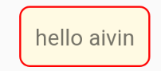

# 常用shape

##  shape的属性说明
```text
android:shape="rectangle"  // 矩形，默认
android:shape="oval"  // 椭圆
android:shape="line"  // 横线
android:shape="ring"  // 圆环

1、corners // 角度
2、solid  // 内部填充色
3、gradient  // 定义渐变色
4、size // 大小
5、stroke // 描边
6、padding // 内边距
```

##  常用shape 效果

```text
<?xml version="1.0" encoding="utf-8"?>
<shape xmlns:android="http://schemas.android.com/apk/res/android"
    android:shape="rectangle">
    <solid android:color="#32b65b" />
    <corners android:radius="50dp" />
</shape>
```



```text
<?xml version="1.0" encoding="utf-8"?>
<shape xmlns:android="http://schemas.android.com/apk/res/android"
    android:shape="rectangle">
    <stroke
        android:width="1dp"
        android:color="#ff0000" />
    <solid android:color="#fffae3" />
    <corners android:radius="6dp" />
</shape>
```


```text
<?xml version="1.0" encoding="utf-8"?>
<layer-list xmlns:android="http://schemas.android.com/apk/res/android">
    <item>
        <shape android:shape="oval">
            <solid android:color="#ffe4f6db" />
            <size
                android:width="15dp"
                android:height="15dp" />
        </shape>
    </item>

    <item android:gravity="center">
        <shape android:shape="oval">
            <solid android:color="#ff2fb755" />
            <size
                android:width="8dp"
                android:height="8dp" />
        </shape>
    </item>
</layer-list>
```

## shape 部分圆角
```text
<?xml version="1.0" encoding="utf-8"?>
<shape xmlns:android="http://schemas.android.com/apk/res/android"
    android:shape="rectangle">
    <solid android:color="#CC54678c" />
    <!--部分圆角-->
    <corners
        android:bottomLeftRadius="12dp"
        android:bottomRightRadius="12dp"
        android:topLeftRadius="0dp"
        android:topRightRadius="0dp" />
</shape>
```


