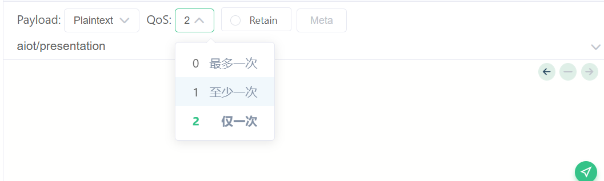

# 开源软件
## 文件管理器
[Amaze File Manager](https://github.com/TeamAmaze/AmazeFileManager)


# xUtils 

```text
https://github.com/wyouflf/xUtils3
compile 'org.xutils:xutils:3.5.0'

// 1、在Application 初始化
// import org.xutils.x;
x.Ext.init(this);
x.Ext.setDebug(false);

// get请求
private void loadData( ) {
    String API = Ipconfig.KEY_WORKNEWS_DetailItem;
    API = API.replace("{pageSize}" ,"10") ;
    RequestParams params = new RequestParams(API);
    Callback.Cancelable cancelable = x.http().get(params,
            new Callback.CommonCallback<String>() {
                @Override
                public void onSuccess(String result) { }

                @Override
                public void onError(Throwable ex, boolean isOnCallback) {   }

                @Override
                public void onCancelled(CancelledException cex) {   }

                @Override
                public void onFinished() {   }
            });
}

// post 请求
private void requestHost(String name, String pwd1 ) {
    String API = Ipconfig.KEY_userRegister;
    RequestParams params = new RequestParams(API);
    params.addBodyParameter("userName",name);
    params.addParameter("password",pwd1);
    x.http().post(params, new Callback.CommonCallback<String>() {
        public void onSuccess(String result) {   }
    });


 // 文件上传
String api ="http://xxx" ;
RequestParams params = new RequestParams(api) ;
params.setMultipart(true);
params.addBodyParameter("userId", MyApplication.getUserId(activity));
params.addBodyParameter("file", new File( filePath));
Callback.Cancelable cancelable
        = x.http().post(params,
        new Callback.CommonCallback<String>() {
            @Override
            public void onSuccess(String result) {   }
        });
// 文件下载
RequestParams requestParams = new RequestParams();
requestParams.setSaveFilePath(filePath);
requestParams.setUri(url);// 文件url
x.http().get( requestParams, new Callback.ProgressCallback<File>() {
    @Override
    public void onSuccess(File result) {   }
    @Override
    public void onLoading(long total, long current, boolean isDownloading) {
        float percent = 100f* current /  total  ;
    }        
```


 
# butterknife
```text
butterknife 常用的功能就是 findview 绑定 和 click 绑定。
https://github.com/JakeWharton/butterknife
```

##  butterknife 添加依赖
```text
Butterknife requires Java 8,
compileOptions {
    sourceCompatibility JavaVersion.VERSION_1_8
    targetCompatibility JavaVersion.VERSION_1_8
}

dependencies {
// 在 基础库中添加
  implementation 'com.jakewharton:butterknife:10.2.3'
}

dependencies {
// 在项目根目录的 build.gradle 中添加插件依赖
    classpath 'com.jakewharton:butterknife-gradle-plugin:10.2.3'
  }

// 在需要使用的 module 中添加
apply plugin: 'com.jakewharton.butterknife'  
// 哪个 module 使用，就在哪个 module 中添加，而不是添加在在基础module中，否则注解是无效的。
annotationProcessor 'com.jakewharton:butterknife-compiler:10.2.3'
```

##  butterknife 使用示范
```text
@BindView(R2.id.wkExpandOhterFunc)
public WkExpandLayout wkExpandLayout ;

setContentView(R.layout.lib_login_activity_login);
ButterKnife.bind(this);

@OnClick({R2.id.changeStateBtn })
public  void onViewClicked(View view){
    int id = view.getId();
    if (id == R.id.changeStateBtn) {
         // todo 
    }
}
```


 

# EventBus、
```text
缺点： 不容易跟踪调试代码。逻辑不是很连贯。
https://github.com/greenrobot/EventBus
compile 'org.greenrobot:eventbus:3.1.1'
// 绑定
@Override
public void onStart() {
    super.onStart();
    EventBus.getDefault().register(this);
}

// 解绑
@Override
public void onStop() {
    super.onStop();
    EventBus.getDefault().unregister(this);
}

// 发送
EventBus.getDefault().post(new MessageEvent());

// 接收
@Subscribe(threadMode = ThreadMode.MAIN)
public void onEventBusMsgCome(WkEventBean bean) {
   switch (bean.getCode()){
       case WkEventBean.CODE_1:
           String msg = (String) bean.getData() ;
           WkLog.d("UI received =   "+msg);
           break;
       default:
           break;
   }

public class WkEventBean {
public static  final int CODE_1 = 1;
public static  final int CODE_2 = 2;
public WkEventBean(int code , Object data){
   this.code = code ;
   this.data =data ;
}

private int code ;
private Object data ;

public int getCode() {
   return code;
}
}       
```
 


#  [RxJava 2.x](https://github.com/ReactiveX/RxJava)
要在Android中使用RxJava2,  需要依赖 [Rxjava2.x](https://github.com/ReactiveX/RxJava) 、 [RxAndroid](https://github.com/ReactiveX/RxAndroid)

```text
异步事件处理框架。
continued support for Java 6+ & Android 2.3+
基于观察者设计模式。

RxJava1.x 跟 RxJava2.x 不能共存 ，会冲突。
```

## RxJava组成元素
RxJava基本组成元素 | 说明
-|-
被观察者 | 数据源  发送数据
观察者  |  接收到（处理后的数据）
建立订阅关系 |  
操作符 | 可以对数据进行过滤、转换等处理
线程切换 |  指定发送和接收的线程


## RxJava 常用类

常用类 | 作用
-|-
Observable| 被观察者 <br>
ObservableEmitter| 用来发出事件的，它可以发出三种类型的事件  <br> x.onNext() <br> x.onComplete() <br> x.onError() <br> 发射规则如下： <br>  1、上游可以发送无限个onNext ，下游也可以接收无限个onNext   <br><br> 2、当上游发送了一个onComplete后（只能发一次）, 上游onComplete之后的事件将会继续发送, 而下游收到onComplete事件之后将不再继续接收事件  <br><br> 3、当上游发送了一个onError后（只能发一次）, 上游onError之后的事件将继续发送, 而下游收到onError事件之后将不再继续接收事件  <br><br> 4、上游可以不发送onComplete或onError.  <br><br> 5、onComplete 和 onError 只能发送一个 , 不能都发送
ObservableOnSubscribe |
Observer| 观察者
Disposable| x.dispose() 切断订阅关系。 <br>  调用dispose()后 ，观察者接收不到数据，但是数据源还可以继续发送
CompositeDisposable| Disposable 容器 <br> x.add(...)  <br> x.clear()
Flowable | Rxjava2 新增的 。数据发送 。我们可以用Flowable + Subscriber 来解决 收发速度不一致问题
Subscriber| 与Flowable搭配， 数据接收。
Subscription|  切断订阅关系 <br> Subscription.cancel()  <br>  观察者请求数据源发送多少个数据 <br> subscription.request(Long.MAX_VALUE)
FlowableEmitter | 返回 观察者 能处理多少个数据 <br>flowableEmitter.requested()
Action |
BiConsumer |
BiFunction |
Predicate|
BiPredicate|
BooleanSupplier|
Cancellable|
Consumer |
Function |
Function3|
Function4|
Function5|
Function6|
Function7|
Function8|
Function9|
IntFunction|
LongConsumer|
Schedulers | 调度器。 <br>  当数据源和观察者在同一个线程时，这是一个同步的订阅关系 。 <br>  数据源每发送一个事件后必须等到观察者接收处理完了以后才能接着发送下一个。  <br>  当处于不同线程时 ,就是异步的订阅关系, 这个时候数据源可以自由发送数据。  <br>//CPU计算密集型线程 默认线程数等于处理器的数量  <br>  Schedulers.computation()   <br>  // 使用指定的Executor作为调度器 <br>  Schedulers.from()  <br>  // io操作的线程 <br>  Schedulers.io()  <br>  // 常规新线程 <br>  Schedulers.newThread()  <br>  // Android主线程 <br>  AndroidSchedulers.mainThread()  <br>  // 在当前线程执行 ，不过需要等队列中的其他任务完成后才执行 <br>  Schedulers.trampoline()  <br>  
BackpressureStrategy| 背压策略 抗压力策略  <br>   背压是指在异步场景中，数据源发送事件速度远快于观察者的处理速度的情况下， <br> 一种告诉 数据源 需要降低发送速度的策略 。  <br>    // 缓存区大小128，超过大小继续发就会报错 <br>      BackpressureStrategy.ERROR   <br>   // 默认128，超过大小继续发就会 提示缓冲满了 <br>   BackpressureStrategy.MISSING   <br>   // 默认大小128 ，大于128时就会修改为无限大。直到OOM <br>   BackpressureStrategy.BUFFER    <br>   // 默认128 ，超过128后来的数据会被丢掉 <br>   BackpressureStrategy.DROP   <br>   // 默认128 ，超过128就会只会保留最后的一个数据。  最后总个数 是 129 <br>   BackpressureStrategy.LATEST  <br>   
SingleEmitter | 用来发射一条单一的数据，且一次订阅只能调用一次 <br>  singleEmitter.onSuccess()  <br>   <br>  // onSuccess与onError只可调用一个  ，否则会报异常 <br>  singleEmitter.onError()
Subject | 主题 , 不支持背压控制  <br>  一种特殊的存在 ，同时是 数据接收者 和 发送者
AsyncSubject|无论输入多少参数，永远只输出最后一个参数  ,  <br> 如果因为发生了错误而终止，AsyncSubject将不会发射任何数据
BehaviorSubject| 会发送离订阅最近的上一个值，没有上一个值的时候会发送默认值。  <br> 如果遇到错误会直接中断
PublishSubject|一旦一个观察者订阅了该Subject，它会发送所有数据给订阅者。  <br>  如果接收者只关系自己订阅的信息 ，可以用ofType来过滤  <br>  订阅者只会接受订阅之后的来自PublishSubject发射的数据。
ReplaySubject|无论何时订阅，都会将所有历史订阅内容全部发出
Processor|  rxjava2.x新增的 ，作用与Subject一样 。 <br> 支持背压控制
AsyncProcessor |
BehaviorProcessor |
PublishProcessor |
ReplayProcessor |
Transformer | 转换器 ，  实际上就是Func1<Observable , Observable>，  <br>  换句话说就是提供给他一个Observable它会返回给你另一个Observable
ObservableTransformer |
SingleTransformer |
CompletableTransformer |
FlowableTransformer |
MaybeTransformer |


## RxJava2.0中的观察者模式

RxJava2.0中的观察者模式| 说明
-|-
Observable / Observer | 不支持背压，及无法处理发送数据速度不协调的问题。  <br>  
Flowable/ Subscriber|
Single/ SingleObserver| 只发射一条单一的数据，或者一条异常通知，  <br>  不能发射完成通知，其中数据与通知只能发射一个。  <br>  // 可以指定Schedulers实现异步处理 ，如果不被订阅是不会被调用的  <br> Single.create  <br>   <br> // 接收传入的参数 ，是一种特殊的create() ，只会在当前线程里执行 , 不管是否被 订阅均会被调用  <br> Single.just  <br>   <br> // 仅仅用来连接Single顺序执行的，比如顺序执行检查网络，检查内存 ，注意：如果某个Single调用了onError()会导致被中断  <br> Single.concat  <br>   <br> // 将多个Single整合为一个  <br> Single.zip  <br>   <br> //   <br> Observable.just().zipWith()  <br>   <br> //创建一个自定义的操作符，用来处理数据发送者 。  <br> 就是对当前Observable进行操作，然后再返回它   <br> Single.compose  <br>   <br> //   <br> Single.subscribe  <br>   <br> // 返回一个错误， 一般用于调试  <br> Single.error  <br>   <br> // 用于一对0~多的返回  <br> Single.just( ... ).flatMap()  <br>   <br> // 一般map()是用于一对一的返回  <br> Single.just( ).map()  <br>   <br> // 它支持将Single转化为Observable对象，可以返回多个值  <br> Single.just( ).flatMapObservable()  <br>   <br> //  类似于concat ，如果有中断 ，后面都会中断  <br> Single.merge()  <br>   <br> //   <br> Single.just().mergeWith()  <br>   <br> // 用于指定异步任务的线程  <br> Single.just().subscribeOn()  <br>   <br> // 相当于try catch中的return，具体意思就是当函数抛出错误的时候给出一个返回值  <br> Single.just().onErrorReturn()  <br>   <br> // 指定回调所在线程  <br> Single.just().observeOn()  <br>   <br> // 超时设置  <br> Single.just().timeout()  <br>   <br> //   <br>  Single.just( ).toString()
Completable/ CompletableObserver|只发射一条完成通知，或者一条异常通知， <br> 不能发射数据，其中完成通知与异常通知只能发射一个
Maybe/ MaybeObserver|可发射一条单一的数据，以及发射一条完成通知，  <br>  或者一条异常通知，其中完成通知和异常通知只能发射一个，  <br>  发射数据只能在发射完成通知或者异常通知之前，否则发射数据无效。


##  RXjava2操作符
所谓的操作符就是一些被Rxjava封装好的方法或API ，使用这些操作符就可以完成线程调度，数据过滤等功能 。


操作符类型 | 说明
-|-
create()|创建被观察者对象
just()|快速的创建被观察者对象
fromArray()|将数组中的数据转换为Observable对象
fromIterable()|将List中的数据转换为Observable对象
empty()| 用于测试 ，仅发送Complete事件  
error()|用于测试 ，仅发送Error事件
never()|不发射数据，也永远不会结束
defer()|直到有观察者订阅时，才创建被观察者对象&发送事件  <br>  每次订阅后，都会得到一个刚创建的最新的Observable对象
timer()| 延迟指定时间后，发送1个数值0
interval()|  每隔指定时间就加n并发送出去
range()|连续发送一个事件序列，可指定范围
rangeLong()|跟 range()类似，支持数据类型为Long
intervalRange()|每隔指定时间 就发送 事件，可指定发送的数据的数量
map()  | 将传入数据处理后返回 。<br> 输入和输出是一对一
flatMap()| 输入和输出可以是 一对多 <br> 不能保证 输出的顺序和输入的顺序一致
concatMap| 输入和输出可以是一对对 <br>  输出和输入顺序 严格一致
buffer()|每次取n个事件放到缓存区中，n可配置
filter()| 将符合自定义条件的事件过滤出来
ofType()|过滤 特定数据类型的数据
skip()| 跳过正序的前 n 项
skipLast()| 跳过正序的后 n 项
distinct()| 去掉序列中重复的事件
distinctUntilChanged() | 去掉序列中连续重复的事件
take()| 指定观察者最多能接收到的事件数量
takeLast()| 指定观察者只能接收到被观察者发送的最后几个事件
throttleFirst()| 在某段时间内，只发送该段时间内第1次事件
throttleLast()| 在某段时间内，只发送该段时间内 最后1次事件
sample()| 指定时间内 取一次数据 ，其他的数据就会被丢掉
throttleWithTimeout() | 在输出了一个数据后的一段时间内，没有再次输出新的数据，  <br>   则把这个数据真正的发送出去；   <br>  假如在这段时间内有新的数据输出，则以这个数据作为将要发送的数据项，  <br>  并且重置这个时间段，重新计时
debounce () | 跟 throttleWithTimeout() 一样
firstElement() | 仅选取第1个元素
lastElement()  | 仅选取最后一个元素
elementAt()|  接收指定索引的某个元素 ， <br>  索引越界也不会报异常
elementAtOrError()| 接收指定索引的某个元素 ， <br>  索引越界 会报异常
all()| 判断发送的所有数据是否都满足自定义的条件 , true false
takeWhile()| 判断发送的每项数据是否满足 自定义条件   <br>  若满足条件则发送 ,不满足不发送
skipWhile()| 一直跳过，直到满足自定义条件
skipUntil()| -
takeUntil()| 一直发送 ，直到某个条件
sequenceEqual()| 两个数据源的数据是否相同
isEmpty()| 数据源的数据是否为空
contains()| 数据源中是否包含指定数据
defaultIfEmpty( obj)| 在不发送任何有效事件（ Next事件）、仅发送了 Complete 事件的前提下，发送个默认值obj
amb()| 当有多个数据源需要发送数据时 ， <br>  只发送 先发送数据的Observable的数据，而其余 Observable被丢弃。
concat()|组合多个被观察者一起发送数据，合并后 按发送顺序串行执行
concatArray()| 跟concat()类似
merge()|组合多个被观察者一起发送数据，合并后 按时间线并行执行  <br>  被观察者数量≤4
mergeArray()| 被观察者数量 > 4
mergeWith()|
delay()|使被观察者延迟一段时间再发送事件
concatDelayError()| 使用concat()，一旦某个被观察者发出onError事件，其他被观察者就会终止发送。 <br> 为了让其他被观察者继续发送，可以使用这个操作符
concatArrayDelayError()|
mergeDelayError()|
combineLatestDelayError()|
reduce()|把被观察者需要发送的事件聚合成1个事件、发送
collect()|将被观察者发送的数据事件收集到一个数据结构里
startWith()| 在被观察者发送事件前，追加发送一些数据
startWithArray()|
count()|统计被观察者发送事件的数量
subscribe()| 订阅， 连接观察者 和 被观察者
zip()|多个数据源Observable 发送数据，经过自定义组合处理后，观察者再收到 。 <br> <br> 1、组合数据时严格按照顺序从多个数据源中拿数据。<br> 2、最后观察者收到的数据个数 跟发送最少数据的数据源的数据个数相同。
x.zipWith()|
combineLatest()|如果子流1在等待其他流发射数据期间又发射了新数据，  <br> 则使用子流最新发射的数据进行合并
x.concatMap()|
x.scan()|
x.window()|
subscribeOn()| 指定发送事件的线程  <br>  只有第一次指定有效，其余的指定线程无效
unsubscribeOn()| 取消订阅
observeOn()|指定接收事件的线程  <br>  每次指定均有效
doOnEach() |每发送一次就会调用一次
doOnNext () |执行 next之前调用
doAfterNext()  |执行 next之后调用
doOnError() |
doOnComplete()|
doOnTerminate()|
doFinally()|
doOnSubscribe() |观察者订阅时调用
onErrorReturn()| 遇到错误时，发送1个特殊事件 & 正常终止
onErrorResumeNext()| 拦截的错误 是Throwable 类型
onExceptionResumeNext()|拦截的错误 是 Exception类型
retry()| 当捕捉到错误时，被观察者会重新发射数据
retryUntil()|遇到错误，重新发射，直到...
retryWhen()|
repeat()| 无条件地、重复发送事件
repeatWhen()|
repeatUntil()|
publish()|
share()|
connect()|


## 补充知识点
### 链式调用
```text
MsgInfo msgInfo = new MsgInfo();
// 链式调用
msgInfo.setOwnerId("100011002")
        .setStatus(MsgInfo.Status.SENDING)
        .setTime(System.currentTimeMillis());

// 普通调用
msgInfo.setOwnerId("100011002");
msgInfo .setStatus(MsgInfo.Status.SENDING) ;
msgInfo .setTime(System.currentTimeMillis());

// 链式调用的关键在于方法的返回值！
public MsgInfo setStatus(int status) {
    this.status = status;
    // 注意返回的是 this
    return this;
}
```


 
# [Retrofit 2.x](https://github.com/square/retrofit)
```text
一个支持 RxJava方式调用的网络请求框架
A type-safe HTTP client for Android and Java  by Square, Inc.
requires at minimum Java 7 or Android 2.3.

Retrofit 提供2种风格的网络请求方式：
1、传统风格 (略过不看)
采用Callback 接口  
2、RxJava 风格 (流行)
采用Observable接口
```
 
## Retrofit2 + Rxjava2  依赖
```text 
// rxjava核心库
compile 'io.reactivex.rxjava2:rxjava:2.0.1'
// Android 支持 Rxjava
compile 'io.reactivex.rxjava2:rxandroid:2.0.1'
// Android 支持 Retrofit
compile 'com.squareup.retrofit2:retrofit:2.1.0'
// 衔接 Retrofit & RxJava
compile 'com.jakewharton.retrofit:retrofit2-rxjava2-adapter:1.0.0'
// 支持Gson解析
compile 'com.squareup.retrofit2:converter-gson:2.1.0'
```

注解|作用
-|-
@GET| get请求
@POST| post请求
@DELETE| delete请求
@HEAD| head请求
@OPTIONS| options请求
@PATCH| patch请求
@Headers|	添加请求头
@Path	| get请求 ，user/{password}  格式
@Query|	get请求 ， user/password?password=xxx 格式
@FormUrlEncoded	| 用表单数据提交
@Field|	 post需要  post请求需要 ， 替换参数

```text
//定义请求接口
public interface BlogService {
    // get 方式
    @GET("getAllMusicInfoGson")
    Call<ResponseBody> getBlogByGet(@Query("pageNum") int pageNum);
    // post 方式
    @FormUrlEncoded
    @POST("getAllMusicInfoGson")
    Call<ResponseBody> getBlogByPost(@Field("pageNum") int pageNum);
}


//简单使用
Retrofit retrofit = new Retrofit.Builder()
        .baseUrl("https://www.aivin666.cn/AivinInfo/")// url根目录
        .build();

BlogService service = retrofit.create(BlogService.class);
//Call<ResponseBody> call = service.getBlogByGet(2);//get方式
Call<ResponseBody> call = service.getBlogByPost(2);//post方式
call.enqueue(new Callback<ResponseBody>() {
    @Override
    public void onResponse(Call<ResponseBody> call,
     Response<ResponseBody> response) {
        try {
            String reslut = response.body().string();
            tvHttpResult.setText(reslut);
            Log.i(TAG , reslut) ;
        } catch (Exception e) { }
    }

    @Override
    public void onFailure(Call<ResponseBody> call, Throwable t) {  }
});
```

 
# Retrofit_RxJava_OkHttp 
```text 
Retrofit + RxJava + OkHttp
Retrofit 负责请求的数据和请求的结果
RxJava 负责异步，各种线程之间的切换
OkHttp 负责请求的过程

// rxjava 核心库
compile 'io.reactivex.rxjava2:rxjava:2.1.14'
// Android 支持 Rxjava
compile 'io.reactivex.rxjava2:rxandroid:2.0.1'
// retrofit 核心库
compile 'com.squareup.retrofit2:retrofit:2.4.0'
// retrofit json 转换器
compile 'com.squareup.retrofit2:converter-gson:2.3.0'
//  衔接 Retrofit & RxJava
compile 'com.squareup.retrofit2:adapter-rxjava2:2.3.0'
// okhttp 核心库
compile 'com.squareup.okhttp3:okhttp:3.10.0'
// okhttp log 拦截器
compile 'com.squareup.okhttp3:logging-interceptor:3.8.1'
```
 
 
##  RxJava 订阅者
```text
public class HttpSubscriber<T> implements Observer<T> {
    private PicInfoSubscriberListener subscriberOnListener;
	private Context context;
    private Disposable disposable;
    public HttpSubscriber( PicInfoSubscriberListener subscriberOnListener, Context context) {
        this.subscriberOnListener = subscriberOnListener;
		this.context = context;
    }

    @Override
    public void onSubscribe(@NonNull Disposable d) {
        disposable = d;
    }

    @Override
    public void onComplete() {
        if( (subscriberOnListener == null) ||  (context == null))  {
            if(disposable != null && !disposable.isDisposed()){
                //切断订阅关系
                disposable.dispose();
            }
        }
    }

    @Override
    public void onError(Throwable e) {
        if(subscriberOnListener != null && context != null)  {
            if (e instanceof SocketTimeoutException) {
                subscriberOnListener.onError(-1001, "网络超时，请检查您的网络状态");
            } else if (e instanceof ConnectException) {
                subscriberOnListener.onError(-1002, "网络链接中断，请检查您的网络状态");
            } else if(e instanceof MyException){
                subscriberOnListener.onError(((MyException)e).getCode(), ((MyException)e).getMsg());
            } else  {
                subscriberOnListener.onError(-1003, "未知错误:" + e.getMessage());
            }
        }  else  {
            if(disposable != null && !disposable.isDisposed()){
                disposable.dispose();
            }

        }
    }

    @SuppressWarnings("unchecked")
    @Override
    public void onNext(T t) {
        if(subscriberOnListener != null && context != null)  {
            // 收到想要的订阅信息 ，然后通过回到接口 发送到需要数据的地方
            subscriberOnListener.onSucceed((List<PicBean>) t);
        }  else  {
            if(disposable != null && !disposable.isDisposed()){
                disposable.dispose();
            }
        }
    }
}
```

 
## 定义 发布者 的能力接口
```text 
/**
 *  最终的访问地址是 主地址 + 尾地址 http://xxx/getAllPicInfoGson?pageNum=6
 *  此处填写 尾地址
 */ 
@GET("getAllPicInfoGson")
Observable<List<PicBean>> getPicListByGet(@Query("pageNum") int pageNum );

@FormUrlEncoded
@POST("getAllPicInfoGson")
Observable<List<PicBean>> getPicListByPost(  @Field("pageNum") int pageNum );
``` 
 
## 封装发布者
```text
/**
 *  封装 图片模块的http接口
 */
public class PicInfoApi {
    private final String TAG="PicInfoApi" ;
    private static PicInfoApi picInfoApi;
    private PicInfoService picInfoService;
    private PicInfoApi()  {
        final String BASE_URL_PANDA = "https://www.aivin666.cn/AivinInfo/";
        picInfoService = HttpClient.getInstance(BASE_URL_PANDA).createApi(PicInfoService.class);
    }

    public static PicInfoApi getInstance() {
        if(picInfoApi == null) {
            picInfoApi = new PicInfoApi();
        }
        return picInfoApi;
    }

    public void getPicListByGet (Observer <List<PicBean> >subscriber , int pageNum) {
        // 通过操作符 map(...) 将接收的数据经过处理后再返回
        Observable observable = picInfoService.getPicListByGet(pageNum)  .flatMap( function );
        toSubscribe(observable, subscriber);
    }

    public void getPicListByPost (Observer<List<PicBean>> subscriber , int pageNum) {
        // 通过操作符 map(...) 将接收的数据经过处理后再返回
        Observable   observable = picInfoService.getPicListByPost(pageNum) .flatMap( function );
        toSubscribe(observable, subscriber); // 将观察者 和订阅者 关联起来
    }

    private  void toSubscribe( Observable<List<PicBean>> o, Observer<List<PicBean>> s){
       o.subscribeOn(Schedulers.io()) // 运行在 io 线程中
                .unsubscribeOn(Schedulers.io())//  取消订阅
                .observeOn(AndroidSchedulers.mainThread())// 指定接收事件的线程
                .subscribe(s);// 订阅
    }


    /***
     *  配合 操作符 map 使用
     *  Function<List<PicBean>, List<PicBean>>  第一个参数是输入数据类型 ， 第二个参数是输出类型 <br>
     *   List<PicBean> apply(List< PicBean> list)
     *   第一个   List<PicBean>  是返回数据类型 ， 第二个 List<PicBean>  是输入的数据类型
     *
     */
    private Function function = new Function<List<PicBean>,  Observable<List<PicBean> >     >() {
        @Override
        public Observable<List<PicBean> >   apply(List<PicBean> list) throws Exception {

            // 可以在这个函数里面进行数据过滤等处理
            if(list != null && list.size() > 0)  {
                Log.i(TAG , " 数据处理="+ list.size()) ;
            }else{
                Log.i(TAG , " 数据处理  没有获取到数据") ;
            }
            return Observable.fromArray(list) ;
        }
    };
```

## 进行http访问的相关配置
```text
public class HttpClient {
    private static String token = "";
    private static Retrofit retrofit;
    private static HashMap<String, HttpClient> clients = new HashMap<>();

    private HttpClient(String url) {
        retrofit = new Retrofit.Builder()
                .baseUrl(url) // 设置接口主地址
                .client(getHttpRequestClient())// 配置 HTTP 请求客户端
                .addConverterFactory(GsonConverterFactory.create())// 配置json 转换器
                // 添加支持 - 返回值定义为Observable对象
                .addCallAdapterFactory(RxJava2CallAdapterFactory.create())
                .build();
    }

    public <T> T createApi(Class<T> clazz) {
        return retrofit.create(clazz);// 获取接口实例
    }

    public static HttpClient getInstance(String url){
        if(!clients.containsKey(url))  {
            HttpClient httpClient = new HttpClient(url);
            clients.put(url, httpClient);
        }
        return clients.get(url); // 一个主地址 对应一个client
    }


    /**
     *  定制 http 访问访问器
     */
    private OkHttpClient getHttpRequestClient() {
        HttpLoggingInterceptor logging = new HttpLoggingInterceptor( new OkHttpLogTool());
        // 打印获取到的信息。 （不设置不打印）
        logging.setLevel(HttpLoggingInterceptor.Level.BODY);
        //设置缓存路径
        String cacheDir = MyApplication.getInstance().getExternalCacheDir().getAbsolutePath() ;
        File httpCacheDirectory = new File(cacheDir , "OKHttpResponses");
        //设置缓存 大小
        Cache cache = new Cache(httpCacheDirectory, 50 * 1024 * 1024);
        // 自定义拦截器
        Interceptor interceptor = new Interceptor() {
            @Override
            public Response intercept(Chain chain) throws IOException {
                Request request = chain.request()
                        .newBuilder()
                        .addHeader("token", token)
                        .build();

                // 无网络时 ，使用缓存
                if (!NetUtil.isNetworkConnected(MyApplication.getInstance())) {
                    request = request.newBuilder()
                            .cacheControl(CacheControl.FORCE_CACHE)
                            .build();
                }

                Response response = chain.proceed(request);
                if (NetUtil.isNetworkConnected(MyApplication.getInstance())) {
                    // 有网络时 设置缓存超时时间0个小时
                    int maxAge = 0 * 60;
                    response.newBuilder()
                            .addHeader("Cache-Control", "public, max-age=" + maxAge)
                            // 清除头信息，因为服务器如果不支持，会返回一些干扰信息，不清除下面无法生效
                            .removeHeader("Pragma")
                            .build();
                } else {
                    // 无网络时，设置超时为1周
                    int maxStale = 60 * 60 * 24 * 7;
                    response.newBuilder()
                            .addHeader("Cache-Control", "public, only-if-cached, max-stale=" + maxStale)
                            .removeHeader("Pragma")
                            .build();
                }
                return response;
            }

        };

        OkHttpClient httpClient = new OkHttpClient.Builder()
                .addInterceptor(logging)
                .cache(cache)
                .addInterceptor(interceptor)
                .build();

        return httpClient;
    }
}
```
 
## 如何使用
```text
private int pageNum = 6 ;
private void testUrlGet() {
    PicInfoApi.getInstance().getPicListByGet(  new HttpSubscriber<List<PicBean>>(new PicInfoSubscriberListener () {
        @Override
        public void onSucceed(List<PicBean> data) {
          // 获取到数据
        }

        @Override
        public void onError(int code, String msg) {   }
    },  this) , pageNum);
}


private void testUrlPost( ){
    PicInfoApi.getInstance().getPicListByPost(  new HttpSubscriber<List<PicBean>>(new PicInfoSubscriberListener () {
        @Override
        public void onSucceed(List<PicBean> data) {   }

        @Override
        public void onError(int code, String msg) {   }
    },  this) , pageNum);
}
```


# Hilt
## hilt的目的
```text
Hilt 是 Android 的依赖注入库。 
Java中我们使用对象时，需要去 new一个对象，或者使用 builder模式去构建一个对象，无论哪种模式，其目标都是从无到有去创建一个对象。
但是在创建对象的过程中，可能存在多个依赖。随着我们项目功能的越来越多，越来越复杂，那么对象之间的相互的依赖就会越来越复杂，
为了解决这个问题，Google就开发出了Hilt，旨在解决减少项目中执行手动依赖注入(自己去new对象的过程)和样板代码。

Hilt主要是为Android项目开发的，它为项目中每个Android类提供容器并自动管理其生命周期，提供了一种在应用中使用DI(依赖注入)的标准方法。
用了这些所谓的依赖注入框架 可以让你少写很多代码，且变的很容易维护。

你在构造一个对象的时候 如果是手动new 出来的，那么如果日后这个对象的构造方法发生了改变，那么你所有new 的地方 都要挨个修改，这岂不是很麻烦？ 
如果有依赖注入框架帮你处理，我们基本就不用修改。
```

##  DI
```text
Dependency Injection，简写为 DI。
https://developer.android.com/training/dependency-injection/hilt-android
```


## 引入依赖
```text
implementation ("com.google.dagger:hilt-android:2.40.5")
annotationProcessor "com.google.dagger:hilt-android-compiler:2.40.5"
implementation("com.squareup.okhttp3:okhttp-tls:4.9.2") // 教程上没说要这个依赖，但是我有这个依赖，hilt运行就会报错。
Caused by: java.lang.ClassNotFoundException: Didn't find class "kotlin.jvm.internal.Intrinsics" on ...

plugins {
    id 'dagger.hilt.android.plugin'
}

dependencies {
    classpath "com.android.tools.build:gradle:4.2.1"
    classpath "com.google.dagger:hilt-android-gradle-plugin:2.40.5"
}
```

## hilt 常用注解
```text
@HiltAndroidApp ,
要添加到 Application 头上.。
使用这个注解后，Hilt才会去生成一系列的容器组件，这时候才能够使用Hilt。

@AndroidEntryPoint ，
注入Android类（带有Android特性的Class）Application，Activity，Fragment，View，Service，BroadcastReceiver。
表示当前的XX是一个注入的入口点，可以进行注入。Hilt并不是在哪都能进行注入的，而是有着特定的入口点，并且入口点必须得通过该注解注释。

@Inject ， 
用来注解构造方法，也可以注解字段。要注入的对象使用。类的构造方法使用@Inject注解，这表明该类可以被Hilt自动创建并注入到相应的地方


@HiltViewModel ，
不能使用@Inject去注入ViewModel ，而是和普通的使用ViewModel保持一致，使用ViewModelProvider去获取ViewModel。

@Module @InstallIn ，
对于无法在构造方法上加@Inject的类如系统类三方库中的类等，是不能直接进行注入的，要通过安装模块的方式去添加依赖。
@InstallIn(SingletonComponent.class)
@InstallIn(ActivityRetainedComponent)
@InstallIn(ActivityComponent)
@InstallIn(ViewModelComponent)
@InstallIn(FragmentComponent)
@InstallIn(ViewComponent)
@InstallIn(ViewWithFragmentComponent)
@InstallIn(ServiceComponent)


@Provide ，
在Module中用来修饰方法的，被它修饰的方法代表着提供依赖的方法。

@Binds，
提供依赖，提供依赖的方法必须是一个抽象方法，这个抽象方法只能有一个参数，必须有返回值。

@Qualifier
当moudle中的两个或多个方法返回的类型是同样的时候，就代表着有了依赖冲突。用来解决冲突。
```


# 数据库框架 Room 
```text
Room 是Google JetPack组件库中推出的，基于 sqllite 的 ORM 型数据库框架。 （ORM 是 Object Relational Mapping 的缩写,译为“对象关系映射”）
Room 持久性库在 SQLite 上提供了一个抽象层，简化了使用复杂度和提高了性能，
谷歌推荐使用 Room，而不是直接使用 SQLite API。
room 官网地址 https://developer.android.google.cn/training/data-storage/room/
```

## 引入room
```text
//room
val room_version = "2.4.3"
implementation "androidx.room:room-runtime:$room_version"
// For Kotlin use kapt instead of annotationProcessor
kapt "androidx.room:room-compiler:$room_version" 
// // optional - Test helpers
androidTestImplementation "androidx.room:room-testing:$room_version"
// optional -  Kotlin扩展和协程支持
api "androidx.room:room-ktx:$room_version"
// 可选 - RxJava 支持
implementation "androidx.room:room-rxjava2:$room_version"
```

## room 常用注解
```text
@Database 创建数据库
@Entity 实体类，对应的是数据库的一张表结构。
@Dao 一系列访问数据库的方法。
@PrimaryKey 每个数据库要求至少设置一个主键字段
@ColumnInfo 修饰字段作为数据库中的列(字段)

@Insert 插入一条数据
@Delete 删除表的数据则
@Update 修改某一条数据则
@Query 条件查询

@ForeignKey
外键，可以用来将两个对象关联起来。 
onDelete = ForeignKey.CASCADE

@Relation
一般用来实现多表查询。
不需要先查询A，然后再根据A的查询条件再查询B。

@Embedded
Room明确禁止对象间外键引用，（尽管大多数对象关系映射库都允许实体对象互相引用，但 Room 明确禁止这样做。）不过，Room 提供了@Embedded 来实现同样的效果。
Room支持数据库表Java对象通过注解符@Embedded内嵌一个Java对象。
具体原理讲解：
@Embedded
public Info info; 
User内嵌了Info，那么User数据库表中将会被Room自动添加Info里面的列名字段。User表中原有userId，name，age，updateTime四列，
由于@Embedded了Info，那么Info里面的blog，content将会自动添加到User数据表中。但是Info的主键infoId将在User中被忽略不再被作为主键。 

@Ignore  被该注解修饰的字段不会被算在表结构中

@Transaction 事务，确保在该方法中执行的所有数据库操作都将在一个事务中运行，在方法体中抛出异常时，事务将失败。
```


# 数据库框架 LitePal 
```text
https://github.com/LitePalFramework/LitePal
https://blog.csdn.net/guolin_blog/category_9262963.html

Android中内置的数据库是SQLite，而我之前做Web开发时最常用的数据库是MySQL，
经过对比之后我发现这两个数据库极为相似，都支持标准的SQL语法，还遵循了数据库的ACID事务。

LitePal 采取的是对象关系映射(ORM)的模式，那么什么是对象关系映射呢？
简单点说，我们使用的编程语言是面向对象语言，而我们使用的数据库则是关系型数据库，
那么将面向对象的语言和面向关系的数据库之间建立一种映射关系，这就是对象关系映射了。
```

## litepal 常用操作
```text
需要注意的细节：
对象的 id这个字段可写可不写，因为即使不写这个字段，LitePal也会在表中自动生成一个id列。

// 升级表
我们在一开始创建的表结构，随着需求的变更，到了后期是极有可能需要修改的。因此，升级表的操作对于任何一个项目也是至关重要的。
SQLite并不支持删除列的功能，对于这情况，多数软件采取的作法是无视它，反正以后也用不到它了，
留着也占不了什么空间，所以针对于这种需求，传统的方案确实没什么简单的解决办法。
只需要在litepal.xml中对版本号加1就行了,
<version value="n" ></version>

与Android 自带的 SQLite 比较，相信你已经充分体会到了使用LitePal进行升级表操作所带来的便利了吧。
我们不需要去编写任何与升级相关的逻辑，也不需要关心程序是从哪个版本升级过来的，唯一要做的就是确定好最新的Model结构是什么样的，然后将litepal.xml中的版本号加1 。
而且 LitePal 通过以下方案，间接实现了删除列的效果。
先将comment表重命名成一个临时表，然后根据最新的Comment类的结构生成一个新的comment表，再把临时表中除了publishdate之外的数据复制到新的表中，
最后把临时表删掉。因此，看上去的效果好像是做到了删除列的功能。这也是使用框架的好处，如果没有框架的帮助，我们一般不想为了删除一个列而大废周章地去写这么多的代码。

// 建立表关联
任何一个像样的程序都不可能仅仅只有一个类的，同样地，任何一个像样的数据库也不可能仅仅只有一张表。
使用LitePal来自动建立表关联又是一个非常不错的选择，我们不需要关心什么外键、中间表等实现的细节，只需要在对象中声明好它们相互之间的引用关系，
LitePal就会自动在数据库表之间建立好相应的关联关系了。

// 增
News news = new News();
boolean  result =news.save() ; // true 表示存储成功

News news = new News();
news.saveThrows();  // 保存失败就抛出异常

News news = new News();
Log.d("TAG", "news id is " + news.getId());
news.save();
Log.d("TAG", "news id is " + news.getId()); 
//  返回的是插入行对应的id ,存储成功后 ，LitePal会自动将该条数据对应的id赋值到实体类的id字段上。

List<News> newsList;
DataSupport.saveAll(newsList);  // 批量保存

// 删除
DataSupport.delete(News.class, 2);
删除news表中id为2的记录。
需要注意的是，这不仅仅会将news表中id为2的记录删除，同时还会将其它表中以news id为2的这条记录作为外键的数据一起删除掉，因为外键既然不存在了，那么这么数据也就没有保留的意义了。

// 刪除符合条件的数据
DataSupport.deleteAll(News.class, "title = ? and commentcount = ?", "今日iPhone6发布", "0"); 
DataSupport.deleteAll(News.class);   // 删除表中所有数据

News news = new News();
if (news.isSaved()) {  // 是否是持久化的
	news.delete(); // 删除该对象
}

//  改
ContentValues values = new ContentValues();
values.put("title", "今日iPhone6发布");
DataSupport.update(News.class, values, 2);   // 把news表中id为2的记录的标题改成“今日iPhone6发布”

ContentValues values = new ContentValues();
values.put("title", "今日iPhone6 Plus发布");  //批量修改
DataSupport.updateAll(News.class, values, "title = ? and commentcount > ?", "今日iPhone6发布", "0");

ContentValues values = new ContentValues();
values.put("title", "今日iPhone6 Plus发布");
DataSupport.updateAll(News.class, values);  // 批量修改，把news表中所有新闻的标题都改成“今日iPhone6发布”

News updateNews = new News();
updateNews.setTitle("今日iPhone6发布");
updateNews.update(2);   // 把news表中id为2的记录的标题改成“今日iPhone6发布”

News updateNews = new News();
updateNews.setTitle("今日iPhone6发布");
// 把news表中标题为“今日iPhone6发布”且评论数量大于0的所有新闻的标题改成“今日iPhone6 Plus发布”
updateNews.updateAll("title = ? and commentcount > ?", "今日iPhone6发布", "0");

News updateNews = new News();
updateNews.setToDefault("commentCount"); // 将 commentCount 列的值重置为默认值
updateNews.updateAll(); // 

// 查
News news = DataSupport.find(News.class, 1); // 查询news表中id为1的这条记录
News firstNews = DataSupport.findFirst(News.class);  //   取出表中的第一条数据
News lastNews = DataSupport.findLast(News.class);  
List<News> newsList = DataSupport.findAll(News.class, 1, 3, 5, 7);  /把news表中id为1、3、5、7的数据都查出来
long[] ids = new long[] { 1, 3, 5, 7 };
List<News> newsList = DataSupport.findAll(News.class, ids);
List<News> allNews = DataSupport.findAll(News.class); // 查询所有数据
List<News> newsList = DataSupport.where("commentcount > ?", "0").find(News.class);
List<News> newsList = DataSupport.select("title", "content").where("commentcount > ?", "0").find(News.class);
List<News> newsList = DataSupport.select("title", "content")
		.where("commentcount > ?", "0")
		.order("publishdate desc").find(News.class);
List<News> newsList = DataSupport.select("title", "content")
		.where("commentcount > ?", "0")
		.order("publishdate desc").limit(10).find(News.class);
List<News> newsList = DataSupport.select("title", "content")
		.where("commentcount > ?", "0")
		.order("publishdate desc").limit(10).offset(10)
		.find(News.class);

值得注意的是，LitePal 支持激进查询。但是这种查询方式LitePal并不推荐，因为如果一旦关联表中的数据很多，查询速度可能就会非常慢。而且激进查询只能查询出指定表的关联表数据，
但是没法继续迭代查询关联表的关联表数据。因此，这里我建议大家还是使用默认的懒加载更加合适
News news = DataSupport.find(News.class, 1, true);  //设置成true就表示激进查询，这样就会把关联表中的数据一起查询出来了。
List<Comment> commentList = news.getCommentList();

LitePal在查询方面提供的API已经相当丰富了。但是，也许你总会遇到一些千奇百怪的需求，可能使用LitePal提供的查询API无法完成这些需求。
没有关系，因为即使使用了LitePal，你仍然可以使用原生的查询方式(SQL语句)来去查询数据。
Cursor cursor = DataSupport.findBySQL("select * from news where commentcount>?", "0");
findBySQL()方法返回的是一个Cursor对象，这和原生SQL语句的用法返回的结果也是相同的。

//聚合查询
在SQL语句当中，有一种查询是比较特殊的，就是聚合函数查询，它不像传统查询一样是将表中的某些列的数据查询出来，而是将查询结果进行聚合和统计，
最终将统计后的结果进行返回。因此，任何一个关系型数据库中都会提供像count()、sum()等聚合函数。LitePal中一共提供了count()、sum()、average()、max()和min()这五种聚合函数，
基本上已经将SQL语句当中最常用的几种聚合函数都覆盖了
int result = DataSupport.count(News.class);   // 表当中的数据
int result = DataSupport.where("commentcount = ?", "0").count(News.class);

int result = DataSupport.sum(News.class, "commentcount", int.class);
用于指定去统计哪张表当中的数据。第二个参数是列名，表示我们希望对哪一个列中的数据进行求合。第三个参数用于指定结果的类型，这里我们指定成int型，因此返回结果也是int型。

double result = DataSupport.average(News.class, "commentcount"); // 统计news表中平均每条新闻有多少评论
int result = DataSupport.max(News.class, "commentcount", int.class);
int result = DataSupport.min(News.class, "commentcount", int.class);

备注，数据库版本有更新了，
1、替换 DataSupport  改为  LitePalSupport   
2、如果你是调用了DataSupport中的静态方法，那么就将它改为 LitePal。

saveAll方法会返回true和false两种返回值，true表示集合中的所有数据都存储到了数据库当中，false表示存储过程中发生了异常，
没有任何数据存储到了数据库当中。因为，saveAll方法内部开启了事务，要么全部存储成功，要么全部存储失败，不会出现部分存储成功的情况，这样可以避免很多使用saveAll方法时产生的误解。

开启事务
try {
	LitePal.beginTransaction();
	boolean result1 = // 数据库操作1
	boolean result2 = // 数据库操作2
	boolean result3 = // 数据库操作3
	if (result1 && result2 && result3) {
		LitePal.setTransactionSuccessful();
	}
} finally {
	LitePal.endTransaction();
}
```

#  websocket
```text
可以参考这个
https://github.com/TooTallNate/Java-WebSocket
```

# 二维码
```text
https://github.com/bingoogolapple/BGAQRCode-Android
```

# mqtt
```text
MQTT设计了一套保证消息稳定传输的机制，包括消息应答、存储和重传。
为了保证消息被正确的接收
在这套机制下，提供了三种不同层次QoS（Quality of Service）：
QoS0，At most once，至多一次；
QoS1，At least once，至少一次；
QoS2，Exactly once，确保只有一次。

QoS 是消息的发送方（Sender）和接受方（Receiver）之间达成的一个协议：
QoS0 代表，Sender 发送的一条消息，Receiver 最多能收到一次，也就是说 Sender 尽力向 Receiver 发送消息，如果发送失败，也就算了；
QoS1 代表，Sender 发送的一条消息，Receiver 至少能收到一次，也就是说 Sender 向 Receiver 发送消息，如果发送失败，会继续重试，直到 Receiver 收到消息为止，但是因为重传的原因，Receiver 有可能会收到重复的消息；
QoS2 代表，Sender 发送的一条消息，Receiver 确保能收到而且只收到一次，也就是说 Sender 尽力向 Receiver 发送消息，如果发送失败，会继续重试，直到 Receiver 收到消息为止，同时保证 Receiver 不会因为消息重传而收到重复的消息。

你有一个温度传感器，它每三个小时向一个 Topic 发布当前的温度。那么问题来了，有一个新的订阅者在它刚刚发布了当前温度之后订阅了这个主题，那么这个订阅端什么时候能才能收到温度消息？
对的，它必须等到三个小时以后，温度传感器再次发布消息的时候才能收到。在这之前，这个新的订阅者对传感器的温度数据一无所知。

怎么来解决这个问题呢？
这个时候就轮到 Retained 消息出场解决这个问题了。Retained 消息是指在 PUBLISH 数据包中 Retain 标识设为 1 的消息，Broker 收到这样的 PUBLISH 包以后，将保存这个消息，当有一个新的订阅者订阅相应主题的时候，Broker 会马上将这个消息发送给订阅者。
Retain 的优先级比 qos优先级高。 如果设置了 Retain 为 0， 无论 QoS0 设为什么，断开后重连是收不到上次的信息的。
```

## 解决收到最后一条信息的问题
```text
https://mqttx.app/
如果每次连接后，都收到最后一条信息，取消的办法是： 用 MQTTX 进行如上设置，发送一条空消息即可。
```



##  APP数据库调试
```text
Android-Debug-Database()
https://github.com/amitshekhariitbhu/Android-Debug-Database
debugImplementation 'com.amitshekhar.android:debug-db:1.0.6'
adb forward tcp:8082 tcp:8082    // 开启设备用哪个端口
// 在Androidstudio 的log中根据 DebugDB 过滤到设备的ip和端口
D/DebugDB: Open http://192.168.159.74:8080 in your browser   
```
