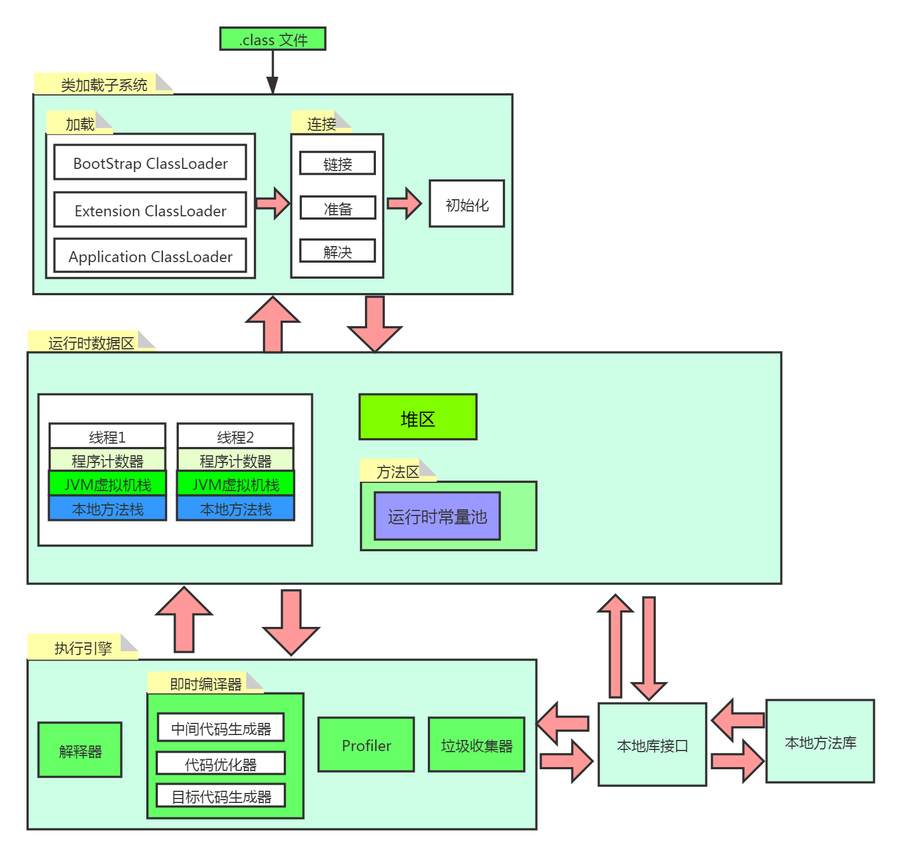

# JVM
```text
JVM 是 Java Virtual Machine (Java 虚拟机 ) 的缩写，
是指负责将字节码解释成为特定的机器码进行运行。
Java源程序需要通过编译器编译为 .class 文件，才能被 JVM 识别。
```

# JRE
```text
字节码将由 JRE (Java运行时环境) 执行。
JRE是Java虚拟机(JVM)的一个实现，它可以分析字节码、解释代码并执行它。
```

# JVM 架构
```text
JVM 分为三个主要子系统 ：类加载子系统 、运行时数据区 、执行引擎
```



## 类加载子系统
```text
Java的动态类加载功能由 类加载子系统 处理。
加载、链接、初始化。并在运行时(而不是编译时)首次引用类时初始化类文件。
```

### 加载
```text
ClassLoader 在加载类文件时将遵循委托层次算法。

BootStrap ClassLoader
负责从引导类路径中加载类，仅用于rt.jar。最高优先级将给予此加载程序。
Extension ClassLoader
负责加载ext文件夹（jre \ lib）内的类。

Application ClassLoader
负责加载应用程序级别的类路径，提到的环境变量路径等。
```

### 链接
```text
// 验证
字节码验证程序将验证生成的字节码是否正确，如果验证失败，我们将收到验证错误。
// 准备
将为所有静态变量分配内存并为其分配默认值。
// 解决
将所有符号内存引用替换为“方法区域”中的原始引用。
```

### 初始化
```text
所有静态变量将被分配原始值，并且将执行静态块。
```

## 运行时数据区
```text
运行时数据区域主要分为五个区域
```

### 方法区
```text
所有类级别的数据（包括静态变量）都将存储在此处。
每个JVM只有一个方法区域，它是共享资源。
```

### 堆区(Heap)
```text
所有对象及其对应的实例变量和数组将存储在此处。
每个JVM还有一个堆区。由于“方法”和“堆”区域共享多个线程的内存，
因此存储的数据不是线程安全的。
```

### 栈区(Stack)
```text
对于每个线程，将创建一个单独的运行时堆栈。对于每个方法调用，
将在堆栈存储器中创建一个条目，称为堆栈帧。所有局部变量都将在堆栈存储器中创建。
堆栈区域不是共享资源，因此是线程安全的。堆栈框架分为三个子实体：
1）局部变量数组–与该方法有关，涉及多少个局部变量，并且相应的值将存储在此处。
2）操作数堆栈–如果需要执行任何中间操作，则操作数堆栈充当执行该操作的运行时工作区。
3）帧数据–与该方法相对应的所有符号都存储在此处。在任何例外情况下，捕获块信息都将保留在帧数据中。
```

### 程序计数器
```text
PC寄存器(程序计数器)
每个线程将具有单独的PC寄存器，以在执行指令后保存当前执行指令的地址，
PC寄存器将用下一条指令进行更新。
```

### 本机方法堆栈
```text
本机方法堆栈保存本机方法信息。对于每个线程，将创建一个单独的本机方法堆栈。
```

## 执行引擎
```text
分配给运行时数据区的字节码将由执行引擎执行。
执行引擎读取字节码并逐段执行。
```

###  解释器 Interpreter
```text
计算机只认识0和1，任何编程语言的代码最终都要转化成  机器码(二进制代码) 才能执行，
解释器的工作是将编译得到的字节码再转化成机器码，然后才能执行。
Java 正是因为边解释边执行的特点，
在执行时才会慢于 C++ 之类的编译型语言。
```

###  即时编译器 、JIT Compiler，just-in-time compiler
```text
为了弥补解释执行带来的速度劣势，JVM 引入了即时编译器，
它的作用就是把热点代码，比如重复调用的方法和循环代码等，
编译成机器码并存放在 code cache 中，
这样之后再用到这些代码就不用重新解释执行了，可以提高程序运行效率。

// 中间代码生成器
产生中间代码。
// 代码优化器
负责优化上面生成的中间代码。
// 目标代码生成器
负责生成机器代码或本机代码。
```

###  Profiler
```text
个特殊的组件，负责查找热点，即是否多次调用该方法。
```

### 垃圾收集器
```text
程序员可以不用手动释放内存，全是垃圾收集器的功劳。
当然可以通过调用System.gc() 来触发垃圾回收，但是不能保证马上被回收。
```

###  Java本地接口库 、JNI 
```text
JNI将与本机方法库进行交互，并提供执行引擎所需的本机库。
```

### 本机方法库
```text
这是本机库的集合，这是执行引擎所需的。
一般是计算机本地的 C 或 C++ 库。
```