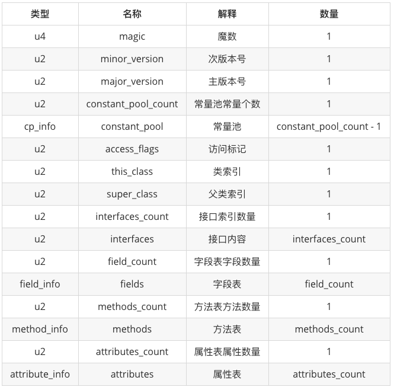

# JVM
```text
JVM 是 Java Virtual Machine (Java 虚拟机 ) 的缩写，
是指负责将字节码解释成为特定的机器码进行运行。
Java源程序需要通过编译器编译为 .class 文件，才能被 JVM 识别。
```

# JRE
```text
字节码将由 JRE (Java运行时环境) 执行。
JRE是Java虚拟机(JVM)的一个实现，它可以分析字节码、解释代码并执行它。
```

# Java 字节码
通俗来讲，字节码就是经过 javac 命令编译之后生成的 class 文件。 
class文件包含了 Java 虚拟机指令集和符号表以及若干其他的辅助信息。

## 字节码结构
```text
cafe babe 0000 0034 001d 0a00 0600 0f09
0010 0011 0800 120a 0013 0014 0700 1507
0016 0100 063c 696e 6974 3e01 0003 2829
5601 0004 436f 6465 0100 0f4c 696e 654e
756d 6265 7254 6162 6c65 0100 046d 6169
6e01 0016 285b 4c6a 6176 612f 6c61 6e67
2f53 7472 696e 673b 2956 0100 0a53 6f75
7263 6546 696c 6501 0009 4465 6d6f 2e6a

整个字节码文件本质上就是一张表，它由下面几个部分组成 。
便于理解，可以将一个完整的表划分为以下七个部分，
这七个部分组成了一个完整的 Class 字节码文件：

魔数与Class文件版本
常量池
访问标志
类索引、父类索引、接口索引
字段表集合
方法表集合
属性表集合

可以用 javap 命令反编译字节码，查看相关信息
例如 javap -verbose Hello.class

-help  --help  -?        输出此用法消息
-version                 版本信息
-v  -verbose             输出附加信息
-l                       输出行号和本地变量表
-public                  仅显示公共类和成员
-protected               显示受保护的/公共类和成员
-package                 显示程序包/受保护的/公共类
                       和成员 (默认)
-p  -private             显示所有类和成员
-c                       对代码进行反汇编
-s                       输出内部类型签名
-sysinfo                 显示正在处理的类的
                       系统信息 (路径, 大小, 日期, MD5 散列)
-constants               显示最终常量
-classpath <path>        指定查找用户类文件的位置
-cp <path>               指定查找用户类文件的位置
-bootclasspath <path>    覆盖引导类文件的位置
```


## 字节码查看工具
```text
1、jol-cli  ClassLayout 第三方工具
2、 javap -v xxx  // xxx 是 class 文件  （貌似是信息最全面的）
3、jclasslib ( Androidstudio 插件 )
https://github.com/ingokegel/jclasslib
```

## ASM Bytecode Outline ，ASM 字节码查看工具
```text
在使用 ASM 插入字节码代码时、如果不熟悉字节码相关语法和规则 ,
可能对于插入 字节码代码 就束手无策了、
ASM官方开发了一款IDE插件，可以将 Java代码 转换成 ASM 字节码类型代码，
这样再使用 ASM 插入字节码时就比较方便了。
```


# JVM 架构
```text
JVM 分为三个主要子系统 ：类加载子系统 、运行时数据区 、执行引擎
```


## 类加载子系统
```text
Java的动态类加载功能由 类加载子系统 处理。
加载、链接、初始化。并在运行时(而不是编译时)首次引用类时初始化类文件。
```

### 加载
```text
ClassLoader 在加载类文件时将遵循委托层次算法。

BootStrap ClassLoader
负责从引导类路径中加载类，仅用于rt.jar。最高优先级将给予此加载程序。
Extension ClassLoader
负责加载ext文件夹（jre \ lib）内的类。

Application ClassLoader
负责加载应用程序级别的类路径，提到的环境变量路径等。
```

### 链接
```text
// 验证
字节码验证程序将验证生成的字节码是否正确，如果验证失败，我们将收到验证错误。
// 准备
将为所有静态变量分配内存并为其分配默认值。
// 解决
将所有符号内存引用替换为“方法区域”中的原始引用。
```

### 初始化
```text
所有静态变量将被分配原始值，并且将执行静态块。
```

## 运行时数据区
```text
运行时数据区域主要分为五个区域。
程序计数器、Java 虚拟机栈 、本地方法栈 是线程私有的 ，
堆、方法区 是线程共享的。
```

### 程序计数器
```text
PC寄存器 (程序计数器)
每个线程将具有单独的PC寄存器，以在执行指令后保存当前执行指令的地址，
PC寄存器将用下一条指令进行更新。
```

### 方法区
```text
每个JVM只有一个方法区域，它是共享资源。
方法区用于存储已被虚拟机加载的 类级别信息、常量、静态变量、即时编译器编译后的代码缓存等数据。

在 JDK 6 的 时候 HotSpot 开发团队就有放弃永久代，逐步改为采用 本地内存 来实现方法区的计划了，
到了JDK 7 的 HotSpot，已经把原本放在永久代的字符串常量池、静态变量等移出，
而到了 JDK 8，终于完全废弃了永久代的概念，改用与 JRockit、J9 一样在本地内存中实现的元空间(Metaspace)来代替，
把JDK 7中永久代还剩余的内容(主要是类型信息)全部移到元空间中。
不要将方法区和永久代混为一谈，从JDK 8 以后已经没有永久代的概念了。

运行时常量池 是方法区的一部分。
Class 文件中除了有类的版本、字段、方法、接口等描述信息外，
还有一项信息是常量池表 (Constant Pool Table)，
用于存放编译期生成的各种字面量与符号引用，
这部分内容将在类加载后存放到方法区的运行时常量池中。
常量池是为了避免频繁的创建和销毁对象而影响系统性能，其实现了对象的共享。
```

### 堆区
```text
所有对象及其对应的实例变量和数组将存储在此处。
由于“方法”和“堆”区域共享多个线程的内存，
因此存储的数据不是线程安全的。
```

### Java虚拟机栈
```text
Java虚拟机栈 是线程私有的，它的生命周期与线程相同。
虚拟机栈描述的是 Java 方法执行的线程内存模型。
每个方法被执行的时候，Java 虚拟机都 会同步创建一个 栈帧 用于存储局部变量表、操作数栈、动态连接、方法出口等信息。
每一个方法被调用直至执行完毕的过程，就对应着一个栈帧在虚拟机栈中从入栈到出栈的过程。

// 局部变量表
存放了编译期可知的各种Java虚拟机基本数据类型、对象引用、和 returnAddress 类型(指向了一条字节码指令的地址)。
// 操作数栈
如果需要执行任何中间操作，则操作数堆栈充当执行该操作的运行时工作区。
// 动态连接
每个栈帧中包含一个在常量池中对当前方法的引用， 目的是支持方法调用过程的动态连接。
// 方法出口
无论何种退出情况，都将返回至方法当前被调用的位置。方法退出的过程相当于弹出当前栈帧。
```

### 本机方法堆栈
```text
本机方法堆栈保存本机方法信息。对于每个线程，将创建一个单独的本机方法堆栈。
```


## 执行引擎
```text
分配给运行时数据区的字节码将由执行引擎执行。
执行引擎读取字节码并逐段执行。
```

###  解释器 Interpreter
```text
计算机只认识0和1，任何编程语言的代码最终都要转化成  机器码(二进制代码) 才能执行，
解释器的工作是将编译得到的字节码再转化成机器码，然后才能执行。
Java 正是因为边解释边执行的特点，
在执行时才会慢于 C++ 之类的编译型语言。
```

###  即时编译器 、JIT Compiler，just-in-time compiler
```text
为了弥补解释执行带来的速度劣势，JVM 引入了即时编译器，
它的作用就是把热点代码，比如重复调用的方法和循环代码等，
编译成机器码并存放在 code cache 中，
这样之后再用到这些代码就不用重新解释执行了，可以提高程序运行效率。

// 中间代码生成器
产生中间代码。
// 代码优化器
负责优化上面生成的中间代码。
// 目标代码生成器
负责生成机器代码或本机代码。
```

###  Profiler
```text
个特殊的组件，负责查找热点，即是否多次调用该方法。
```

### 垃圾收集器
```text
程序员可以不用手动释放内存，全是垃圾收集器的功劳。
当然可以通过调用System.gc() 来触发垃圾回收，但是不能保证马上被回收。
```

###  Java本地接口库 、JNI 
```text
JNI将与本机方法库进行交互，并提供执行引擎所需的本机库。
```

### 本机方法库
```text
这是本机库的集合，这是执行引擎所需的。
一般是计算机本地的 C 或 C++ 库。
```