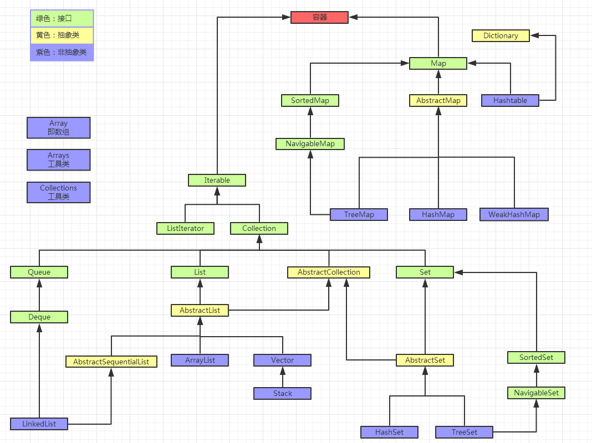

# 容器类关系图



# Array 、Arrays
```text
Array：就是数组。
java.lang.reflect.Array 是个反射工具包，全是静态方法。

Arrays：是Array的工具类，其静态方法定义了 对Array 的各种操作。
```


# Collection 、Collections
```text
Collection 是接口，集合。
Collections 是工具类。提供静态方法 封装了一些对集合的操作。
```
