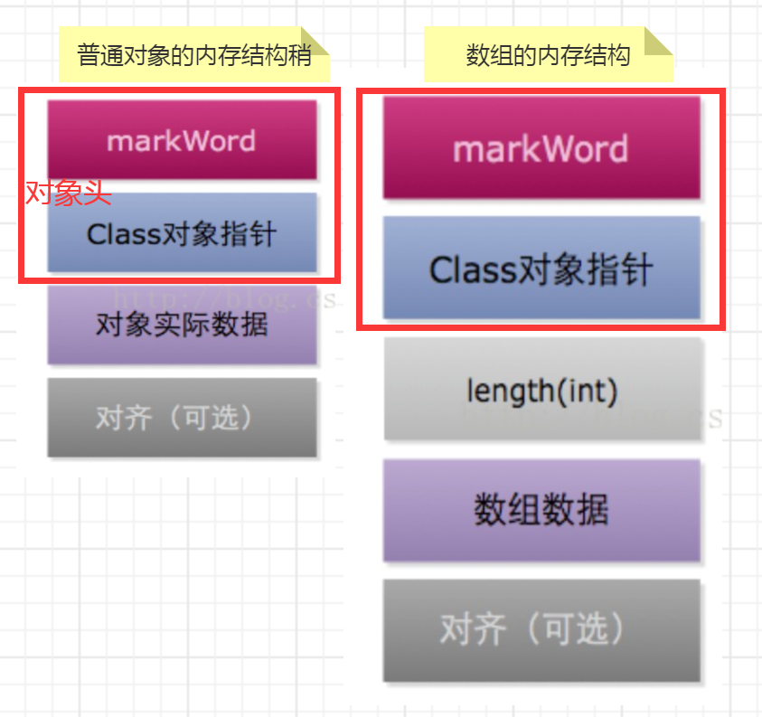

# 对象内存布局

```text
在HotSpot虚拟机中，对象在内存中存储的布局分为
对象头Header、实例数据Instance Data、对齐填充Padding。

// 对象头 
object header , 包括了关于堆对象的布局、类型、GC状态、同步状态和标识哈希码的基本信息。
Java对象和vm内部对象都有一个共同的对象头格式。

// 实例数据
Instance Data ,主要是存放类的数据信息，父类的信息，对象字段属性信息。

// 对齐填充
Padding, 为了字节对齐，填充的数据，不是必须的。
对齐填充并不是必然存在的，无特别含义，起着占位符的作用，
HotSpotVM的自动内存管理系统要求对象起始地址必须是8字节的整数倍，也就是对象的大小必须是8字节的整数倍，
对象头正好是8字节的倍数，所以当对象实例数据部分没有对齐，就需要通过对齐填充来补全。

对于Java和C、C++、C#这类高级语言，因为编译器的存在，
编译器或虚拟机会自动帮我们进行字节对齐补白。无需手动去处理。
```



## 为什么要进行内存对齐
```text
// 平台原因
不是所有的硬件平台（例如某些嵌入式系统中使用的低端微处理器）都能访问任意地址上的任意数据，
某些硬件平台只能访问对齐的地址，否则会出现硬件异常。

// 性能原因
如果数据存放在未对齐的内存空间中，则处理器访问变量时需要做两次内存访问，
而对齐的内存访问仅需要一次访问。
显然，内存对齐在某些情况下可以减少读取内存的次数以及一些运算，性能更高。
另外，由于内存对齐保证了读取 b 变量是单次操作，在多核环境下，原子性更容易保证。

但是内存对齐提升性能的同时，也需要付出相应的代价。
由于变量与变量之间增加了填充，并没有存储真实有效的数据，所以占用的内存会更大。
这也是一个典型的空间换时间的应用场景。
```


## 如何解决 内存对齐 带来的内存浪费问题
```text
有内存对齐就会有内存浪费的情况，所以为了减少内存浪费，
并达到内存对齐的目的，JVM就会将字段重新排列。

java -version   // 查看虚拟机类型
java version "1.8.0_151"
Java(TM) SE Runtime Environment (build 1.8.0_151-b12)
Java HotSpot(TM) 64-Bit Server VM (build 25.151-b12, mixed mode)
由于HotSpot虚 拟机的自动内存管理系统要求对象的起始地址必须是8字节的整数倍，
因此当对象实例部分数据没有对齐时，就需要对剩余的部分进行填充。
补齐位的存在就是为了补齐8字节，每一个java对象的大小都是8的倍数。

// 字段重排规则 (Java HotSpot(TM) )
1、总的规则是  
(对象头 + 实例数据 + padding) %8 == 0  
且  0 <= padding < 8

2、对象属性排序规则（我猜的）
在属性中选一个使得从起始开始，每一步累加后 尽快满足 sum%8===0 

class TestBean {
    private byte byteValue1 ;
    private char charValue1 ;
    private long longValue2 ;
    private char charValue2 ;
    private double doubleValue1 ;
    private boolean booleanValue2 ;
    private byte byteValue2 ;
    private double doubleValue2 ;
}
---------------- > 
 OFFSET  SIZE    TYPE DESCRIPTION 
      0     4         (object header)
      4     4         (object header) 
      8     4         (object header)                
      // header 下面属性顺序跟申明顺序可能不一致
     12     2  char TestBean.charValue1             
     14     2  char TestBean.charValue2             
     16     8  long TestBean.longValue2 
     24     8  double TestBean.doubleValue1 
     32     8  double TestBean.doubleValue2 
     40     1  byte TestBean.byteValue1
     41     1  boolean TestBean.booleanValue2 
     42     1  byte TestBean.byteValue2  
     43     5  (loss due to the next object alignment)
Instance size: 48 bytes
```

## jol-cli 查看 对象内存布局信息
```text
https://repo.maven.apache.org/maven2/org/openjdk/jol/jol-cli/ 
下载一个 full 版本
//查看对象内部信息.
String inInfo=ClassLayout.parseInstance(bean).toPrintable() ;
//查看对象外部信息，包括引用的对象.
String outInfo=GraphLayout.parseInstance(bean).toPrintable() ;
//查看对象总大小.
long allInfo=GraphLayout.parseInstance(bean).totalSize();
```


# 字节码查看工具
```text
1、jol-cli  ClassLayout 第三方工具
2、 javap -v xxx  // xxx 是 class 文件  （貌似是信息最全面的）
3、jclasslib ( Androidstudio 插件 )
https://github.com/ingokegel/jclasslib
```


