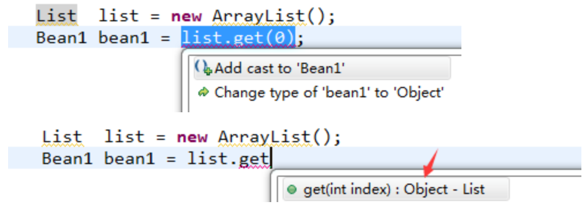
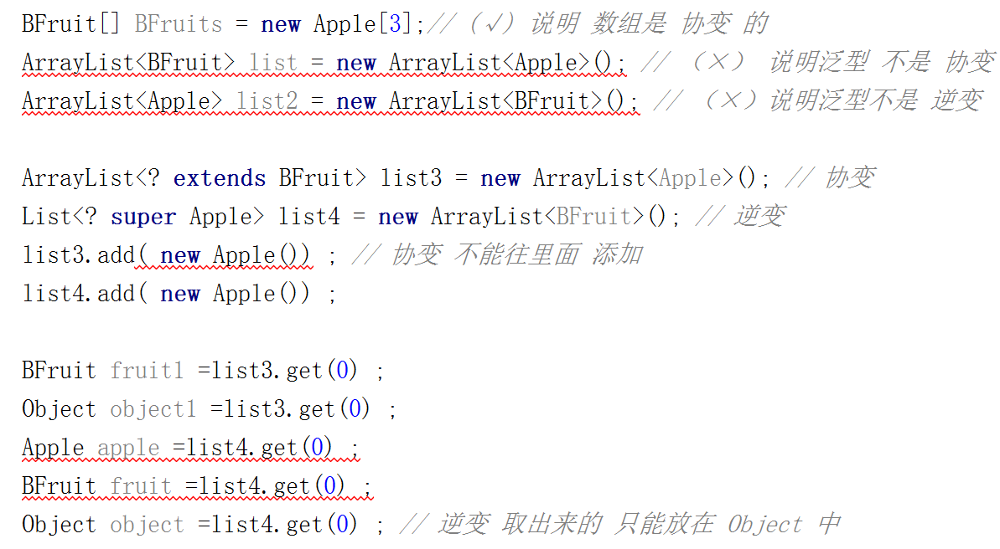
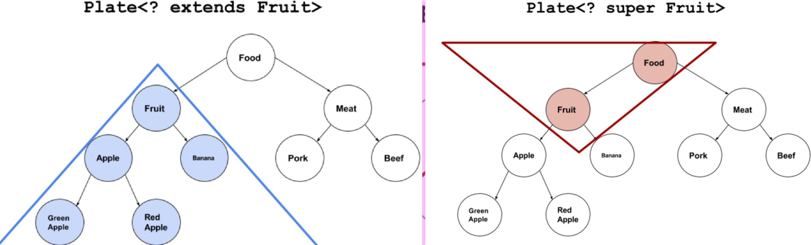

# 泛型是什么 
```text
在 Java5 以前，普通的类和方法只能使用特定的类型，
但是如果编写的代码需要应用于多种类型，这种严苛的限制对代码的束缚就会很大。
所以 Java5 引入泛型，泛型实现了参数化类型，
使得你编写的组件(通常是集合)可以适用于多种类型。

泛型将类型参数化,让编译器在编译期间帮忙检查类型错误。
在定义的时候你不知道这个地方需要什么类型的数据，只有实际使用的时候才会知道。
```
 

## 使用泛型 前
```text
Object 是所有类的根类，
任何类的对象都可以设置给该Object引用变量，使用的时候可能需要类型强制转换 。
需要开发者手动做强制转换，但是如果开发者判断失误，程序运行会崩溃。
有很大的安全隐患。
```


## 使用泛型 后
```text
这样设计的容器在使用时编译器就可以帮忙做很大一部分的类型安全检查工作了，
这就避免了很多运行时的ClassCastException异常，
程序员也无需记住各种对象的类型和担心类型匹配问题了。
(编译器在编译是就帮我们做检查，更容易发现错误。)

List<Bean> list = new ArrayList<Bean>();
Bean bean = list.get(0) ; // 无需手动转换
```

#  泛型 通配符 
```text
原则上来讲，使用任何字母或字符串都是可以的，
但是为了代码的可读性，我们一般有如下约定。
E - Element   //在集合中使用，因为集合中存放的是元素 
T - Type  // 类型
K - Key  //键
V - Value // 值
N - Number   // 数字
? -    //表示不确定的java类型、无界通配符          
```

# 泛型的应用范围
```text
泛型接口 、泛型类 、泛型方法
```

## 泛型类
```text
public class Tool <T > {
	private T value ;
}
```
 
##  泛型接口
```text
public interface Person <T>{
   T getType();
}}
```
 

## 泛型方法
```text
// <T200> 说明当前是一个泛型方法，并且将类型定义为T200
// 返回值 为 T200
public <T200> T200 showKeyName (List<T200> list) {
      return list.get(0) ;
  }

public class Tool <T200 > {
// 静态方法不能使用类定义的泛型。
public static void show(T200 t){
 // 这样使用编译器会报错
}
}
```


# 泛型与可变参数
```text
//printMsg("111",222,"aaaa","2323.4",55.55);
public static <T300> void printMsg( T300... args){
    for(T300 t : args){
      System.out.println("t is " + t);
    }
}
```


# 泛型的 类型擦除
```text
Java泛型 是从JDK 1.5才开始加入的，
因此为了兼容之前的版本， 
Java在语法上支持泛型，但是在编译阶段会进行所谓的“类型擦除”，
将所有的泛型表示（尖括号中的内容）都替换为具体的类型（其对应的原生态类型），
就像完全没有泛型一样。

// 类型擦除验证
List<String> list1 = new ArrayList<>(); 
List<Integer> list2 = new ArrayList<>(); 
boolean result = list1.getClass() == list2.getClass()
result 结果是true。
说明两个传入了不同泛型的List最终都编译成了ArrayList，成为了同一种类型，
原来的泛型参数String和Integer被擦除掉了。 
```

# 协变 、逆变  、型变 、不变  定义
```text
型变 分为 逆变 和 协变, 与不变对应。均用来描述类型转换后的继承关系;
其定义：

A、B表示类型，
f(⋅)表示某种类型转换，例如 f(A)=ArrayList<A>  ，f(A)=[]A
≤表示继承关系（A≤B表示A是由B派生出来的子类） 

若 A≤B ，有f(A)≤f(B)成立； f(⋅) 是协变 的，
若 A≤B ，有f(B)≤f(A)成立；f(⋅) 是逆变 的 
若 A≤B ，f(A) 与 f(B) 相互之间没有继承关系。 f(⋅) 是不变 的
```

## 数组的 协变 、泛型的 不变
```text
BFruit[] BFruits = new Apple[3];// (通过) 说明 数组是 协变 的
ArrayList<BFruit> list = new ArrayList<Apple>()//(报错)说明泛型 不是 协变 的
ArrayList<Apple> list2 = new ArrayList<BFruit>()//(报错)说明泛型不是 逆变 的
```

## 泛型中 ? extends 和 ? super  
```text
Java中泛型是不变的，可有时需要实现逆变与协变，怎么办呢？
这时，通配符? 派上了用场。
上界通配符 <? extends> 实现了泛型的协变
ArrayList<? extends BFruit> list3 = new ArrayList<Apple>();

下界通配符 <? super>实现了泛型的逆变 
List<? super Apple> list4 = new ArrayList<BFruit>(); 
```



## 为什么 协变 只能读不能存  ？
```text
BFruit[] fruits =new Banana[5] ;
fruits[0] =new Apple();
System.out.println(fruits[0]);// 编译通过，但是运行报错 java.lang.ArrayStoreException

ArrayList<? extends BFruit> list3 = new ArrayList<Banana>();
list3.add( new Apple()) ; // ( 编译报错)
list3.add( new Banana()) ; // ( 编译报错)
// 因为根据 里氏替换原则 ，list3 可能是 list3 = new ArrayList<Apple>()
// 也可能是 list3 = new ArrayList<Banana>()
// 如果不加限制地存进去，那么取出来的时候 ，类型转换就存在 转换异常 。
```

## 为什么  逆变 取出来的 只能放在 Object 中 ？
```text
List<? super BFruit> list4 = new ArrayList< >();
list4.add( new Meat()) ; // (通过)
list4.add( new Banana()) ; // (通过)
Apple fruit1 =list4.get(0) ; // (编译报错)
Banana fruit2 =list4.get(0) ; // (编译报错)
BFruit fruit3 =list4.get(0) ; // (编译报错)
Object object =list4.get(0) ; // (通过)
//  因为 list4 限定的是下界是 BFruit 类型,
// 编译器并不知道 里面存取的确切的类型是什么，没法找到一个合适的类型接受返回值。
// 所以只能放 Object 中 。
```

## 补充理解
```text
ArrayList<? extends BFruit> list
// 定义一个list，存放 BFruit 和子类 是 BFruit的对象 。
List<? super Apple> list ;
// 定义一个list ，存放 BFruit 和 父类是 BFruit 的对象。
```



#  PECS 原则
```text
究竟什么时候用extends什么时候用super呢？《Effective Java》给出了答案：
PECS: producer-extends, consumer-super.

如果它表示一个 T 生产者，就使用 <? extends T> 
如果它表示一个 T 消费者， 就使用 <? super T> 
PECS 这个助记符突出了 通配符类型 的基本原则。 

// java.util.Collections 的 copy() 方法(JDK1.7)完美地诠释了 PECS
public static <T> void copy( List<? super T> dest, List<? extends T> src) {
    int srcSize = src.size();
    if (srcSize < COPY_THRESHOLD || ...) {
        for (int i=0; i<srcSize; i++)
            dest.set(i, src.get(i)); // dest 消费者 ，src 生产者
    } else {
        ListIterator<? super T> di=dest.listIterator();
        ListIterator<? extends T> si=src.listIterator();
        for (int i=0; i<srcSize; i++) {
            di.next();
            di.set(si.next());
        }
    }
}
```