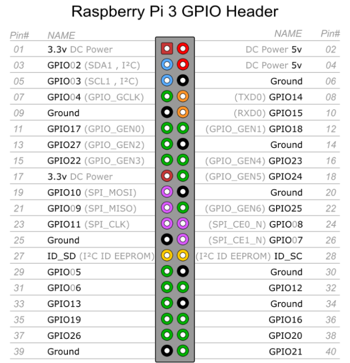

# linux - Ubuntu
[Ubuntu下载地址](http://cn.ubuntu.com/download/)  

## 获得su的密码
Ubuntu刚安装后，不能在终端中运行su命令，因为root没有默认密码，需要手动设定。
以安装ubuntu时输入的用户名登陆，该用户在admin组中，有权限给root设定密码。
```text
sudo passwd xxx    //xx是账号 ， xx为空就默认是root账号
更换新密码后 就获得了 root的密码。 从而进入su账号。
```


## ubuntu 常用目录

名字| 说明|其他
-|-|-
bin | 系统启动需要的命令和大部分普通用户平常所需的可执行命令。 <br> 都是二进制文件 |
sbin | 存放系统管理员可执行的命令。 |
sys | 系统中的设备和文件层次结构。 |
etc |程序的配置文件目录  |  
boot | 存放Ubuntu内核文件及引导加载器相关的文件 |
dev | 设备列表文件夹，鼠标、键盘、硬盘等。 <br> 关于设备驱动文件都在这里 |  配置文件 <br>  /etc/profile  <br>   /etc/bash.bashrc   <br>   /etc/environment    
cdrom | 光盘目录，如果插入光盘会出现光盘内容 |  
mnt |所有挂载在系统中的设备。比如U盘设备  |   
root | 超级管理员的家目录 |   
home | 所有普通用户都有一个以自己名字命名的文件夹存放在这个目录中。 | 配置文件 <br>  /home/aivin/.profile   <br>    /home/aivin/.bashrc     <br>    /home/aivin/.bash_logout     <br>    /home/aivin/.bash_history   
usr | 　和用户有关的文件系统都存放在这个目录。  |  
var | 存放类似日志这样随时间变化的文件。 |  
opt | 机额外安装软件所摆放的目录。默认是空的。  <br> 一般安装软件的时候，可以自己指定安装到这个目录下，便于查找和管理   |   
run |保存从系统诞生到当前的关于系统信息的文件。  |   
srv | 一般是系统存储的服务相关数据。 |       
tmp | 　存放系统或者用户的临时文件的目录。 |  
lib | 各种程序所需的共享动态链接库 |	  
lib64 | 64位支持库 |	 
snap | snap应用框架的程序文件 |     
media | 存放所有关于媒体信息的文件。 |	 
proc | 存放的是系统信息和进程信息。 |
swapfile |  |  
vmlinuz | 内核文件|
initrd.img|initrd是在系统引导过程中挂载的一个临时根文件系统，用来支持两阶段的引导过程。 |


## Ubuntu 配置文件
Linux系统严格的权限管理造成系统有多个环境变量配置文件，如果不了解其调用顺序，很有可能遇到配置了环境变量，而看不到其发生作用。

### /etc/environment
系统在读取用户的profile前,设置环境文件的环境变量。

### /home/aivin/.bash_logout
当每次退出系统(退出bash shell)时,执行该文件

### /home/aivin/.bash_history
是bash shell的历史记录文件，里面记录了你在bash shell中输入的所有命令。


### /etc/profile
为系统的每个用户设置环境信息, 当用户第一次登录时,该文件被执行。
修改后重启生效、或者source /etc/profile立即生效 。  

### /home/aivin/.profile

### /home/aivin/.bashrc
### /etc/bash.bashrc


## 用终端打开、关闭软件
```text
xx &   // 打开xx软件， 注意后面的 & , 否则终端关了 软件也会跟着关闭
killall xx // 关闭xx这个软件
注意：前提是xx这个软件的安装路径已经加入到环境变量中了
```


###### NDK配置
```html
1、ubuntu 查看当前工作目录：pwd  //路径至关重要
2、配置环境变量命令：$sudo gedit ~/.bashrc
在打开的文件中添加以下代码：
export   NDK=/home/aivin/Downloads/myNDKr13b/android-ndk-r13b
export   PATH=${PATH}:$NDK
3、保存关闭刚刚修改过的文件。
4、source  ~/.bashrc使其修改的文件生效。
5、配置好后可通过 echo $PATH查看配置环境
输入ndk-build -v ,出现一下信息说明ndk配置ok。
```


 


## 虚拟内存
```text
直接从内存读写数据要比从硬盘读写数据快得多，因此更希望所有数据的读取和写入都在内存中完成，
然而内存是有限的，这样就引出了物理内存与虚拟内存的概念。

物理内存就是系统硬件提供的内存大小，是真正的内存。
相对于物理内存，在 Linux 下还有一个虚拟内存的概念，
虚拟内存是为了满足物理内存的不足而提出的策略，它是利用磁盘空间虚拟出的一块逻辑内存。
用作虚拟内存的磁盘空间被称为swap空间。

Linux会在物理内存不足时，使用交换分区的虚拟内存，
更详细地说，就是内核会将暂时不用的内存块信息写到交换空间，
这样一来，物理内存得到了释放，这块内存就可以用于其他目的，
当需要用到原始的内容时，这些信息会被重新从交换空间读入物理内存。

Linux的内存管理采取的是分页存取机制，
为了保证物理内存能得到充分的利用，
内核会在适当的时候将物理内存中不经常使用的数据块自动交换到虚拟内存中，
而将经常使用的信息保留到物理内存。


```

## 常见错误
### ubuntu 报错Syntax error: "(" unexpected解决方法。
```text
因为Ubuntu为了加快开机速度，用dash代替了传统的bash，是dash在捣鬼。
解决方法是 取消dash，
sudo dpkg-reconfigure dash
在选择项中选No，即可。
```

###  ubuntu 重启时，提示 A STOP JOB IS RUNNING FOR UNATTENDED UPGRADES SHUTDOWN 
A stop job is running for snappy daemon
```text
编辑system.conf文件  vim /etc/systemd/system.conf
修改以下两个地方
DefaultTimeoutStartSec=10s
DefaultTimeoutStopSec=10s

systemctl daemon-reload  // 执行使得配置生效
```


## linux常用命令

命令 | 说明
-|-
reboot | 重启系统
shutdown -h now |  立刻关机
pwd | 显示当前的路径
find aa.x  | 在当前目录下查找aa开头的文件
sudo chmod 777 XXX目录 | 修改权限
sudo chmod -R 777  |xxx目录 修改目录下所有的文件
sudo su |获取root权限
dpkg -l xx | 查询这个xx软件是否安装
dpkg -L xx | 查看详细的安装路径， 简洁查询可以用 whereis xx
dpkg -i xx.deb | 	安装deb包  。  <br>  如果deb没有打包好依赖包，需要自己手动安装依赖包 。 apt-get 方式会自动解决依赖问题
dpkg -r xx  |	删除包
dpkg -P xx  |	删除包（包括配置文件）
apt list --upgradable    |查看可升级的软件信息
apt list --upgradable -a | 查看可升级的软件的全部版本信息
apt --fix-broken install   | 修正软件包的依赖错误
apt-get -f -y install  | 安装需要的依赖包
apt-get install xxx  | 安装xxx软件
apt-get update    | 同步软件源， 获得最新的软件包
apt-get upgrade    | 将本地所有的软件更新到apt支持的最新版本。只是简单的更新包。 <br> 不建议这样更新 ，可能会导致软件版本兼容问题。 建议指定更新某个软件
apt-get upgrade xx |  更新指定的软件到最新版本
apt-get dist-upgrade |  作用跟apt-get upgrade 类似，更智能， 可以根据依赖关系的变化，添加或删除依赖包。
apt-cache show xx  | 获取包的相关信息，如说明、大小、版本等
aptitude show   xx  | 获取包的相关信息，如说明、大小、版本等 。 <br>  需要先安装  sudo apt-get install aptitude
apt-get remove  --purge   xxx |卸载软件并且删除配置
apt-get autoclean     | 清除已卸载软件的备份。 <br>  apt默认会把已安装和已卸载的软件都备份起来
apt-get clean     | 清除已安装软件的备份
arch  |	显示机器的处理器架构
cat /proc/version  |	显示内核的版本
ifconfig | 查看IP信息
cat>>test.txt   |	创建文件
mkdir xx  |	创建目录
rm -f xx  |	删除文件
rmdir xx  |	删除空文件夹
rm -rf xx  |	删除非空文件夹
cp file1 file2   |	复制文件到当前路径
cp  file1 dir1 | 复制文件夹到指定路径
cp -a dir1 dir2  |	复制目录 到指定文职
mv a/  b/ | 从 a 移动到 b  
mv 源文件名 目标文件名 | 移动文件跟重命名都是同一个命令
zip -r a.zip test.txt test2.txt | 多个文件压缩成zip
unzip xx.zip -d dir  <br>  unzip -O CP936 xxxx.zip  解决解压后乱码问题 | 解压zip到指定目录
rar a 3.rar test.txt test2.2  | 多个文件压缩成rar
unrar e  3.rar  dir | rar解压到指定目录

```text
Linux查看所有用户
cat /etc/passwd
cat /etc/passwd |cut -f 1 -d :
```


uname -a  | 查看系统架构
dpkg --print-architecture | 64还是32位的

```text
cpu详细信息
cat /proc/cpuinfo | head -20

内存信息  
cat /proc/meminfo   或  free

磁盘使用情况
 df -hT
```


## vim 常用命令
```text
esc // 进入正常模式
i  // 进入编辑模式
v  // 进入可视模式

vim + fileName   // 新建或打开一个文件
:w  保存
:q  退出
:wq 保存并退出
:q! 强制退出

:set number   // 显示行号
u        //撤销上一步的操作
Ctrl+r   //恢复上一步被撤销的操作

在可视模式下 ，按键盘左右键 可以选中内容。
y  // 复制选中的内容
p  //  粘贴剪切板中的内容
```

## 文件上传 ftp
```text
```

## 文件上传 sz rz
```text
安装 lrzsz
sz xxx.zip  // 下载服务器上的文件  
rz   // 将指定的文件 上传到 服务器当前的目录下
rz -be // 批量上传
```


## 查找软件的安装路径 whereis
```text
1、先运行这个程序
2、在终端中输入命令 ps -e
3、在打印出来的正在运行程序的列表中找到这个程序的具体名字 ,例如叫做 atom
3、 whereis  atom
就会输出   atom: /usr/bin/atom   /usr/share/atom
第一个路径就是安装路径
```


## 设置自定义分辨率  1920*1080
```text
1、添加1920*1080选项
sudo xrandr --newmode "1920x1080_60.00" 173.00 1920 2048 2248 2576 1080 1083 1088 1120 -hsync +vsync
sudo xrandr --addmode Virtual1 "1920x1080_60.00"
2、设置开机自启
打开 etc/profile 文件 添加
xrandr --newmode "1920x1080_60.00" 173.00 1920 2048 2248 2576 1080 1083 1088 1120 -hsync +vsync
xrandr --addmode Virtual1 "1920x1080_60.00"
```


## 默认开启小键盘
Windows下虚拟机中安装Ubuntu
```text
1、安装一个软件 sudo apt-get install numlockx
2、找到并打开配置文件 sudo gedit /usr/share/lightdm/lightdm.conf.d/50-unity-greeter.conf
3、修改并保存  greeter-setup-script=/usr/bin/numlockx on
```


## ubuntu下常用软件
网易云音乐播放器 、火狐浏览器 、 搜狗输入法、 wps 、 Unity Tweak Tool 桌面美化工具 、   第三方终端 Guake Terminal
atom 、    git  、 FillZilla Ftp   、tomcat 、 进程查看工具 htop 、  截图软件 flameshot


# 树莓派相关
## 需要用到的软件
```text
SDFormatter         // 格式化sd卡
Win32DiskImager    // 烧录系统到sd卡
WiFi共享精灵       // 创建wifi 。方便查看ip 。如有路由器，这个软件就不需要。
WinSCP           // 图形化界面，上传文件。
Xshell  、putty // ssh 命令行工具
VNC Viewer     // 图形化桌面
ExtFS for Windows  // 在window下直接打开装有linux的分区
官方系统 2018-11-13-raspbian-stretch-full.img
https://www.raspberrypi.org/downloads/
ubuntu系统也可以，但是没有HDMI外接显示器 安装ubunt有点不方便，所以选择官方系统。
（官方镜像烧录完成 系统就可以直接用，ubuntu还需要一些后续操作才能用）

JuiceSSH   // 在安卓上连接树莓派  
```

## 修改密码 和启用 root账号
```text
系统装好之后的默认账号和密码
pi  raspberry

sudo passwd xxx  //更新 xxxx账号的密码

sudo passwd root  //修改root密码
sudo passwd --unlock root   // 解锁root账号

// 开启 root 登录
打开配置文件  /etc/ssh/sshd_config
注释掉这一行：PermitRootLogin prohibit-password
新建一行添加：PermitRootLogin yes
重启服务  sudo service ssh restart
```

## 通过wifi连接网络
```text
在烧录好系统的 sd卡根目录放置一个 ssh文件。（空文件 ，不用写后缀名）
wpa_supplicant.conf
country=GB
ctrl_interface=DIR=/var/run/wpa_supplicant GROUP=netdev
update_config=1
network={
    ssid="AAIVINPC"
    psk="1234567890"
}

然后接入电源，就会自动去连接指定wifi 。
```


## 挂载 NTFS 格式的移动硬盘
```text
 一般情况下，Linux是识别不了NTFS格式移动硬盘的，
可以使用  ntfs-3g 来帮助挂载 NTFS格式的硬盘 。

//安装 ntfs-3g
apt-get install ntfs-3g

fdisk -l | grep NTFS     
得到NTFS分区的信息， 类似   /dev/sda5  4096 976773119 976769024 465.8G  7  HPFS/NTFS/exFAT

// 挂载之前先 取消挂载
umount /dev/sda5  

// 挂载 ， 将 /dev/sda5 挂载到你自己指定的位置 /mnt/aivin-fun-data
mount -t ntfs-3g  /dev/sda5    /mnt/aivin-fun-data

如果以前挂载过，然后在window上复制了文件到硬盘中 但是树莓派上没法看到。就重新挂载即可。


我的树莓派 好像会自动挂载到 /media 目录下。 将这个文件夹设置为 777 权限。tomato的虚拟目录设置成到这里即可。
不需要指定挂载目录 进行挂载等操作了。


````

## 安装tomcat
```text
https://tomcat.apache.org/download-90.cgi   xxx.zip解压即可
```
### 设置 tomcat  开机自启
```text
修改etc目录下的 rc.local文件
cd /home/pi/aivinSpace/tomcat9/bin
./startup.sh

设置tomcat访问webapps之外的路径
修改 tomcat的 server.xml 文件 ，在 Host 节点下 添加 。然后重启tomcat
 <Context path="" docBase="/media/pi/PICD/xyData/" debug="0" />	  
 说明： path 这里代表项目路径 ， docBase 代表Root的路径
 例如： 我们的Test.war还是放在 tomcat 的webApp 目录下。
 最后的访问路径就是   htpp://xxx:8080/   (这个路径已经达到xyData目录了)
```


## 安装 mysql
```text
卸载mysql
apt-ge autoremove --purge mysql-server
//安装sql
apt-get install mysql-server  


//设置root密码
mysql -u root -p  //   密码输入 root密码即可
use mysql;
update user set plugin='mysql_native_password' where user='root';
UPDATE user SET password=PASSWORD('123456') WHERE user='root';
flush privileges;
exit;

设置 root登录
mysql -uroot -p
use mysql;
GRANT ALL PRIVILEGES ON *.* TO 'root'@'%' IDENTIFIED BY '123456' WITH GRANT OPTION;
flush privileges;
exit;

// 设置root远程登录
修改mysql配置文件，允许远程登录 ，将bind-address这行注释掉
vim /etc/mysql/mariadb.conf.d/50-server.cnf

然后重启
sudo /etc/init.d/mysql restart


//不知道mysql的root账号密码，可以使用 系统的 debian-sys-maint 账号和密码
vim/etc/mysql/debian.cnf

//添加账号 ，并允许在所有ip登录
CREATE USER 'aivin'@'%' IDENTIFIED BY '123456';

//授予所有权限（增删改查）
GRANT ALL ON  *.*  TO 'aivin'@'%';
//然后刷新权限
flush privileges;  
```
### python 扫描本地文件夹 更新数据库
```text
# -*- coding: utf-8 -*-

import os
import datetime
import pymysql

conn = pymysql.connect(host='127.0.0.1', # host='127.0.0.1',  192.168.23.2
                       port=3306,
                       user='root',
                       passwd='123456',
                       db='xyDb',
                       charset='UTF8')
print("获得数据库连接:")
print(conn)
cursor = conn.cursor()

sql = " DROP TABLE IF EXISTS `xyTable`; "
cursor.execute( sql )
print("删除表 ok")

sql ="  CREATE TABLE  `xyTable`  (  `mId` int(100) NOT NULL AUTO_INCREMENT, " \
    "`mType` varchar(10) NOT NULL, \
    `mName` varchar(100) NOT NULL, \
    `mDir` varchar(100) NOT NULL,\
    `mDesc` varchar(1000) NOT NULL,\
    `mUrl1` varchar(1000) NOT NULL,\
    `mUrl2` varchar(1000) NOT NULL,\
    `mLrc` varchar(1000) NOT NULL, \
    `mVisiable` varchar(10) NOT NULL, \
    `mTime` varchar(100) NOT NULL, \
    PRIMARY KEY (`mId`)  \
    ) ENGINE=InnoDB DEFAULT CHARSET=utf8mb4; "
cursor.execute( sql )
print("创建表 ok")

def getFileList(dir, fileList):
    newDir = dir
    if os.path.isfile(dir):         # 如果是文件则添加进 fileList
        fileList.append(dir)
    elif os.path.isdir(dir):
        for s in os.listdir(dir):   # 如果是文件夹
            newDir = os.path.join(dir, s)
            getFileList(newDir, fileList)
    return fileList

# dir = "D:\\xyData\\"
dir = "/mnt/aivin-fun-data/xyData/"
list = getFileList( dir, [])
print("扫描资料库 ok , 数据总量为："  , len(list))

for path in list:
    mType = os.path.basename(os.path.dirname(os.path.dirname(path)))
    mUrl1 = os.path.basename(path)
    mName = mUrl1.split(".")[0]
    mDir =  os.path.basename(os.path.dirname(path))
    mDesc =""
    mUrl2= ""
    mLrc =  mName+".lrc"
    mVisiable ="1"
    mTime = datetime.datetime.now().strftime('%Y-%m-%d')

    sql = " insert  into xyTable(  mType , mName, mDir , mDesc , mUrl1 , mUrl2 , mLrc , mVisiable , mTime )" \
          " values(  '%s','%s','%s','%s','%s','%s' ,'%s','%s','%s' ) " \
          % (mType, mName, mDir, mDesc, mUrl1, mUrl2, mLrc, mVisiable, mTime)
    cursor.execute(sql)
    newId = int(conn.insert_id())
    conn.commit()
    print("插入成功 id:  ", newId)

print("更新完毕 !!! ")
cursor.close()
conn.commit()
conn.close()
```

## 安装文件共享 Samba
```text
https://www.jianshu.com/p/0fb0638fa061
apt-get install samba
apt-get install samba samba-common-bin
apt-get install samba-client

配置 /etc/samba/smb.conf
在文件末尾加上如下内容
[public]
   comment = public storage
   path = /mnt/udisk
   valid users = pi
   read only = no
   create mask = 0777
   directory mask = 0777
   guest ok = no
   browseable = yes

public : 这是对外显示的文件名字，可以改成其他ABCD
comment：共享文件夹说明
path：共享文件夹目录
valid users：有效用户
read only：是否只读
create mask：创建文件的权限
directory mask：创建文件夹的权限
guest ok：是否允许访客访问
browseable：是否可见
valid users 即 pi 为有效用户


将用户添加到 Samba中
smbpasswd -a pi
重启samba
samba restart
注：Samba 默认开机自启，无需为重启担心。
```


## wifi 断线重连
```text
将脚本放入随意一个目录，开机自己执行就可以。
import os, time
while True:
    if '192' not in os.popen('ifconfig | grep 192').read():
        print( '\n****** wifi is down, restart... ******\n')
        os.system('sudo /etc/init.d/networking restart')
    else:
        print("\nwifi is ok !! \n")
    time.sleep(1 * 60)  # n  minutes

// 在 rc.local文件中加入
cd /home/pi/  
python  WiFi_Check.py  &
```


## 树莓派硬件说明
### 引脚
### GPIO
```text
GPIO（GeneralPurposeI/OPorts）意思为通用输入/输出端口，通俗地说，就是一些引脚，
可以通过它们输出高低电平或者通过它们读入引脚的状态-是高电平或是低电平。
```

### 针脚编号方案
```text
BOARD编号
使用这种编号的好处是，你的硬件将是一直可以使用的，不用担心树莓派的版本问题。
因此，在电路板升级后，你不需要重写代码。

BCM编号
是更底层的工作方式。在使用一个引脚时，你需要查找信道号和物理引脚编号之间的对应规则。
对于不同的树莓派版本，编写的脚本文件也可能是无法通用的。

WPI编号
编号侧重实现逻辑，把扩展GPIO端口从0开始编号，这种编号方便编程。
```




```text
40个PIN中，有固定输出的5V（2、4号PIN）、3.3V（1、17号PIN）和地线（Ground，6、9、14、20、25、30、34、39）。
如果一个电路两端接在，5V和地线之间，该电路就会获得5V的电压输入。
27和28号PIN标着ID_SD和ID_SC。它们是两个特殊的PIN，用于和拓展树莓派功能的附加电路板通信。
其他的PIN大多编程GPIOX的编号，如GPIO14 等 用户用来给用户编程使用。
```


### 控制引脚的第三方库
```text
RPi.GPIO
是Python的一个模块。 通过它可以控制和获取引脚的状态。

gpio readall  // 读取树莓派gpio的信息

```

### PWM ( Pulse Width Modulation )
```text
脉冲宽度调制
是指用微处理器的数字输出来对模拟电路进行控制，
是一种对模拟信号电平进行数字编码的方法。
在树莓派上，可以通过对GPIO的编程来实现PWM。
```
