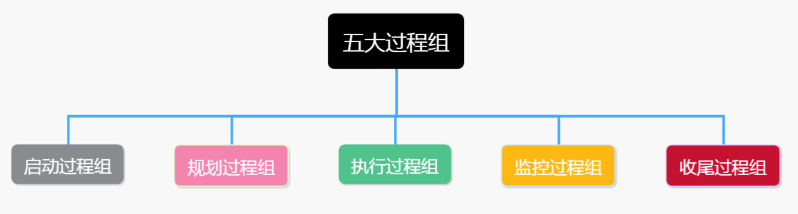
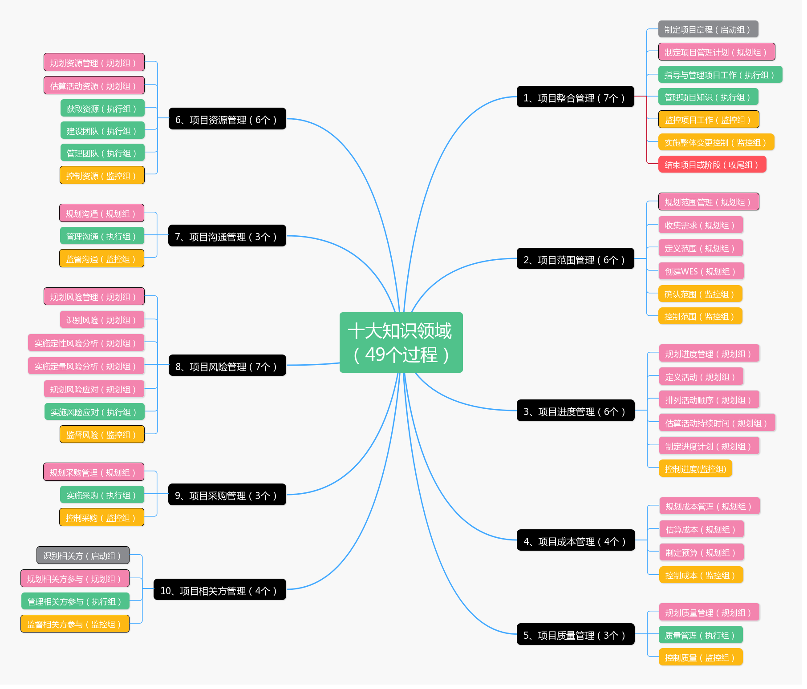

# 工具
##  Axure
### 软件安装
```text
Axure 原型制作工具
1、安装包
测试版本为8.1.0.3377
安装包在我百度盘有备份

2、汉化
汉化包也在百度盘
将汉化包解压，将其中的 lang文件夹, 复制到Axure 安装目录下即可。

3、破解
于20180907测试可用，以后可能会失效。
zdfans.com
gP5uuK2gH+iIVO3YFZwoKyxAdHpXRGNnZWN8Obntqv7++FF3pAz7dTu8B61ySxli
```

类型 | 保真度| 用途|特点|费用
-|-|-|-
线框图|低|文档、快速交流、<br>表达设计思路和大纲|手绘草图，不能交互|低
原型|中|模拟成品的交互流程|可以交互|高
视觉稿|高|给非专业人看的，视觉感受|静态视觉设计，不能交互|中

```text
类图(Class Diagram)   
对象图(Object Diagram)
包图(Package Diagram)  
组件图(Component Diagram)  
部署图(Deployment Diagram)  
用例图(User Case Diagram)  
顺序图/序列图/时序图(Sequence Diagram)  ---> 交互图
状态机图、状态图(State Machine Diagram)
协作图、通信图(Communlcation Diagram)  
活动图(Activity Diagram)
```


## PERT图
```text
项目评估与评审技术
Project Evaluation and Review Technique
```

可以使用[亿图图示](http://www.edrawsoft.cn/)绘制

[pert图示例](https://baike.baidu.com/item/PERT%E5%9B%BE/5939469?fr=aladdin)


## UML流程图
```text
绘制软件 推荐使用 Visio 、processon
```

### 流程图符号
类型|作用|图形
-|-|-
开始 / 结束|代表“开始”、“结束”| 
过程|一个步骤或操作| 
判断| if  else | 
数据  输入/ 输出  |输入、输出的数据| 
箭头、连接线|工作流方向|
文档|输入、输出的文件| 
多文档||
外部数据| 表示数据来自外部|
数据库|表示从数据库中获取数据信息|
内部存储|指数据提交之后，需要写入数据库|
队列数据|表示数据处理的一种方式|
直接数据||
人工输入|用户通过键盘等手动输入的数据|
人工操作|表示需要用户手动操作调整的内容 <br>比如修改、搜索、删除、提交等| 
手动操作||
卡片|穿孔卡是早期计算机的信息输入设备| 
纸带、条带|参考卡片|
展示内容|在设备上展示信息|
循环限值|是指循环开始或结束的条件| 
子流程||
并行模式|表示同时进行 <br>（在并行模式的框内可以添加其它的部件）| 
预定义流程|| 
人员|| 
注释|| 
批注|| 
页面内引用|相当于一个页面内的跳转| 
跨页引用|相当于一个跨页的连接器| 
预备|进入流程前的准备状态| 
推迟、延期|| 

 

## UML状态图  State Machine Diagram
```text
用于描述一个特定的对象的所有可能状态以及由于各种事件的发生而引起的状态之间的转换。
```

概念 | 意义| 图示
-|-
状态|开始 、其他状态、结束|
转移|两个状态之间的一种关系 <br> 表示对象将在第一个状态中执行一定的动作，<br> 并在某个特定事件发生而某个特定的条件满足时进入第二个状态|

 


 

## UML用例图 User Case Diagram
```text
用例图从用户角度描述系统的静态使用情况
```
 

类型 | 作用 | 图示
-|-
角色、参与者|在系统外部与系统直接交互的人或事物| 
用例|系统外部可见的一个系统功能单元|
系统边界、容器|用来展示系统的一部分功能，这部分功能联系紧密|
关系|有4种：关联、泛化、包含、扩展|

 

关系|意义|图示|备注
-|-
关联|||箭头指向消息接收方
泛化|继承关系  ||箭头指向父类
包含|用来体现一个用例功能的多个子功能||
拓展|是指用例功能的延伸，相当于为基础用例提供一个附加功能||

 

## UML类图
```text
Unified Modeling Language
统一建模语言
```

### 绘制UML类图的软件推荐 Enterprise Architect 或 [processon](https://www.processon.com/)

作用域类型 |符号
-|-
public| +
private| -
protected| #

 

元素类型| 图示
-|-
包|
类|
接口|

 

元素之间的关系 | 定义 | 举例 |  备注
-|-|-|-
泛化（Generalization）|继承||箭头指向父类
实现（Realization）|类实现接口| |箭头指向接口
关联（Association)|拥有关系||箭头指向被拥有者
聚合（Aggregation）|整体与部分的关系。<br>部分可以单独存在。||菱形指向整体
组合(Composition)|整体与部分的关系<br> 部分不能单独存在。||图标有2种<br>菱形指向整体
依赖(Dependency)|A需要B的协助<br>才能完成某项功能||箭头指向被使用者

 

## 甘特图
```text
甘特图最早由Henry L.Gantt在1917年提出。

甘特图是一个二维平面图，
横纬度 显示了每项工作的开始时间和结束时间，横道线的长度表示了该项工作的持续时间。
纵维表示工作内容
```

绘制工具可以使用 [雁阵](http://www.geeseteam.com/)


# 其他
## 五大过程组 、十大知识领域




## 项目管理常用缩写
| 缩写        | 解释                                                                                                                                                                                                                                                |
|-----------|---------------------------------------------------------------------------------------------------------------------------------------------------------------------------------------------------------------------------------------------------|
| AC        | 实际成本 。 Actual Cost : 在一个给定的时间段内，为完成进度活动或工作分解结构组成部分的工作，而实际发生并记录在案的总成本。实际成本有时仅为直接工时或直接成本，有时也为包括间接成本在内的所有成本。实际成本也称“已完工作实际成本（ACWP）”。参见“挣值管理”和“挣值技术”。                                                                                                  |
| ACWP      | 已完成工作实际成本\- Actual Cost of Work Performed : 见“实际成本”。AC                                                                                                                                                                                            |
| BAC       | 完工预算\- Budget At Completion：项目工作、工作分解结构组成部分或进度活动的所有预算之和，即项目的总计划价值。即PV之和                                                                                                                                                                           |
| BCWP      | 已完成工作预算成本\- Budgeted Cost of Work Performed：见“挣值”。EV                                                                                                                                                                                              |
| BCWS      | 计划工作预算成本\- Budgeted Cost of Work Scheduled：见“计划价值”。PV                                                                                                                                                                                             |
| CCB       | 变更控制委员会\-Change Control Board：由干系人正式组成的团体，负责审议、评价、批准、推迟或否决项目变更，所有决定和建议均应记录在案。                                                                                                                                                                     |
| COQ       | 质量成本\-Cost Of Quality：确定为保证质量而付出的成本的一种方法。预防和评估成本（一致性成本）包括为确保符合要求而进行质量规划、质量控制和质量保证的成本（即培训、质量控制体系等）。缺陷成本（非一致性成本）包括对不合格产品、部件或过程的返工成本，保修工作和废品的成本，以及名誉的损失。                                                                                             |
| CPF       | 成本加费用\-Cost Plus Fee:                                                                                                                                                                                                                             |
| CPFF      | 成本加固定费用\- Cost Plus Fixed Fee \[Contract\]：成本补偿合同的一种类型，买方为卖方报销可列支成本（可列支成本由合同确定），再加上一笔固定数额的利润（费用）。                                                                                                                                                 |
| CPAF      | 成本加奖励费用\- Cost Plus Award Fee \[Contract\]：为卖方报销履行合同工作所发生的一切合法成本，但是只有在满足了合同中规定的某些笼统、主观的绩效标准的情况下，才能向卖方支付大部分费用。完全由买方根据自己对卖方绩效的主观判断来决定奖励费用，并且卖方通常无权申诉。                                                                                               |
| CPIF      | 成本加激励费用\- Cost Plus Incentive Fee \[Contract\]：成本补偿合同的一种类型，买方为卖方报销可列支成本（可列支成本由合同确定），并且卖方在达到规定绩效标准时赚取利润。                                                                                                                                           |
| CPI       | 成本绩效指数\-Cost Performance Index：项目成本效率的一种指标，是挣值（EV）与实际成本（AC）之比。CPI=EV／AC。                                                                                                                                                                          |
| CPM       | 关键路径法\-Critical Path Methodology：一种进度网络分析技术，用来确定项目进度网络中各条逻辑路径的灵活性大小（浮动时间大小），进而确定整个项目的最短工期。从规定的开始日期开始，利用顺推计算法计算最早开始和完成日期。从规定的完成日期（可能是顺推计算所得到的项目最早完成日期）开始，利用逆推计算法计算最晚开始和完成日期。                                                                       |
| CV        | 成本偏差\-Cost Variance：项目成本绩效的一种指标，是挣值（EV）与实际成本（AC）之差。CV=EV−AC。                                                                                                                                                                                      |
| DU or DUR | Duration \(DU or DUR\) 持续时间：完成某进度活动或工作分解结构组成部分所需的工作时段总数（不包括节假日或其他非工作时段）。通常用工作日或工作周表示。有时被错误地等同于“自然流逝时间”。与“人力投入”比较。                                                                                                                                 |
| EAC       | 完工估算\[输出／输入\] \-Estimate at Completion \[Output/Input\] ：为完成某进度活动、工作分解结构组成部分或整个项目所需的预期总成本。EAC 既可以根据迄今为止的实际绩效进行计算，也可以由项目团队根据其他因素做出估算，后者也常称“最新修订估算”。参见“挣值技术”和“完工尚需估算”。                                                                              |
| ETC       | 完工尚需估算\[输出／输入\] \-Estimate to Completion\[Output/Input \]：为完成某进度活动、工作分解结构组成部分或整个项目的所有剩余工作而预计需要的成本。参见“挣值技术”和“完工估算”。                                                                                                                                |
| EV        | 挣值\-Earned Value Management ：进度活动或工作分解结构组成部分的已完成工作的价                                                                                                                                                                                              |
|           | 值，用分配给该工作的预算数来表示。也称“已完工作预算成本（BCWP）”。                                                                                                                                                                                                              |
| ES        | 最早开始时间\-Earliest Start Date：在关键路径法中，基于进度网络逻辑、数据日期和所有进度制约因素，某进度活动（或项目）的未完部分可能开始的最早时点。最早开始日期可随项目的进展和项目管理计划的变更而改变。                                                                                                                                   |
| EF        | 最早结束时间\-Earliest Finish Date：在关键路径法中，基于进度网络逻辑、数据日期和所有进度制约因素，某进度活动（或项目）的未完部分可能完成的最早时点。最早完成日期可随项目的进展和项目管理计划的变更而改变。                                                                                                                                  |
| EMV       | 预期货币价值分析\- Expected Monetary Value Analysis：当某些情况在未来可能发生、也可能不发生时，计算平均结果的一种统计技术。这种技术经常在决策树分析中使用。                                                                                                                                                   |
| FF        | 完成到完成\- Finish to Finish：只有当紧前活动完成，紧后活动才能完成的逻辑关系。参见“逻辑关系”。                                                                                                                                                                                        |
| FFP       | 固定总价\[合同\]\- Firm Fixed Price \[Contract\]：不考虑卖方实际成本，由买方向卖方支付事先确定的金额（由合同规定）的一种总价合同。                                                                                                                                                               |
| FPIF      | 总价加激励费用\- Fixed Price Incentive Fee                                                                                                                                                                                                               |
| FP\-EPA   | 总价加经济价格调整\- Fixed Price with Economic Price Adjustment                                                                                                                                                                                            |
| FMEA      | 失效模式与影响分析\[技术\]：\-Failure Mode and Effect Analysis \[Technique\]：一种分析程序用来分析产品的每个部件的每种可能失效模式及其对该部件的可靠性的影响，并确定每种失效模式本身或与其他失效模式联合将对产品或系统的可靠性的影响，或对该部件的必备功能的影响；或者，用来检查产品（在整个系统和／或较低层次上）的所有可能失效模式。对于每一种可能的失效，都要估计对整个系统的影响。此外，还应该审查为降低失效的概率和影响而计划采取的行动。 |
| FS        | 完成到开始\- Finish to Start：紧后活动的开始依赖于紧前活动的完成的逻辑关系。参见“逻辑关系”。                                                                                                                                                                                          |
| IFB       | 投标邀请书\- Invitation For Bid：通常本术语等同于建议邀请书。但在某些应用领域，其含义可能更狭窄或更具体。                                                                                                                                                                                   |
| LS        | 最晚开始日期\-Late Start Date：在关键路径法中，基于进度网络逻辑、项目完成日期和任何施加于进度活动的制约因素，在不违反进度制约因素或延误项目完成日期的条件下，允许某进度活动最晚开始的时点。最晚开始日期在项目进度网络的逆推计算中确定。                                                                                                                      |
| LF        | 最晚完成日期\- Late Finish Date：在关键路径法中，基于进度网络逻辑、项目完成日期和任何施加于进度活动的制约因素，在不违反进度制约因素或延误项目完成日期的条件下，允许某进度活动最晚完成的时点。最晚完成日期在项目进度网络的逆推计算中确定。                                                                                                                    |
| LOE       | 人力投入量\- Level of Effort                                                                                                                                                                                                                           |
| OBS       | 组织分解结构\[工具\]\- Organizational Breakdown Structure \[Tool\]：对项目组织的一种层级描述，以便把工作包与相应的执行部门联系起来。                                                                                                                                                       |
| PDM       | 紧前关系绘图法\-Precedence Diagramming Method: 一种用方框（或节点）表示计划活动的进度网络图绘制技术。进度活动在图形中按一种或多种逻辑关系连接起来，以显示活动的实施顺序。                                                                                                                                             |
| PMBOK     | 项目管理知识体系\-Project Management Body of Knowledge：说明项目管理专业范围内的知识总和的概括性术语。与法律、医学、会计等其他专业一样，该知识体系掌握在应用和推进它的实践者和学者手中。完整的项目管理知识体系既包括已被验证并广泛应用的传统做法，也包括本专业新近涌现的创新做法。该知识体系包括已发表和未发表的材料。该知识体系正处于不断演进中。PMI的PMBOK® 指南识别了作为项目管理知识体系一部分的、被普遍公认的良好做法。            |
| PMIS      | 项目管理信息系统\-Project Management Information System：由收集、整合和传播项目管理过程成果的工具和技术所组成的信息系统。它为项目从启动到收尾的所有方面提供支持，可以包括人工和自动系统。                                                                                                                                  |
| PV        | 计划价值\-Planned Value：为某进度活动或工作分解结构组成部分的预定工作进度而分配且经批准的预算。也称“计划工作预算成本”。                                                                                                                                                                              |
| QA        | 质量保证\-Quality Assurance: 审计质量要求和质量控制测量结果，确保采用合理的质量标准和操作性定义的过程                                                                                                                                                                                     |
| QC        | 质量控制\-Quality Control: 监测并记录执行质量活动的结果，从而评估绩效并建议必要变更的过程。                                                                                                                                                                                           |
| RACI      | 执行、负责、咨询、知情\-Responsible、Accountable、Consult、Inform                                                                                                                                                                                               |
| RAM       | 责任分配矩阵\- Responsibility Assignment Matrix：一种将项目组织分解结构与工作分解结构联系起来的结构，有助于确保项目工作范围的每个组成部分都被分配给了某个人或某个团队。                                                                                                                                             |
| RBS       | 风险分解结构\- Risk Breakdown Structure：按风险类别和子类别来排列已识别的项目风险的一种层级结构图，用来显示潜在风险的所属领域和产生原因。风险分解结构通常依具体项目类型定制。                                                                                                                                              |
| RFI       | 信息邀请书\-Request For Information：采购文件的一种，买方借此邀请潜在卖方就某种产品、服务或卖方能力提供相关信息。                                                                                                                                                                             |
| RFP       | 建议邀请书\- Request For Proposal：采购文件的一种，用来向潜在卖方征求对产品或服务的建议书。在某些应用领域，其含义可能更狭窄或更具体。                                                                                                                                                                    |
| RFQ       | 报价邀请书\- Request For Quotation：采购文件的一种，用来向潜在卖方征求对普通或标准产品或服务的报价。有时可用来代替建议邀请书。在某些应用领域，其含义可能更狭窄或更具体。                                                                                                                                                  |
| SF        | 开始到完成\- Start to Finish：紧后进度活动的完成取决于紧前进度活动的启                                                                                                                                                                                                      |
|           | 动的逻辑关系。参见“逻辑关系”。                                                                                                                                                                                                                                  |
| SS        | 开始到开始\- Start to Start：紧后进度活动的启动取决于紧前进度活动的启动的逻辑关系。参见“逻辑关系”。                                                                                                                                                                                       |
| SV        | 进度偏差\-Schedule Variance：项目进度绩效的一种指标，是挣值（EV）与计划价值（PV）之差。SV=EV\-PV。                                                                                                                                                                                 |
| SPI       | 进度绩效指数\-Schedule Performance Index：项目进度效率的一种指标，是挣值（EV）与计划价值（PV）之比。SPI=EV/PV。                                                                                                                                                                      |
| SOW       | 工作说明书\-Statement of Work：对需提供的产品、服务或成果的叙述性说明。                                                                                                                                                                                                     |
| SWOT      | 优势、劣势、机会、威胁\-Strength、Weaknesses、Opportunities、Threats：这种信息收集技术从项目的每一个优势、劣势、机会和威胁的出发，对项目进行考察，以便更全面地考虑风险。                                                                                                                                          |
| T&M       | 工料合同\-Time & Material Contract：兼具成本补偿和总价合同特征的一种混合合同安排。与成本补偿合同相似，工料合同没有封顶价，因为签订合同时并没有确定合同总价。工料合同的合同价可以像成本补偿合同那样增长。另外，工料合同又与总价合同相似。例如，当买卖双方就某类高级工程师的单价达成一致意见时，该单价就被事先确定了。                                                                           |
| TQM       | 全面质量管理\-Total Quality Management                                                                                                                                                                                                                  |
| WBS       | 工作分解机构\-Work Breakdown Structure：以可交付成果为导向的工作层级分解。其分解的对象是项目团队为实现项目目标、提交所需可交付成果而实施的工作。工作分解结构组织并定义了项目的全部范围。                                                                                                                                         |
| PERT      | （Program/Project Evaluation and Review Technique）即计划评审技术                                                                                                                                                                                          |
| ITTO      | 是一种输入输出工具法，类似于思维导图。用于项目管理中各种工作内容的计划的过程梳理，能够帮助人们在工作中理清工作思路，做好项目中的优先级排序。                                                                                                                                                                            |
| NPV       |                                                                                                                                                                                                                                                   |
| ROI       |                                                                                                                                                                                                                                                   |
| IRR       |                                                                                                                                                                                                                                                   |
| EVM       | 挣值计算                                                                                                                                                                                                                                              |
| AT        | 实际时间                                                                                                                                                                                                                                              |
| PMB       | 绩效测量基准                                                                                                                                                                                                                                            |
| VAC       | 完工偏差                                                                                                                                                                                                                                              |
| TCPI      | 完工尚需绩效指数                                                                                                                                                                                                                                          |


##  141个工具和技术
| 序号  | 名称           | 定义                                                                                                                                                                              |
|-----|--------------|---------------------------------------------------------------------------------------------------------------------------------------------------------------------------------|
| 1   | 专家判断         | 对某方面擅长的人就是专家，找专家协助就是专家判断，专家可能是顾问、干系人、团队成员                                                                                                                                       |
| 2   | 引导技术         | 用来协调干系人之间的矛盾，以及项目其他要素之间的矛盾。头脑风暴，冲突处理，问题解决和会议管理等，都是引导者可以用来帮助团队和个人完成项目活动的关键技术                                                                                                     |
| 3   | 项目管理信息系统     | 作为事业环境因素的一部分，项目管理信息系统提供下列工具：进度计划工具，工作授权系统，配置管理系统，信息收集与发布系统，或进入其他在线自动化系统的网络界面。也可用于自动收集和报告关键绩效指标KPI                                                                               |
| 4   | 会议           | 通过会议来讨论和解决项目的相关问题。参会者可包括项目经理，项目团队成员，以及与所讨论问题相关或会受该问题影响的干系人。按照会议目的分为三类：交换信息，头脑风暴或方案评估，制定决策。注意不要把各种会议类型混合在一起。                                                                     |
| 5   | 变更控制工具       | 为了便于开展配置和变更管理，可用一些手工或自动化的工具。工具的选择应基于项目干系人的需要，并考虑组织和环境情况或制约因素。可使用工具来管理变更请求和后续决策，还要关注沟通，以帮助CCB成员履行职责，以及向相关干系人传达决定。例如，变更管理软件，版本控制软件都是软件开发项目常用的变更控制工具                               |
| 6   | 变更控制会        | CCB开的会，重要干系人组成负责评审、批准变更请求，但不是所有变更都要由CCB来批准。是另一个工具“会议”的一种形式                                                                                                                      |
| 7   | 分析技术         | 用来研究变量之间的复杂关系的各种技术的总称。可用的项目分析技术包括：回归分析，分组方法，因果分析，根本原因分析，预测方法，FMEA，FTA，储备分析，趋势分析，挣值管理，差异分析                                                                                       |
| 8   | 配置管理系统       | 整个项目管理系统的一个子系统。它由一系列正式的书面程序组成，用于对以下工作提供技术和管理方面的指导与监督：识别并记录产品、成果、服务或部件的功能特征和物理特征；控制对上述特征的任何变更；记录并报告每一项变更及其实施情况；支持对产品、成果或部件的审查，以确保其符合要求。该系统包括文件和跟踪系统，并明确了为核准和控制变更所需的批准层次，包括变更控制系统 |
| 9   | 工作授权系统       | 整个项目管理系统的一个子系统。它是一系列正式书面程序的集合，规定如何授权（委托）项目工作，以保证该工作由正确的组织、在正确的时间、以正确的顺序执行。工作授权系统包括发布工作授权所需的步骤、文件、跟踪系统以及审批层次                                                                     |
| 10  | 访谈           | 与干系人直接交流，通常是一对一                                                                                                                                                                 |
| 11  | 焦点小组会议       | 有主持人，分主题、分小组讨论                                                                                                                                                                  |
| 12  | 引导式讨论会       | 跨职能人员讨论：IT行业JAD（联合应用开发）；制造业QFD（质量功能部署,倾听客户的声音）                                                                                                                                  |
| 13  | 头脑风暴法        | 面对面，快，容易受别人影响；属于群体创新技术                                                                                                                                                          |
| 14  | 名义小组法        | 头脑风暴后，对创意进行排序；属于群体创新技术                                                                                                                                                          |
| 15  | 德尔斐法         | 背靠背，匿名，客观，慢；属于群体创新技术                                                                                                                                                            |
| 16  | 思维导图         | 圆圈、创意、线连起来；属于群体创新技术                                                                                                                                                             |
| 17  | 亲和图          | 大量创意，然后找关系，同类的放在一起；属于群体创新技术                                                                                                                                                     |
| 18  | 多标准决策分析      | 做决策时需要考虑多重相互矛盾的标准，可以建立矩阵表格，基于多重标准作出决策；属于群体创新技术                                                                                                                                  |
| 19  | 群体决策技术       | 为达成某种期望结果而对多个未来行动方案进行评估                                                                                                                                                         |
| 20  | 问卷调查         | 通过设计书面问题，向为数众多的受访者快速收集信息                                                                                                                                                        |
| 21  | 观察           | 直接观察个人在各自的环境中如何开展工作和实施流程                                                                                                                                                        |
| 22  | 原型法          | 先造出该产品的实用模型                                                                                                                                                                     |
| 23  | 系统交互图        | 把某个系统置于大背景中，用图形直观地展示该系统与其他系统之间的接口关系。例如，该系统从哪里获得输入，又会向哪里输出什么，该系统与周围环境是什么关系等等                                                                                                     |
| 24  | 文件分析         | 从各种文件中识别并收集干系人的需求。可供分析的文件包括：商业计划，营销文献，协议，建议邀请书，现行流程，逻辑数据模型，业务规则库，应用软件文档，业务流程或接口文档，其他需求文档，问题日志，政策程序和法规文件                                                                         |
| 25  | 产品分析         | 产品分解、系统分析、需求分析、系统工程、价值工程和价值分析                                                                                                                                                   |
| 26  | 备选方案识别       | 头脑风暴、横向思维和配对比较，条条大路通罗马                                                                                                                                                          |
| 27  | 分解           | 把项目可交付成果划分为更小的、更便于管理的组成部分                                                                                                                                                       |
| 28  | 检查           | 开展测量、审查与核实等活动，来判断工作和可交付成果是否符合要求及产品验收标准                                                                                                                                          |
| 29  | 滚动式规划        | 近期详细、远期粗略，计划反复进行                                                                                                                                                                |
| 30  | 模板           | 过去的经验总结                                                                                                                                                                         |
| 31  | PDM紧前关系图     | 节点法AON，方框代表活动，箭线代表逻辑关系，ADM，CDM                                                                                                                                                  |
| 32  | 确定依赖关系       | 硬逻辑（客观，无法改变）、软逻辑（考验项目经理创造力，最佳实践）、外部逻辑（依赖其他项目的活动，隐含着风险，可以包含硬逻辑或软逻辑）                                                                                                              |
| 33  | 提前&滞后        | 提前或推迟（如水泥抹平晾干）某个活动的开始日期，不改变本来的逻辑关系                                                                                                                                              |
| 34  | 网络模板         | 标准化网络，某部分可以称为子网络，适合项目中存在重复性的成果时                                                                                                                                                 |
| 35  | 出版的估算数据      | 外部公司发布的生产率和资源单价                                                                                                                                                                 |
| 36  | 自下而上估算       | 对活动估算，然后汇总到工作包，再汇总到项目总资源，比较准，比较慢                                                                                                                                                |
| 37  | 项目管理软件       | 不等于项目管理信息系统                                                                                                                                                                     |
| 38  | 类比估算         | 以过去项目信息做基础来估算未来项目信息（历时、资源、成本）                                                                                                                                                   |
| 39  | 参数估算         | 利用历史数据与其它变量的关系，生产率、成果数量，铺电缆200ft/小时                                                                                                                                             |
| 40  | 三点估算以及标准差    | 用最悲观、最乐观、最可能三个来估算                                                                                                                                                               |
| 41  | 储备分析         | 考虑应急储备（如缓冲时间或储备金）和/或管理储备                                                                                                                                                        |
| 42  | 进度网络分析       | 包括CPM、关键链、资源平衡、假设情景分析等                                                                                                                                                          |
| 43  | 关键路径法        | 不考虑资源限制的情况下，找出完成项目的最短时间                                                                                                                                                         |
| 44  | 关键链：帕金森定律    | 关键路径\-时差概念\+时间缓冲\+资源缓冲，越早越好                                                                                                                                                     |
| 45  | 资源平衡         | 确保资源使用量稳定均衡，往往会造成关键路径的变化                                                                                                                                                        |
| 46  | 资源平滑         | 对进度模型中的活动进行调整，从而使项目资源需求不超过预定的资源限制的一种技术，相对于资源平衡，资源平滑不会改变关键路径，完工日期也不会延迟                                                                                                           |
| 47  | 资源优化技术       | 包括了资源平衡和资源平滑，通常先做资源平滑，再做资源平衡                                                                                                                                                    |
| 48  | 假设情景分析       | 考虑各种可能的情形，预测对项目目标的影响，属于建模技术                                                                                                                                                     |
| 49  | 模拟           | 基于多种不同的活动假设（通常使用三点估算的概率分布）计算出多种可能的项目工期，以应对不确定性，最常用的模拟技术为蒙特卡洛分析；属于建模技术                                                                                                           |
| 50  | 建模技术         | 包括假设情景分析和模拟                                                                                                                                                                     |
| 51  | 进度压缩         | 不改变范围情况下，缩短项目历时：赶工（那资源换时间，但逻辑关系不变）与快速跟进（调整逻辑关系，会增大风险）                                                                                                                           |
| 52  | 进度计划编制工具     | 和项目管理软件一起使用，应该也是自动化的工具                                                                                                                                                          |
| 53  | 绩效审查         | 测量与对比分析进度绩效，可使用各种技术包括趋势分析，关键路径法，关键链法，挣值管理，偏差分析                                                                                                                                  |
| 54  | 质量成本（COQ）    | 一致、非一致成本（失败或缺陷成本）；一致中又分预防（培训）和评估（过程控制）                                                                                                                                          |
| 55  | 卖方投标分析       | 让卖方先报价，预估项目大概花费成本                                                                                                                                                               |
| 56  | 成本汇总         | 以WBS中工作包为单位汇总，得出总成本                                                                                                                                                             |
| 57  | 历史关系         | 感觉就是参数估算或类比估算的基础                                                                                                                                                                |
| 58  | 资金限制平衡       | 平衡资金支出，不要有很大起伏，财务部很喜欢                                                                                                                                                           |
| 59  | 挣值管理（EVM）    | PV、EV、AC、CV、SV、CPI、SPI、EAC、ETC、TCPI，属于偏差分析的一种                                                                                                                                   |
| 60  | 绩效审查         | 包括偏差分析（看节点）、趋势分析（一个区间段）、挣值绩效分析                                                                                                                                                  |
| 61  | 成本效益分析       | 对质量活动进行分析评估是否合适                                                                                                                                                                 |
| 62  | 控制图          | 看过程是否稳定，7点规则、失控                                                                                                                                                                 |
| 63  | 标杆对照（基准对照）   | 将项目与其它项目对比找差距、制定改进措施                                                                                                                                                            |
| 64  | 实验设计（DOE）    | 统计学方法，分析每个因素对开发的流程和产品的特定变量的影响                                                                                                                                                   |
| 65  | 统计抽样         | 从目标总体中选样本进行检查，在规划确定次数规模，在控制实施                                                                                                                                                   |
| 66  | 流程图          | 显示某个过程中各步骤之间的关系                                                                                                                                                                 |
| 67  | 其它质量规划工具     | 头脑风暴、力场分析、名义小组、质量管理和控制工具                                                                                                                                                        |
| 68  | 质量管理和控制工具    | 亲和图，过程决策程序图（PDPC），关联图，树形图，优先矩阵，活动网络图，矩阵图                                                                                                                                        |
| 69  | 质量审计         | 独立的结构化审查，由内外部审计师进行                                                                                                                                                              |
| 70  | 过程改进（过程分析）   | 识别所需要改进的过程，包括根本原因分析                                                                                                                                                             |
| 71  | 因果图          | 石川图、鱼骨图                                                                                                                                                                         |
| 72  | 直方图          | 显示特定情况的发生次数                                                                                                                                                                     |
| 73  | 帕累托图         | 特殊的直方图，按每个情况发生次数排序，28原理，如银行存款28法则                                                                                                                                               |
| 74  | 核查表（计数表）     | 用于收集数据的查对清单，合理排列各种事项，以便有效地收集关于潜在质量问题的有用数据                                                                                                                                       |
| 75  | 散点图          | 显示两个变量（因变量、自变量）的关系                                                                                                                                                              |
| 76  | 组织机构图（OBS）   | 按组织部门排列下面列出工作包                                                                                                                                                                  |
| 77  | 责任分配矩阵图（RAM） | 显示工作包（活动）和成员（资源）之间的关系，RACI                                                                                                                                                      |
| 78  | 人际交往         | 正式、非正式的行业、职业环境下的人际互动，有助于认识人才                                                                                                                                                    |
| 79  | 组织理论         | 个人、团队、组织的行为方式                                                                                                                                                                   |
| 80  | 多标准决策分析      | 在组建团队过程中，经常需要使用团队成员选择标准。通过多标准决策分析，制定出选择标准，并据此对候选团队成员进行定级或打分。根据各种因素对团队的不同重要性赋予不同的权重。包括可用性，成本，经验，能力，知识，技能，态度，国际因素等等                                                               |
| 81  | 预分派          | 事先选定的，三种情况：竞标过程承诺、取决于特定技能、项目章程承诺                                                                                                                                                |
| 82  | 谈判           | 就某个事情双方达成共识的过程                                                                                                                                                                  |
| 83  | 招募           | 从外部招聘人员                                                                                                                                                                         |
| 84  | 虚拟团队         | 为共同目标而努力可几乎大家不见面，凝聚力低，沟通麻烦                                                                                                                                                      |
| 85  | 人际关系技能       | 软技能：领导力，团队建设，激励，沟通，影响力，决策，政治和文化意识，谈判，建立信任，冲突管理，教练技术                                                                                                                             |
| 86  | 培训           | 能够提高团队成员能力的活动                                                                                                                                                                   |
| 87  | 团队建设活动       | 有专门和非专门之分，非正式沟通非常重要，需要持续进行                                                                                                                                                      |
| 88  | 基础规则         | 对成员可接受行为进行明确规定                                                                                                                                                                  |
| 89  | 集中办公         | “紧密矩阵”，把许多或全部最活跃的项目团队成员安排在同一个物理地点（作战室）工作，以增强团队工作能力。                                                                                                                             |
| 90  | 认可与奖励        | 对优秀成员的行为给予认可和奖励，要根据对方需求进行奖励                                                                                                                                                     |
| 91  | 人事测评工具       | 能帮助项目经理和项目团队洞察成员的优劣势，了解成员的偏好和愿望，如何与人交际等。如态度调查，细节评估，结构化面谈，能力测试及焦点小组讨论等                                                                                                           |
| 92  | 观察与交谈        | 了解团队的工作表现和态度动态                                                                                                                                                                  |
| 93  | 项目绩效评估       | 对成员表现进行评估                                                                                                                                                                       |
| 94  | 冲突管理         | 解决项目冲突，合作/解决问题（综合考虑不同意见引导各方达成共识）、强制/命令（问题解决了，人际关系破坏了，通常在紧急情况下）、撤退/回避、缓和/包容（求同存异），妥协/调解（各让一步）                                                                                    |
| 95  | 问题日志         | 书面的记录下来项目出现的问题                                                                                                                                                                  |
| 96  | 干系人分析        | 系统收集和分析各种信息了解干系人的利益、影响、期望                                                                                                                                                       |
| 97  | 沟通需求分析       | 确定项目干系人的信息需求                                                                                                                                                                    |
| 98  | 沟通技术         | 要不要使用自动化工具，网络系统、视频会议等等                                                                                                                                                          |
| 99  | 沟通模型         | 显示发送者和接受者                                                                                                                                                                       |
| 100 | 沟通方法         | 推式（发email\)、拉式\(在线课堂、网站）、交互式（开会）                                                                                                                                                |
| 101 | 信息管理系统       | 用来管理和分发项目信息的工具，包括电子的、纸的、项目管理电子工具（门户网站）                                                                                                                                          |
| 102 | 报告绩效         | 收集和发布绩效信息，包括状况报告，进展测量结果及预测结果，可以是简单的状态报告，也可以是详尽的报告                                                                                                                               |
| 103 | 管理技能         | 指导与控制一群人协调他们行动实现目标                                                                                                                                                              |
| 104 | 规划会议和分析      | 项目干系人、项目经理、团队成员、组织内负责风险的人一起开会                                                                                                                                                   |
| 105 | 文档审查         | 对项目文档（合同、计划、项目档案等）进行评估审查                                                                                                                                                        |
| 106 | 信息收集技术       | 头脑风暴、德尔斐、访谈、根本原因分析                                                                                                                                                              |
| 107 | 核对表分析        | 根据编制的风险识别清单来进行风险识别，优点快，缺点不够全面                                                                                                                                                   |
| 108 | 假设分析         | 检验之前的假设是否还成立，如果不成立就是风险                                                                                                                                                          |
| 109 | 图解技术         | 因果图、流程图、影响图                                                                                                                                                                     |
| 110 | SWOT分析       | 从内部优势、劣势；外部机会和威胁不同角度进行分析                                                                                                                                                        |
| 111 | 概率与影响评估      | 分析风险发生可能性和后果                                                                                                                                                                    |
| 112 | 概率影响矩阵       | 用来对比把某个风险放入，深灰色代表严重；中度灰色代表较轻                                                                                                                                                    |
| 113 | 风险数据质量评估     | 对风险识别分析所依据的数据进行评估开是否可信                                                                                                                                                          |
| 114 | 风险分类         | 根据WBS、根据阶段、根据干系人、根据RBS（类别）对风险分类                                                                                                                                                 |
| 115 | 风险紧迫性评估      | 评估哪些风险现在需要应对，哪些需要过一段时间应对                                                                                                                                                        |
| 116 | 数据收集与表现      | 包括访谈、概率分布（贝塔分布、三角分布）                                                                                                                                                            |
| 117 | 敏感性分析        | 确定哪些风险对项目具有最大影响，用龙卷风图来表现                                                                                                                                                        |
| 118 | 预期货币价值（EMV）  | 把各种可能的后果和概率相乘，常和决策树一起使用                                                                                                                                                         |
| 119 | 消极风险和威胁应对    | 回避、转移、减轻、主动或被动接受                                                                                                                                                                |
| 120 | 积极风险和机会应对    | 开拓、提高、分享、接受                                                                                                                                                                     |
| 121 | 应急应对策略       | 制定应急计划，当风险发生时再执行                                                                                                                                                                |
| 122 | 风险再评估        | 对现有评估、识别新风险、删除过去的风险，团队成员作的，内部人做的                                                                                                                                                |
| 123 | 风险审计         | 评估风险管理过程的有效性，通常外部人来做                                                                                                                                                            |
| 124 | 技术绩效衡量       | 对技术成果和项目计划进行比较                                                                                                                                                                  |
| 125 | 状态审查会        | 定义开会，顺便看风险状况                                                                                                                                                                    |
| 126 | 自制外购分析       | 确定某个工作是团队自己完成还是外部采购                                                                                                                                                             |
| 127 | 市场调研         | 包括考察行业情况和供应商能力                                                                                                                                                                  |
| 128 | 合同类型         | 固定价（范围明确时使用，买方风险小，卖方风险大，可以加激励、加经济调整考虑利率）、成本补偿类（买方参与最多，卖方风险小，有加成、有激励、有奖励\-主观的·虚的）、时间材料合同（二者混合，谈判速度快）                                                                             |
| 129 | 投标人会议        | 买方向所有潜在卖方召开，要公平，让每个卖方对项目有清楚认识                                                                                                                                                   |
| 130 | 建议书评价技术      | 就是评标的方法                                                                                                                                                                         |
| 131 | 独立估算         | 买方或找第三方编写，用作标杆来和投标人的报价进行对比                                                                                                                                                      |
| 132 | 广告           | 在报纸或网站宣传招标活动                                                                                                                                                                    |
| 133 | 采购谈判         | 作为买方和卖方谈判，谈判技巧很重要，黑脸白脸，最终期限，有限授权，继承事实                                                                                                                                           |
| 134 | 合同变更控制系统     | 文书工作、跟踪系统、争议解决程序、审批层次                                                                                                                                                           |
| 135 | 采购绩效审查       | 根据合同对卖方审查业绩，结构化审查                                                                                                                                                               |
| 136 | 检查和审计        | 买方开展的，卖方需要支持                                                                                                                                                                    |
| 137 | 绩效报告         | 用来向高层汇报说明卖方合同执行情况                                                                                                                                                               |
| 138 | 支付系统         | 说明如何给卖方付款，需要先确定卖方工作完成了                                                                                                                                                          |
| 139 | 索赔管理         | 就是针对争议性的变更如何进行管理，先按合同谈判，然后考虑仲裁，最后上法院                                                                                                                                            |
| 140 | 记录管理系统       | 属于项目管理信息系统的一部分用来记录合同执行过程的文档                                                                                                                                                     |
| 141 | 采购审计         | 对项目采购过程进行审查，找出经验和教训                                                                                                                                                             |

## PMP相关文档
https://hnyer.gitee.io/2020/06/08/pmp-xiang-guan-wen-dang/

## 技术选型的 考虑纬度
```text
//需求的满足度
是否满足当前的业务需求

// 成熟度、使用人数、社区活跃度、替换成本
更新速度稳定、社区气氛活跃的框架优先考虑。

// 学习成本
学习使用、引入当前技术框架带来的学习和改造成本。

// 开发速度、代码可维护性、可阅读性 、易调试性
当前技术是否会降低开发速度，和维护难度。

// 执行效率 、性能
是否对产品的性能有影响。

//安全性 
数据安全性，是否容易被攻击；
开源协议约束，是否对自己的商业产品有版权威胁。 
```

##  Scrum 
```text
在敏捷开发中，经常会看到Scrum一词。
作为敏捷开发的术语，Scrum 没有太贴切的中文翻译，
正确地读作[skrʌm]（中文读者常常发出错误读音为[skrum]）。
Scrum是一种敏捷软件开发的方法学。

Sutherland 读到了两位日本管理教授介绍制造业里出现的新的产品开发方法 Rugby 的文章。
他受到启发结合自己多年的经验，与 John Scumniotales 和 Jeff McKenna 一起开发了一套方法，取名为 Scrum 。
 
Scrum 是众多轻量级敏捷框架中应用最广泛的一种。
它用于开发、交付和持续支持复杂产品，是一个增量的、迭代的开发过程。

在标准的Scrum流程定义中，
有两个关键的产物： Product Backlog   、 Sprint Backlog  
以及四个关键的会议： 计划会议、每日立会、评审会议 、 回顾会议。
 
Epic ：史诗，表示比较大的特性，开发周期一般是1-3月，用于产品路线图的规划。
Feature ：特性，表示相对小一些的特性，开发周期一般是1-3周，用于产品版本的规划
User Story：用户故事，表示最小的用户场景，开发周期一般是1-3天，用于迭代规划。
```

|          | Product Backlog                                           | Sprint Backlog             |
|----------|-----------------------------------------------------------|----------------------------|
| 作用     | 一个具有优先级的需求列表， 并对每个需求进行了粗略的估算。 | 任务列表 , WBS             |
| 估算单位 | Story Points                                              | 小时                       |
| 文档归属 | Product Owner                                             | 开发团队                   |
| 更新频率 | 一次/周                                                   | 一次/工作日                |
| 持续长度 | 整个项目周期                                              | 一个Sprint                 |
| 文档名   | Product Backlog workbook                                  | Iteration Backlog workbook |


## Scrum 每日站会
```text
Daily Scrum / Daily Stand-up 执行频率为每24小时一次，
每次15分钟，每次都在同一时间、同一地点。
团队在每日站会上，进行上次每次站会以来的工作检视，并且计划接下来24小时的工作。
团队根据 每日 Scrum 站会的机会可以检视当前Sprint的目标进度，
并可以查看整个 Sprint Backlog的工作进度趋势，
让团队能够了解自身的进度情况，从而更好的进行协同工作来达成 Sprint 目标。

我们的发言可以遵循以下3条简易模板：
1、昨天，我做了什么？
2、今天，我要做什么？
3、我遇到了什么问题？
如果一个成员好多天都没有交付，那么也就意味着可能他所负责的 Story 太大，或者是不合理的。

------>
1、我昨天做的事情，对我们的项目产生了什么样的影响？ 今天谁可以来消费我昨天的工作成果？
2、我今天打算做的事情，可能会使用谁的知识或者信息？
3、我遇到的问题会不会是我们项目中潜在的一个风险 ？
```