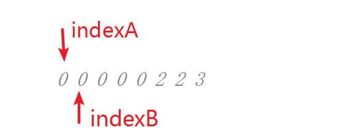

# 让三个线程按照顺序依次打印 1-100 ，
几个线程轮流打印。 
如何让n个线程循环交替打印

## 思路1 synchronized + wait + notifyAll
```text
思路就是通过锁机制 
private static final Object lockObj = new Object();
private static volatile int printInt = 1;
public static void main(String[] args)  {
    Thread threadFirst = new Thread(new Runnable() {
        @Override
        public void run() {
            synchronized (lockObj) {
                while (printInt <= 100) {
                    if (printInt % 3 == 1) {
                        System.out.println("\r\n线程名字=" + Thread.currentThread().getName() + ";i==" + printInt );
                        printInt++ ;
                    }
                    lockObj.notifyAll();
                    if (printInt == 101) {
                        break;
                    }

                    try {
                        lockObj.wait();
                    } catch (InterruptedException e) {
                        e.printStackTrace();
                    }

                }
            }
        }
    });

    Thread threadSecond = new Thread(new Runnable() {
        @Override
        public void run() {
            synchronized (lockObj) {
                while (printInt <= 100) {
                    if (printInt % 3 == 2) {
                        System.out.println("线程名字=" + Thread.currentThread().getName() + ";i==" + printInt );
                        printInt++ ;
                    }
                    lockObj.notifyAll();
                    try {
                        lockObj.wait();
                    } catch (InterruptedException e) {
                        e.printStackTrace();
                    }
                }
            }
        }
    });

    Thread threadThird = new Thread(new Runnable() {
        @Override
        public void run() {
            synchronized (lockObj) {
                while (printInt <= 100) {
                    if (printInt % 3 == 0) {
                        System.out.println("线程名字=" + Thread.currentThread().getName() + ";i==" + printInt );
                        printInt++ ;
                    }
                    lockObj.notifyAll();
                    try {
                        lockObj.wait();
                    } catch (InterruptedException e) {
                        e.printStackTrace();
                    }
                }
            }
        }
    });
    threadFirst.start();
    threadSecond.start();
    threadThird.start();
}
```


## 思路2 休眠+ 条件判断
```text
public class PrintRunnable implements Runnable{
     private static  int printValut =1;
     /**
      * 下一个将要打印的线程序号,
      * 用来确保线程 是按照 0 ，1 ，2 顺序来执行的
      */
     private static volatile int nextPrintSeq =0;
    private static Lock lock=new ReentrantLock();

    /**
     * 当前线程序号
     */
    private int seq;
    /**
     * 线程总数
     */
    private int nThread;

    PrintRunnable(int seq, int nThread) {
        this.seq = seq;
        this.nThread=nThread;
    }

    @Override
    public void run() {
        final int MAXVALUE =100 ;
        while(printValut <=MAXVALUE){

            while (nextPrintSeq !=seq){
                LockSupport.parkNanos(1);// 休眠等待
            }

            lock.lock();
            if(nextPrintSeq !=seq){
                // 重新循环，继续等待
                lock.unlock();
                continue;
            }

            int value= printValut;
            for(int i=0; i<5 & value<= MAXVALUE; i++,value++){
                // 通过修改 5，可以实现 线程打印效果 123，456，789，等
                System.out.println("threadSeq: "+seq+", value: "+value);
                printValut++ ;
            }

            nextPrintSeq =(seq+1)%nThread;
            lock.unlock();
        }
    }
}

public static void main(String[] args) {
    int nThread=3;
    for(int i=0;i<nThread;i++){
        Thread thread=new Thread(new PrintRunnable(i, nThread));
        thread.start();
    }
}
```


# 删除数组中的重复元素 
数组去重
```text
给定 nums = [0,0,1,1,1,2,2,3,3,4],
函数应该返回新的长度 5, 并且原数组 nums 的前五个元素被修改为 0, 1, 2, 3, 4。
你不需要考虑数组中超出新长度后面的元素。

思路：定义两个指针，将数组看做两个部分，将前面部分与后面部分进行比较，
如果发现不同，就将后面的不同项拷贝到前面。
根据示意图和打印过程，很容易理解

public static void main(String[] args) {
    int[] values = {0, 0, 0, 0, 0, 2, 2 ,3};
    int size = removeDuplicates1(values);
    System.out.print("\r\n有效数字长度="+size +"  -->");
    for(int value : values){
        System.out.print( "  "+value);
    }
}

private static int removeDuplicates1(int[] nums) {
    if(nums.length == 0) {
        return 0;
    }
    int indexA = 0;
    for(int indexB = 1; indexB < nums.length; indexB++){
        showArray(nums);
        System.out.print("本轮索引-->"+indexA+"  "+indexB  );
        if(nums[indexA] != nums[indexB]){
            System.out.print("值不同-->"+nums[indexA]+"  "+nums[indexB] +"  需要修改");
            indexA++;
            nums[indexA] = nums[indexB];
        }else{
            System.out.print("值相同-->"+nums[indexA]+"  "+nums[indexB]  +"  忽略本轮");
        }
        showArray(nums);
    }
    //循环结束之后，indexA是索引，数组的长度要+1
    return indexA + 1;
}

private static void showArray(int[] values ){
    System.out.println();
    for(int value : values){
        System.out.print(value+" ");
    }
    System.out.println();
}

0 0 0 0 0 2 2 3 
本轮索引-->0  1值相同-->0  0  忽略本轮
0 0 0 0 0 2 2 3 

0 0 0 0 0 2 2 3 
本轮索引-->0  2值相同-->0  0  忽略本轮
0 0 0 0 0 2 2 3 

0 0 0 0 0 2 2 3 
本轮索引-->0  3值相同-->0  0  忽略本轮
0 0 0 0 0 2 2 3 

0 0 0 0 0 2 2 3 
本轮索引-->0  4值相同-->0  0  忽略本轮
0 0 0 0 0 2 2 3 

0 0 0 0 0 2 2 3 
本轮索引-->0  5值不同-->0  2  需要修改
0 2 0 0 0 2 2 3 

0 2 0 0 0 2 2 3 
本轮索引-->1  6值相同-->2  2  忽略本轮
0 2 0 0 0 2 2 3 

0 2 0 0 0 2 2 3 
本轮索引-->1  7值不同-->2  3  需要修改
0 2 3 0 0 2 2 3 

有效数字长度=3  -->  0  2  3  0  0  2  2  3
```




# 反转数组
```text
例如原数组为：{"a","b","c","d"},那么翻转后的数组为  {"d","c","b","a"}。

void reverseArray(int[] array){
    for (int i = 0, max = array.length - 1; i < max; i++, max--) {
        int temp = array[i];
        array[i] = array[max];
        array[max] = temp;
    }
}
```


# 生产者消息者模型
```text
生产者和消费者问题是线程模型中的经典问题：
生产者和消费者在同一时间段内共用同一个存储空间，
生产者往存储空间中添加产品，消费者从存储空间中取走产品，
当存储空间为空时，消费者阻塞，当存储空间满时，生产者阻塞。
```


## 方式1 synchronized + object.wait() + object.notifyAll() - 原理
```text
public static void main(String[] args) {
    // 所有的生产者+消费者线程都争抢这一把锁
    Object lock =new Object();
    // 存放产品的缓冲区
    List<Integer> linkedList = new ArrayList<>();

    for (int i = 0; i < 5; i++) {
        new Thread(new Productor(linkedList, 20 ,lock) ,"生产者_"+i).start();
    }

    for (int i = 0; i < 10; i++) {
        new Thread(new Consumer(linkedList,  lock) ,"消费者_"+i).start();
    }
}
    
public class Productor implements Runnable {
    private List<Integer> list;
    private int maxLength;
    private final Object lock ;
    private static boolean isRunning = true ;

    Productor(List<Integer> list, int maxLength , Object lock) {
        this.list = list;
        this.maxLength = maxLength;
        this.lock = lock;
    }

    @Override
    public void run() {
        while (isRunning) {
            synchronized (lock) {
                try {
                    while (list.size() >= maxLength) {
                        System.out.println(Thread.currentThread().getName() + "  队列已满，进行wait。"+list.size());
                        lock.wait();
                        System.out.println(Thread.currentThread().getName() + "  退出wait");
                    }

                    int i = getRadomInt(0 ,100);
                    System.out.println( Thread.currentThread().getName() + " 生产了数据:  " + i);
                    list.add(i);
                    lock.notifyAll();
                    Thread.sleep(500);
                } catch (InterruptedException e) {
                    e.printStackTrace();
                }
            }
        }
    }

    private int getRadomInt(int startNum, int endNum){
        return new  Random().nextInt(endNum - startNum + 1) + startNum;
    }
}

public class Consumer implements Runnable {
    private final Object lock ;
    private static boolean isRunning = true ;
    private List<Integer> list;
    Consumer(List<Integer> list ,Object lock) {
        this.list = list;
        this.lock = lock;
    }

    @Override
    public void run() {
        while (isRunning) {
            synchronized (lock) {
                try {
                    while (list.isEmpty()) {
                        System.out.println(Thread.currentThread().getName() + "  数据不足，进行wait");
                        lock.wait();
                        System.out.println(Thread.currentThread().getName() + "  数据充足,退出wait");
                    }
                    Integer element = list.remove(0);
                    System.out.println(Thread.currentThread().getName() + "  消费了数据：" + element+"  数据剩余个数="+list.size());
                    lock.notifyAll();
                    Thread.sleep(500);
                } catch (InterruptedException e) {
                    e.printStackTrace();
                }
            }
        }
    }
}
```


## 方式2 封装工具 BlockingQueue -生产环境
```text
BlockingQueue 内部提供了线程安全的队列访问方式，
使我们不需要手动去操作 wait 和 notifyAll 等细节。

BlockingQueue<Integer> queue = new LinkedBlockingQueue<>();
while (true) {
    Random random = new Random();
    int i = random.nextInt();
    System.out.println("生产者" + Thread.currentThread().getName() + "生产数据" + i);
    queue.put(i); //
    Thread.sleep(1000);
}

while (true) {
    Integer element = (Integer) queue.take();
    System.out.println("消费者" + Thread.currentThread().getName() + "正在消费数据" + element);
    Thread.sleep(1000);
}
```


# 斐波那契数列、青蛙跳台阶 
##  斐波那契数列
```text
斐波那契数列指的是这样一个数列：1、1、2、3、5、8、13、21 ...
F(1)=1，F(2)=1, F(n)=F(n-1)+F(n-2)（n>=3，n∈N*）
从第3项开始，每一项都等于前两项之和。
```

##  简单青蛙跳台阶
```text
一只青蛙一次可以跳上1级台阶，也可以跳上2级。
求该青蛙跳上一个n级的台阶总共有多少种跳法。 
可以发现这个相当于变相的斐波那契数列。

思路：假如有5级台阶，青蛙要么直接从4级上跳一格上来，要么从3级上跳两格上来，没有别的方式了，
因此青蛙只要关心跳到4级的总方法数和跳到三级的总方法数。

// 递归方式(效率不如非递归)
private static long jumpFloor(int n) {
    if (n < 0){
        throw new IllegalArgumentException("n can't be < 0");
    }

    if(n <= 2){
        return n;
    }

    else {
        return jumpFloor(n-1)+jumpFloor(n-2);
    }
}

// 非递归方式
private static long numWays(int n) {
    if (n < 0){
        throw new IllegalArgumentException("n can't be < 0");
    }

    if(n <= 2){
        return n;
    }

    int pre_2 = 1, pre_1 = 2;
    for (int i = 3; i <= n; i++) {
        int curent = pre_2 + pre_1;
        pre_2 = pre_1;
        pre_1 = curent;
    }
    return pre_1;
}
```

## 变态青蛙跳台阶
```text
一只青蛙一次可以跳1阶，2阶…n阶。
求该青蛙跳上一个n 级的台阶总共有多少种跳法

数学分析过程：
将 n 级台阶的跳法记为 f(n)。
n = 1 时，  跳法只有 1 种，记为 f(1)；
n = 2 时，  可以先跳 1 级，然后有 f(1) 种跳法；
            或者直接跳 2 级，这是 1 种跳法；
            共计 f(2) = f(1)+1；
n = 3 时，  可以先跳 1 级，
            然后有 f(3-1) 种跳法，即 f(2) 种；
            或者先跳 2 级，然后有 f(3-2) 种跳法，即 f(1) 种；
            或者直接跳 3 级，这是 1 种跳法；；
            共计 f(3) = f(2) + f(1) + 1 种；

n 级台阶，共有
f(n) = f(n-1) + f(n-2) + … + f(1) + 1 种；

n-1 级台阶，共有
f(n-1) = f(n-2) + … + f(1) + 1 种；

两个等式相减，得到：
f(n) - f(n-1) = f(n-1)

即 f(n) = 2*f(n-1)
 
// 递归方式(效率不如非递归)
public static int jumpFloorBT(int n) {
    if (n<= 0){
        return 0;
    }

    if (n == 1){
        return 1;
    }

    else{
        return  2*jumpFloorBT(n-1);      
    }
}

// 简化版 (非递归方式)
根据上述分析的结果 f(n) = 2*f(n-1) ，
可以看出这是一个公比为2的等比数列。 且符合 f(n)=2^(n-1) ，
所以可以直接使用Math的公式 
prvate int jumpFloorBT2(int n) {
    return (int)Math.pow(2,(n-1));
}
```