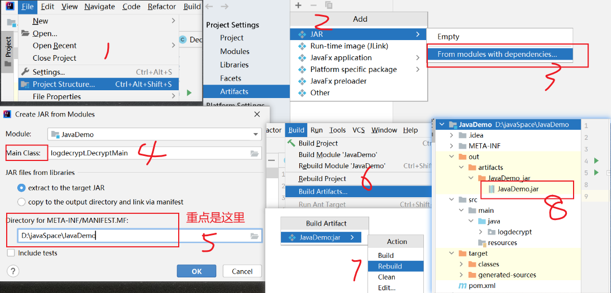
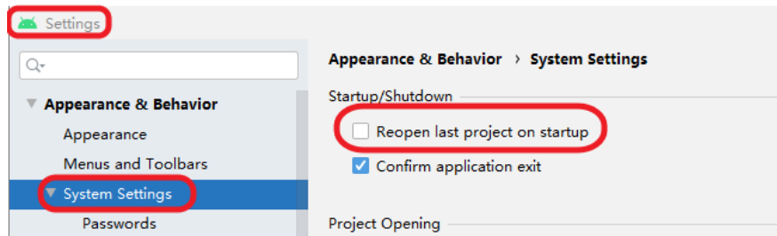
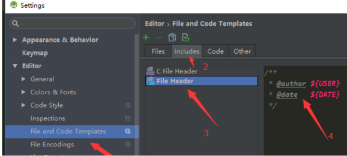
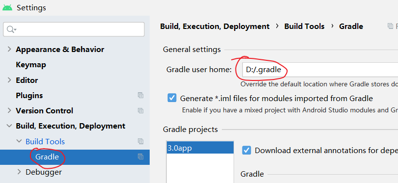
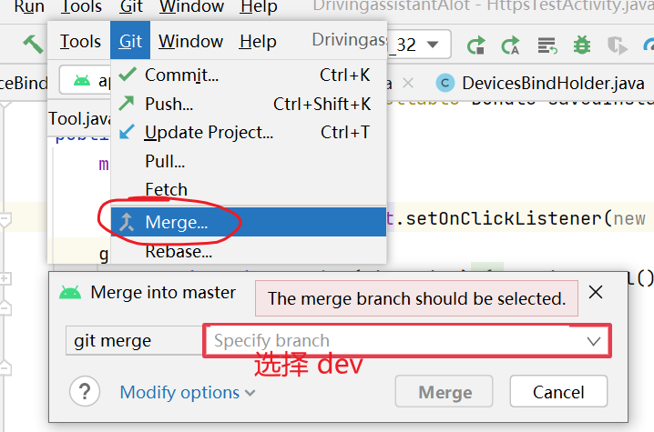
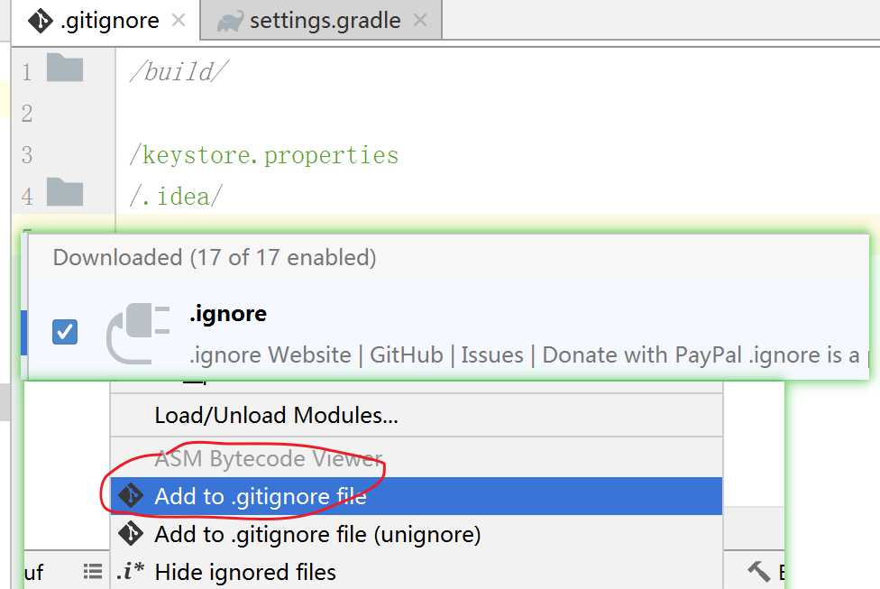
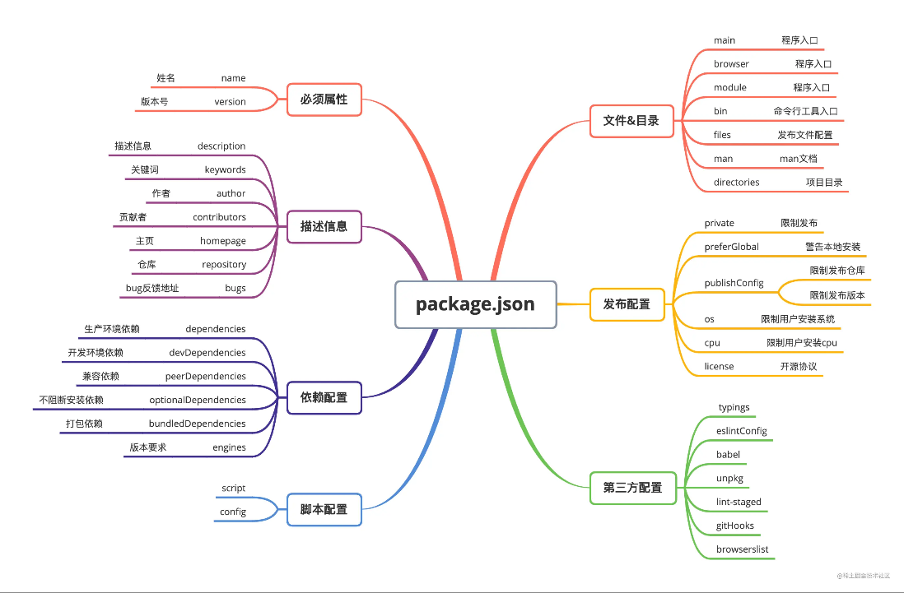
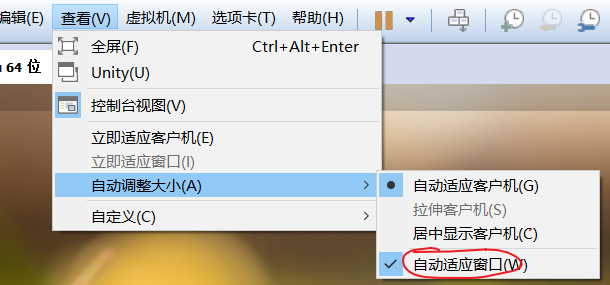

#  IntelliJ IDEA
```text
IntelliJ IDEA 下载地址为
https://www.jetbrains.com/idea/download/#section=windows

IntelliJ IDEA 商业版 License 免费申请。
申请地址为 https://www.jetbrains.com/shop/eform/opensource?product=ALL
一般是一周左右就可以通过。
申请条件是自己的开源项目， github 和gitee上的都可以。
我用的就是托管在 gitee上的开源项目。

许可证的有效周期为一年 
They are valid for one year. 
You will receive an automatic email reminder shortly before the license expiration date.

根据收到的邮件进入授权页面，点击 Assign 授权给你指定的账号。
然后打开 IntelliJ IDEA 就行使用即可。
```


## 打包 jar

```text
java -jar  JavaDemo.jar  // 测试运行jar包
可能遇到的错误：Error：Invalid or corrupt jarfile xxx.jar
原因：重点在 Directory for META-INT/MANIFEST.MF ，IDEA 工具帮我们默认选择的是错误的！
请检查步骤5 。需选项目名称，我们应该将其放置在项目的根路径。

exe4j ,  jar 转为 exe。
https://www.cnblogs.com/wren/p/16710691.html
官网下载一个。注册码：A-XVK258563F-1p4lv7mg7sav
名字和公司随便填一个即可。

 // jar 转为 exe 后，程序执行完后，就退出了。为了防止自动退出。可以使用以下方法。
System.out.println("按回车键，退出程序");
int readResult=System.in.read();
System.out.println("退出成功。readResult="+readResult);
```


# Androidstudio 
安装或更新后插件后都需要重启 Androidstudio 。
[Androidstudio下载](https://developer.android.com/studio/index.html)

## Androidstudio 自动代码补全配置
```text
通过输入快捷键，自动补全模板代码，
例如 输入 "todo" , 就可以自动生成 "// TODO: 2021/2/4  " 

ctrl + J  快速查看 Live Templates
打开 "设置 -> Editor -> Live Templates"，
可以看到默认已经有很多"Live Templates" ，可以进行修改。

导入原有的模板：
将文件替换即可 （C:\Users\kaifa4k\.AndroidStudio2.2 是你自己的安装路径）
C:\Users\kaifa4k\.AndroidStudio2.2\config\templates
```

## CodeGlance
代码快速定位 插件


## [Android-Resource-Usage-Count](https://plugins.jetbrains.com/plugin/9885-android-resource-usage-count)
显示 Android 资源使用的次数。


## [翻译插件ECTranslation](https://github.com/Skykai521/ECTranslation)
原理是调用了有道词典的API 。可以自定义 快捷方式，我目前设置的是 alt + m
```text
快捷键设置
Preferences -> Keymap -> 搜索Translate - > 右键 add Keyboard Shortcut. 输入你想要的快捷键。
```
 


## Android Parcelable code generator
自动生成 Parcelable接口相关的代码。
```text
public class FtpThumDownListInfo implements Parcelable{
    /**当前这个指针 指向的文件需要下载*/
    private int gotoDownFileIndex = 0;
    /**需要下载的文件列表- 这个列表会分批次增加 */
    private List<FTPFile> ftpNeddLoadList =null  ;
    /**下载好的文件的byte[]*/
    private List<FTPFile> ftpDowndBytesList =null  ;

    //以下代码是 用插件自动生成的  start
    protected FtpThumDownListInfo(Parcel in){
        this.gotoDownFileIndex = in.readInt();
        this.ftpNeddLoadList = new ArrayList<FTPFile>();
        in.readList(this.ftpNeddLoadList, FTPFile.class.getClassLoader());
        this.ftpDowndBytesList = new ArrayList<FTPFile>();
        in.readList(this.ftpDowndBytesList, FTPFile.class.getClassLoader());
    }

    /**
     * 内容接口描述，默认返回0就可以了
     */
    @Override
    public int describeContents(){
        return 0;
    }

  
    @Override
    public void writeToParcel(Parcel dest, int flags){
        dest.writeInt(this.gotoDownFileIndex);
        dest.writeList(this.ftpNeddLoadList);
        dest.writeList(this.ftpDowndBytesList);
    }

    /**
       实例化静态内部对象
     * 接口对象名必须为CREATOR.
     * 必须按成员变量声明的顺序读取数据
     */
    public static final Parcelable.Creator<FtpThumDownListInfo> CREATOR = new Parcelable.Creator<FtpThumDownListInfo>()  {
        @Override
        public FtpThumDownListInfo createFromParcel(Parcel source)  {
            return new FtpThumDownListInfo(source);
        }

        @Override
        public FtpThumDownListInfo[] newArray(int size)  {
            return new FtpThumDownListInfo[size];
        }
    };

    // 以下代码是 用插件自动生成的 end
}


//赋值
Bundle mBundle = new Bundle();
mBundle.putParcelable("picBean",picBean);  
intentToMatch.putExtras(mBundle);
//获取：
RecommendPicBean picBean = (RecommendPicBean)getIntent().getParcelableExtra("picBean");
```


## 无线调试 ADB WIFI
```text
华为M2 ，无Root
1、 确保电脑和手机在同一个局域网
2、插上USB线 连上adb
3、adb tcpip 5555 ( 5555为端口号，可自由指定）
4、adb connect 192.168.x.x:5555

// 如果是想同时连接多个设备
> adb devices   // 找到设备号

adb -s 设备号 指令  // 使用 -s 参数指定设备号
```

##  布局查看器
```text
可以用 Androidstudio 自带工具查看 DecorView的布局。
Tools -> Layout Inspector
```

## 生成文档 JavaDoc
```text
找到工具栏上的 Tools，选择 Generate JavaDoc
如果出现编码错误提示，则在 Other command line arguments 中添加 -encoding utf-8 -charset utf-8
```

## 单行注释
```text
androidstudio 单行注释默认是从第一列开始的。
如果需要改成从代码列开始，可以配置：
Settings → Editor → Code Style → JAVA. Select "Code Generation" tab 
然后把 "Line comment at first column"去掉即可，注意要找到"Code Generation" tab页才行 。
```

## 多行注释快捷键
```text
Ctrl+Shift+/   

// idea将单行注释替换为多行注释
匹配正则
// +(.*$)   ---------->       /**\n   * $1\n   */
```
 
## 代码折叠
```text
可以把相关的代码放在一组 region 中，
这样这组代码就可以收起和展开。

// region 布局测试
...... 这是代码...
// endregion 布局测试
``` 

##  Android studio 不打开默认项目



## 配置作者模板
```text
/** 
 * @author Aivin
 * created on ${DATE}
 * des: 
 */
```




## BookMark 书签
```text
做项目难免来回查看某个文件的某个方法，某些文件可能访问率很高，
为了加快开发效率楼主推荐使用 favorites  文件 , bookmark 代码行 ,

favorites 的添加就再文件单击右键 add to favorites 即可。
添加书签 // 单击 f11 (笔记本需要 fn ) 
查看书签 //  shift+f11 (笔记本需要 fn ) 

比较遗憾的是，目前(20211122) Androidstudio还不支持导出或同步书签，以便分享到其他同事。
```

## androidstudio 快速删除无用的 import
```text
Code --> Optimize Imports
```


##  回退到旧版的logcat
```text
Android Studio 回退到旧版的logcat
Settings-> Experimental -> [x] Enable new Logcat tool window 取消选择 -> 重启 Android Studio
新版的logcat可能用不习惯，可以回退到旧版本的logcat。
不过新版的Androidstudio渐渐强制开发者使用新版的了，以上方法只能在一些过度版本上有效。
```

## 代码行数统计
```text
使用插件 statistic
```


## 修改 .android /  .gradle 的默认位置
```text
C:\Users\你的名字 
下默认会有  .android 和 .gradle 文件夹， 会占用大量的C盘空间。
.android  是Android SDK生成的 AVD(Android Virtual Device Manager)，即模拟器存放路径 。
你如果不用模拟器，删掉这个文件夹即可。
1、修改 .android 默认路径会稍微麻烦一点。
我不适用模拟器，懒得做笔记了，需要的去百度一下即可。

2、修改 .gradle 的默认路径比较简单 ，在 Androidstudio 中指定路径就可以了。
.gradle 是Androidstudio 默认缓存 gradle 的路径。
```



 
## logcat 
```text
int[] mqttInfoInt ={ 1 ,1 ,1 ,1 ,1 ,};
for (int s : mqttInfoInt) {
    Log.i("TAG", "mqtt信息=" + s);
}
为什么只打印一次 I/TAG: mqtt信息=1 ?
原因：是因为相邻的几行打印内容完全相同，从Android O开始Log的chatty机制，会把中间的重复内容不再打印。
而是打印类似如上的 ”identical 391 lines“ ，告知有多少行的日志是一样的，
这不是错误，只是减少了重复打印的次数。
``` 

##  xml 预览界面行号栏
```text
Androidstudio xml 预览界面 行号栏太宽以及显示一些图标问题解决。
把show gutter icons 去掉即可。
```


##  开启 Gradle 卡片中的 task 任务项
```text
有时候Androidstudio 的Gradle卡片中，看不到 task 任务项，
可以先检查下setting下的 “Do not build Gradle task list during Gradle sync” 是否是选中的，如果选中状态，就要去掉。
```


## 获取签名的 MD5 和 SHA1 
```text
利用Androidstudio获取签名的 MD5 和 SHA1 的值
点击项目右侧的Gradle-->app--->Tasks-->android-->signingReport,双击signingReport，执行完毕后，可以在Run控制台找到MD5 好SHA1信息。

补充：keytool -v -list -keystore E:\kr_android\NongJi\nongji.jks
上述命令在不同的java版本下获取的信息不一致，可能会获取不到MD5的值。 
```


# git操作
## 配置全局信息
```text
git config --global user.name "aivin666@qq.com"
git config --global user.email "aivin666@qq.com"
git config --list //查看当前用户信息
```

## 拉取指定分支
```text
git clone  -b 分支名称  https://xxxx.git 
```


## 拉取指定历史版本
```text
1、找到历史版本，获取对应的版本编号
2、git checkout xxxxx
```


## git 文件状态
```text
Git中文件大概分为三种状态：已修改（modified）、已暂存（staged）、已提交（committed）

修改：Git可以感知到工作目录中哪些文件被修改了，然后把修改的文件加入到 modified 区域

暂存：通过 add 命令将工作目录中修改的文件提交到暂存区，等候被 commit

提交：将暂存区文件commit至Git目录中永久保存
```


## git合并
```text
分支合并
Androidstudio上，如何操作将 dev 分支 合并到  testUI2 分支：
1、将当前分支切换到 testUI2,(意思是准备将其他分支合并到 testUI2)
2、按下图进行 merge 操作。
3、执行 merge 后，此时dev的内容会被合并到本地的 testUI2 上，然后用 push 将 testUI2 的本地内容推送到服务器。
```



## git 的 HEAD 概念
```text
HEAD 是Git中非常重要的一个概念，你可以称它为指针或引用，
HEAD 可以指向任意一个节点，并且指向的节点始终为当前工作目录 ，也就是你所看到的代码 就是HEAD指向的 节点 。
```


## [添加个人私钥到网站](http://git.mydoc.io/?t=154712)
这种情况下无需配置密码 - window10下测试
```text
1、生成对应的文件
ssh-keygen -t rsa -C 'aivin666@qq.com'
2、将 id_rsa.pub 里面的内容填写到网站上。
3、测试是否成功 。
ssh -T git@gitee.com
```

##  配置密码方式  Ubuntu下测试
https模式，每次提交都需要输入密码。
```text
1、在一个新目录 初始化
git init

2、将远程代码拉倒本地
git pull https://gitee.com/hnyer/java_android.git

3、关联远程端仓库
master 是远程端的一个支路。
git remote add master https://gitee.com/hnyer/java_android.git
// git remote rm master , 删除关联

4、 将本地指定的版本推送到远程端指定的版本
的一个maser是远程的 ，第二个是本地的
git push -u master master

5、以后不用每次都用参数 u ,直接 git push 即可
```

## Ubuntu下 SSH 配置 码云
```text
1、进入 /home/用户名/.ssh 目录下 生成公钥
ssh-keygen -t rsa -C "your_email@example.com"

2、将 id_rsa.pub 文件中的内容填入码云网站中 。
3、即可正常拉取 、提交 
```
 
## git 有时会把本地代码覆盖掉
```text
一般我们 git 更新不会覆盖掉我们本地的代码 ,但是有时 androidstudio 出bug ， git pull 后，
会把本地代码删掉。此时可以通过 Androidstudio 的 localHistory 找回代码。
```


## gitignore 文件
```text
1、如果不清楚添加规则，可以借用插件 .gitignore 进行鼠标添加

2、有时会遇到修改了忽略文件后，规则并没有生效的现象。
原因是.gitignore只能忽略那些原来没有被追踪的文件，如果某些文件已经被纳入了版本管理中，
则修改.gitignore是无效的。那么解决方法就是先把本地缓存删除（改变成未被追踪状态），然后再提交。
git rm -r --cached ./  (注意那个小数点) 
``` 


 

## idea 中 git pull 和 update project 的区别
```text
git pull 是 git fetch + git merge FETCH_HEAD 的缩写。
git pull 就是先 fetch ，然后执行 merge 操作，如果加 —rebase 参数，就是使用 git rebase 代替 git merge。

Idea 的 update project 就是你可以选择到底是 merge 还是 rebase 的 git pull。 
是 idea 封装的一个工具。
```


## git fetch 和 git pull 的区别
```text
git fetch ：相当于是从远程获取最新版本到本地，但不会自动 merge
git pull ：相当于是从远程获取最新版本并 merge 到本地 。
git fetch 更安全一些，因为在 merge 前，我们可以查看更新情况，然后再决定是否合并。
```


## git push 命令
```text
git push 用于将本地的分支版本上传到远程并合并。
git push <远程主机名> <本地分支名>:<远程分支名>    //完整命令
git push <远程主机名> <本地分支名>        // 如果本地分支名与远程分支名相同，则可以简写
```


## Merge branch ‘master’ of XXXXX 
```text
经常可以在 git 版本控制工具的时候，可以在提交记录中看到 Merge branch ‘master’ of XXXXX  这一条记录，
这使我们的提交记录看起来很凌乱。

我们合并的时候选择 rebase 模式 而不是 merge 模式既可。
```


##  git rebase 和 git merge 的区别
```text
git rebase 和 git merge , 他们两种合并所产生的log是不一样。
rebase 模式相对简洁很多 ，merge 会如实第记录所有提交，看起来会显得繁杂。
两者模式各有优势，可能不同的公司有不同的选择。
```

##  git强制推送
```text
应用场景:回退到一个历史版本后，在此基础上进行修改，然后覆盖远程的代码。
如果不用强制推送，会要求你先merge，但是一进行merge，代码就不是刚刚回退到的那个历史版本了。
```


# gitbook
## windows 安装gitbook
```text
安装gitbook过程中请优先连接VPN，如果没有请考虑更换淘宝源等方式。

npm uninstall -g gitbook  // 卸载 gitbook
npm uninstall -g gitbook-cli
npm cache clean --force   //清除npm缓存
npm install gitbook -g  // 安装gitbook
npm install -g gitbook-cli
gitbook -V  // 查看版本
gitbook ls  // 列出本地所有的gitbook版本

//注意
安装新版本的 nodejs后，再去安装gitbook 会出现很多问题，比较折腾。没有必要去安装最新版本的 node
所以为了省事，可以直接安装 node-v10.15.0-x64.msi 即可 。https://nodejs.org/dist/
gitbook 的安装流程就是两句命令
npm install -g gitbook-cli  // 先安装 cli
gitbook -V  // 输入查看版本的命令后，如果没有安装，就会去自动安装，耐心等待即可。
```

##  在国内为了加速访问速度，一般会更换成淘宝的下载源
```text
// 设置 淘宝镜像源
npm config set registry https://registry.npm.taobao.org
npm config get registry  // 查看 使用的 镜像源
npm install -g cnpm --registry=https://registry.npm.taobao.org
```

## gitbook常用的使用命令
```text
gitbook install // 安装依赖包
gitbook init //新建定义好的文件
gitbook serve // 本地服务器测试
gitbook build // 编译成html格式
```


## 安装错误
```text
如果遇到 “ Error: ENOENT: no such file or directory ... ” 这个错误 ，
把.gitbook\versions\3.2.2\lib\output\website\copyPluginAssets.js
修改成   confirm：false 

如果遇到  fs\polyfills.js:287 if (cb) cb.apply(this, arguments) ...
根据报错信息，找到 polyfills.js ，注释 62-64 行即可 
Node.js：v14.15.4. 
CLI version: 2.3.2
GitBook version: 3.2.3
```
 
## gitbook 热更新 (Windows)
```text
https://github.com/GitbookIO/gitbook-cli/issues/67
暂时没找到优雅的办法。给出粗暴的方案，检测到奔溃后又重启。
将下面的命令做成一个 xx.bat ，通过这个文件启动即可。
@echo off
:start
call gitbook serve
@goto start
```

## gitbook 留言评论
```text
使用 Valine 插件可以实现 (20210204)。
Valine 是一款无后端评论系统。
https://valine.js.org/

Valine 是基于 leancloud 实现的(Valine的评论数据保存在这里)    
需要申请 leancloud 的账号，因为国内监管问题，
如果你不想实名认证和域名备案，请使用国际版 (20210204)。。
https://console.leancloud.app/apps
```

# npm
如果 React Native 工程，打包出来的apk 跟同事的不一样，而且会闪退找不到so，
建议查看 npm 的版本是否一致。 
因为如果 npm版本过高或过低，下载依赖可能会失败。
```text
npm install 时容易发生以下错误;
Cannot read properties of null (reading 'pickAlgorithm')
npm cache clear --force // 清除缓存

npm install //先检查，node_modules 目录之中是否已经存在指定模块。如果存在，就不再重新安装了，即使远程仓库已经有了一个新版本
npm install --force  // 一个模块不管是否安装过，npm 都要强制重新安装
npm -v // 查看npm的版本
npm install -g npm   // 默认安装最新版本的npm
npm install -g npm@6.14.14  // 安装指定版本的npm

npm config get registry     //查看当前npm镜像源
npm config delete registry   // 删除设置的镜像源（恢复成默认的）
```

## package.json 结构
```text
{
    "name":"weilian",  // 项目名字
    "version":"0.0.1", // 项目包的版本号
    "private":true,    // 可以防止我们意外地将私有库发布到 npm 服务器

    "scripts":{ // scripts 是 package.json 中内置的脚本入口，是 key-value 键值对配置，key 为可运行的命令，可以通过 npm run 来执行命令。
        "android":"react-native run-android",
        "ios":"react-native run-ios",
        "start":"node node_modules/react-native/local-cli/cli.js start",
        "test":"jest",
        "postinstall":"patch-package",
        "lint":"eslint ."
    },

    "dependencies":{ // 项目的生产环境中所必须的依赖包。
        "@ptomasroos/react-native-multi-slider":"^2.2.2",
        "@react-native-community/art":"^1.2.0",
        "@react-native-community/masked-view":"^0.1.11",
        "@react-navigation/native":"^5.9.8",
        "@react-navigation/stack":"^5.14.9",
        "react-native-safe-area-context":"^3.3.2",
        "react-native-screens":"software-mansion/react-native-screens#main",
        "lottie-react-native":"^4.1.3",
        "query-string":"^7.0.1",
        "react":"18.2.0",
        "react-native":"0.71.8",
        "dayjs":"^1.11.6",
        "intl":"1.2.5",
        "intl-messageformat":"2.2.0",
        "react-native-fs":"^2.19.0",
        "react-native-gesture-handler":"^1.10.3",
        "react-native-modal":"^12.0.0",
        "react-native-modal-dropdown":"^1.0.2",
        "react-native-progress":"^5.0.0",
        "react-native-svg":"^9.4.0",
        "throttle-debounce":"^5.0.0",
        "react-native-linear-gradient":"^2.5.6",
        "@callstack/react-theme-provider":"^3.0.8",
        "debounce":"^1.2.1"
    },

    "devDependencies":{ // 开发阶段需要的依赖包
        "@babel/core":"^7.12.9",
        "@babel/runtime":"^7.12.5",
        "@react-native-community/eslint-config":"^2.0.0",
        "@typescript-eslint/eslint-plugin":"^5.3.0",
        "@typescript-eslint/parser":"^5.3.0",
        "babel-jest":"^26.6.3",
        "compressing":"^1.5.1",
        "eslint":"^7.32.0",
        "eslint-config-standard":"^16.0.3",
        "eslint-plugin-import":"^2.25.2",
        "eslint-plugin-node":"^11.1.0",
        "eslint-plugin-promise":"^5.1.1",
        "eslint-plugin-react":"^7.26.1",
        "fstream":"^1.0.12",
        "jest":"^26.6.3",
        "metro-react-native-babel-preset":"^0.64.0",
        "patch-package":"^7.0.0",
        "react-test-renderer":"17.0.1",
        "tar":"^6.1.11"
    },

    "jest":{ // Jest 测试框架的依赖项
        "preset":"react-native"
    }
}
```



# 虚拟机
```html
VMware Workstation 12序列号
5A02H-AU243-TZJ49-GTC7K-3C61N

//安装完VmTools重启之后仍不能全屏显示
检查VmTools是否安装成功: 将主机的一个文件拖到虚拟机，如果可以托进去说明已经安装成功，否则没有。
如果还没有全屏显示，就设置成"自动适应窗口"。
```



#  windows 系统
如果用的是正版的win10系统，会经常提示更新，但是如果你不想强制你更新，
可以 使用 [Windows Update Blocker]( https://www.sordum.org/9470/windows-update-blocker-v1-6/)将更新模块禁止掉。

## 电脑浏览器模拟手机浏览器
pc端谷歌浏览器模拟微信浏览器，然后利用音频抓取插件抓取音频。
因为有些网页做了限制“请在微信客户端打开链接” 。
```text
1、电脑端谷歌浏览器安装插件 " user agent switcher "
2、在插件中模拟微信浏览器的 UA ( userAgent )
mozilla/5.0 (linux; android 5.1.1; mi note pro build/lmy47v) applewebkit/537.36 (khtml, like gecko) version/4.0 chrome/37.0.0.0 mobile mqqbrowser/6.2 tbs/036215 safari/537.36 micromessage/6.3.16.49_r03ae324.780 nettype/wifi language/zh_cn
3、然后浏览器安装插件“猫抓”，进行视屏抓取。
```

## win10 双屏显示
```text
按 Windows 徽标键  + P 
然后在弹出的选项中选择 拓展。
```


## win10 iso 镜像
```text
https://windows10.pro/microsoft-com-software-download-windows10-iso/
或者在我阿里云盘里有保存。
win10_21h1_china_ggk_chinese(simplified)_x64.iso
```

 
# ps
## 常用快捷键：
```text
移动工具  V
裁剪工具  C
shift+ctrl+alt+s 保存切片
放大视图 Ctrl+【+】
缩小视图 【Ctrl】+【-】
切图： ctrl + alt + shift + a
```

## 制作圆角矩形图片
[参考资料](http://jingyan.baidu.com/article/1974b289b4a5e8f4b1f774a7.html)
 

## 图片渐变、透明度渐变
[参考资料](http://jingyan.baidu.com/article/bea41d43769fa2b4c51be69f.html)


## PS里怎么样将白色背景去掉，变成透明的背景？
[参考资料](https://zhidao.baidu.com/question/117581064.html)
```text 
要先解压图层锁定
打开图片，单纯白色背景的话则只需使用工具栏中的魔棒工具在白色部位点一下，跟着delete键删除，此时就是透明的背景图片了，但关键的是要选择合适的保存方式。点文件-存储为web和设备所用格式，在弹窗选择附图红框处的PNG格式就可以了。
方法一:用擦除工具组中的魔棒擦除,点选白色
方法二:
1、用选择工具中的魔棒工具选白色(勾选连续的).
2、然后反选,复制
3、再粘贴成新层
4、册掉背景层
5、完
```

 

# [react-native](https://reactnative.cn/)
将 reate-native 的相关笔记删除。体验不如 Flutter ，跨平台请使用 flutter。


#  Hierarchyviewer 
借助[ViewServer](https://github.com/romainguy/ViewServer) 这个工具可以在任何手机上使用 hierarchyviewer。
```text
注：在 android device monitor 可以找到 hierarchyviewer。 
检验手机是否开启了View Server：

adb shell service call window 3
//View Server处于关闭状态
返回：Result: Parcel(00000000 00000000 '........')"
//View Server处于开启状态
返回值：Result: Parcel(00000000 00000001 '........')"  
```


# 抓包工具
```text
对于一般的公司和个人来说，抓包难度越来越大。
暂时没有深入研究。
1、高版本的Android系统，例如7.0以上会抓包更难。
2、APP做了证书合法性检验。例如检测到非法证书无法启动APP。
3、https 传输 并对传输内容进行了加密。抓到后并不是明文。

常用工具有 
小茶壶 charles https://www.charlesproxy.com/download/
HttpCanary  https://github.com/MegatronKing/HttpCanary    
Fiddler
```


# 反编译 
keystore 
```text
// apktool
http://ibotpeaches.github.io/Apktool/install/
解压apk文件，获取其中的图片、布局文件 ，必须用apktool打开。
apktool.bat d -f test.apk  test
直接用解压软件打开的会显示乱码。

// dex2jar 
https://sourceforge.net/projects/dex2jar/files/
直接用解压软件解开,获得dex。
用 dex2jar 将classes.dex转变成jar包。
dex2jar.bat  classes.dex  //在当前文件夹里生成classes_dex2jar.jar 

// jd-gui
http://java-decompiler.github.io/
用 jd-gui打开jar包，查看class 文件。

android APP 反编译工具
https://github.com/skylot/jadx
```
 


# Mac 系统 
```text
复制粘贴  command +c v
xcode 全局查找   command + shift + f
commit+shift+J   快速定位文件   // xcode
shift+ option + 全屏按钮  --》 最大化
command +  🔼箭头  // 返回上一个目录
command + F3            //回到桌面
command + tab          //程序切换  

贴图工具 //  安装 snap 软件
图片浏览软件，用 kantu  看图 。

//   Xcode打包 应用
https://www.yisu.com/zixun/80031.html
首先我们打开要打包的工程文件，comm＋shift＋K清空，再comm＋B编译一下，
1、product -->  scheme  -->  editor scheme 把debaug改成release，点击close。
2、product -->     archive
```

 
   
 