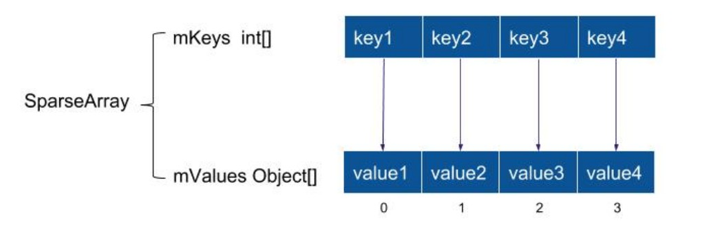

# 常用数据结构
# Hash 、Hash碰撞
```text
// Hash
是一种信息摘要算法，一般用于验证完整性，它还叫做哈希、散列。我们平时使用的MD5,SHA1,SSL中的公私钥验证都属于Hash算法。

// Hash碰撞
好的Hash算法可以出计算几乎出独一无二的HashCode，如果出现了重复的hashCode，就称作碰撞; 
不过就算是MD5这样优秀的算法也会发生碰撞，即两个不同的key也有可能生成相同的MD5。
```

# 哈希表 Hashtable

```text
Hashtable 和 HashMap 的内部数据结构相似。

// HashMap 和 Hashtable 的区别
Hashtable 已经被淘汰了,不用关注太多细节。

知道以下几个区别就好了。
1、HashMap可以允许key为null，value为null，Hashtable 都不允许为null 。
2、HashMap 没有提供同步机制，是线程不安全的，需要自己在外面写同步代码，Hashtable 部分方法上有自己的 synchronize 同步，是线程安全的。
3、父类不一样 ， 各自拥有的方法不完全一样 ， 扩充机制不一样 。
```

#  ConcurrentHashMap
```text
ConcurrentHashMap  使用的分段锁。
访问Hashtable的所有线程都竞争同一把锁，所以效率低下。
而ConcurrentHashMap是容器里有多把锁，每把锁用于锁容器中的一部分数据，
当多线程访问不同数据段时，线程间就不会存在竞争，从而 提高并发访问效率。
```

#  HashMap


```text
Hashtable和HashMap的内部数据结构相似.
HashMap由数组+链表组成的，数组是HashMap的主体，链表则是主要为了解决哈希冲突而存在的。 
HashMap中的链表出现越少，性能才会越好。当链表较长时，又会引入红黑树来解决性能问题。

// HashMap存储的步骤put（K,V）
传入key和value，计算key的hash值，根据hash值搜索在哈希表table中的索引位置，
若当前索引位置不为null，则对该位置的Entry链表进行遍历，
如果链中存在该key，则用传入的value覆盖掉旧的value，同时把旧的value返回。
入股链中不存在该key，就用key-value创建一个新的节点，并把该节点插入到该索引对应的链表的头部
 
// HashMap 如何解决 Hash碰撞问题的
根据不同的key 计算得到 hash值，如果有碰撞，就进入当前hash值索引对应的 链表中， 在同一条链表中 根据 不同的 key 来存储不同的 value值。
 
// HashMap的读取实现get（key，value）
读取的步骤比较简单，调用hash（key）求得key的hash值，然后调用indexFor（hash）求得hash值对应的table的索引位置，然后遍历索引位置的链表，如果存在key，则把key对应的Entry返回，否则返回null
 
// HashMap键的遍历，keySet()
HashMap遍历时，按哈希表的每一个索引的链表从上往下遍历。

// 缺点
1、在移动设备端内存资源很珍贵，HashMap为实现快速查询带来了很大内存浪费。
2、ArrayMap是非线程安全的类 。
```

# android 对 HashMap 的优化
## ArrayMap

```text
ArrayMap是Android api提供的 ，Android里的Bundle内部就是ArrayMap 。

ArrayMap有两个数组 。第一个数组存放存放item的hash值，第二数组是把key，value连续的存放在数组里，
通过先算hash在第一个数组里找到它的hash index，根据这个index在去第二个数组里找到这个key-value。

// ArrayMap 如何解决哈希碰撞问题的。（以下结论是我猜测的）
1、存储
如果产生了相同的哈希值了，如果他的key是相同的，就把key对应的value修改。如果key 不同，就会把当前哈希值也保存在哈希数组中(此时数组中有相同的哈希值)。
2、读取
由于存在hash碰撞的情况，而二分法查找到下标可能是多个连续相同hash值中的任意一个，
所以此时需要用equals比对对命中的Key对象是否相符，不相符时，从当前index先向后再向前遍历所有相同hash。
3、注意比较 与 HashMap解决哈希冲突方法的区别。

// 比 HashMap 更省内存。  
ArrayMap 相对于 HashMap ，无需为每个键值对创建Node对象， 这就是为什么ArrayMap相对HashMap要节省空间。 

// 缺点
1、ArrayMap查找时间复杂度O(logN)；HashMap查找、修改的时间复杂度为O(1)；
2、ArrayMap增加、删除操作需要移动成员，速度相比较慢 。
```

## SparseArray

```text
在 Android 中，IDE会提醒我们应该使用 SparseArray 替换掉 HashMap，其根本原因就在于 SparseArray 相比较 HashMap 会更省内存。

// 更省内存
1、SparseArray 对应的key只能是int类型，它不会对key进行装箱操作。 所以比 HashMap 更省内存。
2、SparseArray 不需要保存key所对应的哈希值，所以比 ArrayMap 更省内存。

// SparseArray 的 延迟回收 机制
当执行delete()或者removeAt()删除数据的操作，只是将相应位置的数据标记为DELETE，并设置mGarbage=true，而不会直接执行数据拷贝移动的操作。
比如删除某个数据后被标记删除，接着又需要在相同位置插入数据，则不需要任何数组元素的来回移动操作。所以SparseArray适合频繁删除和插入来回执行的场景。
```
 
# 栈


## 手写代码实现一个栈。
1、用数组实现
通过移动下标来模拟。

2、使用系统的 LinkedList 来实现。
```text
Deque< Object > queue = new LinkedList<Object>();  
queue.addFirst(e);
queue.removeFirst();
```

3、自己模拟单链表 实现栈 。

sample没有考虑线程安全等细节，只是简洁地展示关键思想
```text
// 栈节点
public class Node{
	public Object data;/**数据*/
	public Node next ;/**下一个节点*/
	public Node(Object data ,Node next) {
		this.data=data ;
		this.next =next;
	}
}
 
public class MyStack{
	/**栈顶节点*/
	private Node topNode ;
	/**栈大小*/
	public int stackSize;

	// 入栈
	public void push(Object data){
		Node newNode = new Node(data, topNode);//新节点
		topNode= newNode ;	//对外公布 新栈顶元素
		stackSize++ ;
	}

	// 出栈
	public void pop() {
		Node temp= topNode ;//需要出栈的节点
		topNode = temp.next ;//对外公布  新的栈顶元素
		stackSize-- ;
	}

	/**打印该栈所有元素*/
	public void showStackInfo() {
		Node temp =topNode ;
		if(temp==null) {
			System.out.println("空栈");
			return ;
		}

		while(temp !=null ) {
			System.out.println("栈节点值="+ temp.data);
			temp = temp.next;
		}
	}
}

// 测试
public static void main(String[] args){
  MyStack myStack = new MyStack();
  myStack.showStackInfo();  
  myStack.push(1) ;
  myStack.push(2) ;
  myStack.showStackInfo();
  myStack.pop();
  myStack.showStackInfo();
}
```
 

# 队列
队列的特点是“先进先出”。

## 阻塞队列
与普通队列的区别在于：当阻塞队列为空时，从队列中获取元素的操作将会被阻塞，或者当队列是满时，往队列里添加元素会被阻塞。

## 阻塞双端队列
指允许两端都可以进行入队和出队操作的阻塞队列。

常用队列 | 特点 | 常用方法 | 安全性
-|- |-|-
LinkedBlockingQueue|基于链表的单向队列||线程安全
LinkedBlockingDeque|基于链表的双端队列||

```text  
interface BlockingQueue  extends Queue  ...
interface BlockingDeque   extends BlockingQueue , Deque  {...
class LinkedBlockingDeque ...  implements BlockingDeque {...
class LinkedBlockingQueue implements BlockingQueue...
```
