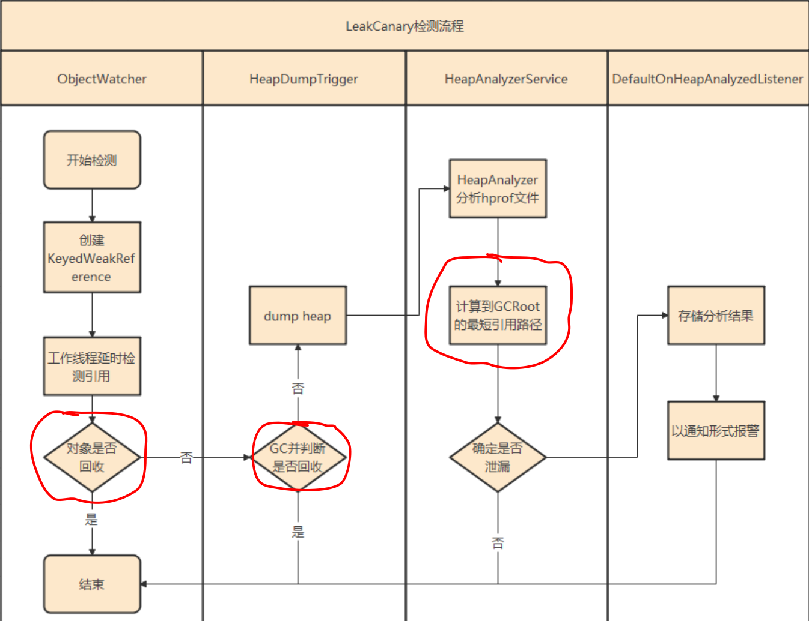

# LeakCanary 框架
```text
https://square.github.io/leakcanary/
https://github.com/square/leakcanary
https://gitee.com/hnyer/leakcanary-2.7  // 2.7版本

LeakCanary 目前最新的版本是 Version 2.7 (2021-03-26)，
相比之前的版本，2.0 之后的版本在使用上简洁了很多，
只需要在 dependencies 中加入 LeakCanary 的依赖即可。
而且 debugImplementation 只在 debug 模式下有效，
所以不用担心用户在正式环境下也会出现 LeakCanary 收集。

dependencies {
  debugImplementation 'com.squareup.leakcanary:leakcanary-android:2.7'
}
```

##  LeakCanary 的特点
```text
1、不需要手动初始化
2、可自动检测内存泄漏并通过通知报警
3、不能用于线上
```


## leakCanary 基本原理 和 基本流程
```text
1、LeakCanary 的基础是 ObjectWatcher Android  库。
它 hook 了 Android 的生命周期，
当 activity/fragment 被销毁时触发检测。

2、这些被销毁的对象被传递给 ObjectWatcher ， 
ObjectWatcher 持有这些被销毁对象的弱引用 。

3、如果弱引用在等待几秒钟并执行 gc ,如果仍未被清除，
那么被观察的对象就被认为存在潜在的泄漏。进行下一步分析。
private void runGC() {
    Runtime.getRuntime().gc();
     Thread.sleep(5000);
    System.runFinalization();
}

3、 dump heap 分析 hprof 文件，
构建可能泄漏的对象与 GCRoot 间的引用链,
如果存在则证明有泄漏。

4、将泄漏的消息通过 log 或 APP通知 提示用户。

那么 
1、怎么判断在5秒之后还未被清除的呢？ 
2、怎么检测 对象和 GCRoot的引用链 ？
```

## 怎么判断在5秒之后还未被清除的呢？
```text
当一个对象仅仅被 weak reference指向, 
而没有任何其他strong reference指向的时候, 
如果GC运行, 那么这个对象就会被回收。

基本原理就是 利用弱引用  WeakReference 和 ReferenceQueue 的特点

public void onActivityDestroyed(Activity activity) {
    String key = UUID.randomUUID().toString();
    // referenceQueue 队列保存的是弱引用对象
    MyWeakReference myWeakReference = new MyWeakReference(activity, referenceQueue);
    myWeakReference.key = key;
    leakMap.put(key, myWeakReference);

    handler.postDelayed(() -> watchActivity(myWeakReference), 5000);
}
    
private void removeWeaklyReachableObjects() {
    MyWeakReference myWeakReference;
    do {
    // 通过 do ...while 将队列的数据全部取出
        myWeakReference = (MyWeakReference) referenceQueue.poll();
        // 如果 myWeakReference 不为空，说明它包装的对象，已经被系统回收了，然后通知到了这个队列
        if (myWeakReference != null) {
            //  myWeakReference.info 已经被回收
            leakMap.remove(myWeakReference.key);
        } 
    } while (myWeakReference != null);
}

boolean isRecycled = !leakMap.containsKey(myWeakReference.key);
if (isRecycled) {
   // 通过 ReferenceQueue 判断，已经被回收
}

注：补充一下，我在Android平台下测试，但是 ReferenceQueue 中
取不到非空对象，在 Java平台下要新建大量的对象并不停地回收，
才能有一部分非空对象。
所以用 ReferenceQueue 来监控并不是很实时，不太靠谱，
最终的确定是否被回收还得靠分析 .hprof 文件。 
```

## LeakCanary 怎么检测 对象和 GCRoot的引用链 ？ (分析 hprof 文件 )
```text
如果用 ReferenceQueue 怀疑 对象没有被回收，
就需要 发起 heap dump，分析 dump 文件 最终确定。

旧版(2.0之前)是使用 haha 库去分析的，新版的重写的堆内存分析，就是 shark ，分析速度更快了。
https://square.github.io/leakcanary/shark/

// LeakCanary 如何分析 hprof文件
Leakcanary2.0 较之前的版本最大变化是改由 kotlin 实现以及开源了自己实现的 hprof 解析的代码，
总体的思路是根据 hprof 文件的二进制协议将文件的内容解析成一个图的数据结构，
然后广度遍历这个图找到最短路径，
路径的起始就是GCRoot对象，结束就是泄漏的对象。

具体的实现代码可以去看源码。
```




## leakCanary为什么不用 ‘虚引用 ’而用 ‘弱引用’
```text
因为 弱引用 + 手动gc 会让 那些没有被引用的对象回收掉。
而虚引用的对象，不管你gc还是不gc，它都没啥反应的。
唯一的作用就是在对象被回收时，告诉你一下我被回收了。
所以此处用虚引用不合适。
```

## LeakCanary 是如何初始化的
```text
LeakCanary 不需要 在自己的代码中进行初始化，
是因为应用了 ContentProvider 的特性。

因为 ContentProvider.onCreate() 在 Application.onCreate() 之前执行，
然后 LeakCanary 在自己的库中配置了 ContentProvider 。
internal sealed class AppWatcherInstaller : ContentProvider() {... 
AppWatcherInstaller 有两个子类, MainProcess  、LeakCanaryProcess

<application>
<provider
    android:name="leakcanary.internal.AppWatcherInstaller$MainProcess"
    android:authorities="${applicationId}.leakcanary-installer"
    android:enabled="@bool/leak_canary_watcher_auto_install"
    android:exported="false"/>
</application>

<application>
  <provider
      android:name="leakcanary.internal.AppWatcherInstaller$LeakCanaryProcess"
      android:authorities="${applicationId}.leakcanary-process.installer"
      android:process=":leakcanary"
      android:exported="false"/>
</application>

override fun onCreate(): Boolean {
    val application = context!!.applicationContext as Application
    AppWatcher.manualInstall(application) // 真正的初始化
    return true
}

当然，我们也可以关闭自动注册，
在合适的地方在自己的代码中手动注册
```


##  LeakCanary 为什么不能用于线上
```text
1、每次内存泄漏以后，都会生成一个.hprof文件，然后解析， 
会增加手机负担，引起手机卡顿等问题。

2、多次调用GC，会对 APP 性能产生影响

所以新版本的 LeakCanary 设计成 debugImplementation ，
只有在 debug 模式下才起作用
```


## 手写demo ，模拟 leankCanary
```text
https://gitee.com/hnyer/leak-canary-sample
```


# RecyclerView 控件
```text
RecyclerView 是 Google 在2014年的IO大会首次提出来。
implementation 'com.android.support:recyclerview-v7:26.1.0'
implementation 'com.android.support:recyclerview-v7:26.0.0'
implementation 'androidx.recyclerview:recyclerview:1.0.0'
在添加依赖的时候，要用小写字母去搜索。

RecyclerView 可以替代 ListView 和 GridView 。
```

##  recyclerview 源码阅读
```text
androidx.recyclerview:recyclerview:1.0.0 的源码拷贝出来
重新理解、注释一部分。
https://gitee.com/hnyer/AndroidxRecyclerviewSource
```

## RecyclerView 插拔式设计
```text
RecyclerView 在设计方面上非常的灵活，
不同的部分承担着不同的职责。
每一个人都可以根据自身的需求来定义不同的部分。

Adapter 负责提供数据、创建ViewHolder、绑定数据，
LayoutManager 负责 ItemView 的测量和布局，
ItemAnimator 负责每个ItemView的动画，
ItemDecoration 负责每个 ItemView 的间隙。
```

## RecyclerView 的优点
```text
RecyclerView 是一个展示大量数据的控件，
相比较 ListView ,RecyclerView 有非常出色的缓存机制，
在性能方面相比于 ListView 提升了不少。
同时由于 LayoutManager 的存在,
让 RecyclerView 不仅有 ListView 的特点，
同时兼有 GridView 的特点 ，还可以有瀑布流布局。
```
 

##  RecyclerView 与 listview 的区别
```text
RecyclerView 是 listview 的升级版，具有更高灵活、扩展 。
1、RecyclerView 默认实现了 线性布局、网格布局、流式布局。
2、RecyclerView 取消了 setEmptyView() 、 addHeaderView() 、 addFooterView() 对应的 UI效果需要自己去实现。
3、RecyclerView 提供了 局部刷新的 接口  notifyItemChanged(position) 
4、RecyclerView 提供了部分 动画效果。listview 完全靠自定义 。
5、RecyclerView 实现嵌套滚动机制 。
```
 
## RecyclerView 自定义 LayoutManager 
```text
默认提供了 
线性布局 LinearLayoutManager 、
网格布局 GridLayoutManager 、
瀑布流布局 StaggeredGridLayoutManager 。
------------------
extends RecyclerView.LayoutManager 
重写以下函数
onLayoutChildren()  // 
getItemCount() 
canScrollVertically() 
scrollVerticallyBy()
```


##  RecyclerView 自定义间隔线  、边界样式 、ItemDecoration
```text
recyclerView.addItemDecoration(xx);
https://gitee.com/Aivin_CodeShare/android_tool_code/raw/master/RecyclerView/RecyclerViewMarginDecoration.java
```
 

## RecyclerView 使用自带动画
注意，使用 notifyDataSetChanged() 时无法触发动画的。
```text
RecyclerView 自带一个动画 DefaultItemAnimator ，默认开启。
在增加、删除 、更新 item 时都会触发。
recyclerView.setItemAnimator(null); // 去掉默认动画

Adapterxxx 适配器中...
public void addOneItem(int position ,String value){
    if(datas==null){
        return ;
    }
    datas.add(position,value) ; 
    notifyItemInserted(position);// !
    if (position == 0) {
        recyclerView.scrollToPosition(0);
    }
}

public void removeOnItem(int position){
    if(datas==null){
        return ;
    }
    if(datas.size()<=0){
        return ;
    }
    datas.remove(position) ;
    notifyItemRemoved(position); // !
}

public void itemSwap(int from, int to) {
    Collections.swap(datas, from, to);
    if (to == 0) {
        recyclerView.scrollToPosition(0);
    }
    notifyItemMoved(from, to); // !
}

public void updateItem(int position, String s) {
    datas.set(position, s);
    notifyItemRangeChanged(position, 1); // !
}

// 动画时间
DefaultItemAnimator defaultItemAnimator = new DefaultItemAnimator();
defaultItemAnimator.setRemoveDuration(200);
defaultItemAnimator.setAddDuration(200);
defaultItemAnimator.setMoveDuration(200);
defaultItemAnimator.setChangeDuration(2000);
recyclerView.setItemAnimator(defaultItemAnimator);
```


## RecyclerView 自定义动画、添加动画 
```text
一般都是模仿自带的动画 DefaultItemAnimator 去实现。

可以参考 https://github.com/wasabeef/recyclerview-animators 的实现。
val recyclerView = findViewById<RecyclerView>(R.id.list)
recyclerView.itemAnimator = SlideInUpAnimator(OvershootInterpolator(1f))
```

 


## RecyclerView 自定义滑动效果
```text
可以通过 自定义  RecyclerView 的 LayoutManager 去实现。

可以参考 https://gitee.com/hnyer/GalleryDemo 
```


## RecyclerView 自定义回收策略
```text
自定义 ViewCacheExtension 。用的较少。
```


## RecyclerView 绘制流程
```text
RecyclerView 就是一个 ViewGroup ，
```


## RecyclerView 局部刷新 
```text
DiffUtil 是 专门为RecyclerView更新item设计的。
可以精确到某个Item上某个具体的TextView，或者ImageView的刷新。
使我们的app每次刷新消耗的资源较小。 

adapter.notifyDataSetChanged(); //  全部刷新
adapter.notifyItemChanged(position);//刷新某Item中的所有组件
adapter.notifyItemChanged(position, payloads); //刷新某Item中的部分组件。 配合 DiffUtil
```

 

##  RecyclerView 滚动机制
```text
RecyclerView 之所以能滚动，就是因为它在监听到手指滑动之后，反复 layout 子View，不断更 Item 的位置。
```

## RecyclerView 缓存 、复用 机制
```text
// 缓存匹配顺序
先从 1 级找，然后 2 级 ，然后3级 ，然后4 级，若找不到就走 onCreateViewHolder 。
```

| 缓存级别 | 关键对象                        | 说明                                                         |
| :------- | :------------------------------ | :----------------------------------------------------------- |
| 1级      | mAttachedScrap 和 mChangedScrap | 屏幕上的 HolderView 从 RecyclerView 的布局中被 拿下来后，存放到 mAttachedScrap 中 ， 这些 holderView 并不参与回收复用， 单纯只是为了先从RecyclerView中拿下来，再重新布局上去。对于新布局中没有用到的HolderView，才会从 mAttachedScrap 移到 mCachedViews 中，让它参与复用。 |
|          | mCachedViews                    | 它的 size 默认是 DEFAULT_CACHE_SIZE= 2，只能保存两个HolderView。   <br/>这里保存的始终是最新鲜被移除的HolderView，   <br/>当 mCachedViews 满了以后，会利用先进先出原则，把老的 HolderView 存放在 mRecyclerPool 中。   <br/>它的作用是在需要新的 HolderView 时，精确匹配是不是刚移除的那个，     如果是，就直接返回给 RecyclerView 展示，如果不是它，那么即使这里有 HolderView 实例， 也不会返回给 RecyclerView，而是到 mRecyclerPool 中去找一个HolderView实例返回给 RecyclerView ，让它重新绑定数据使用。 |
| 3级      | mViewCacheExtension             | 是一个帮助类，让开发者可以自己控制View 缓存。<br/>Recycler不会在这个类中做任何缓存View的操作，是否需要缓存View由开发者自己控制。我们一般不会用到，使用系统自带的回收池即可。 |
| 4级      | mRecyclerPool                   | mRecyclerPool  默认size是  DEFAULT_MAX_SCRAP =5。   <br> 在 mAttachedScrap 、mCachedViews 中的 holderView 都是精确匹配的， 真正被标识为废弃的是存放在 mRecyclerPool 中的 holderView ，  <br> 当我们向 RecyclerView 申请一个 HolderView 来使用的时，  <br> 如果在 mAttachedScrap 、 mCachedViews 精确匹配不到，  <br> 即使他们中有 HolderView 也不会返回给我们使用，  <br>而是会到 mRecyclerPool 中去拿一个废弃的HolderView返回给我们。 |


## 如何判断 item 是否复用
```text
如果是新创建的View，
则会先调用 onCreateViewHolder 来创建View，然后调用 onBindViewHolder 来绑定数据 ；
如果是复用的View，就只会调用 onBindViewHolder 而不会调用 onCreateViewHolder 。

如果数据有 100 个，
没有复用机制，会创建 100个 itemView + 绑定100次数据。
有复用机制，有可能只绑定 20个 itemView + 100次数据绑定，
并且是一次性创建并绑定完，容易导致 ANR 。
```
 

##  RecyclerView 嵌套滑动 机制
```text
Android 5.0推出了嵌套滑动机制，在之前，一旦子View处理了触摸事件，
父View就没有机会再处理这次的触摸事件，而嵌套滑动机制解决了这个问题

为了支持嵌套滑动，
子View必须实现 NestedScrollingChild 接口，
父View必须实现 NestedScrollingParent 接口。
```

##  RecyclerView 滑动卡顿
```text
1、嵌套布局滑动冲突 导致卡顿假象
内部的滑动控件消费了滑动操作, 外部的滑动控件就再也没机会响应这个滑动操作了。

2、嵌套布局层次太深。过多的测量，绘制布局可能会导致滑动卡顿。

3、在 onCreateViewHolder / onBindViewHolder 中做了耗时的操作导致卡顿。
类似 Bitmap 解码一类的耗时操作，不要在它们里面进行。
```


##  RecyclerView 万能适配器
实际使用中 可以使用 一些封装过的 第三方 适配器，提高开发速度。
```text
https://github.com/CymChad/BaseRecyclerViewAdapterHelper
```

##  RecyclerView  +  RadioGroup RadioButton 防止数据错乱 处理
```text
https://gitee.com/Aivin_CodeShare/android_tool_code/raw/master/PreFlightCheckAdapter.java
``` 


## RecyclerView 问答
###  RecyclerView 的缓存结构是怎样的？ 缓存的是什么？cachedView 会执行 onBindView 吗?
### RecyclerView 嵌套 RecyclerView，NestScrollView 嵌套 ScrollView 滑动冲突
### 讲一下 RecyclerView 的缓存机制,滑动10个，再滑回去，会有几个执行 onBindView
### 如何实现 RecyclerView 的局部更新，用过 payload 吗, notifyItemChange 方法中的参数？
### RecyclerView 防止内存OOM的一道题，充分利用自身的缓存机制
### RecyclerView 和 ListView 区别、特点、缓存 、懒加载、局部刷新 ,多种type场景下怎么避免滑动卡顿 ,怎么优化滑动
### RecyclerView 缓存结构，RecyclerView 预取，RecyclerView 局部刷新
### RecyclerView 里面那个 mChangedScrap, mAttachedScrap  之类的到底是在做什么 ? 


 