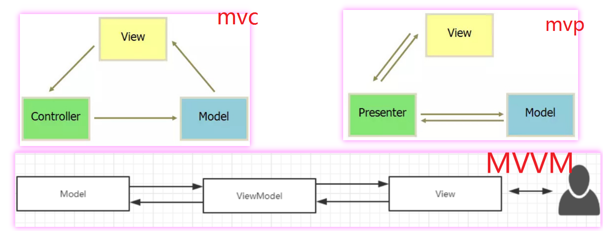

# 常用架构

## MVC 架构
```xml  
1979年，Trygve Reenskaug 在Smalltalk-80系统上首次提出了MVC的概念，
最初的时候叫做Model-View-Controller-Editor。

MVC并不是一种设计模式，不在23种经典设计模式中。
可以理解为 MVC是一种架构模式，一种架构可能 运用到了多种设计模式。
```

### Model 模型
适合做一些业务逻辑处理，比如数据库存取操作，网络操作，复杂的算法，耗时的任务等都在model层处理。

### View 视图
处理数据显示的部分，XML布局可以视为V层，显示Model层的数据结果。

### Controllor 控制器
处理用户交互问题。

 

### mvc 优点 、缺点
```text
// 优点
1、实现了分层开发 ,降低了代码的耦合
// 缺点
1、增加了代码编写的复杂性
2、MVC中 允许 M 层 和 V 层进行交互 ，解耦合不够彻底  
```
 

## MVP 架构
### Model  
业务逻辑和实体模型层

### View
视图展示层。 V层没有任何的逻辑部分又不用主动监听数据，被称之为“被动视图”。

###  Presenter
负责view和model层的交互。

### mvp 特点
于mvc相比，mvp有以下特点
```text
1、 M 层和 V 层只能通过 P 层进行交互
2、V 层和 P 层通过接口进行交互
3、一个复杂的 V 层可以对应多个 P
```

 

### mvp 优点 、缺点
```text
// 优点
1、相对mvc解耦更彻底
// 缺点
1、多了很多接口文件。
繁多的接口，繁琐的接口通信 ,
在实际的开发过程中，很难严格遵循。
```

 
##  MVVM 、 MV-VM 架构
MVVM架构在一定程度上减少了MVP存在的以下缺点。
```text
1、P 层与 V 层是通过接口进行交互的，接口粒度不好控制。
粒度太小，就会存在大量接口的情况，使代码太过碎版化;
粒度太大，解耦效果不好。

2、V 层与 P 层还是有一定的耦合度。
一旦 V 层某个UI元素更改，那么对应的接口就必须得改，
数据如何映射到UI上、事件监听接口这些都需要转变，牵一发而动全身。

3、复杂的业务同时也可能会导致 P 层太大。虽然可以 一个 V 对应 多个 P 。
```

### MVVM模块

模块 | 说明
-|-
M Model|  数据提供 
V View| 视图展示  
VM ViewModel |  M 和 V 绑定 ， 监听数据变化，一旦有改变，就响应到另一方
 

### mvvm的缺点
```text
2、引入新框架，增加学习成本。
3、通过 数据绑定的方式 ，出现问题 ，不容易调试。
```

###  MVVM 数据双向绑定、完全解耦的原理
```text
在安卓中，DataBinding 是 谷歌提供的一个工具，
可以将 V 和 M 进行数据绑定 。

能实现数据绑定的原因，我猜测是框架采用了 观察者模式 实现数据驱动，
DataBinding 具体源码我暂时还未看过，只能是猜测 。

其他方向，例如前端也有类似的框架，例如 Vue.js
```


### 完全解耦的方案中 ，如何管理生命周期
可以使用 谷歌的 LiveData 。


## 总结
```text
1、MVC中 允许 M 层 和 V 层进行交互 ，耦合太高，不合理。
2、MVP 中 ， P 层与 V  层还是有一定的耦合度。还不够完美。
3、MVVM ，通过数据绑定的方式，实现数据监听 ，完全解耦。
```



#  Jetpack
由于Gradle默认支持依赖传递，添加这一句代码就依赖了很多库。
implementation "android.arch.lifecycle:extensions:1.1.1"

```text
一直以来，Android开发都充斥了大量的不规范的操作和重复代码，
比如生命周期的管理，开发过程的重复，项目架构的选择等等。
所以 2018年谷歌I/O 发布了一系列辅助android开发者的实用工具，
合称 Jetpack ，以帮助开发者在从基础，架构，行为以及界面 4 大方面体系化地为我们提供组件级别的支持。

Jetpack 包含4个部分的组件：Architecture、Foundation、Behavior 以及 UI 。
Architecture 全称 Android Architecture Component (AAC) 。
AAC 包含 
ViewModel 、LiveData、Room、
Lifecycles、DataBinding、Navigation、
Paging、WorkManager 、DataStore 
```

##  Navigation
https://developer.android.google.cn/guide/navigation/navigation-getting-started
```text
Navigation的主要目的就是方便在一个 Activity中对多个Fragment进行管理。
让Fragment能够轻松的实现跳转与传递参数。
类似于ios开发中的storyboard 。

我试用了一下，感觉不太喜欢这种方式。
只做一下基本笔记。

// 在 APP 模块下的 gradle 配置
apply plugin: 'androidx.navigation.safeargs' 
def nav_version = "2.1.0"
implementation "androidx.navigation:navigation-fragment:$nav_version"
implementation "androidx.navigation:navigation-ui:$nav_version"

// 在项目 gradle 配置 
def nav_version = "2.1.0"
classpath "androidx.navigation:navigation-safe-args-gradle-plugin:$nav_version" -- 这个是为了使用 Safe Args Gradle

<fragment
    android:id="@+id/navHost" //  这个 fragment 放 activity 下的xml中
    android:name="androidx.navigation.fragment.NavHostFragment"  // 指定这个 fragment 跟 Navigation 关联起来
    app:defaultNavHost="true" // 说明是默认容器
    app:navGraph="@navigation/nav_main"  />  -- 指定导航容器
    
<navigation xmlns:android="http://schemas.android.com/apk/res/android"
    xmlns:app="http://schemas.android.com/apk/res-auto"
    xmlns:tools="http://schemas.android.com/tools"
    android:id="@+id/nav_main"
    app:startDestination="@id/fragmentOne"> -- 指定开始页是 fragmentOne
     ... 
</navigation>

注意 ，如果修改了 navigation 地图， 需要在 配置了 apply plugin: 'androidx.navigation.safeargs'
并且修改了就要重新 rebuild ，以便 系统帮你生成中间代码。
很多操作都是用鼠标可视化操作。

// 启用 Safe Args 后，该插件会生成代码 FragmentOneDirections ，规则是 你的fragment名字+ Directions
NavDirections navDirections = FragmentOneDirections.actionFragmentOneToFragmentTwo("Tom"  ,"标题2")  ;
其他的内容很容易理解，参考官网就行了。
```


## Lifecycles
```text
Lifecyces 是一个生命可感知的组件。
LiveData 、 ViewModel  也依赖于 Lifecycle 框架。

如果不用 Lifecycles , 我们以前需要在 activity 的每个生命周期函数中进行监听。
使用了 Lifecycles ，可以在 activity 中注册一次，
即可监听到所有生命周期的回调，简化了代码。

def lifecycle_version = "2.2.0"
implementation "android.arch.lifecycle:runtime:$lifecycle_version"
implementation "androidx.lifecycle:lifecycle-process:$lifecycle_version"

// 监听器
class MyLifecycleObserver implements LifecycleObserver {
    @OnLifecycleEvent(Lifecycle.Event.ON_CREATE ) // 还有其他
    void onCreate() {
        // onCreate生命周期回调
    }

// Activity 注册监听
class MainActivity extends FragmentActivity implements LifecycleOwner {
    // Activity 好像监听不到，我测试失败。用 FragmentActivity AppCompatActivity 可以
    LifecycleRegistry registry;
    registry = new LifecycleRegistry(this); // 注册
}

// Application 注册监听
ProcessLifecycleOwner.get().getLifecycle().addObserver(new MyLifecycleObserver());
```

## LiveData
```text
LiveData如同它的名字一样，是一个可观察的数据持有者，
和常规的observable不同，LiveData是具有生命周期感知的，
它能够在Activity、Fragment、Service中正确的处理生命周期。

当数据更新后，LiveData 就会通知它的所有观察者，比如Activiy。
但是 LiveData并不是通知所有观察者，它只会通知处于Active状态的观察者，
如果一个观察者处于Paused或Destroyed状态，它将不会收到通知。
所以我们可以安全地观察LiveData对象而不用担心内存泄漏的问题。

LiveData 代表 MVVM 模式最重要的思想，即数据驱动视图（也叫观察者模式、响应式等）。
LiveData 本质是 观察者模式 的体现 。

class MyLiveDataData extends LiveData<MyLiveDataData> ...
class MyViewModel extends ViewModel { ...

// 获得 ViewModel
MyViewModel mMyViewModel = new ViewModelProvider.AndroidViewModelFactory( getApplication() ).create( MyViewModel.class);
// LiveData 注册观察者
mMyViewModel.getDemoData().observe(this, new Observer<MyLiveDataData>() {
    @Override
    public void onChanged(MyLiveDataData myLiveDataData) {
        // 收到数据更新
    }
});

// 数据被更新
mMyViewModel.getDemoData().setTag1(123);

// 或者直接使用 LiveData 的子类 MutableLiveData
MutableLiveData<String> mutableLiveData  = new MutableLiveData<>();
mutableLiveData.observe(this, new Observer<String>() { 
    @Override
    public void onChanged(@Nullable final String s) {
       // 收到更新
    }
});
mutableLiveData.postValue("发送新数据"); 
```


## ViewModel
```text
ViewModel  的定义最早起源于前端，代表着 数据驱动视图 的思想。
在实际开发中我们通过观察数据的状态，来维护UI的自动更新，这就是 数据驱动视图（观察者模式）。

因为  MVVM 有截然不同的实现方式，这种百花齐放的代码风格、难以严格统一的 开发流派 
导致代码质量的参差不齐，代码的可读性更是天差地别。
不同的项目、不同的依赖库加上不同的开发者，
最终代码中对于 状态管理 的实现方式都有很大的不同。

ViewModel 以注重生命周期的方式管理界面相关的数据。通常和DataBinding配合使用 。

基于以上不足，谷歌推出了 ViewModel ，它具有以下优点
1、 ViewMode l组件直接对 ViewModel 层进行了标准化的规范
2、更便于保存数据
当组件被销毁并重建后，原来组件相关的数据也会丢失(例如屏幕的旋转)，如果数据类型比较简单，同时数据量也不大，
可以通过onSaveInstanceState()存储数据，组件重建之后通过onCreate()，从中读取Bundle恢复数据。
但如果是大量数据， 则上述方法将不适用。
ViewModel 的扩展类则会在这种情况下自动保留其数据

3、更方便UI组件之间的通信
如果 ViewModel 的实例化作用域为Activity的生命周期，
则两个Fragment可以持有同一个ViewModel的实例，这意味着数据状态的共享。

那些 “重新获取的代价比较大” 的状态（例如通过网络请求到的 List 等数据，抛开 “费流量” 不说，
https 请求本身涉及大量的加解密运算，耗费 CPU 资源，耗电显著）。

ViewModel 对象可以处理配置更改，因此无需担心旋转时或其他情况下的状态。
但是，如果需要处理系统发起的进程终止，则可以使用 onSaveInstanceState() 作为备用方式。
状态必须是简单的轻量级状态。对于复杂或大型数据，您应该使用本地持久性存储。

mMyViewModel = new ViewModelProvider.AndroidViewModelFactory( getApplication() ).create( MyViewModel.class);
int oldValue = mMyViewModel.age; // ViewModel 会自动将数值存储，屏幕翻转之后数据不会丢失
// 注意 activity 标签需要配置这个 才会生效
android:configChanges="keyboardHidden|orientation|screenSize"
```

##  DataBinding (单向、双向数据绑定)
```text
DataBinding  顾名思义即为数据绑定，可以绑定数据和UI，还可以绑定事件
是 MVVM 模式在 Android 上的一种实现 。
Google在2015年IO大会上提出的 ，它的发布极大地促进了MVVM在Android领域的应用。

dataBinding {
    enabled = true // 开启dataBinding
}
 
<?xml version="1.0" encoding="utf-8"?>
<layout>
        <data>
            <variable
                name="userName"  // 设置变量名 
                type="String" />
        </data>
    <LinearLayout xmlns:android="http://schemas.android.com/apk/res/android"
        android:orientation="vertical" >
        <TextView
            android:text="@{userName}" // 绑定
            android:layout_width="wrap_content"
            android:layout_height="wrap_content" />
    </LinearLayout>
</layout>

// 代码中加载布局
binding = DataBindingUtil.setContentView(this, R.layout.activity_main); // ActivityMainBinding
// 更新数据后，UI的数据会自动更新
binding.setUserName("tom"+ (++age) );
```


## ViewModel 是怎么实现双向数据绑定的 
```text

```


##  ViewModel 怎么实现自动处理生命周期 
```text

```


##  ViewModel 为什么在旋转屏幕后不会丢失状态 / 为什么可以在Activity销毁后保存数据
```text
屏幕旋转时，activity被销毁重建了，存放在activity的数据也没有了。
ViewModel在配置更改期间能自动保留其对象，以便它们所持有的数据可立即用于下一个 Activity 或片段 Fragment
Activity的生命周期不断变化，经历了被销毁重新创建，而ViewModel的生命周期没有发生变化。
```


 
 

##  ViewModel 的使用中有什么坑
```text

```

## ViewModel 在 Activity 初始化与在 Fragment中初始化，有什么区别 
```text

```


## LiveData 是如何避免内存泄漏的
```text
RxJava在使用过程中，避免内存泄漏是一个不可忽视的问题，
因此我们一般需要借助三方库比如RxLifecycle、AutoDispose来解决这个问题。
而反观LiveData，当它被我们的Activity订阅观察，这之后Activity如果finish()掉，
LiveData 本身会自动“清理”以避免内存泄漏。
它的实现原理非常简单，其本质就是利用了Jetpack 架构组件中的另外一个成员 ,Lifecycle。

LiveData会绑定到 Lifecycle 对象，并在其关联的生命周期遭到销毁后进行自我清理。
```