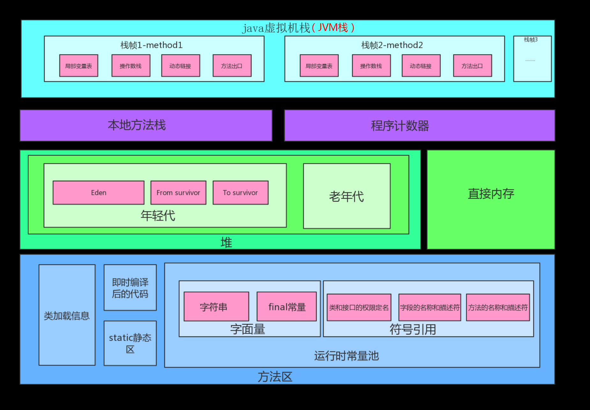

# 广州极飞
##  1、二进制数 11101 转化为⼗进制数是多少?

```text
2^0 + 0 + 2^2 + 2^3 +2^4 = 29 
```


##  2、 声明⼀个类不能再被继承的关键字是()
```text
A.public  B.abstract  C.final  D.static

final 是最终的意思。被final修饰过的类不能被继承，
被final修饰过的函数不能被覆盖，被final修饰过的变量不能改值
```


##  3、以下关于Handler机制原理的说法错误的是()
```text
A、Android提供了Handler和Looper来满⾜线程间的通信。

B、Handler机制是遵循先进后出的原则。

C、Looper类⽤来管理待定线程内对象之间的消息交换（Message Exchange），
⽽通过Handler对象可以与 Looper 进⾏沟通，以便push新消息到Message Queue⾥⾯，
或者接收Looper从MeaagesQueue取出的消息。

D、UI Thread通常就是Main Thread，⽽Android启动程序的时候就会替它建⽴⼀个Message Queue。

// B、先进先出 。
```
 


## 4、 以下关于Service的说法错误的是()
```text
A. Android中，Service有两种不同的使⽤⽅式：
⼀种是以启动⽅式使⽤Service（Started Service），
另⼀种是以绑定⽅式使⽤Service（Bound Service）。

B. 需要在AndroidManifest.xml⽂件中注册，否则，Service根本⽆法启动。

C. 以绑定⽅式使⽤Service，能够获取到Service对象，
不仅能够正常启动Service，
⽽且能够调⽤正在运⾏中的Service实现的私有⽅法和属性。

D. 为了使Service⽀持绑定，需要在Service类中重写onBind()⽅法，
并在onBind()⽅法中返回Service对象

// C、无法调用私有方法和属性。
```

 

##  5、 进程间通信的⽅式有哪些？
```text
1、 Intent + Bundle 
bundle.putString(KEY ,"xxxxx");  

2、socket
socket都可以实现网络通信，那么实现跨进程通信自然是ok的。开销大。

3、通过文件
通过对同一个文件进行读写来实现信息交互。

4、ContentProvider
可以让一个应用向其他应用暴露接口，提供数据。，可以说天生就是为进程通信而生的。
底层是Binder实现 。

5、BroadcastReceiver
通过广播播放实现单方面通知。

6、android.os.Messenger  + Service
一个 server 运行在一个 apk 中 ， 另一个apk 绑定服务，发送和接收信息。
基于AIDL。串行通信。 

7、AIDL
支持并发交互。
使用接口定义语言AIDL 来自定义规则使用Binder 。
例如ContentProvider就是官方给我们提供的一个使用案例，我们也可以使用AIDL来自己实现一个类似的。

补充：当作为客户的一方和要和作为服务器的一方进行通信时，需要指定一些双方都认可的接口， 这样才能顺利地进行通信。
而AIDL就是定义这些接口的一种工具。为什么要借助AIDL来定义，而不直接编写接口呢（比如直接通过Java定义一个Interface）？ 
涉及到进程间通信（IPC）的问题。和大多数系统一样，在Android平台下,各个进程都占有一块自己独有的内存空间，
各个进程在通常情况下只能访问自己的独有的内存空间，而不能对别的进程的内存空间进行访问。 
进程之间如果要进行通信，就必须先把需要传递的对象分解成操作系统能够理解的基本类型，并根据你的需要封装跨边界的对象。
而要完成这些封装工作，需要写的代码量十分地冗长而枯燥。因此Android提供了AIDL来帮助你完成这些工作。
```


##  6、 开启⼀个线程的⽅法有哪些？销毁⼀个线程的⽅法呢？
不带返回值的方式
```text
new MyThread().start();

new Thread(new Runnable() {
@Override
public void run() {

}
}).start();
```

带返回值
```text
FutureTask futureTask = new FutureTask<String>(new Callable<String>() {
@Override
public String call() throws Exception {
Thread.sleep(3*1000);
return "I am the result !";
}
}) ;

new Thread(futureTask).start(); // 执行子线程
// futrue.get() 去获取线程执行后的返回值。get()函数会导致当前线程阻塞，等待子线程执行完毕再往下走
Object object =futureTask.get(0 , TimeUnit.SECONDS) ; // 如果超时了，不会一直阻塞，挥抛出异常后继续往下走
```


## 7、多线程是否⼀定⽐单线程快，为什么？
```text
不一定比单线程快。如果多个线程需要用到一个公共的变量，
由于多个线程需要消耗更多的资源、切换线程需要时间，有可能还不如单线程快。
```

##  8、 什么是死锁？如何避免死锁
```text
多个线程同时被阻塞，因为它们中的一个或者全部都在等待某个资源被释放。

//java 死锁产生的四个必要条件：
1、互斥使用，即当资源被一个线程使用(占有)时，别的线程不能使用。
2、不可抢占，资源请求者不能强制从资源占有者手中夺取资源，资源只能由资源占有者主动释放。
3、请求和保持，即当资源请求者在请求其他的资源的同时保持对原有资源的占有。
4、循环等待，即存在一个等待队列：P1占有P2的资源，P2占有P3的资源，P3占有P1的资源。

当上述四个条件都成立的时候，便形成死锁。当然，死锁的情况下如果打破上述任何一个条件，便可让死锁消失。
```

##  9、列举线程同步的⽅式
```text
同步高开销，尽量减少同步的内容。一般同步关键代码（代码块）即可。
1、同步函数方法。
2、同步函数块
3、 使用系统api ReentrantLock
//fair为true表示是公平锁 。默认非公平。
boolean fair= false ;
ReentrantLock  lock  = new ReentrantLock(fair) ;

if(lock.tryLock()) ;//如果已经被锁定了 就会忽略。不会等待。
if(lock.tryLock(5 , TimeUnit.SECONDS)) ;//如果被锁定了，就会尝试等待指定时长。如果还没有就放弃
lock.lock();  //如果已经被锁定了 ,会在此等待
lock.unlock();//释放锁
//tryLock和lockInterruptibly方法在申请锁的过程中是可以被中断的 .
//如果线程被中断，抛出一个InterruptedException异常
lock.lockInterruptibly();

4、 使用系统API LinkedBlockingQueue
多线程安全，每次只允许 一个线程去队列里面存放对象。
LinkedBlockingQueue outQueue = new LinkedBlockingQueue<>(Integer.MAX_VALUE);
outQueue.put(msg);
msg = outQueue.poll();

5、可以使用Java Api  AtomicXX 来实现同步。
因为根据java 定义，原子操作是不会被打断地的操作，因此被认为是线程安全的。
//原子更新数组类
int[]arrayInt ={1,30};
AtomicIntegerArray atomicIntArray = new AtomicIntegerArray(arrayInt);
atomicIntArray.getAndSet(i, newValue);
atomicIntArray.addAndGet(i, delta);

//AtomicReferenceFieldUpdater 一个基于反射的工具类，它能对指定类的指定的volatile引用字段进行原子更新。(这个字段不能是private的)
AtomicReferenceFieldUpdater  updater= AtomicReferenceFieldUpdater.newUpdater(Dog.class,String.class,"name");
updater.compareAndSet(dog1,dog1.name,"test") ;

//AtomicMarkableReference 是为解决CAS操作中潜在的ABA问题 设计的解决方案。
AtomicMarkableReference atomicMarkRef= new AtomicMarkableReference<String>("StrMsg", false) ;
if(!atomicMarkRef.isMarked())  {
atomicMarkRef.set("bbb", true);
};      
```


## 10、JVM内存结构。


```text
分为6大块内存空间。 

1、JVM栈，存放一个Java线程的运行状态 。

2、本地方法栈，存储本地方法执行过程中的栈数据。

3、程序计数器 当前线程所执行的字节码的行号指示器。
用来记录程序运行到哪里了，下一步又该执行哪一步操作。

4、堆，存放运行时产生的对象的。Java只能在堆中存放对象 。

5、直接内存。
既堆外内存。 内存对象分配在Java虚拟机的堆以外的内存，这些内存直接受操作系统管理，而不是虚拟机。

6、方法区。
方法区主要是用来存类型数据的，与类型相关的东西，比如常量，静态变量。 
注：运行时常量池是方法区的一部分，用来存放编译器生成的各种字面量和符号引用。 
```


##  11、 简单介绍Android平台单元测试的⽅法，列举常⽤的测试框架。
```text
用得少。不太了解。
```

##  12、 列举你使⽤过或⽐较熟悉的设计模式。
```text
单例模式、观察者模式等。
```

##  13、容量为5升和6升的瓶⼦怎么装出3升的⽔？

```text
假设A是5升的瓶 ，B是6升的瓶子。

A装满水倒入B，再用A装满水，倒入B，使得B装满。---> 此时A是4升，B是6升。
然后将B清空，---> 此时A是4升，B是0升。
将A中水倒入B，此时A是0，B是4。
继续装满A，从A中拿2升给B装满。---- > 此时A剩下3升。
```

## 14、如果让你写⼀个简单的⽂件传输APP，⽤于在两台⼿机之间传输⽂件

⽐如将⼿机A相册⾥的照⽚，传输到⼿机B指定的⽬录，怎么设计数据传输的协议，说⼀说你的思路。
```text
方案1：搭建ftp服务器。
方案2：利用手机api 开启WiFi热点，组成局域网，然后用socket进行文件传输。系统的api即可实现面对面快传。
如果要实现加密传输，可以基于socket进行自定义协议传输。
```

## 15、什么是JNI? 它主要⽤来⼲什么。

```text
JNI (java native interface) , 通过JNI可以实现java和本地代码之间相互调用。

1、提高代码安全性。因为.so文件反编译困难。（加密一些算法等）
2、方便使用已经存在的c/c++库。可以加载 .dll 和 .so 格式的动态库。
3、提高某些特定情况下的执行效率。（c/c++的效率比java高。不过并不能明显提升android程序的性能）
```

## 16、输⼊⼀个字符串，打印出该字符串中字符的所有排列。

例如输⼊字符串abc，则输出由字符a、b、c 所能排列出来的所有字符串abc、acb、bac、bca、cab 和cba。
```text
/**
* 外部调用
* @param str abcd 等
*/
public void permutation(String str) {
    char[] chars = str.toCharArray();

    getResult(chars,0,str.length()-1 );
}

/**
* 第一步：可以先将字符串分为两部分，第一个字符和后面的字符。
* 第二步：求出所有可能出现在第一个位置的字符，然后再和后面的字符交换 。
* 第三步：固定第一个字符，然后求后面字符的排列，至于后面字符的排列,我们可以看作再次固定第一个字符，以此类推，用递归解决。
*/
private void getResult(char[] chars,int start,int end ){
    if(start==end){
        //递归结束
        System.out.println("---------stop= "+ String.valueOf(chars)  );
    }  else{
        for(int i=start;i<=end;i++){
            //将第一个字符和后面的字符交换
            swap(chars,start,i);
            //对后面的所有字符进行全排列
            getResult(chars,start+1,end );
            //把第一个字符再换回来，方便再与其他字符交换
            swap(chars,start,i);
        }
    }
}

private void swap(char[] chars,int a,int b){
    if(a!=b) {
        char temp = chars[a];
        chars[a] = chars[b];
        chars[b] = temp;
    }
}
```

## 17、 有⼀个X*Y的⽹格，⼩明要在此⽹格上从左上⻆到右下⻆。

只能⾛格点且只能向右或向下⾛。请设计⼀个算法，计算⼩明有多少种⾛法。
给定两个正整数int x,int y，请返回⼩名的⾛法数⽬。

```text
   /**
    * 若该格子位于第一行，则只能由左边的格子到达；   return 1
    * 若格子位于第一列，只能由上面的格子到达；  return 1
    *
    * 其他未知的格子：网格中的其他格子可以由左边的格子到达，也可以由上面的格子到达。
    * f(x , y) = f(x - 1, y) + f(x , y - 1)
    */
public int getStep(int x,int y){
if( x==1 || y==1 ) {
    return 1 ;
}
return getStep(x-1, y) + getStep(x, y-1);
}
```