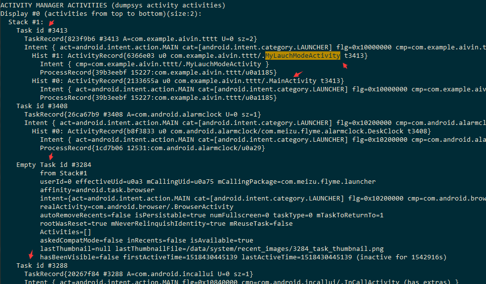

# Activity 生命周期
## onDestroy()
```text
// onStop 和 onDestroy 回调为什么会延时
由于要关闭的 或者要打开的 Activity 往主线程的 MessageQueue 中发送了 大量的 Message ,
导致主线程一直在不断的进行消息循环处理这些消息而没有得到停歇。
App 侧就不能向 AMS 告知自己有空闲时间来处理 AMS 侧的任务。
所以，finish Activity B后，onDestroy不会被及时回调。
具体延时多久，要看主线程什么时候闲下来。

// 为什么 Activity.finish() 之后 10s 才 onStop 、onDestroy 
除正常流程外，Android 系统另行安排了一套流程来保证即使正常流程被阻断以后，Activity B还是能被销毁。
ActivityStac.java 中 
// schedule an idle timeout in case the app doesn't do it for us.
mStackSupervisor.scheduleIdleTimeoutLocked(next);
this.mHandler.sendMessageDelayed(msg, 10000L); // 10s
```

## onRestart ()
经过测试，以下几种情况 onRestart()方法 会被调用 
```text
1、按下home键之后，然后切换回来  
2、从本Activity跳转到另一个Activity之后，按 back键返回原来 Activity 
3、从本Activity切换到其他的应用，然后再从其他应用切换回来 
``` 

## onStop()
```text
两个Activity之间跳转 ,
从A跳到B ，A的 onStop 是否执行 取决于 B是否完全覆盖在 A上 导致A整个不可见。  
如果 B 是透明的 Activity 或者是个 Dialog 样式 ，A 的 onStop 并不会被执行。
```

## 按 Back 键 后，activity 的生命周期变化
```text
这些东西 写个简单demo 实验一把 当场就能出结果。
面试官要是硬要你回答，就是沙比。
```

## 按 Home 键 后，activity 的生命周期变化
```text
这些东西 写个简单demo 实验一把 当场就能出结果。
```

## activity 启动另外一个activity的时候横屏切换再点击返回，过程中发生的生命周期
```text
这些东西 写个简单demo 实验一把 当场就能出结果。
```

# Activity 启动模式
通过使用不同的启动模式，来控制是否生成唯一还是多个activity实例 。来满足不同的使用场景 。

##  standard 模式
```text
默认模式。每当有一次Intent请求，就会创建一个新的Activity实例 。
并且被放到启动它的那个Activity所属的任务栈中。
```

## singleTop 模式
```text
栈顶复用。
栈顶有此实例就使用（调用 onNewIntent()方法） ，没有就重新创建。(调用onCreate()方法)
栈顶模式只有在一种情况下有别于 standrad 默认模式，便是身处栈顶的时候。
```

## singleTask 模式
```text
栈内复用。
若栈中已有该Activity的实例，就重用该实例(调用onNewIntent()方法)。
并且会将它所在任务栈之前的所有activity实例移除掉。因此该实例就处于栈顶了。
若栈中不存在该实例，将会onCreate()。
可以用在 消除交互界面的嵌套循环 场景。

例如主页面一般使用 SingleTask 模式，
因为用户点击多次页面的相互跳转后，在点击回到主页，再次点击退出，
这时他的实际需求就是要退出程序，
而不是一次一次关闭刚才跳转过的页面最后才退出。
```

## singleInstance 模式
```text
全局唯一，整个系统中是单例的。
Activity 单独占用一个Task栈 。
例如 A 是 standard 模式 ，B 是 singleInstance ，
那么 A 和 B 是在不同的栈内的。
```

## 启动模式属性
```text
// taskAffinity 
android:taskAffinity="task001"
它倾向于将 taskAffinity 属性相同的Activity，扔进同一个Task中。指定Activity希望归属的栈

// allowTaskReparenting
任务状态是否始终由系统来维护
android:allowTaskReparenting="true"  //默认false
```
 

##  任务栈 task stack  
每次启动新的Activity都将被添加到Activity Stack。
用户返回就会将当期的activity实例出栈。
如果当前栈空了，就会进入 Home screenn 所在的栈 。
```text
1、一个应用程序一被启动,系统就给它分配一个任务栈 。 一个应用程序一个任务栈。
2、一个任务栈中存放多个activity ,可以来自不同的应用程序。
```


 

## 指定启动模式  
```text
代码方式 优先级大于 xml方式 
// xml方式
<activity android:name=".MyLauchModeActivity"
    android:launchMode="singleTop"
    android:taskAffinity="com.test.."
    android:allowTaskReparenting="true"
    android:clearTaskOnLaunch="true"
    android:finishOnTaskLaunch="true"
    android:alwaysRetainTaskState="true"
    android:multiprocess="true"
    android:noHistory="true"
    android:excludeFromRecents="true"
    android:process=""
    android:stateNotNeeded="true" />

// 代码方式
Intent intent = new Intent( this ,TestActivity.class);
intent.addFlags(Intent.FLAG_ACTIVITY_SINGLE_TOP);
this.startActivity(intent);
```
 
## Intent的 Flag标志
 [官网flags](https://developer.android.com/reference/android/content/Intent.html#addFlags(int)

 Intent的Flag标志 |意义 
 -|-
 FLAG_ACTIVITY_NEW_TASK| 默认的跳转类型 
 FLAG_ACTIVITY_SINGLE_TOP|singletop模式 
 FLAG_ACTIVITY_BROUGHT_TO_FRONT| 
 FLAG_ACTIVITY_CLEAR_TOP|SingleTask模式 
 FLAG_ACTIVITY_NO_HISTORY|Activity不会保留在栈中 
 FLAG_ACTIVITY_NO_ANIMATION|不使用过渡动画
 FLAG_ACTIVITY_EXCLUDE_FROM_RECENTS|最近应用里面查看不到这个activity的启动记录

# 查看  系统的任务栈 、 Activity 栈信息  、各个栈的 Activity 列表
```text
adb shell dumpsys activity
```


# Activity 其他方法
## onSaveInstanceState() 、onRestoreInstanceState() 
```text
onSaveInstanceState() 只会在 Activity 即将被销毁
并且有机会重新显示的情况下才会去调用它，
正常情况下系统是不会回调的(如当用户按back键时)。

1、按下 Home键 (常见)
2、长按 Home键 ，选择运行其他的程序 (常见)
3、按下电源键，关闭屏幕显示 
4、锁屏 
5、屏幕方向切换、键盘可用性、语言切换 (常见)
6、电话打入时 (常见)

不是用户主动退出某个Activity或者跳转到其他Activity的情况下就会触发 onSaveInstanceState ，
即 当系统存在“未经你许可”时销毁了我们的Activity,就会被系统调用，
这是系统的职责，因为它必须要提供一个机会让用户保存数据。

对于一个Activity或者View来说，状态的保存与恢复是必不可少的，
最常见的一种情况是切换屏幕方向了，如果由竖屏切换为横屏，
那么必定会经历Activity的摧毁与重建，那么它所对应的View视图也会被摧毁和重建，
如果此时没有对View进行状态的保存的话，那么待View重建后，其之前的状态便不复存在。
对于系统自带的View（如CheckBox等），Android已经帮我们实现了状态的自动保存与恢复。
但是对于我们自己开发的自定义View，就需要我们去保存状态和恢复状态了，

如果我们没有覆写 onSaveInstanceState() , 
此方法的默认实现会自动保存activity中的某些状态数据。
android应用框架中定义的几乎所有UI控件都恰当的实现了onSaveInstanceState(),
因此当activity被摧毁和重建时, 这些UI控件会自动保存和恢复状态数据. 
比如 CheckBox控件会自动保存和恢复选中状态。
开发者只需要为这些控件指定一个ID( 设置android:id  ), 
剩余的事情就可以自动完成了.如果没有为控件指定ID, 
则这个控件就不会进行自动的数据保存和恢复操作。

protected void onSaveInstanceState(@NonNull Bundle outState) {
    outState.putBundle(WINDOW_HIERARCHY_TAG, mWindow.saveHierarchyState());
    outState.putInt(LAST_AUTOFILL_ID, mLastAutofillId);
    Parcelable p = mFragments.saveAllState();
    if (p != null) {
        outState.putParcelable(FRAGMENTS_TAG, p);
    }
    if (mAutoFillResetNeeded) {
        outState.putBoolean(AUTOFILL_RESET_NEEDED, true);
        getAutofillManager().onSaveInstanceState(outState);
    }
    dispatchActivitySaveInstanceState(outState);
}

在 onSaveInstanceState() 中保存数据 
在 onCreate(Bundle )、onRestoreInstanceState(Bundle) 中恢复数据。
```