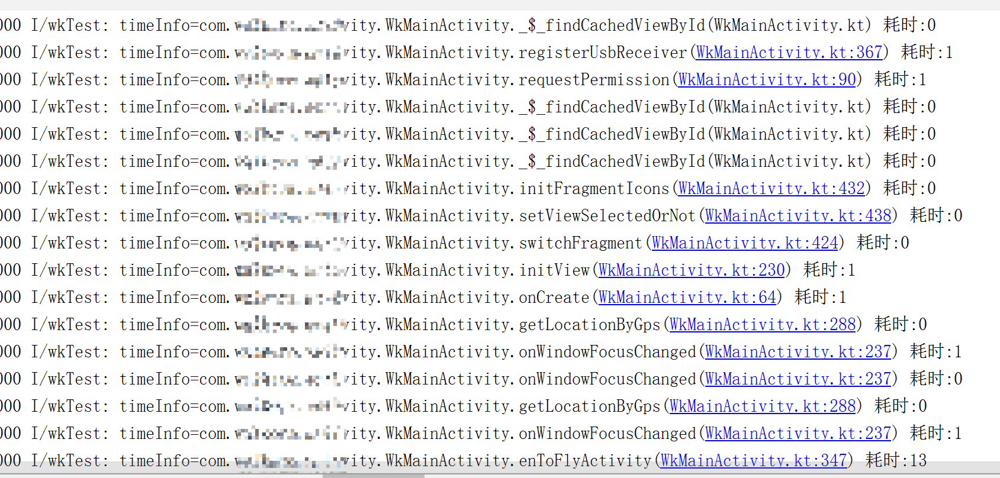
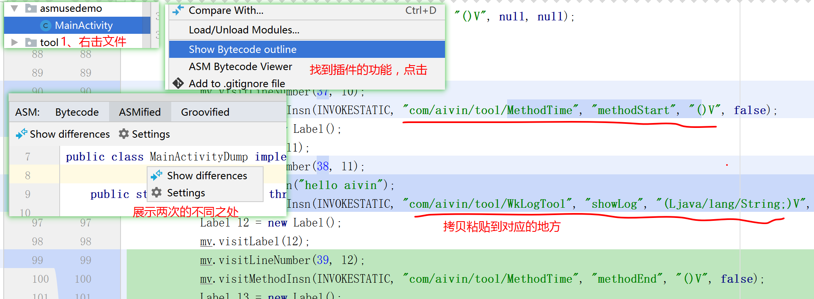

# Android 字节码插桩
## 什么是插桩
```text
插桩就是将一段代码插入或者替换原本的代码。
字节码插桩顾名思义就是在我们编写的源码编译成字节码（Class）后，
在Android下生成dex之前修改Class文件，
修改或者增强原有代码逻辑的操作。
```


## 插桩的应用场景
```text
通过 代码插入、代码替换实现
无痕埋点、性能监控 、日志记录、
性能统计、异常处理、修改三方库代码等目的。
总之就是 AOP（面向切面编程）。
```


## 插桩的时机
```text
字节码操作框架的作用在于生成或者修改Class文件，
因此在Android中字节码框架本身是不需要打包进入APK的，
只有其生成/修改之后的Class才需要打包进入APK中。
它的工作时机在Android打包流程中的 java 文件生成 Class 之后，打包 .dex 之前。
```


# 字节码插桩框架 ASM
```text
在maven 库中查看最新版本，
https://search.maven.org/search?q=g:org.ow2.asm
The source code is hosted on Gitlab. 
https://gitlab.ow2.org/asm/asm 

//引入asm库
compile 'org.ow2.asm:asm:9.1'
compile 'org.ow2.asm:asm-commons:9.1'
compile 'org.ow2.asm:asm-analysis:9.1'
compile 'org.ow2.asm:asm-util:9.1'
compile 'org.ow2.asm:asm-tree:9.1'
compileOnly 'com.android.tools.build:gradle:3.4.1' , {
    //排除gradle自带的asm库
    exclude group:'org.ow2.asm'
}

asm 是直接使用指令来控制字节码，执行效率很高。

ASM提供了两种API来生成和转换已编译类，
一个是 基于事件形式的 core API ，
另一个是基于对象形式 的 tree API 。
我们一般采用占用内存较多但是难度较小的 tree API  。

demo 地址
https://gitee.com/aivinCompany/AsmgradlePlugin
https://gitee.com/aivinCompany/AsmUseDemo
```




## ClassVisitor
```text
可以访问class文件的各个部分，比如方法、变量、注解等，用于修改 class 文件。
```
 | ClassVisitor 方法 | 作用                                                         |
| ----------------- | ------------------------------------------------------------ |
| visit()           | 拿到 .class 的信息<br />version jdk的版本 *<br />access 类的修饰符 <br />signature 泛型信息 <br />superName 类的父类 <br />interfaces 类实现的接口 |
| visitMethod()     | 拿到函数信息。<br />access 方法的修饰符<br />name 方法名<br />desc 方法签名<br />signature 泛型相关信息<br />exceptions 方法抛出的异常信息 |
| visitEnd()        | 类访问结束                                                   |


## MethodVisitor
| MethodVisitor 的方法     | 作用     |
| ------------------------ | -------- |
| onMethodEnter()          | 方法开头 |
| onMethodExit(int opcode) | 方法结束 |


 
## ClassReader 
```text
对具体的 class 文件进行读取与解析
```
 
## ClassWriter
```text
将修改后的class文件通过文件流的方式覆盖掉原来的 class 文件，从而实现 class 修改；
```
 

   
# ASM Bytecode Outline (字节码辅助工具) 
```text
在开发插件，需要进行插桩时，需要对字节码进行操作。
如果你不熟悉字节码代码，可以借助 这个插件进行辅助编码。
```   



# Transform API ( Android平台)
```text
Android Gradle 工具从 1.5.0-beta1 版本开始，包含了 Transform API，
Transform API 允许第三方插件在将编译后的类文件转换为 dex 文件之前对 .class 文件进行操作。

可以这么简单地理解，ASM的作用是修改你指定的 class文件， 
Transform的作用是遍历你的工程中的 class文件，
根据你设定的条件找到你想要修改的class文件，
让 asm 去修改，
并让修改后的 class文件 打包到apk中。

关于混淆可以不用担心。
混淆其实是个ProguardTransform，在自定义的Transform之后执行。
```

## Transform
| 方法 | 作用 |
| --------------- | :---------------------------------------------------|
| getName()       | 返回该 transform 对应的task名称，<br>在编译过程中会打印出类似的信息 ,{Name} 是 getName()的值。<br>Task :app:transformClassesWith{Name}ForDebug UP-TO-DATE |
| getInputTypes() | 需要处理的数据类型。<br>CONTENT_CLASS 代表 java 的 class(含jar中的)文件<br>RESOURCES 代表资源 |
| getScopes()     | 指 Transform 要操作内容的范围 <br />EXTERNAL_LIBRARIES   只有外部库<br />PROJECT   只有项目内容 <br />PROJECT_LOCAL_DEPS  只有项目的本地依赖(本地jar)<br />PROVIDED_ONLY   只提供本地或远程依赖项 <br />SUB_PROJECTS   只有子项目。 <br />SUB_PROJECTS_LOCAL_DEPS   只有子项目的本地依赖项(本地jar)。 <br />TESTED_CODE  由当前变量(包括依赖项)测试的代码 TransformManager.SCOPE_FULL_PROJECT   处理所有的字节码 |
| isIncremental() | 是否增量构建。<br />增量编译能有效提升编译速度。<br />但是需要自己在transform方法里面根据增量文件的状态进行判断处理。 |
| transform( xx)  | 就算什么都不做，也需要把所有的输入文件拷贝到目标目录下,<br />否则下一个Task就没有TransformInput了。<br />如果是此方法空实现，最后会导致打包的APK缺少.class文件 |
   

## 其他
| TransformInput | Transform 的 inputs 有两种类型，一种是目录，一种是 jar 包，要分开遍历 。 |
| -------------- | ------------------------------------------------------------ |
| DirectoryInput | 用来遍历目录                                                 |
| JarInput       | 用来遍历jar       |
   
   
