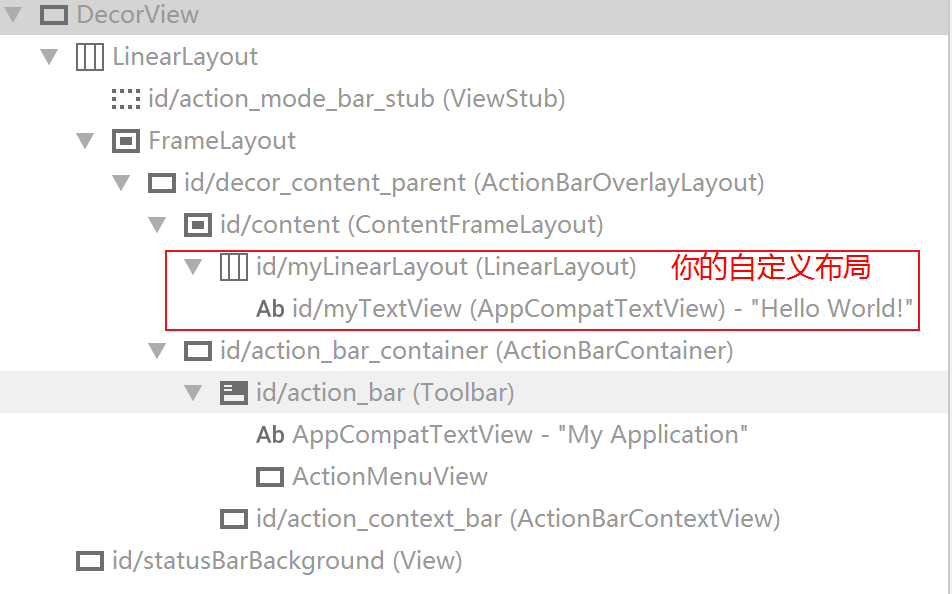
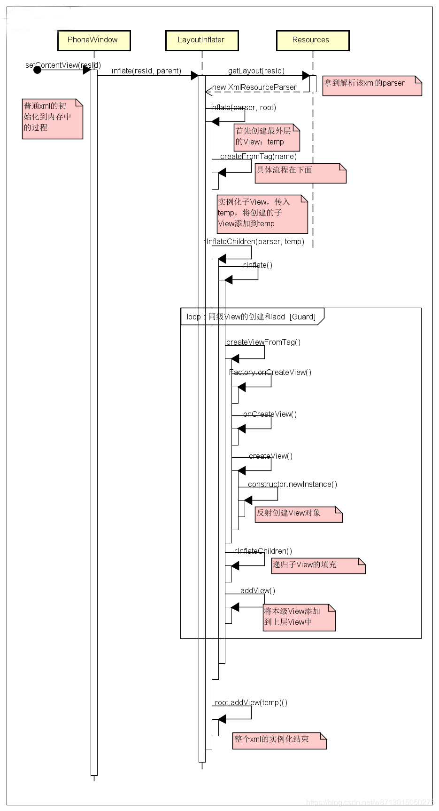

# 相关类


## Window.java、PhoneWindow.java
```text
Window 是抽象类，表示一个窗口的概念。Window是所有视图的载体。

PhoneWindow 中有个内部属性 DecorView ，
通过创建 DecorView 来加载 Activity 中设置的布局 R.layout.xxx ,

PhoneWindow 是 Window 的唯一实现类，
PhoneWindow 通过 Activity 去控制 View 。

当我们调用 Activity 的 setContentView() 时，其实最终会调用Window的setContentView()，
当我们调用 Activity 的 findViewById()时，其实最终调用的是Window的findViewById()，
这说明了 Window 是 View 的管理者。
```


## WindowManager.java ( interface )
```text
WindowManager 是外界访问Window的入口 ,
WindowManager 的主要功能是提供简单的API使得使用者可以方便地将一个控件作为一个窗口添加到系统中，
使得开发者无需关注与WMS复杂的通信过程，
通过WindowManager即可简单的添加删除窗口。

而 WindowManager 通过 Binder 机制与 WindowManagerService 进行跨进程通信，
最终把具体的实现工作交给 WindowManagerService。
```

## WindowManagerImpl.java ( class )
 ```text
private final WindowManagerGlobal mGlobal; // 实际实现者
private final Display mDisplay; //保存所属屏幕
private final Window mParentWindow; // 窗口
 ``` 
 
 
## WindowManagerGlobal.java (单例)
```text
IWindowSession sWindowSession ;// aidl ,与 WMS
ArrayList<ViewRootImpl> mRoots // 根View 的管理者
IWindowManager sWindowManagerService // adil ,WMS 在 client 的代理
ArrayList<View> mViews // 所有窗口的根View ( 即DecorView)
ArrayList<LayoutParams> mParams //布局参数
``` 


## WindowManagerService.java
```text
WMS 运行在 system_server 进程中 ，
android 的窗口管理服务 ，
要处理对输入事件的派发、
负责管理窗口 Surface 的布局等具体工作。
```

## SurfaceFlinger.cpp
```text
SurfaceFlinger 将 WMS 维护的窗口 Surface 显示到 屏幕上。
基本只做与“显示”相关的事情 。 
```

 
 ##  DecorView.java
 ```text
 DecorView extends FrameLayout 
 DecorView 是整个 Window 界面的最顶层 View。
 
可以用 Androidstudio 的工具查看 DecorView的布局。
Tools -> Layout Inspector 
 ```
 
 


 ##Activity.java
 ```text
 Activity 并不负责视图控制，它只是控制生命周期和处理事件。
 真正控制视图的是Window。 Window 通过 Activity 操作 View 。
 一个 Activity包含和维护着一个 Window 对象 ，Window才是真正代表一个窗口。
 ```
 
 

 
## ViewRootImpl.java 、ViewRoot(已经废弃)
```text
从字面上来看 ViewRootImpl 是 ViewRoot 的实现，其实不是的。
Android 2.2 中 ViewRoot 被废弃，由 ViewRootImpl 替代了。

PhoneWindow 通过 WindowManager 将 DecorView 加载其中，并将 DecorView 交给 ViewRootImpl ，
ViewRootImpl 作为 连接器，连接 DecorView 与 WMS，负责与 WMS 进行直接的通讯 。

ViewRootImpl 负责与 WMS 进行直接的通讯，
负责管理Surface，
负责触发View的测量、布局、绘制，
同时也是输入事件的中转站，

输入事件的派发处理都由ViewRootImpl触发。
它是WindowManagerGlobal工作的实际实现者，
它需要负责与WMS交互通信以调整窗口的位置大小，
以及对来自WMS的事件（如窗口尺寸改变等）作出相应的处理。
总之，ViewRootImpl是整个控件系统正常运转的动力所在 。
```

## ViewManager.java 接口
```text
是一个功能接口，定义了增、删、更新 View的能力。
void addView(xx);
void updateViewLayout(xx);
void removeView(xx);
```

## 关系图


# 总结
```text
Window 是 View 的载体，我们想要对Window进行删除，添加，更新 View 就得通过 WindowManager ，
WindowManager 与 WindowManagerService 通过 Session 进行通信，具体的实现就交给了 WindowManagerService 处理，
WindowManagerService 会为每一个 Window 创建一个 WindowState 并管理它们，
具体的渲染工作 WindowManagerService 就交给 SurfaceFlinger 处理。
```


# 提问
## Activity、Window、ViewRootImpl、DecorView之间的联系
```text
Activity 中包含一个 Window ,Window中包含一个DecorView 。
MainActivity.this.getWindow() .getDecorView();
其他的请参看上面的关系图。
```
 
## Activity 有几个 PhoneWindow (Window)
```text
只有一个。在 Activit.java 中的 attach()中创建 .
```
 


##  PhoneWindow 创建的时机
```text
在 Activit.java 中的 attach()中创建 .
final void attach( xxx) {
        attachBaseContext(context);
        mWindow = new PhoneWindow(this, window, activityConfigCallback);
        mWindow.setWindowControllerCallback(this);
}
```

##  ViewRootImpl 创建的时机
```text
用户在 添加 View的时候，最终会 跳转到 WindowManagerGlobal 的 addView(xx) ,
在这个函数中 ViewRootImpl 被创建
ViewRootImpl root = new ViewRootImpl(view.getContext(), display);
view.setLayoutParams(wparams);
this.mRoots.add(root); // ArrayList<ViewRootImpl> mRoots = new ArrayList();
```

##  Activity 创建的时机
```text
在 ActivityThread 的 performLaunchActivity( ...) 中被创建 。 
ClassLoader cl = r.packageInfo.getClassLoader();
activity = this.mInstrumentation.newActivity(cl, component.getClassName(), r.intent);
```

##  DecorView 创建的时机
```text
在 PhoneWindow 的 setContentView(...) 时会进行一系列的判断，
其中会 对 mDecor 进行判断 ，如果为空 就会进行新建。
return new DecorView(context, featureId, this, getAttributes());
```


## 除了 Activity 还有哪些方式显示 Window
```text
1、Dialog
Dialog implements  Window.Callback, , Window.OnWindowDismissedCallback ... 
Dialog( Context context, int themeResId, xx) {
    ...
    mWindowManager = (WindowManager) context.getSystemService(Context.WINDOW_SERVICE);
    final Window w = new PhoneWindow(mContext);
    mWindow = w;
}
```

##  setContentView()后的加载流程

一路追踪源码，发现用户的view是被添加到mContentParent中。
```text
ViewGroup  mContentParent = generateLayout(mDecor);
ViewGroup contentParent = (ViewGroup)findViewById(ID_ANDROID_CONTENT);
public static final int ID_ANDROID_CONTENT = com.android.internal.R.id.content;
```

## setContentView 如何把xml文件显示到 Activity中的
```text
setContentView(R.layout.activity_main)
将布局文件交给 PhoneWindow ，
1、PhoneWindow 会实例化一个 DecorView(这是每个Activity根布局)往这个布局里添加了一个 LinearLayout

2、PhoneWindow 最终交给 LayoutInflater 去处理 ，获得一个 Viwe (会被放到 DecorView中)。
先创建最外层的 View
 // Temp is the root view that was found in the xml
final View temp = createViewFromTag(root, name, inflaterContext, attrs);
然后用反射的方式 获得子View ，并添加到 temp 。

3、PhoneWindow 用 Callback 通知刷新 UI
final Callback cb = getCallback();
cb.onContentChanged();
```


## LayoutInflater 如何把xml文件显示到 Activity中的 
```text
LayoutInflater inflater = (LayoutInflater) mCtx.getSystemService(Context.LAYOUT_INFLATER_SERVICE);
View rootView = inflater.inflate(R.layout.lonlatinputwindow, null);
this.setContentView(rootView);

具体流程参看 setContentView 的流程。
```