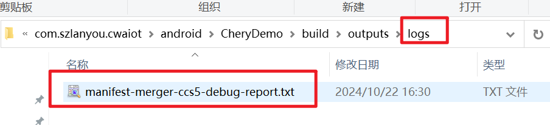

# gradle详解
```text
1、Android运行时技术
通过反射、hook等方式达到某种效果，这类黑科技往往是在运行时对于系统层面或者源码层面的动态调整。
这类技术有性能和稳定方面的缺点。
由于现在Android生态越来越重视性能问题，现在越来越多的库，开始迁移到编译期。

2、编译期处理技术
运行时对于性能的影响还有稳定性一直被人诟病，所以现在逐渐发展成编译期路线。
将我们想做的入侵编译期，最终打到我们的apk包中，达到我们想要的效果，而由于是在编译期做的处理，
所以是前置处理好的，也就没有了运行时效率的问题。
Android的编译，脱离不了Gradle 的学习。

Gradle 可以应用在移动端和后台的项目， 可用来帮忙工程构建。优点是：更快，更自动化。
Gradle是目前Android官方推荐的构建工具，不管是通过命令行还是通过AndroidStudio来build，最终都是通过Gradle来实现的。
Gradle是一个基于 Ant和 Apache Maven 概念的开源工具，它使用基于Groovy的特定领域语言(DSL)来声明项目设置，
抛弃了基于XML的各种繁琐配置。注意：Gradle不是一种语言，只是一个构建工具。

Gradle 和 Android Studio 是完全两个没有关系的东西，
Gradle有一套自己的环境，就像我们安装Java一样，需要配置环境变量等等，然后也可以通过命令行执行操作，类似于javac。
为了让 AS 便捷的使用 Gradle ，Google 就编写了一个Android Gradle Plugin 。我们能在 AS上直接使用Gradle 就是这个插件的功劳。
它一边调用Gradle本身的代码和工具来构建项目，一边调用Android SDK的编译、打包功能，从而让我们能够顺畅的在AS上进行开发。

Gradle插件有自己独立的版本号，每个版本号的插件适配了某些版本的 Gradle 。具体的适配关系为可参考android的官网。
所以我们的插件的版本和Gradle的版本一定要对应上，如果插件版本 不适配 Gradle ，Androidstudio就会报错。

一个项目中可以有多个 gradle.properties 文件，根目录下的配置会全局生效，所以我们在根目录配置了一个变量，
所有的子Module都可以读取到。但是如果我们在子项目 的gradle.properties 也配置了一个同名变量，那么它会覆盖根目录的变量。

Gradle中的所有内容都是基于 project和task 这两个基本概念。
Gradle  通过一系列的 task 来最终完成自动化构建的， 我们以生成一个可用的 apk 为例，
整个过程要经过 资源的处理，javac 编译，dex 打包，apk 打包，签名等等步骤，每个步骤就对应到 gradle 里的一个 task 。
 
Gradle的代码实质是配置脚本，执行一种类型的配置脚本时就会创建一个关联的对象。
Gradle的三种主要对象如下：
1、Gradle对象：构建初始化时创建，整个构建执行过程中只有这么一个对象，一般很少去修改这个对象。
2、Project对象：每个build.gradle会转换成一个Project对象。
3、Settings对象：每个settings.gradle会转换成一个Settings对象。
```

## Gradle的构建阶段
```text
初始化阶段
根据 setting.gradle，分析哪些项目需要被构建。

配置阶段
根据 build.gradle ，分析需要执行哪些 task 。

执行阶段
对所有的task，按顺序进行执行。
```


# gradle技巧
##  gradle查找三方包中引入的权限
```text
gradle查找三方包中引入的权限
如何找到某些特殊权限是由哪个sdk引入的
gradle在进行打包时，会将主工程、子工程以及三方sdk中的manifest文件中的内容进行合并操作，
对于权限的合并，会生成一个相应的Log文件。在 app/build/outputs下，
除了常用的 apk和mapping文件夹外，还有一个logs文件夹：
```


