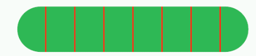
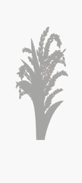
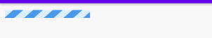

# Application 
```text
// Application 中显示 Dialog (AlertDialog) 
借助 ActivityLifecycleCallbacks 的生命周期回调 获得 Context
new AlertDialog.Builder(mContext);   

// 通过 Application  传值 缺点 
```

# EditText
## EditText 默认不获取焦点
```text
1、解决 在 PopupWindow 中 ，EditText 有时无法获取输入法焦点。
在 PopupWindow 中设置一下  this.setFocusable(true);

2、让 EditText 默认不获取焦点
在 EditText 的父容器中加入以下两个配置，让其抢夺到焦点。
android:focusableInTouchMode="true"
android:focusable="true"
```

## EditText 按下回车键隐藏光标 和收起键盘
```text
private void closeInputMethod(EditText theEditText) {
    theEditText.setCursorVisible(false); //关闭光标
    InputMethodManager imm = (InputMethodManager) context.getSystemService(Context.INPUT_METHOD_SERVICE);
    boolean isOpen = imm.isActive();
    if (isOpen) {
        imm.hideSoftInputFromWindow(theEditText.getWindowToken(), InputMethodManager.HIDE_NOT_ALWAYS);
    }
}
```


#  ImageView
## 长按和短按/点击
```text
监听点击，长按开始和长按结束
public class LyLongPressImageView extends AppCompatImageView {
    private OnClickTypeCallback clickTypeCallback;
     // 长按是否触发了
    private boolean isLongPressTriggered = false;

    public LyLongPressImageView(@NonNull Context context) {
        super(context);
        init();
    }

    public LyLongPressImageView(@NonNull Context context, @Nullable AttributeSet attrs) {
        super(context, attrs);
        init();
    }

    public LyLongPressImageView(@NonNull Context context, @Nullable AttributeSet attrs, int defStyleAttr) {
        super(context, attrs, defStyleAttr);
        init();
    }
    private void init() {
        setOnClickListener(v -> {
            if (clickTypeCallback != null) {
                clickTypeCallback.onSingleClick();
            }
        });

        setOnLongClickListener(v -> {
            isLongPressTriggered = true;
            if (clickTypeCallback != null) {
                clickTypeCallback.onLongPress(true);
            }
            return true;
        });
    }

    public void setClickTypeCallback(OnClickTypeCallback clickTypeCallback) {
        this.clickTypeCallback = clickTypeCallback;
    }

    @SuppressLint("ClickableViewAccessibility")
    @Override
    public boolean onTouchEvent(MotionEvent event) {
        if (event.getAction() == MotionEvent.ACTION_DOWN) {
            isLongPressTriggered = false;
        } else if (event.getAction() == MotionEvent.ACTION_UP) {
            if (isLongPressTriggered) {
                if (clickTypeCallback != null) {
                    clickTypeCallback.onLongPress(false);
                }
            }
        }
        return super.onTouchEvent(event);
    }

    public interface OnClickTypeCallback {
        // 点击
        void onSingleClick();
         // 长按 @param isStart true 长按开始 ，false 长按结束
        void onLongPress(boolean isStart);
    }
}
```


# TextView
## drawablePadding
```text
// 在 xml 中配置
<TextView
    android:drawableStart="@mipmap/icon_itemvideo_normal"
    android:drawablePadding="20dp"
    android:layout_width="match_parent"
    android:layout_height="match_parent" />
    
// 用代码配置    
private void setDrawable(TextView textView ,int drawableId){
    Drawable drawable= mContext.getResources().getDrawable(drawableId);
    drawable.setBounds(0, 0, drawable.getMinimumWidth(), drawable.getMinimumHeight());
    textView.setCompoundDrawables(drawable,null,null,null);
}
```


## drawable 和文字都居中 
```text
/**
<com.example.unlockview.HXDrawableCenterTextView
    android:layout_width="300dp"
    android:layout_height="100dp"
    android:background="@drawable/dispatch_round_corner_btn_green"
    android:drawableLeft="@mipmap/icon_create_add"
    android:drawablePadding="30dp"
    android:gravity="start|center_vertical"
    android:text="添加"
    android:textColor="@color/white" />

 注意 android:gravity 的设置，要 start
 */
public class HXDrawableCenterTextView extends AppCompatTextView {

    public HXDrawableCenterTextView(Context context, @Nullable AttributeSet attrs) {
        super(context, attrs);
    }

    @Override
    protected void onLayout(boolean changed, int left, int top, int right, int bottom) {
        super.onLayout(changed, left, top, right, bottom);
    }


    @Override
    protected void onDraw(Canvas canvas) {
        translateView(canvas);
        super.onDraw(canvas);
    }

    private void translateView(Canvas canvas){
        Drawable[] drawables = getCompoundDrawables();
        if(drawables==null){
            return;
        }

        Drawable drawableLeft = drawables[0]; // 这里要根据 drawableTop 还是其他来修改
        if(drawableLeft==null){
            return;
        }

        float textWidth = getPaint().measureText(getText().toString());
        int drawablePadding = getCompoundDrawablePadding();
        int drawableWidth = drawableLeft.getIntrinsicWidth();
        float bodyWidth = textWidth + drawableWidth + drawablePadding;
        canvas.translate((getWidth() - bodyWidth) /2,0);
    }
}
```

##  设置行间距
```text
1、android:lineSpacingExtra
设置行间距，如”3dp”。
2、android:lineSpacingMultiplier
设置行间距的倍数，如”1.2″。
```

## 省略号
```text
android:ellipsize="end"
android:singleLine="true"
```


## textView下划线
```text
getDataBinding().tvBindFaildReason.getPaint().setFlags(Paint.UNDERLINE_TEXT_FLAG);
或
<?xml version="1.0" encoding="utf-8"?>
<layer-list xmlns:android="http://schemas.android.com/apk/res/android">
    <item
        android:left="-2dp"
        android:right="-2dp"
        android:top="-2dp">
        <shape>
            <stroke
                android:width="2dp"
                android:color="@color/color_00BC8E" />
        </shape>
    </item>
</layer-list>
```

##  textView 展示 Emoji
```text
https://emojipedia.org/animated-noto-color-emoji/
binding.tvSceneInfo.setText("车机暂不支持场景服务\n\n场景服务请使用微信扫描左侧二维码进入“刺猬物联小程序”进行配置使用喔\uD83D\uDDA4"); 
注意：不要在xml中配置，会提示编译不过，要在代码中转义后设置。
```

##  TextView 设置滚动效果
```text
setMovementMethod
```

# DialogFragment
## 安全弹出
```text
弹窗之前 状态判断
val isLegalState = (!isFinishing) && (!isDestroyed) && (!supportFragmentManager.isStateSaved)
if (isLegalState){
    // DialogFragment 弹窗时先判断一下状态是否合法，防止 IllegalStateException
    dialogLogin?.show(supportFragmentManager, null)
}
```


# PopupWindow
## PopupWindow 设置宽高
https://gitee.com/hnyer/PopuwindowDemo
```text
1、PopupWindow  在 xml 中设置宽高无效的原因和解决方案：
PopupWindow 没有继承 Viewgroup ，因此最外层布局属性的宽高无效，
解决方法是：
1、在在xml中套两层，第二层指定长宽。 (第一层其实就相当于添加了一个 Viewgroup )
3、或者在代码中加一个 Viewgroup 就行了
2、或者在代码中设置具体宽高。

public View  initView( Context context ) {
    LayoutInflater inflater = (LayoutInflater) context .getSystemService(Context.LAYOUT_INFLATER_SERVICE);
    LinearLayout linearLayout = new LinearLayout(context);
    View rootView  = inflater.inflate(R.layout.oofaywindow, linearLayout);
    return rootView ;
}

PopupWindow + ViewPager + fragment 的组合会出现问题 No view found for id 0xxxxxxxxx
可以采用 DialogFragment + ViewPager + fragment 组合
https://gitee.com/Aivin_CodeShare/android_tool_code/raw/master/precheck2.zip
``` 

##  PopupWindow 半透明
```text
方案有两个
1、方案1
void setWindowFilter(float alpha ,Activity activity) {
    WindowManager.LayoutParams lp = activity.getWindow().getAttributes();
    lp.alpha = alpha;
    lp.dimAmount = alpha;
    activity.getWindow().addFlags(WindowManager.LayoutParams.FLAG_DIM_BEHIND);
    activity.getWindow().setAttributes(lp);
}

setOnDismissListener(new OnDismissListener() {
            @Override
            public void onDismiss() {
                setWindowFilter(1f , (Activity) context);
            }
        });
        
@Override
public void showAtLocation(View parent, int gravity, int x, int y) {
    setWindowFilter(alpha , (Activity) context);
    super.showAtLocation(parent, gravity, x, y);
}

2、方案2
android:background="#XXxxxxxx"
说明：半透明颜色值共8位，前2位是透明度，后6位是颜色。
全透明：#00000000
半透明：#80000000
不透明：#FF000000
白色半透明：#80FFFFFF
红色30%透明：#4Dca0d0d
```
## 透明度对照表

| 透明度 | 百分比 | 数值   |
| ------ | ---- | ---- |
| 不透明 | 100% | FF   |
|        | 95%  | F2   |
|        | 90%  | E6   |
|        | 85%  | D9   |
|        | 80%  | CC   |
|        | 75%  | BF   |
|        | 70%  | B3   |
|        | 65%  | A6   |
|        | 60%  | 99   |
|        | 55%  | 8C   |
| 半透明 | 50%  | 80   |
|        | 45%  | 73   |
|        | 40%  | 66   |
|        | 35%  | 59   |
|        | 30%  | 4D   |
|        | 25%  | 40   |
|        | 20%  | 33   |
|        | 15%  | 26   |
|        | 10%  | 1A   |
|        | 5%   | 0D   |
| 全透明 | 0%   | 00   |


## 透明度对照表(完整版)
```text
100% — FF    不透明度=255
99% — FC    不透明度=252
98% — FA    不透明度=250
97% — F7    不透明度=247
96% — F5    不透明度=245
95% — F2    不透明度=242
94% — F0    不透明度=240
93% — ED    不透明度=237
92% — EB    不透明度=235
91% — E8    不透明度=232
90% — E6    不透明度=230
89% — E3    不透明度=227
88% — E0    不透明度=224
87% — DE    不透明度=222
86% — DB    不透明度=219
85% — D9    不透明度=217
84% — D6    不透明度=214
83% — D4    不透明度=212
82% — D1    不透明度=209
81% — CF    不透明度=207
80% — CC    不透明度=204
79% — C9    不透明度=201
78% — C7    不透明度=199
77% — C4    不透明度=196
76% — C2    不透明度=194
75% — BF    不透明度=191
74% — BD    不透明度=189
73% — BA    不透明度=186
72% — B8    不透明度=184
71% — B5    不透明度=181
70% — B3    不透明度=179
69% — B0    不透明度=176
68% — AD    不透明度=173
67% — AB    不透明度=171
66% — A8    不透明度=168
65% — A6    不透明度=166
64% — A3    不透明度=163
63% — A1    不透明度=161
62% — 9E    不透明度=158
61% — 9C    不透明度=156
60% — 99    不透明度=153
58% — 96    不透明度=150
58% — 94    不透明度=148
57% — 91    不透明度=145
56% — 8F    不透明度=143
55% — 8C    不透明度=140
54% — 8A    不透明度=138
52% — 87    不透明度=135
52% — 85    不透明度=133
51% — 82    不透明度=130
50% — 80    不透明度=128
49% — 7D    不透明度=125
48% — 7A    不透明度=122
47% — 78    不透明度=120
46% — 75    不透明度=117
45% — 73    不透明度=115
44% — 70    不透明度=112
43% — 6E    不透明度=110
42% — 6B    不透明度=107
41% — 69    不透明度=105
40% — 66    不透明度=102
39% — 63    不透明度=99
38% — 61    不透明度=97
37% — 5E    不透明度=94
36% — 5C    不透明度=92
35% — 59    不透明度=89
34% — 57    不透明度=87
33% — 54    不透明度=84
32% — 52    不透明度=82
31% — 4F    不透明度=79
30% — 4D    不透明度=77
29% — 4A    不透明度=74
28% — 47    不透明度=71
27% — 45    不透明度=69
26% — 42    不透明度=66
25% — 40    不透明度=64
24% — 3D    不透明度=61
23% — 3B    不透明度=59
22% — 38    不透明度=56
21% — 36    不透明度=54
20% — 33    不透明度=51
19% — 30    不透明度=48
18% — 2E    不透明度=46
17% — 2B    不透明度=43
16% — 29    不透明度=41
15% — 26    不透明度=38
14% — 24    不透明度=36
13% — 21    不透明度=33
12% — 1F    不透明度=31
11% — 1C    不透明度=28
10% — 1A    不透明度=26
9% — 17    不透明度=23
8% — 14    不透明度=20
7% — 12    不透明度=18
6% — 0F    不透明度=15
5% — 0D    不透明度=13
4% — 0A    不透明度=10
3% — 08    不透明度=8
2% — 05    不透明度=5
1% — 03    不透明度=3
0% — 00    不透明度=0
```


##  透明度百分比转换成十六进制
```text
透明度以0到255表示，总共有256级，透明是0，不透明是255。
for(float i=100 ;i>=0 ;i-=1){
    float temp = i/100f;
    int alpha =  Math.round(temp * 255); // 用四舍五入的方式获得 255维度的百分比
    String hex = Integer.toHexString(alpha).toUpperCase();
    if (hex.length() == 1){
        hex = "0" + hex;
    }
    int percent = (int) (temp * 100);
    System.out.println( String.format("%d%% — %s", percent, hex) );
}
```


##  PopupWindow 里触发弹窗 , 二级弹窗
```text
在popupWindow里面再弹出popupWindow的时候会报这样的错误
ERROR/AndroidRuntime(888): android.view.WindowManager$BadTokenException: Unable to add window -- token android.view.ViewRoot$W@44ef1b68 is not valid; is your activity running? 

解决方法1
不要在当前的 popupWindow 里面继续show一个 popupWindow ，应该写一个接口回调到Activity里面进行show，

解决方法2
第二次弹窗改为 Dialog
```

## PopupWindow 触碰外边关闭
```text
    void setThisOutTouchCancel(final boolean able) { 
        setOutsideTouchable(able);
        setTouchInterceptor(new View.OnTouchListener() {
            @Override
            public boolean onTouch(View v, MotionEvent event) {
                if (!isOutsideTouchable()) {
                    View mView = getContentView();
                    if (null != mView)
                        mView.dispatchTouchEvent(event);
                }
                return isFocusable() && !isOutsideTouchable();
            }
        });
    }
```

 
## PopupWindow 获取 showAtLocation 的 parent
```text
popupWindow.showAtLocation( getContentView(MainActivity.this),  Gravity.CENTER, 0, 0);
private View getContentView(Activity activity) {
    ViewGroup view = (ViewGroup) activity.getWindow().getDecorView();
    FrameLayout content = view.findViewById(android.R.id.content);
    return content.getChildAt(0);
}
或者直接根据id获取到一个具体的view.
``` 


## PopupWindow 内部进行视图切换
```text
PopupWindow +  HorizontalScrollView 方案来做 。
scrollView.scrollTo(viewWidth*2, 0); // 
这种方案一般不要放很多特别复杂的布局，
因为那些页面都是一次加载到 HorizontalScrollView中的 。
具体参考这个demo.
https://gitee.com/hnyer/PopuwindowDemo
```


# SharedPreferences
一些简单的、无安全风险的键值对数据，可以通过 SharedPreferences 保存。
SharedPreferences 是一个轻量级的xml键值对文件 。
```text
SharedPreferences 的替代方案 ，使用腾讯的 MMKV .
https://github.com/Tencent/MMKV
// 设置 缓存失效时间
思路是 MMKV 保存配置时，将当前时间和要有效时长一起保存进去， 
取出来的时候判断一下，是否超时了。
如果超时了就返回NULL。

文件保存在 /data/data/<package name>/shared_prefs 中，明文可见。
用真机中的文件夹管理器一般看不到，可以用过 Androidstudio 去看。

在 SharedPreferencesImpl.java 中
private void startLoadFromDisk() {
    new Thread("SharedPreferencesImpl-load") {
    ...
            loadFromDisk(); // 开启子线程读取
    }.start();
}
```

## SharedPreferences  apply 和  commit 的区别
```text
apply()：提交后同步写入内存，然后异步写入磁盘，没有返回值。
commit()：需要等异步回写磁盘完成后才返回，有返回值。
如果频繁操作的话 apply 的性能会优于 commit 。 
```

## SharedPreferences   是线程安全的吗 
```text
SharedPreferences 是线程安全的，因为内部有 synchronized 关键字保障。
```


## SharedPreferences 是进程安全的吗？ 如何保证进程安全  
```text
因为 SharedPreferences 会从内存取值，但是进程间内存不是共享的，所以不是多进程安全的。
// SharedPreferencesImpl.java
public String getString(String key, @Nullable String defValue) {
    synchronized (mLock) {
        awaitLoadedLocked();
        String v = (String)mMap.get(key); // 从内存取值
        return v != null ? v : defValue;
    }
}

SharedPreferences sharedPreferences =
context.getSharedPreferences("xxxName", Context.MODE_MULTI_PROCESS);
// 因为对多进程支持不完善，MODE_MULTI_PROCESS (也不可靠) 模式也已经被废弃，
//  官方推荐 ContentProvider 或者 第三方框架 MMKV
```


# AlertDialog 按钮大小问题
```text
TextView textView =new TextView(this);
textView.setText("Hello TextView");

AlertDialog dialog =new AlertDialog.Builder(this)
        .setTitle("Hello aivin")
        .setView(textView)
        .setPositiveButton("ok_Btn", null )
        .show() ;
Button btn = dialog.getButton(AlertDialog.BUTTON_POSITIVE) ;
btn.setAllCaps(false); // 重新设置
``` 

# Dialog 全屏显示 
```text
public class LoadingDialogUtils {
    public static Dialog getLoadingDialogInstance(Context context) {
        // 根据样式创建 Dialog
        Dialog loadingDialog = new Dialog(context, R.style.iosloading_dialog);
        loadingDialog.setCancelable(false);
        // 设置自定义布局
        LayoutInflater inflater = LayoutInflater.from(context);
        View v = inflater.inflate(R.layout.wk_loading_dialog, null);
        LinearLayout layout = v.findViewById(R.id.dialog_view);
        int width = MyDeviceInforHelper.getWidth((Activity) context);
        int height = MyDeviceInforHelper.getRealHeight( (Activity) context) ;
        ViewGroup.LayoutParams layoutParams = new  ViewGroup.LayoutParams(  width   , height);
        loadingDialog.setContentView(layout, layoutParams );
        layout.setBackgroundColor(Color.parseColor("#80000000"));// 设置自定义背景颜色
        loadingDialog.getWindow().setBackgroundDrawable(new ColorDrawable(Color.TRANSPARENT));// 设置window背景
        loadingDialog.getWindow().setLayout(ViewGroup.LayoutParams.MATCH_PARENT, ViewGroup.LayoutParams.MATCH_PARENT);
        return loadingDialog;
    }
}

<style name="iosloading_dialog" parent="android:Theme.Dialog">
    <item name="android:windowFrame">@null</item>
    <item name="android:windowBackground">@android:color/transparent</item>
    <item name="android:windowNoTitle">true</item>
    <item name="android:windowIsTranslucent">true</item>
    <item name="android:windowIsFloating">true</item>
    <item name="android:windowContentOverlay">@null</item>
    <item name="android:backgroundDimEnabled">false</item>
    <item  name= "android:windowFullscreen" >true </item>
</style>

public static int getRealHeight(Activity mActivity) {
    mActivity.getWindowManager().getDefaultDisplay().getRealMetrics(myGetDisplayMetrics());
    return  myGetDisplayMetrics().heightPixels;
}
```

# SeekBar

## SeekBar 进度条显示不全、显示不顶格的问题
```text
<SeekBar
    android:layout_width="match_parent"
    android:layout_height="wrap_content"
    android:layout_gravity="center_vertical"
    android:thumbOffset="0dp" // 解决thumb只显示一半的问题
    android:paddingEnd="0dp"// 解决显示不顶格的问题
    android:paddingStart="0dp"
    android:maxHeight="1.5dp"
    android:minHeight="1.5dp"
    android:progressDrawable="@drawable/seek_progress"
    android:thumb="@drawable/seek_thumb" />
```

## 点击或拖动的分段进度条
```text
https://gitee.com/Aivin_CodeShare/android_tool_code/raw/master/WkProgressView.java
```



## ClipDrawable 实现图片进度条 效果
```text
<?xml version="1.0" encoding="utf-8"?>
<clip xmlns:android="http://schemas.android.com/apk/res/android"
    android:drawable="@mipmap/pic_1"
    android:clipOrientation="vertical"
    android:gravity="bottom">
</clip>

ImageView imageview =  findViewById(R.id.clipImg);
final ClipDrawable drawable = (ClipDrawable) imageview.getDrawable();
drawable.setLevel( 0);

// 10000 是满级
int level = (int) (10000 *  i* 0.01);
drawable.setLevel( level);

demo 地址 https://gitee.com/Aivin_CodeShare/android_tool_code/raw/master/PicProgressDemo.zip
```


 
## 动态条纹背景进度条
```text
方案1、简单使用
<ImageView
   android:layout_width="90dp"
   android:layout_height="10dp"
   android:scaleType="centerCrop"
   // 一张静态的条纹图片
   android:src="@drawable/pic_cover_blue_white" />
   
ViewGroup.LayoutParams lp = mProgressIv.getLayoutParams();
lp.width = (int) (ivWidth* percentFloat); // 不断更改 imageview的长度，配合 android:scaleType="centerCrop"
mProgressIv.setLayoutParams(lp);
mProgressIv.postInvalidate();

方案2 ，参考无限循环的游戏背景思路，用两张图片不断地动画循环。
```


 
 #  ListView 动态改变高度
 ```text
 public void setListViewHeightBasedOnChildren2(ListView listView) {
     ListAdapter listAdapter = listView.getAdapter();
     if (listAdapter == null) {
         return;
     }
     int totalHeight = 0;
     for (int i = 0; i < listAdapter.getCount(); i++) {
         View listItem = listAdapter.getView(i, null, listView);
         // 对 子View item 不做限制，要多大就报上来多大
         listItem.measure(View.MeasureSpec.UNSPECIFIED, View.MeasureSpec.UNSPECIFIED);
         totalHeight += listItem.getMeasuredHeight();
     }
 
     ViewGroup.LayoutParams params = listView.getLayoutParams();
     params.height = totalHeight + (listView.getDividerHeight() * (listAdapter.getCount() -1));
     listView.setLayoutParams(params);
 }
 ```

# 约束布局 ConstraintLayout
ConstraintLayout 是一个ViewGroup，可以在 Api9 以上的Android系统使用它，它的出现主要是为了解决布局嵌套过多的问题。
在开发过程中经常能遇到一些复杂的UI，可能会出现布局嵌套过多的问题，ConstraintLayout 使用起来比 RelativeLayout 更灵活。
```text
api 'androidx.constraintlayout:constraintlayout:2.0.2'

<Button
    android:layout_width="wrap_content"
    android:layout_height="wrap_content"
    app:layout_constraintLeft_toLeftOf="parent"
    app:layout_constraintRight_toRightOf="parent"
    app:layout_constraintTop_toTopOf="parent"
    app:layout_constraintBottom_toBottomOf="parent" />

// 角度约束 (版本1.1中加入)
一个控件在某个控件的某个角度的位置，通过其他的布局其实是不太好实现的，
但是 ConstraintLayout 提供了角度位置相关的属性
app:layout_constraintCircle=""         目标控件id
app:layout_constraintCircleAngle=""    对于目标的角度(0-360)
app:layout_constraintCircleRadius=""   到目标中心的距离

// 百分比偏移
让控件在父布局的水平方向或垂直方向的百分之多少的位置，可以使用如下属性：
app:layout_constraintHorizontal_bias=""   水平偏移 取值范围是0-1的小数
app:layout_constraintVertical_bias=""     垂直偏移 取值范围是0-1的小数

// A依赖B ，B被Gone时，A距离父控件的距离。
app:layout_goneMarginBottom="0dp"
app:layout_goneMarginEnd="0dp"
app:layout_goneMarginLeft="0dp"
app:layout_goneMarginRight="0dp"
app:layout_goneMarginStart="0dp"
app:layout_goneMarginTop="0dp"

//设置宽高比例
给宽或者高其中一个设置为0dp，然后设置该属性是一个比例，宽和高的比
layout_constraintDimensionRatio

// Chain 链
Chain 链是一种特殊的约束让多个 chain 链连接的 Views 能够平分剩余空间位置。
最相似的应该是 LinearLayout 中的权重比 weight ，
但 Chains 链能做到的远远不止权重比 weight 的功能。
Chain 链是由多个 Views 组合的，所以要创建一个 Chain 链就需要先选择多个想要链接到一起的 Views ，
然后再右键选择 'Center Horizontally' 或者 'Center Vertically' 来创建水平链或者垂直链。
Chain 链的创建定义的是 Chain 链组件之间的间隙关系，并不影响原有的非成员间的约束。

Chain 链模式一共有三种，分别为：spread ，spread_inside 和 packed 。
1、默认 spread 模式：
将平分间隙让多个 Views 布局到剩余空间。
2、spread_inside 模式：
它将会把两边最边缘的两个 View 到外向父组件边缘的距离去除，
然后让剩余的 Views 在剩余的空间内平分间隙布局。
3、 packed ：
它将所有 Views 打包到一起不分配多余的间隙 ，然后将整个组件组在可用的剩余位置居中。
```

## ConstraintLayout 常用属性
| 属性                                       | 意义                                                         |
| ------------------------------------------ | ------------------------------------------------------------ |
| app:layout_constraintLeft_toLeftOf         | 此控件的左边框与某个控件的左边框对齐                         |
| app:layout_constraintLeft_toRightOf        | 此控件的左边框与某个控件的右边框对齐或者在其右边             |
| app:layout_constraintRight_toLeftOf        | 此控件的右边框与某个控件的左边框对齐或在其左边               |
| app:layout_constraintRight_toRightOf       | 此控件的右边框与某个控件的右边框对齐                         |
| app:layout_constraintTop_toTopOf           | 此控件的顶部边框与某个控件的顶部边框水平对齐                 |
| layout_constraintTop_toBottomOf            | 此控件的顶部边框与某个控件的底部边框水平对齐或在其下边       |
| app:layout_constraintBottom_toTopOf        | 此控件的底部边框与某个控件的顶部边框水平对齐或其上边         |
| app:layout_constraintBottom_toBottomOf     | 此控件的底部边框与某个控件的底部边框水平对齐或其上边         |
| app:layout_constraintBaseline_toBaselineOf | 此控件与某个控件水平对齐                                     |
| layout_constraintStart_toEndOf             | 此控件的左边界在某个控件右边界的右边，及表示此控件在某个控件的右边 |
| layout_constraintStart_toStartOf           | 此控件的左边界与某个控件的左边界在同一垂直线上               |
| layout_constraintEnd_toStartOf             | 此控件的右边界与某个控件的左边界在同一垂直线上               |
| layout_constraintEnd_toEndOf               | 此控件的右边界与某个控件的右边界对齐                         |


##  ConstraintLayout 两个按钮居中设置
```text
<androidx.constraintlayout.widget.ConstraintLayout>
    <Button
        android:id="@+id/button1"
        android:layout_width="wrap_content"
        android:layout_height="match_parent"
        app:layout_constraintHorizontal_chainStyle="packed"
        app:layout_constraintBottom_toBottomOf="parent"
        app:layout_constraintLeft_toLeftOf="parent"
        app:layout_constraintRight_toLeftOf="@id/button2"/>
    <Button
        android:id="@+id/button2"
        app:layout_constraintBottom_toBottomOf="parent"
        app:layout_constraintHorizontal_chainStyle="packed"
        app:layout_constraintLeft_toRightOf="@id/button1"
        app:layout_constraintRight_toRightOf="parent"
        android:layout_width="wrap_content"
        android:layout_height="match_parent"
        app:layout_goneMarginStart="0dp"
        android:layout_marginStart="120dp" />
</androidx.constraintlayout.widget.ConstraintLayout>
```


# Placeholder
```text
占位控件 androidx.constraintlayout.widget.Placeholder，如果只是单纯占一个位置，做间隔使用。跟View 占位差不多。
但是 Placeholder 支持动态将其他控件加载到这个占位中来。 
placeholder.setContentId(R.id.iv_device);
```


# viewpager2
```text
改变 viewpager的绘制顺序
RecyclerView recyclerView = (RecyclerView) getViewPager2().getChildAt(0);
recyclerView.setChildDrawingOrderCallback((childCount, i) -> {
    int indexOfView;
    if (1 == i) {
        indexOfView = 2;
    } else if (2 == i) {
        indexOfView = 1;
    } else {
        indexOfView = i;
    }
    if (indexOfView <= childCount - 1) {
        return indexOfView;
    } else {
        return i;
    }
});*/
```


# WebView详解
```text
[ Android4.4, +∞) Chromium内核取代了Webkit内核。
[ Android5.0, +∞) WebView移植成了一个独立的apk，可以不依赖系统而独立存在和更新。
[ Android7.0, +∞) 如果用户手机里安装了 Chrome ， 系统优先选择 Chrome 为应用提供 WebView 渲染。
[ Android8.0, +∞) 默认开启WebView多进程模式，即WebView运行在独立的沙盒进程中。

WebView屏蔽长按出现的复制 分享 全选等：
webview.setOnLongClickListener(new View.OnLongClickListener() {
@Override
public boolean onLongClick(View v) {
return true;
}
});
```

##  webView 与反射的处理
```text
因为 WebView 可以使用js，当系统级应用使用 WebView 时，
这个 WebView 就会因为是系统级应用而获取所有的权限，使得整个程序变得不安全，因此系统级应用被禁止使用 WebView 。
如果系统应用想要使用 WebView ，就需要对 webview 进行反射处理。处理的方法，奇瑞iot APP中有。
```


# RecyclerView 控件
```text
RecyclerView 是 Google 在2014年的IO大会首次提出来。
implementation 'com.android.support:recyclerview-v7:26.1.0'
implementation 'com.android.support:recyclerview-v7:26.0.0'
implementation 'androidx.recyclerview:recyclerview:1.0.0'
RecyclerView 可以替代 ListView 和 GridView 。
```

##  recyclerview 源码阅读
```text
androidx.recyclerview:recyclerview:1.0.0 的源码拷贝出来
重新理解、注释一部分。
https://gitee.com/hnyer/AndroidxRecyclerviewSource
```


## RecyclerView 插拔式设计
```text
RecyclerView 在设计方面上非常的灵活，
不同的部分承担着不同的职责。
每一个人都可以根据自身的需求来定义不同的部分。

Adapter 负责提供数据、创建ViewHolder、绑定数据，
LayoutManager 负责 ItemView 的测量和布局，
ItemAnimator 负责每个ItemView的动画，
ItemDecoration 负责每个 ItemView 的间隙。
```

## RecyclerView 的优点
```text
RecyclerView 是一个展示大量数据的控件，
相比较 ListView ,RecyclerView 有非常出色的缓存机制，
在性能方面相比于 ListView 提升了不少。
同时由于 LayoutManager 的存在,
让 RecyclerView 不仅有 ListView 的特点，
同时兼有 GridView 的特点 ，还可以有瀑布流布局。
```
 

##  RecyclerView 与 listview 的区别
```text
RecyclerView 是 listview 的升级版，具有更高灵活、扩展 。
1、RecyclerView 默认实现了 线性布局、网格布局、流式布局。
2、RecyclerView 取消了 setEmptyView() 、 addHeaderView() 、 addFooterView() 对应的 UI效果需要自己去实现。
3、RecyclerView 提供了 局部刷新的 接口  notifyItemChanged(position) 
4、RecyclerView 提供了部分 动画效果。listview 完全靠自定义 。
5、RecyclerView 实现嵌套滚动机制 。
```
 
## RecyclerView 自定义 LayoutManager 
```text
默认提供了 
线性布局 LinearLayoutManager 、
网格布局 GridLayoutManager 、
瀑布流布局 StaggeredGridLayoutManager 。
------------------
extends RecyclerView.LayoutManager 
重写以下函数
onLayoutChildren()  // 
getItemCount() 
canScrollVertically() 
scrollVerticallyBy()
```


##  RecyclerView 自定义间隔线  、边界样式 、ItemDecoration
```text
recyclerView.addItemDecoration(xx);
https://gitee.com/Aivin_CodeShare/android_tool_code/raw/master/RecyclerView/RecyclerViewMarginDecoration.java

// 瀑布流和网格布局的，四周有颜色边线的
https://gitee.com/Aivin_CodeShare/android_tool_code/raw/master/MarginDecorationForStaggered.java
```
 

## RecyclerView 使用自带动画
注意，使用 notifyDataSetChanged() 时无法触发动画的。
```text
RecyclerView 自带一个动画 DefaultItemAnimator ，默认开启。
在增加、删除 、更新 item 时都会触发。
recyclerView.setItemAnimator(null); // 去掉默认动画

Adapterxxx 适配器中...
public void addOneItem(int position ,String value){
    if(datas==null){
        return ;
    }
    datas.add(position,value) ; 
    notifyItemInserted(position);// !
    if (position == 0) {
        recyclerView.scrollToPosition(0);
    }
}

public void removeOnItem(int position){
    if(datas==null){
        return ;
    }
    if(datas.size()<=0){
        return ;
    }
    datas.remove(position) ;
    notifyItemRemoved(position); // !
}

public void itemSwap(int from, int to) {
    Collections.swap(datas, from, to);
    if (to == 0) {
        recyclerView.scrollToPosition(0);
    }
    notifyItemMoved(from, to); // !
}

public void updateItem(int position, String s) {
    datas.set(position, s);
    notifyItemRangeChanged(position, 1); // !
}

// 动画时间
DefaultItemAnimator defaultItemAnimator = new DefaultItemAnimator();
defaultItemAnimator.setRemoveDuration(200);
defaultItemAnimator.setAddDuration(200);
defaultItemAnimator.setMoveDuration(200);
defaultItemAnimator.setChangeDuration(2000);
recyclerView.setItemAnimator(defaultItemAnimator);
```


## RecyclerView 自定义动画、添加动画 
```text
一般都是模仿自带的动画 DefaultItemAnimator 去实现。

可以参考 https://github.com/wasabeef/recyclerview-animators 的实现。
val recyclerView = findViewById<RecyclerView>(R.id.list)
recyclerView.itemAnimator = SlideInUpAnimator(OvershootInterpolator(1f))
```


## RecyclerView 自定义滑动效果
```text
可以通过 自定义  RecyclerView 的 LayoutManager 去实现。

可以参考 https://gitee.com/hnyer/GalleryDemo 
```


## RecyclerView 自定义回收策略
```text
自定义 ViewCacheExtension 。用的较少。
```


## RecyclerView 绘制流程
```text
RecyclerView 就是一个 ViewGroup ，
```


## RecyclerView 局部刷新 
```text
DiffUtil 是 专门为RecyclerView更新item设计的。
可以精确到某个Item上某个具体的TextView，或者ImageView的刷新。
使我们的app每次刷新消耗的资源较小。 

adapter.notifyDataSetChanged(); //  全部刷新
adapter.notifyItemChanged(position);//刷新某Item中的所有组件
adapter.notifyItemChanged(position, payloads); //刷新某Item中的部分组件。 配合 DiffUtil
```

 
##  RecyclerView 滚动机制
```text
RecyclerView 之所以能滚动，就是因为它在监听到手指滑动之后，反复 layout 子View，不断更 Item 的位置。
```

## RecyclerView 缓存 、复用 机制
```text
// 缓存匹配顺序
先从 1 级找，然后 2 级 ，然后3级 ，然后4 级，若找不到就走 onCreateViewHolder 。
```

| 缓存级别 | 关键对象                        | 说明                                                         |
| :------- | :------------------------------ | :----------------------------------------------------------- |
| 1级      | mAttachedScrap 和 mChangedScrap | 屏幕上的 HolderView 从 RecyclerView 的布局中被 拿下来后，存放到 mAttachedScrap 中 ， 这些 holderView 并不参与回收复用， 单纯只是为了先从RecyclerView中拿下来，再重新布局上去。对于新布局中没有用到的HolderView，才会从 mAttachedScrap 移到 mCachedViews 中，让它参与复用。 |
|          | mCachedViews                    | 它的 size 默认是 DEFAULT_CACHE_SIZE= 2，只能保存两个HolderView。   <br/>这里保存的始终是最新鲜被移除的HolderView，   <br/>当 mCachedViews 满了以后，会利用先进先出原则，把老的 HolderView 存放在 mRecyclerPool 中。   <br/>它的作用是在需要新的 HolderView 时，精确匹配是不是刚移除的那个，     如果是，就直接返回给 RecyclerView 展示，如果不是它，那么即使这里有 HolderView 实例， 也不会返回给 RecyclerView，而是到 mRecyclerPool 中去找一个HolderView实例返回给 RecyclerView ，让它重新绑定数据使用。 |
| 3级      | mViewCacheExtension             | 是一个帮助类，让开发者可以自己控制View 缓存。<br/>Recycler不会在这个类中做任何缓存View的操作，是否需要缓存View由开发者自己控制。我们一般不会用到，使用系统自带的回收池即可。 |
| 4级      | mRecyclerPool                   | mRecyclerPool  默认size是  DEFAULT_MAX_SCRAP =5。   <br> 在 mAttachedScrap 、mCachedViews 中的 holderView 都是精确匹配的， 真正被标识为废弃的是存放在 mRecyclerPool 中的 holderView ，  <br> 当我们向 RecyclerView 申请一个 HolderView 来使用的时，  <br> 如果在 mAttachedScrap 、 mCachedViews 精确匹配不到，  <br> 即使他们中有 HolderView 也不会返回给我们使用，  <br>而是会到 mRecyclerPool 中去拿一个废弃的HolderView返回给我们。 |


## 如何判断 item 是否复用
```text
如果是新创建的View，
则会先调用 onCreateViewHolder 来创建View，然后调用 onBindViewHolder 来绑定数据 ；
如果是复用的View，就只会调用 onBindViewHolder 而不会调用 onCreateViewHolder 。

如果数据有 100 个，
没有复用机制，会创建 100个 itemView + 绑定100次数据。
有复用机制，有可能只绑定 20个 itemView + 100次数据绑定，
并且是一次性创建并绑定完，容易导致 ANR 。
```
 

##  RecyclerView 嵌套滑动 机制
```text
Android 5.0推出了嵌套滑动机制，在之前，一旦子View处理了触摸事件，
父View就没有机会再处理这次的触摸事件，而嵌套滑动机制解决了这个问题

为了支持嵌套滑动，
子View必须实现 NestedScrollingChild 接口，
父View必须实现 NestedScrollingParent 接口。
```

##  RecyclerView 滑动卡顿
```text
1、嵌套布局滑动冲突 导致卡顿假象
内部的滑动控件消费了滑动操作, 外部的滑动控件就再也没机会响应这个滑动操作了。

2、嵌套布局层次太深。过多的测量，绘制布局可能会导致滑动卡顿。

3、在 onCreateViewHolder / onBindViewHolder 中做了耗时的操作导致卡顿。
类似 Bitmap 解码一类的耗时操作，不要在它们里面进行。

4、如果 ScrollView 中有 RecyclerView ，会导致滑动不流畅，
原因是因为滑动冲突了，此时禁用 RecyclerView 的滑动即可。
xx.setNestedScrollingEnabled(false);
```


##  RecyclerView 万能适配器
实际使用中 可以使用 一些封装过的 第三方 适配器，提高开发速度。
```text
https://github.com/CymChad/BaseRecyclerViewAdapterHelper
```

## RecyclerView 不规则布局
```text
可以利用 setSpanSizeLookup( )实现。
比如 比如第一行一列，第二行 3列。
```


## RecyclerView 问答
###  RecyclerView 的缓存结构是怎样的？ 缓存的是什么？cachedView 会执行 onBindView 吗?
### RecyclerView 嵌套 RecyclerView，NestScrollView 嵌套 ScrollView 滑动冲突
### 讲一下 RecyclerView 的缓存机制,滑动10个，再滑回去，会有几个执行 onBindView
### 如何实现 RecyclerView 的局部更新，用过 payload 吗, notifyItemChange 方法中的参数？
### RecyclerView 防止内存OOM的一道题，充分利用自身的缓存机制
### RecyclerView 和 ListView 区别、特点、缓存 、懒加载、局部刷新 ,多种type场景下怎么避免滑动卡顿 ,怎么优化滑动
### RecyclerView 缓存结构，RecyclerView 预取，RecyclerView 局部刷新
### RecyclerView 里面那个 mChangedScrap, mAttachedScrap  之类的到底是在做什么 ? 


## RecyclerView 常用函数
### computeVerticalScrollOffset
已经向下滚动的距离，为0时表示已处于顶部。

### computeVerticalScrollRange
整体的高度， 包括在显示区域之外的。


### computeVerticalScrollExtent
显示区域的高度。

## RecyclerView 实际使用
### RecyclerView  +  RadioGroup RadioButton 防止数据错乱 处理
```text
https://gitee.com/Aivin_CodeShare/android_tool_code/raw/master/PreFlightCheckAdapter.java
``` 

###  RecyclerView + 瀑布流  + Glide 长宽比加载
RecyclerView 、瀑布流  、 Glide 长宽比加载 、加载更多、缩略图

```text
完整代码请参看 AivinReader ，里面有示例。
StaggeredGridLayoutManager layoutManager ;// 瀑布流  
recyclerView.setLayoutManager(layoutManager);
recyclerView.addItemDecoration( ); // 间隔

// 通过添加监听，实现加载更多功能
recyclerView.addOnScrollListener 

 if (newState == RecyclerView.SCROLL_STATE_IDLE) {
    int []  positions = manager.findLastVisibleItemPositions(null);
    int lastPos=0 ;
    for(int pos : positions){
        if(pos > lastPos){
            lastPos = pos;
        }
    }
    int itemCount = manager.getItemCount();

    // 判断是否滑动到了最后一个item，并且是向上滑动
    if (lastPos == (itemCount - 1) && isSlidingUpward) {
        //加载更多
        onLoadMore();
    }
}

public void getItemOffsets( ) {
    super.getItemOffsets(outRect, view, parent, state);

    int left;
    int right= margin;
    int top;
    int bottom =0;

    StaggeredGridLayoutManager.LayoutParams params = (StaggeredGridLayoutManager.LayoutParams) view.getLayoutParams();
    int position = params.getSpanIndex();
    if (position == RecyclerView.NO_POSITION) {
        return;
    }

    WkLog.showLog("position=="+position);
    // top
    if(position < columnCount ){
        top = margin ;
    }else{
        top = 0 ;
    }

    // left
    if(position%columnCount == 0){
        left = margin ;
    }else{
        left = 0 ;
    }
    outRect.set(left, top, right, bottom);
}
        
// 先通过 glide 获得实际的图片长宽比 ，最后加载的时候按照长宽比来加载        
private void loadPic2GetScale(PicBean picBean){
    Glide.with(context)
            .load(picBean.getPicUrl())
            .into(new SimpleTarget<Drawable>() {
                @Override
                public void onResourceReady(@NonNull Drawable resource, @Nullable Transition<? super Drawable> transition) {
                    float scale = resource.getIntrinsicWidth() / (float) resource.getIntrinsicHeight();
                    picBean.setScale(scale); // k = w / h
                    notifyDataSetChanged();
                }
                @Override
                public void onLoadFailed(@Nullable Drawable errorDrawable) {
                    super.onLoadFailed(errorDrawable);
                    WkLog.showLog("获取图片长宽比失败0=" );
                }
            });
}

int screenWidth = (int) (MyDeviceInforHelper.getScreenWidth(context)/columnCount);
            final ViewGroup.LayoutParams layoutParams =chooseHolder.picShowIv.getLayoutParams();
            layoutParams.width = screenWidth ;
            layoutParams.height = (int) (layoutParams.width / bean.getScale());
Glide.with(context)
        .load(bean.getPicUrl())
        .placeholder(R.mipmap.loading2)
        .thumbnail(0.5f) // 缩略图为原图的 0.1倍
        .transition(new DrawableTransitionOptions().crossFade())
        .into(chooseHolder.picShowIv);
```


### RecyclerView + 瀑布流 bug 
```text
瀑布流异步加载网络图片时，往回滑动时，可能出现图片重排列的动画。

// 出现跳动和重新排列的原因
由于我们加载的图片高度不确定，而当我们向RecyclerView下方滑动一段距离后，
由于ViewHolder的回收机制，item的尺寸并不确定，滑回到上方时Item需要重新自行绘制，
于是这个又导致重绘，所以会有闪烁、跳动等问题。

// 所以我们要解决的问题就是：
在 onBindViewHolder 前确定了Item的尺寸。

解决方案有两个：
1、自己本地做一个图片加载服务之类的，
只有图片信息获取完毕之后，再去加载 adapter
2、如果觉得方法1要等待时间太长影响体验，
可以让服务器返回 json 数据时，带上图片的长宽比例即可。

搜索网络上有人给出的解决方案 
layoutManager.setGapStrategy(StaggeredGridLayoutManager.GAP_HANDLING_NONE) 
我试了之后并没有用，设置后 RecyclerView 显示空白，加载不出图片。所以放弃。

// 最终解决办法：
1、通过事先获取图片的长宽比 解决重新对其问题。
2、如果有上滑加载更多的功能，还需要进一步操作。
if(mFirst){
    notifyDataSetChanged();
    mFirst = false ;
}else {
    notifyItemRangeInserted(start ,pageData.size()); // 需要使用这个局部刷新
}

注意不要在滚动监听里调用 invalidateSpanAssignments ，否则会导致重排。
manager.invalidateSpanAssignments(); // ！

这里放了一个 瀑布流demo .
https://gitee.com/hnyer/WaterfallFlow
```

 
  

 
### RecyclerView 修改滑动速度  
```text
如果 RecyclerView item 布局比较复杂，虽然有复用机制，
但是如果速度过于快速，会导致内存飙升比较快。
所以我们可以利用反射的方式 对 RecyclerView 的滑动速度做一个限制。
可以避免过快加载内容，一定程度上减少APP不卡顿不掉帧。

private void setMaxFligVelocity(RecyclerView recyclerView ,int velocity){
    try {
        Field field = recyclerView.getClass().getDeclaredField("mMaxFlingVelocity");
        field.setAccessible(true);
        field.set(recyclerView ,velocity);
    } catch ( Exception e) {
        e.printStackTrace();
    }
    int speedAfter =recyclerView.getMaxFlingVelocity();
    WkLog.showLog("设置后最大滑动速度="+ speedAfter);
}
```
 
 

### RecyclerView 快速拖动条
完整代码请参看 AivinReader 
```text
app:fastScrollEnabled="true"
app:fastScrollHorizontalThumbDrawable="@drawable/recyclerview_thumb_drawable"
app:fastScrollVerticalThumbDrawable=  "@drawable/recyclerview_thumb_drawable"
app:fastScrollHorizontalTrackDrawable="@drawable/recyclerview_line_drawable"
app:fastScrollVerticalTrackDrawable=  "@drawable/recyclerview_line_drawable"

宽度可以通过设置。注：高度不生效。
<size android:height="80dp"
    android:width="50dp"/>
如果 Thumb 、TrackDrawable 的宽不一样，那么就是大的那个来确定。


系统自带的，有人觉得数据太多的时候滑块的高度太小了，
想要一个固定高度的滑块。系统的是没办法了，因为并没有对外提供可以修改的东西。

我们可以使用第三方的库
//1、 https://github.com/quiph/RecyclerView-FastScroller  
耦合性弱 ，传入一个 RecyclerView 作为参数 , 不支持瀑布流 StaggeredGridLayoutManager 布局

//2、  https://github.com/timusus/RecyclerView-FastScroll
FastScrollRecyclerView extends RecyclerView  ,效果跟系统自带的比较像
Supports vertical RecyclerViews using either LinearLayoutManager or GridLayoutManager
不支持  StaggeredGridLayoutManager

// 3、 https://github.com/myinnos/AlphabetIndex-Fast-Scroll-RecyclerView
A Powerful AlphabetIndex FastScroller for Android's RecyclerView 
仿照微信带字母索引的那种样式

//4 、RecyclerViewFastScroller 自定义的一个 View
支持  StaggeredGridLayoutManager ，AivinReader 中有用上。
https://gitee.com/Aivin_CodeShare/android_tool_code/raw/master/RecyclerViewFastScroller.java
https://github.com/AndroidDeveloperLB/LollipopContactsRecyclerViewFastScroller
``` 


# TextClock
```text
利用 TextClock 显示实时时间。
<TextClock
    android:id="@+id/tvTest2"
    android:textSize="30dp"
    android:background="#ff0000"
    android:textColor="#ffffff"
    android:format12Hour="HH:mm:ss"
    android:format24Hour="HH:mm:ss"
    android:text="23:40"
    android:layout_centerInParent="true"
    android:layout_width="wrap_content"
    android:layout_height="wrap_content"/>
```

