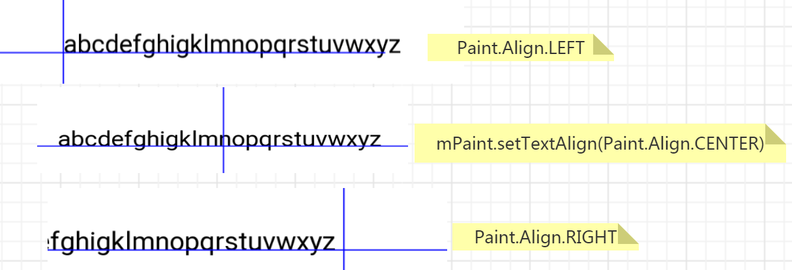
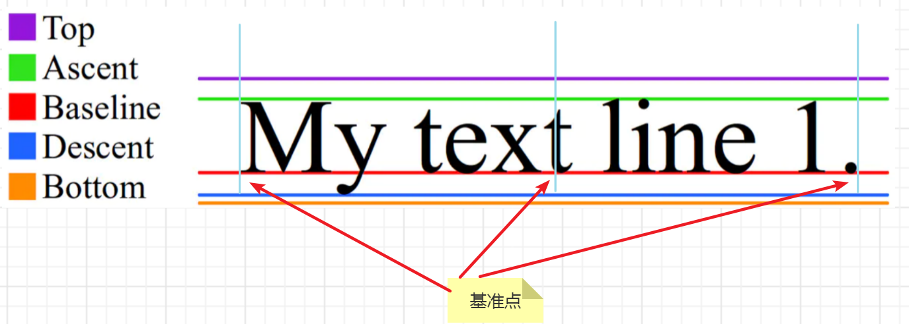
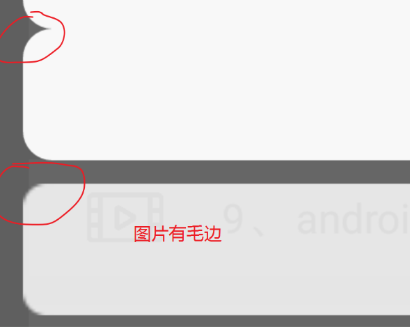

# UI 绘制的类和函数
## LayoutInflater
它的作用类似于 findViewById(),不同点是LayoutInflater是用来找 layout 下xml布局文件，并且实例化。
而findViewById() 是找具体xml下的具体控件。
```text
LayoutInflater inflater1 = activity.getLayoutInflater();
LayoutInflater inflater2 = LayoutInflater.from(this);
LayoutInflater inflater3 = (LayoutInflater)activity.getSystemService(LAYOUT_INFLATER_SERVICE);

// XmlPullParser parser, ViewGroup root, boolean attachToRoot
// 参数意义：parser :R.layout.abc , root :root布局   attachToRoot :是否加到root布局中
View itemView=inflater1.inflate(R.layout.abc, null);

注意：
通过 inflate 获得的view 是获取到的长宽都是为0 。
// itemView.getWidth() 、itemView.getHeight() 都会为0

为了能获得长宽，我目前采用的是如下方式 ：
将这个布局放到启动页下 ，通过 findViewById 的方式获取到后 保存起来给其他用 。
```

## MeasureSpec
```text
MeasureSpec 通过一个int数值 (widthMeasureSpec 、heightMeasureSpec) 保存“模式”和“大小”，
前2位表示“大小的模式” ，后30bit表示 “尺寸大小”
int mode=MeasureSpec.getMode(widthMeasureSpec);
int size=MeasureSpec.getSize(widthMeasureSpec);
    
//MeasureSpec.AT_MOST
父容器给子View一个极限值，最多可以多少。这个值可以用 getSize()获取到
int widthSize =MeasureSpec.getSize(widthMeasureSpec)

//MeasureSpec.EXACTLY ,用的较多
父容器给子View指定了一个明确的值，这个值可以用 getSize() 获取到
int widthSize =MeasureSpec.getSize(widthMeasureSpec)

//MeasureSpec.UNSPECIFIED ,很少用
父容器不约束子View的大小。
```


## onMeasure() 测量自己
```text
测量 View 的大小 ，决定了 view 本身的大小。
子View 根据父容器传入的对自己的约束参数，根据自己的实际情况进行修改最终确认后
再把修改结果告诉父容器。

父容器传给 子View 的模式是 UNSPECIFIED 还是 AT_MOST ，
是根据 子View 在 xml(或代码) 的配置 和 父容器自己的条件来决定的。
具体原理移步阅读 getChildMeasureSpec() 源码 。

@Override
protected void onMeasure(int widthMeasureSpec, int heightMeasureSpec) {
    int measureWidth = getMyViewSize(100, widthMeasureSpec);
    int measureHeight = getMyViewSize(200, heightMeasureSpec);
    setMeasuredDimension(measureWidth, measureHeight);
}
private int getMyViewSize(int defaultSize, int measureSpec) {
    int result = defaultSize;
    int specMode = MeasureSpec.getMode(measureSpec);
    int specSize = MeasureSpec.getSize(measureSpec);
    // 这里的处理只是举例，实际开发中需要根据自己的控件类型修改方案
    switch (specMode) {
        case MeasureSpec.UNSPECIFIED:
            result = defaultSize;
            break;
        case MeasureSpec.AT_MOST:
            result = defaultSize;
            break;
        case MeasureSpec.EXACTLY:
            result = specSize;
            break;
    }
    return result;
}
```


## onLayout() 摆放、布局
```text
结合 measure()  决定 View 自己 在 ViewGroup中的位置如何。
在 ViewGroup 中是 abstract, 必须重写。 
在View中是空函数，一般不用重写。 

protected void onLayout(boolean boo, int l, int t, int r, int b) {
    for (int j=0;j<getChildCount();j++){
        View view = getChildAt(j);
        //  重新布局子View
        view.layout(l + padding,t  + padding,l + width, t + width);
    }
}
```


## onDraw() 绘制
```text
决定如何绘制这个 View 。
```

## measure() 
```text
// 测量入口，一般不用重写。
public final void measure(int widthMeasureSpec, int heightMeasureSpec){ }
```

## getChildMeasureSpec (ViewGroup.java)
```text
父容器对 子View的测量。
ViewGroup.java 中的源码阅读
public static int getChildMeasureSpec(int spec, int padding, int childDimension) {
    // childDimension 为 layout_width/layout_height 的值，用整数表示
    int specMode = MeasureSpec.getMode(spec);
    int specSize = MeasureSpec.getSize(spec);
    // padding 为其他已使用的空间，也就是说该布局里已使用了padding，
    //这部分已经不能分配了，只能分配余下的空间了。
    int size = Math.max(0, specSize - padding);
    int resultSize = 0;
    int resultMode = 0;
    switch (specMode) {
        //父布局的测量模式是确切的
        case MeasureSpec.EXACTLY:
            if (childDimension >= 0) {
                // 子布局声明了自己想要确切的尺寸：childDimension，那么父布局就答应它，
                //并且子布局的测量模式为确切的
                resultSize = childDimension;
                resultMode = MeasureSpec.EXACTLY;
            } else if (childDimension == ViewGroup.LayoutParams.MATCH_PARENT) {
                //子布局声明了自己想要的尺寸是与父布局一样大，那么父布局就答应它，将剩下的尺寸给它
                // 因为父布局是确切的尺寸，因此子布局的测量模式为确切的
                resultSize = size;
                resultMode = MeasureSpec.EXACTLY;
            } else if (childDimension == ViewGroup.LayoutParams.WRAP_CONTENT) {
                //子布局声明了自己想要的尺寸是包括内容，它自己当前也不知道具体要多大，
                //那么父布局就答应它，将剩下的尺寸给它
                //因为不知道自己具体多大，因此子布局测量模式为AT_MOST(最多）
                resultSize = size;
                resultMode = MeasureSpec.AT_MOST;
            }
            break;

        case MeasureSpec.AT_MOST:
            if (childDimension >= 0) {
                //与上面一致
                resultSize = childDimension;
                resultMode = MeasureSpec.EXACTLY;
            } else if (childDimension == ViewGroup.LayoutParams.MATCH_PARENT) {
                //虽然子布局声明了与父布局一样大，但是父布局是AT_MOST，父布局也不知道自己有多大，
                //因此给子布局的测量模式是AT_MOST(最多）
                resultSize = size;
                resultMode = MeasureSpec.AT_MOST;
            } else if (childDimension == ViewGroup.LayoutParams.WRAP_CONTENT) {
                //与上面一致
                resultSize = size;
                resultMode = MeasureSpec.AT_MOST;
            }
            break;

        // Parent asked to see how big we want to be
        case MeasureSpec.UNSPECIFIED:
            ...
            break;
    }
    //通过MeasureSpec 封装测量模式和尺寸
    return MeasureSpec.makeMeasureSpec(resultSize, resultMode);
}
```

## layout() 
确定View自己的位置。
```text
ViewGroup中的 是 final void layout ，不能重写。
View中 public void layout ，可以重写。但是一般不重写。
在 父容器中直接让子View直接调用即可。 

for (int j=0;j<getChildCount();j++){
    View view = getChildAt(j);
    view.layout(...); // 注意此处的 xx.layout() 
｝
```

## setMeasuredDimension()
```text
子控件控件在 自己的 onMeasure() 确定了自己的尺寸后，告知父容器。
一般在 onMeasure() 中调用。
```

## onSizeChanged()
该方法在当前View尺寸变化时被调用 。
可以在这里重新获取view的长宽等参数。
```text
protected void onSizeChanged(int w, int h, int oldw, int oldh)  {
    super.onSizeChanged(w, h, oldw, oldh);
    if (w != oldw || h != oldh) {
        mHeight = h;
        mMaxOverScrollDistance = w / 2.f;
    }
}
```


## dispatchDraw()
绘制子View。
```text
View 没有重写 dispatchDraw的必要。

ViewGroup 貌似一般也不用重写 dispatchDraw ，只是在合适的地方调用一下自己的这个方法，使得自己的子View都去重新绘制。
```

## invalidate() 、postInvalidate()
```text
都是用于刷新界面。
invalidate  在UI线程调用。
postInvalidate  在非UI线程调用，将非UI线程切换到UI线程，最后也是调用invalidate 。

在 View 已被附加在 当前窗口的前提下，invalidate 一定会引起 onDraw 。
如果是 ViewGroup ，默认是认为不需要重新绘制的 ，
如果没有设置过背景 ，调用 invalidate ，viewGroup 的 onDraw 不会被调用。

invalidate 不会导致 onMeasure 和 onLayout 被调用，而 OnDraw 会被调用。
```

## requestLayout()
```text
常用于更新 。
requestLayout 会导致调用 measure()过程 和 layout()过程， 
将会根据标志位判断是否需要 onDraw。

invalidate 会导致调用 onDraw 。
所以一般而言，如果是绘制内容变了就调用 invalidate ， 
如果是位置变了就调用 requestLayout 。

requestLayout 会导致 onMeasure 和 onLayout 被调用。不一定会触发 OnDraw 。
```

## setWillNotDraw( )
```text
setWillNotDraw(true) // 设置后 就不会调用 onDraw() 。一般用来优化GroupView
View中默认设置为false ,ViewGroup默认设置为true 。
``` 


## onFinishInflate
```text
当 XML布局被加载完后，就会回调这个方法，在这个方法中我们可以初始化控件和数据。
```

 
# 提问
## 自定义控件 xml 中设置 "wrap_content"与"match_parent" 为什么效果是一样的
```text
当我们分别设置 layout_width=wrap_content、layout_width=match_parent 时，
父容器传给 子控件的 模式分别为: AT_MOST、 EXACTLY
如果 自定义控件没有 重写 onMeasure() ,就会调用 View.onMeasure的方法，
然后在 getDefaultSize() 中对 AT_MOST 、EXACTLY 的处理是一样的。

protected void onMeasure(int widthMeasureSpec, int heightMeasureSpec) {
    setMeasuredDimension(getDefaultSize(getSuggestedMinimumWidth(), widthMeasureSpec),
            getDefaultSize(getSuggestedMinimumHeight(), heightMeasureSpec));
}
public static int getDefaultSize(int size, int measureSpec) {
    int result = size;
    int specMode = MeasureSpec.getMode(measureSpec);
    int specSize = MeasureSpec.getSize(measureSpec);
    switch (specMode) {
    case MeasureSpec.UNSPECIFIED:
        result = size;
        break;
    case MeasureSpec.AT_MOST:
    case MeasureSpec.EXACTLY:
        result = specSize;
        break;
    }
    return result;
}
```


## 如何触发重新绘制
```text
invalidate() 、postInvalidate()
```

## 首次 View 的绘制流程是在什么时候触发的
```text
始于 ViewRootImpl 的 performTraversals() 。
有调用 performMeasure() ->  performLayout() ->  performDraw()
```


## 如何获取 自定义控件的宽高 
```text
1、addOnGlobalLayoutListener
private void test(){
    final View thisView = this;
    this.getViewTreeObserver().addOnGlobalLayoutListener(new ViewTreeObserver.OnGlobalLayoutListener() {
        @Override
        public void onGlobalLayout() {
            thisView.getViewTreeObserver().removeOnGlobalLayoutListener(this);
            int height = thisView.getMeasuredHeight();
            int width = thisView.getMeasuredHeight() ;
        }
    });
}

2、view.post() 、 view.postDelayed() 
view.post() 方法在整个view树的 performMeasure 、 performLayout 、performDraw执行完后，
才被主线程轮询到，才得到执行。
因此整个View树都完成了测量，布局，绘制。
所以可以拿到宽高信息。
```

## getWidth() 与 getMeasuredWidth() 的区别
```text
getMeasuredWidth() 获取的是view原始的大小，也就是这个view在XML文件中配置或者是代码中设置的大小。
getWidth() 获取的是这个view最终显示的大小，他们不一定相等。

1、getMeasuredWidth() 的赋值在View的 setMeasuredDimension() 中，
它的值在 onMeasure 方法运行后就会确定。
在 setMeasuredDimension()方法调用之后，我们才能使用 getMeasuredWidth() 和 getMeasuredHeight() 
来获取视图测量出的宽高，以此之前调用这两个方法得到的值都会是0。

2、getWidth() 在 onLayout() 完成后才会被赋值。
```

## Window 尺寸测量流程 
基于7.1.1源码
```text
WindowManager.addView() , WindowManager的实现类是 WindowManagerImpl ，
所以直接看 WindowManagerImpl的 addView() 
public void addView( View view, ViewGroup.LayoutParams params) {
    applyDefaultToken(params);
    // WindowManagerGlobal  mGlobal
    mGlobal.addView(view, params, mContext.getDisplay(), mParentWindow);
}

跳转到 WindowManagerGlobal.addView()
public void addView(View view, ViewGroup.LayoutParams params ...) {
    final WindowManager.LayoutParams wparams = (WindowManager.LayoutParams) params;
    ViewRootImpl root;
    View panelParentView = null;
    synchronized (mLock) {
        // 传进来的 View 作为 根布局
        root = new ViewRootImpl(view.getContext(), display);
        view.setLayoutParams(wparams); // 传进的 LayoutParams 作为 root 的参数
        mViews.add(view);  // 记录保存 view
        mRoots.add(root);
        mParams.add(wparams);
    }
    // ViewRootImpl 和 View 关联起来
    root.setView(view, wparams, panelParentView);
}

// 跳转到 ViewRootImpl 的 setView()
public void setView(View view, WindowManager.LayoutParams attrs, View panelParentView) {
    synchronized (this) {
        if (mView == null) {
            mView = view;
            mWindowAttributes.copyFrom(attrs); // 将 LayoutParams 保存起来 
            attrs = mWindowAttributes;
            requestLayout();// 开启 view 的三大流程
            try {
                // IPC 跨进程通信 ，通知 WindowManagerService 去创建 Window
                // 将 LayoutParams 作为参数传递过去
                // 返回的 res 表示这个 Window 可以展示的最大尺寸 
                res = mWindowSession.addToDisplay(mWindow, mSeq, mWindowAttributes,
                        getHostVisibility(), mDisplay.getDisplayId(),
                        mAttachInfo.mContentInsets, mAttachInfo.mStableInsets,
                        mAttachInfo.mOutsets, mInputChannel);
            } catch (RemoteException e) {
                throw new RuntimeException("Adding window failed", e);
            } 
            // 使用和保存 res
            mAddedTouchMode = (res & WindowManagerGlobal.ADD_FLAG_IN_TOUCH_MODE) != 0;
            mAppVisible = (res & WindowManagerGlobal.ADD_FLAG_APP_VISIBLE) != 0;
        }
    }
}
从上述代码可以看出 LayoutParams 作用于 自定义的View 和 Window
```

## 每次 performMeasure() 一定能够触发执行onMeasure()吗？会。
```text
// ViewRootImpl.java
private void performMeasure(int childWidthMeasureSpec, int childHeightMeasureSpec) {
    mView.measure(childWidthMeasureSpec, childHeightMeasureSpec);
}

//  View.java 
public final void measure(int widthMeasureSpec, int heightMeasureSpec) {
    final boolean forceLayout = (mPrivateFlags & PFLAG_FORCE_LAYOUT) == PFLAG_FORCE_LAYOUT;
    final boolean needsLayout = specChanged && (sAlwaysRemeasureExactly || !isSpecExactly || !matchesSpecSize);
     // 需要强制layout 、尺寸发生变化layout 
    if (forceLayout || needsLayout) {
        onMeasure(widthMeasureSpec, heightMeasureSpec);
    }
    因为View尺寸没变过，所以 needsLayout 是不满足的，
    那么只能是 forceLayout=true了。
    在第一次测量 ViewTree 的时候，仅仅只是走了 Measure 过程，并未走Layout过程。
    而我们知道 PFLAG_FORCE_LAYOUT 标记是在 Layout 结束后清空的，因此此处 PFLAG_FORCE_LAYOUT 标记并没有清空，
    当然 needsLayout=true 满足条件。所以 if (forceLayout || needsLayout) 会执行。
}
```

 


## 为什么会多次调用 onMeasure() ,至少2次
基于7.1.1源码
```text
ViewRootImpl 在 setView() 中调用了requestLayout 注册了回调，
当屏幕刷新信号到来之时执行 performTraversals() 开启三大流程。
public void setView( ) {
   requestLayout();// 经过几个方法的跳转 最后会调用 scheduleTraversals()
}

// WindowManagerImpl.java 
// 在 performTraversals() 有5个重要步骤
private void performTraversals() {
    WindowManager.LayoutParams lp = mWindowAttributes;// addView() 保存的布局参数
    int desiredWindowWidth; // Window 需要的长宽
    int desiredWindowHeight;
    Rect frame = mWinFrame;
    if (mFirst) {
        if (shouldUseDisplaySize(lp)) {
        } else {
            // 获取在 setView() 保存的 WindowManagerService 返回的 Window长宽
            desiredWindowWidth = dipToPx(config.screenWidthDp);
            desiredWindowHeight = dipToPx(config.screenHeightDp);
        }
    if (layoutRequested) {
        final Resources res = mView.getContext().getResources();
        // Ask host how big it wants to be ，测量 ViewTree  ①
        windowSizeMayChange |= measureHierarchy(host, lp, res,desiredWindowWidth, desiredWindowHeight);
    }
    if (mFirst || mAttachInfo.mViewVisibilityChanged) {
        // 重新确定 Window 的尺寸  ②
        relayoutResult = relayoutWindow(params, viewVisibility, insetsPending);
         ...
        if (!mStopped || mReportNextDraw) {
            if (focusChangedDueToTouchMode || mWidth != host.getMeasuredWidth()
                    || mHeight != host.getMeasuredHeight() || contentInsetsChanged ||
                    updatedConfiguration) {
                 // 再次测量 ViewTree ③
                performMeasure(childWidthMeasureSpec, childHeightMeasureSpec);
         ...     
    if (didLayout) {
       // 对 ViewTree 进行 Layout  ④
        performLayout(lp, mWidth, mHeight);
     ...  
    if (!cancelDraw && !newSurface) {
        //  开始 对 ViewTree 进行绘制  ⑤
        performDraw();
    }  
}    

步骤① measureHierarchy()
这个函数作用是 
1、结合 Window尺寸，确定 RootView 的测量模式和预估测量值 (MeasureSpec)
2、根据 MeasureSpec ，发起对 ViewTree的测量（从RootView开始)
measureHierarchy() 执行后，RootView 的测量值已经确定了。
measureHierarchy() 测量 ViewTree 是为了确定 RootView 的尺寸,

步骤② relayoutWindow()  
relayoutWindow() 依赖于 RootView 的测量尺寸 进而确定 Window 尺寸。
 
跟着博客还没看完，累了，下次继续看 
https://www.jianshu.com/p/6e45f42da304 
```


## 为什么会多次调用  onLayout()
```text

```


# 自定义控件
##  自定义View的意义
```text
1、实现基础控件无法做到的特效。
2、代码封装后方便给其他成员共用，无需重复造轮子。
3、将控件的内部逻辑封装在自定义View中，便于应用内解耦
```

## Android自定义View类型
### 1、组合控件
将基础控件(TextView、ProgressBar等)组合而成，比如下拉刷新控件等。 

###  2、完全自定义控件
```text
继承 View(UI在主线程中绘制)、ViewGroup 等顶级控件或 SurfaceView 特定控件。
难点在于程序的设计、事件传递处理、效率优化。

SurfaceView extends View ，但是是一个比较特殊的系统控件。UI在一个子线程中进行绘制。
```

## View自定义属性
```text
通过定义属性，使得开发者可以在xml中对控件进行一些参数配置。
不过，我不喜欢这种方式，我习惯在代码中配置。
```

## 动态修改高度
```text
private void setViewHeight(View view, int height) {
    // 父容器为约束布局时，此处有一个bug，
    // 动态设置，高度为 0时，设置setLayoutParams 会异常，view.getHeight() 会变成原始高度。
    // 原因暂时未知。
    if(height<=0){
        height = 1 ;
    }
    ViewGroup.LayoutParams params = view.getLayoutParams();
    params.height = height;
    view.requestLayout();
    view.setLayoutParams(params);
}
```


# 文字绘制
##  文字宽度
```text
// measureText 测量文字绘制时所占用的宽度。
// 一个文字在界面中，往往需要占用比他的实际显示宽度更多一点的宽度，
// 以此来让文字和文字之间保留一些间距，不会显得过于拥挤。
float textWidth= mPaint.measureText(distanceInfo) ;

// getTextBounds 测量的是文字的显示范围,
// 这段文字外放置一个可变的矩形，然后把矩形尽可能地缩小，
// 一直小到这个矩形恰好紧紧包裹住文字，那么这个矩形的范围，就是这段文字的 bounds。
mPaint.getTextBounds(distanceInfo, 0, distanceInfo.length(), rect);
WkLog.showLog("textWidth2="+rect.width()+"  "+ rect.height());

// getTextWidths 获取字符串中每个字符的宽度，并把结果填入 参数 widths
float[] widths =new float[distanceInfo.length()] ;
mPaint.getTextWidths(distanceInfo ,widths) ;
float sumWidth =0 ;
for(float value : widths){
    sumWidth+=value ;
}
```

## 文字高度
```text
以下高度是有差异的，请理解定义标准。

// 通过 FontMetrics 获取
Paint.FontMetrics fm=mPaint.getFontMetrics();
float textHeight1=fm.bottom-fm.top; 
// 通过 Paint 获取
float textHeight2=mPaint.descent()-mPaint.ascent();
// 通过 getTextBounds 获取
mPaint.getTextBounds(stringInfo, 0,stringInfo.length(), bounds);  

对于大部分中文英文，高度如果用 top 和 bottom 计算，会有偏差，字
体被偏下了一点点，应该用ascent和descent计算
部分国家的特殊字符的上下高度会超过descent，ascent，用top和bottom计算 。
```

## 字符间距
```text
// 字符行间距 ，这个值是系统根据文字的字体和字号自动计算的。(无法直接设置)
float space= mPaint.getFontSpacing();
// 字符之间的间距
float letterSpace =mPaint.getLetterSpacing();
WkLog.showLog("letterSpace="+letterSpace);
mPaint.setLetterSpacing(2.1f) ; 
```
## drawText() 基准点
```text
canvas.drawText(stringInfo, x, y, mPaint);
```



## FontMetrics
```text
Android文本绘制是以 baseline 为 y  ，以基准点开始绘制。
规定 baseline 的y 坐标为0 ，
所以 top 和 ascent 值是负值， descent 和 bottom 的值是正值。
要在设置完Paint的文字大小，宽度之类属性后再获取 FontMetrics 。

fontMetrics.leading  // 上一行文字的descent到当前行文字的ascent ，即行间距。
fontMetrics.ascent   // 到字符最高处距离 
fontMetrics.descent  // 到字符最低处距离 
fontMetrics.top      // ascent 上面 有一段预留的空间，用于显示读音符号等
fontMetrics.bottom   // descent 下面还会有一段预留的空间，用于显示读音符号等
```

 

## 矩形中文字居中
```text
canvas.drawRect(rectF ,mPaint);
// 绘制文字
Paint.FontMetrics fontMetrics= mPaint.getFontMetrics();
float distance0=(fontMetrics.bottom - fontMetrics.top)/2 - fontMetrics.bottom;
float baseY=rectF.centerY() + distance0; // 基点坐标Y = 矩形Y坐标 + 矩形中心与基线的距离
float baseX = viewWith/2f ;
mPaint.setColor(Color.RED);
canvas.drawText(strInfo,baseX ,baseY ,mPaint);
```


# 圆角图片 


## 通过 paint.setXfermode 绘制( 传统方法)
```text
当绘制多个图层叠加的时候。
在两个绘制图形过程中，Pain 添加Xfermode绘制模式，能够改变两个图的叠加效果。
XferMode主要是将2张图片合在一起，根据不同的参数实现不同的效果 。
类似ps中的 mask 遮罩效果原理。
```


## 通过 BitmapShader 绘制圆角
```text
原理就是 新建一个 Drawable，
通过 BitmapShader 来设置 Paint ，
绘制出一个圆角矩形 RectF
canvas.drawRoundRect(rectF, ROUNDVALUE, ROUNDVALUE, mPaint);
最后用 ImageView 将 Drawable 显示出来即可。 

public class RoundedImageDrawable extends Drawable {
    private Paint mPaint;
    private Bitmap mBitmap;
    private RectF rectF;
    private static  final int ROUNDVALUE =60 ;

    public RoundedImageDrawable(Bitmap bitmap)  {
        mBitmap = bitmap;
        BitmapShader bitmapShader = new BitmapShader(bitmap, TileMode.CLAMP, TileMode.CLAMP);
        mPaint = new Paint();
        mPaint.setAntiAlias(true);
        mPaint.setShader(bitmapShader);
    }

    @Override
    public void setBounds(int left, int top, int right, int bottom) {
        super.setBounds(left, top, right, bottom);
        rectF = new RectF(left, top, right, bottom);
    }

    @Override
    public void draw(@NonNull Canvas canvas)  {
        // rx：x方向上的圆角半径。 ry：y方向上的圆角半径。
        canvas.drawRoundRect(rectF, ROUNDVALUE, ROUNDVALUE, mPaint);
    }

    @Override
    public int getIntrinsicWidth() {
        return mBitmap.getWidth();
    }

    @Override
    public int getIntrinsicHeight(){
        return mBitmap.getHeight();
    }

    @Override
    public void setAlpha(int alpha) {
        mPaint.setAlpha(alpha);
    }

    @Override
    public void setColorFilter(ColorFilter cf){
        mPaint.setColorFilter(cf);
    }

    @Override
    public int getOpacity() {
        return PixelFormat.TRANSLUCENT;
    }
}

// 使用
imageView.setImageDrawable(new RoundedImageDrawable(bitmap));
```

## 通过 canvas.clipPath 绘制圆角
```text
原理非常简单，就是定义一个 Path ，
然后通过  path.moveTo( ) 和  path.lineTo( ) 定义好 path 的轮廓，
然后调用  canvas.clipPath(path) 将轮廓绘制出来。

public class RoundedImageDrawable extends AppCompatImageView {
    private float width, height;
    private  Path path = new Path();

    public RoundedImageDrawable(Context context) {
        this(context, null);
    }

    public RoundedImageDrawable(Context context, AttributeSet attrs) {
        this(context, attrs, 0);
    }

    public RoundedImageDrawable(Context context, AttributeSet attrs, int defStyleAttr) {
        super(context, attrs, defStyleAttr);
        // 硬件加速 会导致背景为黑色，不要设置setLayerType(View.LAYER_TYPE_SOFTWARE, null);
    }

    @Override
    protected void onLayout(boolean changed, int left, int top, int right, int bottom) {
        super.onLayout(changed, left, top, right, bottom);
        width = getWidth();
        height = getHeight();
    }

    private static final int VALUE = 80 ;
    @Override
    protected void onDraw(Canvas canvas) {
        path.reset();
        path.moveTo(VALUE, 0);
        path.lineTo(width - VALUE, 0);
        path.quadTo(width, 0, width, VALUE);
        path.lineTo(width, height - VALUE);
        path.quadTo(width, height, width - VALUE, height);
        path.lineTo(VALUE, height);
        path.quadTo(0, height, 0, height - VALUE);
        path.lineTo(0, VALUE);
        path.quadTo(0, 0, VALUE, 0);
        canvas.clipPath(path);
        super.onDraw(canvas);
    }
}
```

 

## 通过 ViewOutlineProvider 绘制 (支持任何 View )
直接使用 ViewOutlineProvider Added in API level 21 ， Android 5.0 以上才支持。
```text
private void setClipViewCornerRadius(View view, final int radius) {
    view.setOutlineProvider(new ViewOutlineProvider() {
        @Override
        public void getOutline(View view, Outline outline) {
            outline.setRoundRect(0, 0, view.getWidth(),   view.getHeight(), radius);
        }
    });
    view.setClipToOutline(true);
}
```


## 通过 ShapeableImageView 绘制 (推荐)
 
```text
// ShapeableImageView 是 material 包下的一个控件，
底层是使用了 ViewOutlineProvider 来实现的 ，
ViewOutlineProvider 是Android在 5.0之 后提出的对 Shape 处理的标准API，
其效率会比传统的通过 Xfermode 进行裁剪的方式高很多。

implementation 'com.google.android.material:material:1.2.0'
注意 padding 要设置成 strokeWidth 的一半。

<com.google.android.material.imageview.ShapeableImageView
    android:id="@+id/image1"
    android:layout_width="200dp"
    android:layout_height="200dp"
    android:src="@mipmap/test"
    app:strokeColor="#ff0000"
    android:padding="1dp"
    app:strokeWidth="2dp"
    app:shapeAppearanceOverlay="@style/circleImageStyle"/>

<!-- 圆形图片 -->
<style name="circleImageStyle">
    <item name="cornerFamily">rounded</item>
    <item name="cornerSize">50%</item>
</style>

<!-- 圆角图片 -->
<style name="roundedCornerImageStyle">
    <item name="cornerFamily">rounded</item>
    <item name="cornerSize">20%</item>
</style>

<!-- 切角图片 -->
<style name="cutImageStyle">
    <item name="cornerFamily">cut</item>
    <item name="cornerSize">15dp</item>
</style>

<!-- 菱形图片 -->
<style name="diamondImageStyle">
    <item name="cornerFamily">cut</item>
    <item name="cornerSize">50%</item>
</style>

<!-- 叶子图片 -->
<style name="leafImageStyle">
    <item name="cornerFamilyTopLeft">rounded</item>
    <item name="cornerFamilyBottomRight">rounded</item>
    <item name="cornerSizeTopLeft">50%</item>
    <item name="cornerSizeBottomRight">50%</item>
</style>
```


## Glide 实现圆角
```text
Glide 图片框架可以直接支持显示圆角图片
.transform(RoundedCorners(300))//设置圆角半径
``` 


# 圆角矩形背景  RoundRectShape
这种方式可以避免 .9.png 切的不好导致的图片模糊问题
```text
class BgRoundRectShapeTool  {
    public static RoundRectShape getRoundRectShap(int leftTop, int rightTop, int rightBottom, int leftBottom){
        float []  outerRadii = new float[8];
        if (leftTop > 0) {
            outerRadii[0] = leftTop;
            outerRadii[1] = leftTop;
        }
        if (rightTop > 0) {
            outerRadii[2] = rightTop;
            outerRadii[3] = rightTop;
        }
        if (rightBottom > 0) {
            outerRadii[4] = rightBottom;
            outerRadii[5] = rightBottom;
        }
        if (leftBottom > 0) {
            outerRadii[6] = leftBottom;
            outerRadii[7] = leftBottom;
        }
        return new RoundRectShape(outerRadii, null, null);
    }
}

public class BgDrawable extends StateListDrawable {
    private int buttonPress = 0xFFEAEAEA;
    private int mBackgroundColor = 0xFFf8f8f8 ;
    public BgDrawable(int leftTop, int rightTop, int rightBottom, int leftBottom ) {
        //按下
        ShapeDrawable drawablePress = new ShapeDrawable( BgRoundRectShapeTool.getRoundRectShap(leftTop, rightTop, rightBottom, leftBottom) );
        drawablePress.getPaint().setColor( buttonPress);
        //默认
        ShapeDrawable defaultDrawable = new ShapeDrawable( BgRoundRectShapeTool.getRoundRectShap(leftTop, rightTop, rightBottom, leftBottom) );
        defaultDrawable.getPaint().setColor(mBackgroundColor);

        addState(new int[]{android.R.attr.state_pressed}, drawablePress);
        addState(new int[]{-android.R.attr.state_pressed}, defaultDrawable);
    }
}

// 使用
textView.setBackground(new BgDrawable(mRadius, mRadius, mRadius, mRadius));
```




# 自定义控件示例
## 分贝波形图
```text
https://gitee.com/Aivin_CodeShare/android_tool_code/raw/master/AudioWaveView.java
```


## 瀑布流
现在的 RecyclerView 已经直接支出 瀑布流布局了。
```text
// 实现思路
将手机屏幕分成N块 ，
每当需要添加一张图片时，会将这张图片的宽度压缩成和列一样宽，再按照同样的压缩比例对图片的高度进行压缩，
然后在这三列中找出当前高度最小的一列，将图片添加到这一列中。
之后每当需要添加一张新图片时，都去重复上面的操作，就会形成瀑布流格局的照片墙。

然后解决下内存溢出问题。
```

##  手势控件
GestureDetector ，ScaleGestureDetector 。
支持识别 向左 、向右、 向上 、向下 、手势放大 、手势缩小 、停止缩放、 双击、 单击 、 长按 。
```text
https://gitee.com/Aivin_CodeShare/android_tool_code/raw/master/GestureView.java
```


## 九宫格
```text
//思路
在xml中，九宫格宽度设置为 match_parent ,高度设置为 wrap_content，
在代码中计算得到每一张图片的宽度。(根据容器宽度减去图片之间的间隔和容器左右的padding)。
然后根据自定义的规则获取每一行的高度，例如高度等于宽度或者按比例获得高度等。
然后调用 addView 将图片添加到 ViewGroup 。

//demo 代码
https://gitee.com/Aivin_CodeShare/android_tool_code/raw/master/NineGridLayout.zip 
```


## 自定义日历控件
```text
Calendar 
https://gitee.com/Aivin_CodeShare/android_tool_code/raw/master/CalendarDemo.zip
```


## MPAndroidChart 图表绘制 
```text
https://github.com/PhilJay/MPAndroidChart
是 Android 中一个较流行的第三方开源库 。
适用于 Android 2.2 ( API 8 ) 及以上。
本次讲解基于 v3.0.3 版本。
MPAndroidChart 的动画机制只在Android API 11  及以上有效 。
```


