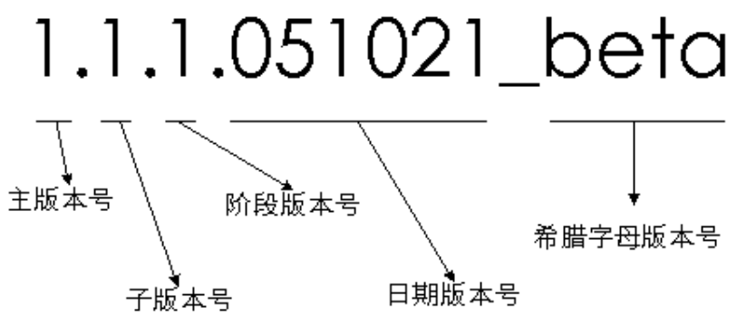

# 开发规范
## Android开发规范
[阿里巴巴Android开发规范 1.0.0](https://edu.aliyun.com/course/813)


类型 | 规范 | 示例
-|-|
资源文件|需带模块前缀|
layout文件|-|Activity 的 layout以 module_activity开头<br>Fragment 的 layout 以 module_fragment 开头<br>Dialog   的 layout 以 module_dialog 开头<br>include  的 layout 以 module_include 开头<br>ListView 的 item layout 以 module_list_item 开头<br>GridView 的 item layout 以 module_grid_item 开头<br>RecyclerView 的 item layout 以 module_recycle_item 开头<br>
drawable 资源|小写单词+下划线|module_tabs_icon_home_normal <br>module_login_btn_pressed
anim 资源|-|module_fade_out <br> module_push_down_in
color 资源|module_colors.xml |《color name="module_btn_bg_color">#33b5e5e5</color》
dimen 资源|module_dimens.xml |《dimen name="module_horizontal_line_height">1dp</dimen》
style 资源|module_styles.xml| 《style name="ParentTheme.ThisActivityTheme"》
string 资源|module_strings.xml|moudule_login_tips <br> module_homepage_notice_desc
控件Id 资源|驼峰法命名 <br>View 的缩写作为前缀|LinearLayout&nbsp;&nbsp;ll <br>RelativeLayoutnbsp&nbsp;&nbsp;	rl<br>ConstraintLayout&nbsp;&nbsp;	cl<br>ListView&nbsp;&nbsp;	lv<br>ScollView	&nbsp;&nbsp;sv<br>TextView&nbsp;&nbsp;	tv<br>Button&nbsp;&nbsp;	btn<br>ImageView&nbsp;&nbsp;	iv<br>CheckBox	&nbsp;&nbsp;cb<br>RadioButton&nbsp;&nbsp;	rb<br>EditText&nbsp;&nbsp;	et <br> //其它控件<br>ProgressBar &nbsp;&nbsp; progress_bar<br> DatePicker &nbsp;&nbsp; date_picker


## Java 开发规范
[阿里巴巴编码规范Java 1.3.1](https://edu.aliyun.com/course/417/lesson/list?spm=5176.8764728.aliyun-edu-course-tab.2.Fx6l4R&previewAs=guest)

类型 | 规范 | 示例
-|-|
资源文件|需带模块前缀|
|不能以下划线或美元符号开始、结束  |_name <br> Object$
|严禁拼音与英文混合<br>严禁直接使用中文|
类名|使用UpperCamelCase风格|TcpUdpDeal <br>   DO 、 DTO 、VO 、 DAO等例外
方法名<br>参数名<br>成员变量<br>局部变量|使用lowerCamelCase风格|getHttpMessage()
常量|全部大写、用下划线隔开、语义表达完整<br> 不允许任何魔法值 <br> 按模块分开放在不同文件中|MAX_STOCK_COUNT <br> CacheConsts.java  <br>ConfigConsts.java
抽象类命名|Abstract 或 Base 开头|
异常类命名|用Exception结尾|
测试类命名|以它要测试的类名开始，以Test结尾|
包名|统小写、统一使用单数形式|com.alibaba.ai.util √ <br>com.alibaba.ai.utils ×
接口类|方法和属性不要加任何修饰符号（包括public） | void f(); √ <br> void f(); ×
枚举|类名带Enum后缀、成员名全大写、用下划线隔开 <br> 若变量值仅在一个固定范围内变化，请用枚举|UNKNOWN_REASON
大括号|若大括号内为空，则写成{} <br> 若非空，则左大括号前不换行(不要学c代码的风格)|
小括号|小括号和字符之间不出现空格| if (空格a == b空格)  ×
equals方法||"test".equals(object); √ <br> object.equals("test"); ×
构造方法|禁止写任何业务逻辑|
POJO类<br>(没有业务逻辑的类)|必须写toString方法，为了方便排除异常|
字符串拼接|使用 StringBuilder|
final |不允许被继承的类 <br>不允许修改的方法、变量 | 并不会影响内存的回收
单例对象、工具类|需要保证线程安全|
if else  <br>for <br>while |必须使用大括号|if (condition) statements ×
if()...else|请勿超过3层|
终止、退出|高并发场景，禁止使用 “==”作为终止条件|并发处理错误会导致数量瞬间变成负数 而无法终止
条件判断|禁止执行复杂语句|if ((...) != null) && (...) &&(...)) ×
TODO||
FIXME|代表 “错误，不能工作”|


## 亚信 xx系统编写规范
```text
long或者Long初始赋值时，必须使用大写的L，
不能是小写的l，小写容易跟数字1混淆，造成误解。

不能使用过时的类或方法。 
例如 java.net.URLDecoder 中的方法 decode(String encodeStr) 这个方法已经过时，
应该使用双参数 decode(String source, String encode)。
接口提供方既然明确是过时接口，那么有义务同时提供新的接口；
作为调用方来说，有义务去考证过时方法的新实现是什么。

异常不要用来做流程控制，条件控制，因为异常的处理效率比条件分支低。
对大段代码进行 try-catch，这是不负责任的表现。
捕获异常是为了处理它，不要捕获了却什么都不处理而抛弃之，如果不想处理它，请将该异常抛给它的调用者。
异常信息应该包括两类信息：案发现场信息和异常堆栈信息。
如果不处理，那么往上抛。 
```


## git 提交规范
```text
常用的 Git Commit  规范采用的是 Angular 规范。

// type 用于说明 commit 的类别，常用的标识如下
feat : 新功能（feature）
fix: 修补bug
docs: 文档 
style:  格式（不影响代码运行的变动,空格,格式化,等等）
refactor: 重构（即不是新增功能，也不是修改bug的代码变动
perf:  性能 (提高代码性能的改变)
test: 增加测试或者修改测试
build:  影响构建系统或外部依赖项的更改(maven,gradle,npm 等等)
ci: 对CI配置文件和脚本的更改
chore: 对非 src 和 test 目录的修改
revert:  Revert a commit

在Androidstudio中，我们可以通过 Git Commit Template 插件来辅助我们生成 合适的规范。
```


## git使用规范
```text
1、Master：只是用于保存官方的发布历史，理论上，Master的每一个提交，对应一个发布版本，
所以通常会为Master的每一个提交使用版本号打上一个标签（tag）。

2、Develop: 开发分支。用于集成各种功能开发的分支。

3、Feature：功能分支，每一个新功能的开发都应该各自使用独立的分支。
在创建新的功能开发分支时，父分支应该选择develop（而不是master）；
当功能开发完成时，改动的代码应该被合并（merge）到develop分支（而不是master）。
Feature分支与Master没有直接联系。

4、Release：发布分支。在准备发布之前，相关要发布的功能分支Feature已经合并到Develop上，
可以基于develop分支建立一个用于产品发布的分支。这个分支的创建意味着一个发布周期的开始，
也意味着本次发布不会再增加新的功能——在这个分支上只能修复bug，做一些文档工作或者跟发布相关的任务。
在一切准备就绪的时候，这个分支会被合并入master，并且用版本号打上标签，同时，也应该合并入develop分支。
注：在发布周期内，develop分支仍然在被使用，其他开发者会把其他功能集成到develop分支上。

5、Hotfix：维护分支。发布上线后的维护工作或者紧急问题的快速修复也需要使用一个独立的分支。
这是唯一一种可以直接基于master创建的分支。一旦问题被修复了，所做的改动应该被合并入master和develop分支。
在这之后，master上还要使用更新的版本号打好标签。


常见问题：
1、直接在Master上开发，只有一个分支，上线之后也继续在Master上开发。
容易出现这种问题：线上版出了紧急问题，然而因为没有给发布版本打标签，不知道要回滚到哪个版本，只能按照时间推算，难以确保准确；
另外，因为继续在Master上开发，如果想在Master最新版本上修复bug,并上线，由于新功能没有开发完成，而陷入两难境地。

2、通常觉得只有自己一个人开发，一个Master就够了。我们不只要考虑多人协作开发问题，
还要考虑线上版本bug的修复管理，以及历史版本的管理。

要求：
1、最低要求：使用Master和Develop分支。Master的每一个提交，对应一个发布版本，并且打上标签（tag）；
develop，如果项目只有一个人，不存在多人协作，也不存在多功能并行开发，那么一个develop分支，也够。 
```


## 向下兼容 、向后兼容
```text
兼容老设备,旧系统版本。
 
在计算机中指在一个程序更新到较新的版本后，
用旧的版本程序创建的文档或系统仍能被正常操作或使用。
向下兼容可以使用户在进行软件或硬件升级时，
厂商不必为新设备或新平台从头开始编制应用程序，以前的程序在新的环境中任然有效。
```


## DEV 、 SIT 、 UAT  环境
```text
DEV 环境 ：DEV 就是 develop ，即代码开发的环境。
SIT 环境 ：System Integration Test 系统集成测试，开发人员自己测试流程是否走通。
UAT 环境 ：User Acceptance Test 用户验收测试，由专门的测试人员验证，验收完成才能上生产环境。
```
 
 
 ## app版本命名规范
 ```text
一、软件版本阶段说明
Alpha版: 此版本表示该软件在此阶段主要是以实现软件功能为主，
通常只在软件开发者内部交流，一般而言，该版本软件的Bug较多，需要继续修改。

Beta版: 该版本相对于α版已有了很大的改进，消除了严重的错误，但还是存在着一些缺陷，
需要经过多次测试来进一步消除，此版本主要的修改对像是软件的UI。

RC版: 该版本已经相当成熟了，基本上不存在导致错误的BUG，与即将发行的正式版相差无几。

Release版: 该版本意味“最终版本”，在前面版本的一系列测试版之后，终归会有一个正式版本，
是最终交付用户使用的一个版本。该版本有时也称为标准版。
一般情况下，Release不会以单词形式出现在软件封面上，取而代之的是符号(R)。

二、版本命名规范
软件版本号由四部分组成，第一个1为主版本号，第二个1为子版本号，第三个1为阶段版本号，
第四部分为日期版本号加希腊字母版本号，希腊字母版本号共有5种，
分别为：base、alpha、beta、RC、release。
例如：1.1.1.051021_beta  , 1.1.1.20220506_alpha

三、 版本号定修改规则
主版本号(1)：当功能模块有较大的变动，比如增加多个模块或者整体架构发生变化。此版本号由项目决定是否修改。
子版本号(1)：当功能有一定的增加或变化，比如增加了对权限控制、增加自定义视图等功能。此版本号由项目决定是否修改。
阶段版本号(1)：一般是 Bug 修复或是一些小的变动，要经常发布修订版，时间间隔不限，修复一个严重的bug即可发布一个修订版。此版本号由项目经理决定是否修改。
日期版本号(051021):用于记录修改项目的当前日期，每天对项目的修改都需要更改日期版本号。此版本号由开发人员决定是否修改。
希腊字母版本号(beta):此版本号用于标注当前版本的软件处于哪个开发阶段，当软件进入到另一个阶段时需要修改此版本号。此版本号由项目决定是否修改。
```



 
 