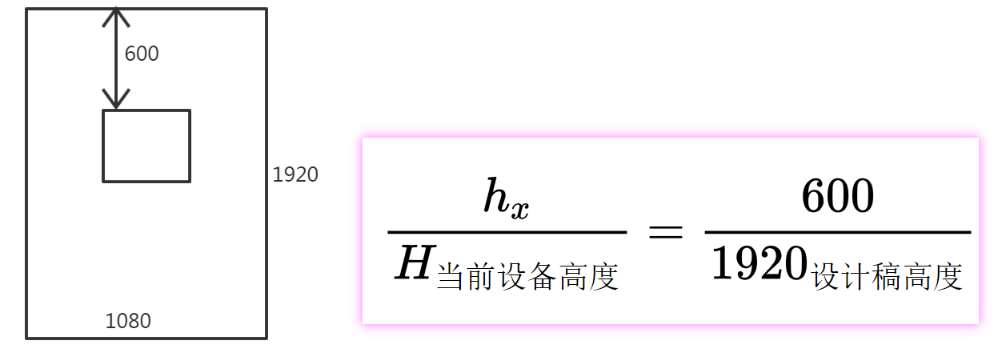

# flutter部分
## flutter 配置
```text
1、修改整个工程的文件夹名字，  修改后需要在工程里 重新命名xxx.imld的名字（例如 wk-weather.iml ）
2、版本号在 pubspec.yaml version 中配置  
version: 1.0.20201109+1   1.0.20201109 是版本标记 ， 1是版本号
3、隐藏右上角 debug 标记
debugShowCheckedModeBanner: false,
```

## Your Flutter application is created using an older version of the Android embedding. It's being deprecated in favor of Android embedding v2
```text
在 application 标签下 添加
<meta-data
    android:name="flutterEmbedding"
    android:value="2" />
```

##  签名配置 keystore
```text
跟Android 工程 一样配置即可。
```

##  app 显示调试模式界面
```text
import 'package:flutter/rendering.dart';
void main() {
debugPaintSizeEnabled = true;
runApp(  ) ;
}
```

##  flutter工程中 Android部分爆红
```text
如果工程能正常运行，请不要理会。
编写Android部分代码时你重新用Androidstudio打开Android部分即可，它也是一个Android工程。

// 如果是 build.gradle 中 Properties 、GradleException  爆红 
按照提示引入 sdk ，并将 GradleException 改成 Exception ，然后重新刷新工程即可。
```

## flutter 插件开发 Android项目部分爆红
```text
在Android的 build.gradle下加入以下配置，引入 flutter.jar即可。
//获取local.properties配置文件
def localProperties = new Properties()
def localPropertiesFile = rootProject.file('local.properties')
if (localPropertiesFile.exists()) {
 localPropertiesFile.withReader('UTF-8') { reader ->
     localProperties.load(reader)
 }
}
//获取flutter的sdk路径
def flutterRoot = localProperties.getProperty('flutter.sdk')
if (flutterRoot == null) {
 throw new GradleException("Flutter SDK not found. Define location with flutter.sdk in the local.properties file.")
}

dependencies {
 compileOnly files("$flutterRoot/bin/cache/artifacts/engine/android-arm/flutter.jar")
}
```


## flutter BloC 模式
```text
业务逻辑组件 （Business Logic Component ），实际上BloC设计模式，似乎和MVP没有什么本质区别，
两种设计模式的最终目的就是为了把和UI糅合在一起的业务逻辑代码剥离开来，单独的抽取到一层中。
```


## 项目类型
### Flutter Application
```text
Flutter Application 表示一个Flutter项目，主体是Flutter，
当然它也可以接入Android Module 或者 iOS Framework，
其内部包含 Android 和 iOS 项目。以后可能会支持其他平台。
```

### Flutter Plugin
```text
Flutter Plugin 表示 Flutter 插件，包含 Android 和 iOS 项目，
如果你要开发一个 Plugin 且此 Plugin 涉及到原生支持，比如蓝牙功能、网络功能等，
这些功能纯 Flutter 是无法实现的。
Flutter Plugin 开发完成后可以发布到 pub 上。
```

### Flutter Package
```text
Flutter Package 和 Flutter Plugin 基本一样，唯一的区别是Flutter Package表示纯 Flutter 模块，
不需要原生开发，没有Android 和 iOS 项目，比如开发一个纯 UI 的插件。
```

### Flutter Module
```text
Flutter Module 用于原生项目中插入 Flutter 模块，原生为主体，与 Flutter 进行混合开发。
```

## json
```text
// 举例使用
// json.decode(modelStr)
// Parses the string and returns the resulting Json object
         
//  json obj 转对象
WeatherModelEntity weatherModelEntity = WeatherModelEntity().fromJson(json.decode(modelStr));

------------------
json部分的代码使用 FlutterJsonBeanFactory 插件生成的 。
https://plugins.jetbrains.com/plugin/11415-flutterjsonbeanfactory

如果改变了结构，需要在变动过的文件上 alt+ j 重新生成 json_convert_content.dart

------------------
1、将 json 字符串转为 map 格式的json 对象 
import 'dart:convert'; //系统自带

2、将 json 对象转为 实体类对象 
借助第三方工具 FlutterJsonBeanFactory 简化人工代码  
```


## 国际化 翻译支持
### 系统自带的控件 国际化
Flutter给我们提供的Widget默认情况下就是支持国际化。例如时间日期选择控件。
```text
1、 pubspec.yaml中新增配置
flutter_localizations:# 国际化支持 包
 sdk: flutter

2、 对 MaterialApp 进行配置
return MaterialApp(
title: 'Flutter Demo',
// localizationsDelegates 指定哪些Widget需要进行国际化
localizationsDelegates: [
 GlobalMaterialLocalizations.delegate, // Material
 GlobalCupertinoLocalizations.delegate, // Cupertino
 GlobalWidgetsLocalizations.delegate // Widgets
],
//  supportedLocales 支持哪些 语言
supportedLocales: [
 Locale("en"),
 Locale("zh")
],
```

### 自定义控件、文本、信息展示 国际化
大部分情况，是需要对自定义的控件或信息等进行国际化。
```text
为了方便快速，一般使用第三方插件 Flutter intl  进行配置。

1、安装插件，重启 Androidstudio
2、 pubspec.yaml中新增配置
flutter_localizations:# 国际化支持 包
 sdk: flutter
3、在Tools栏目下找到 Flutter Intl 进行初始化。
初始化后 ，
pubspec.yaml 中会新增配置 flutter_intl:  enabled: true
lib 目录下 会新增 generated 、l10n文件夹

4、在Tools栏目下找到 Flutter Intl 添加语言支持 ，例如 en_IN, zh_CN, de_DE
5、在 l10n 目录下 找到对应的文件，进行语言配置 ，例如
{
  "string_title": "测试标题" ,
  "string_Name": "测试名字"
}

6、 在 MaterialApp 中进行多语言支持配置 。
return MaterialApp(
title: "123123", // 快照上显示的APP名字
// title: S.of(context).string_title, // 这里使用会报错，
localizationsDelegates: const [
 S.delegate,
 GlobalMaterialLocalizations.delegate,
 GlobalCupertinoLocalizations.delegate,
 GlobalWidgetsLocalizations.delegate
],
supportedLocales: S.delegate.supportedLocales,
localeListResolutionCallback: (locales, supportedLocales) {
 // 设备支持的语言
 print("---------$locales");
 return;
},

7、使用
Text( S.of(context).string_title )  // S是自定生成的代码定义的类名
Text( S.current.string_title )
```

## 屏幕适配
```text
final mediaQueryData = MediaQuery.of(context);
// 逻辑宽高
final screenWidth = mediaQueryData.size.width;
final screenHeight = mediaQueryData.size.height;
// 物理宽高、分辨率
final physicalWidth = window.physicalSize.width; // import 'dart:ui';
final physicalHeight = window.physicalSize.height;
// 密度
final dpr = window.devicePixelRatio;
// 状态栏高度
final statusBarHeight = mediaQueryData.padding.top;
// 底部高度
final bottomHeight = mediaQueryData.padding.bottom;

flutter的长度单位是 dp ，而不是px ,适配方案参考Android的适配经验即可。

无论设计稿的单位是px,或者是dp,我们都能够转换成px。
1、先将设计稿换成 dp为单位的设计稿
例如 1920 * 1080   ( px )
2、转换原理(比例一样)如图.
```


## flutter 运行模式
```text
release  //发布模式
profile // 性能模式
debug  // 调试模式

flutter run --release
flutter run --debug

// It's likely that this file was generated under xxx \build, but the tool couldn't find it.
这个问题 我这边导致的原因是 签名信息配置错了 ， 不能改成 wk2017之类的 ， 要用 release 或者debug ， 或者干脆不要签名。

Androidstudio 菜单下的 Flutter fun xxx.dart in release/profile mode 。
```

## 状态管理
```text
1、添加支持 provider: ^4.3.2+2
https://pub.flutter-io.cn/packages/provider/install

2、定义共享数据类 xxx extends ChangeNotifier
notifyListeners(); // 通知刷新

3、ChangeNotifierProvider 将数据共享类 和 widget 关联起来
Widget someWidget = ChangeNotifierProvider<GlobalModel>(
   create: (context) => GlobalModel(), //  ChangeNotifier
   child: child, // Widget
 );

4、更新数据
var shareBean = Provider.of<XXX>(context); // 如果 Widget 和  ChangeNotifier 没有关联过，是不是就是null？
shareBean.xxx = "abc" // 更新数据
```

##  引入本地第三方库
```text
1、在工程目录下新建一个文件夹存放插件，比如plugin
2、打开工程的pubspec.yaml，在dependence里添加plugin下的插件
//本地插件引用 注意缩进格式
webview_flutter:
 path: plugin/webview_flutter
```

## flutter 插件开发
```text
1、新建插件工程
2、调用者中 引入插件地址
wk_flutter_plugin:
 path: wk_flutter_plugin # 本地flutter插件库 msg_plugin
```

## flutter 与 Android 数据 交互
有些功能，flutter暂时不支持(例如蓝牙)，所以需要用Android开发获得数据，然后传递给蓝牙。
```text
flutter和Android通信的方式目前主要可以采用
MethodChannel // flutter调用方法，方法返回，一问一答模式
EventChannel // Android端不断往flutter发送数据 ，单向?
BasicMessageChannel // 双向通信

注意：新建通道对象时 ，flutter 和 Android 端，name 参数是对应的，

public class MainActivity extends FlutterActivity  implements MethodChannel.MethodCallHandler {
 int count = 0;
 @Override
 protected void onCreate( ... ) {
     super.onCreate(savedInstanceState);
     Activity activity = this ;

     new Thread(new Runnable() {
         @Override
         public void run() {
             while(true){
                 try {
                     Thread.sleep(500);
                 } catch (InterruptedException e) {
                     e.printStackTrace();
                 }

                 if(eventSink==null){
                     WkLog.showLog("myEvent ==null");
                 }else{
                     count ++ ;
                     activity.runOnUiThread(new Runnable() {
                         @Override
                         public void run() {
                             if(count%2==0){
                                 eventSink.success("hello android..."+count);
                             }else{
                                 eventSink.error("500" ,"发生异常" ,null);
                             }
                         }
                     });
                 }


                 if(basicMessageChannel!=null){
                     activity.runOnUiThread(new Runnable() {
                         @Override
                         public void run() {
                            basicMessageChannel.send("Android主动发送消息 " + count);
                         }
                     });

                 }else{
                     WkLog.showLog("basicMessageChannel ==null");
                 }


             }
         }
     }).start();
 }

 private final String KEY_METHODCHANNEL ="KEY_METHODCHANNEL_20201124" ;
 private final String KEY_EventChannel ="KEY_EventChannel_20201124" ;
 private final String KEY_BasicMessageChannel ="BasicMessageChannel_20201124" ;
 private MethodChannel methodChannel;
 private  EventChannel.EventSink eventSink = null ;
 private BasicMessageChannel<String> basicMessageChannel;

 //  configureFlutterEngine 函数 在 onCreate 之前执行
 @Override
 public void configureFlutterEngine(@NonNull FlutterEngine flutterEngine) {
     super.configureFlutterEngine(flutterEngine);
     initEngineConfig(flutterEngine);
 }

 private void initEngineConfig(FlutterEngine flutterEngine){
     // MethodChannel
     methodChannel = new MethodChannel(flutterEngine.getDartExecutor(), KEY_METHODCHANNEL);
     methodChannel.setMethodCallHandler(this);

     // EventChannel
     EventChannel eventChannel =new EventChannel( flutterEngine.getDartExecutor() ,KEY_EventChannel);
     eventChannel.setStreamHandler( new EventChannel.StreamHandler() {
         @Override
         public void onListen(Object arguments, EventChannel.EventSink events) {
             // events 传出去，用来主动发送数据
             eventSink =events ;
         }

         @Override
         public void onCancel(Object arguments) {

         }
     });

     //
     basicMessageChannel = new BasicMessageChannel<String> (  flutterEngine.getDartExecutor() ,
             KEY_BasicMessageChannel, StringCodec.INSTANCE); // StandardMessageCodec.INSTANCE
     basicMessageChannel.setMessageHandler( new BasicMessageChannel.MessageHandler() {
         @Override
         public void onMessage(Object message,  BasicMessageChannel.Reply reply){
             String str =  (String) message;
             WkLog.showLog("收到来自flutter="+ str);

         }
     });
 }

 @Override
 public void onMethodCall(MethodCall call, MethodChannel.Result result) {
     if (call.method.equals("userLogin")) {
         String hostIp = call.argument("hostIp");
         String hostPort = call.argument("hostPort");
         result.success(hostIp+ "   "+hostPort + "登录成功..." + System.currentTimeMillis()) ;
     }else {
         result.notImplemented();
     }
 }
}


class MsgTransmissionTool {
static String KEY_METHODCHANNEL ="KEY_METHODCHANNEL_20201124" ;
static String KEY_EventChannel ="KEY_EventChannel_20201124" ;
static String KEY_BasicMessageChannel ="BasicMessageChannel_20201124" ;

static MsgTransmissionTool _instance ;
static MsgTransmissionTool getinstance()  {
 if(_instance ==null){
   _instance = MsgTransmissionTool() ;
 }
 return _instance ;
}

MethodChannel methodChannel ;
EventChannel eventChannel  ;
BasicMessageChannel basicMessageChannel ;
MsgTransmissionTool(){
 // todo 重要注释： 要先在 flutter端新建初始化这些对象，否则Android端的那些对象是空的。
 methodChannel =   MethodChannel(KEY_METHODCHANNEL);
 eventChannel = EventChannel(KEY_EventChannel );
 basicMessageChannel = BasicMessageChannel( KEY_BasicMessageChannel, StringCodec());
 // StandardMessageCodec
}

setMessageHandler(  Future<dynamic> Function( dynamic message)  handler ){
 if(basicMessageChannel!=null){
   basicMessageChannel.setMessageHandler(handler) ;
 }
}

setEnventChannelListener( void onData(dynamic event) ,void _onError(dynamic event) ){
 if(eventChannel!=null){
   eventChannel.receiveBroadcastStream().listen( onData, onError: _onError);
 }
}

void sendMsgByBasicMessageChannel(String msg) async {
 if(basicMessageChannel!=null){
    await basicMessageChannel.send(msg );
 }
}

Future<String> sendMsgByMethodChannel( String hostIp ,String hostPort)  async {
 if(methodChannel!=null){
   final String version =
   // 参数以键值对的方式传递过去
   await methodChannel.invokeMethod('userLogin'  , <String,dynamic>{"hostIp":hostIp , "hostPort":hostPort});
   return version;
 }else{
   print("methodChannel ==null");
 }
 return null ;
}
}
```

```text
// 使用
// 设置监听函数
_initTool() async{
 await MsgTransmissionTool.getinstance().setMessageHandler(  ongetMsgFromMessageChannerl);
 await MsgTransmissionTool.getinstance().setEnventChannelListener(  _onEvent , _onError);
}

void _onEvent(Object event) {
 setState(() {
   msg2 = event ;
 });
 print("收到数据==_onEvent==$event");
}

void _onError(Object error) {
 PlatformException exception = error ;
 setState(() {
   msg2 = " ${ exception.message} , ${exception.code} ";
 });
 print("收到数据==_onError");
}

Future<String> ongetMsgFromMessageChannerl( dynamic message)  {
setState(() {
 msg3= message ;
});
}

// 往Android发送数据
Future<void> testSend() async {
String  result = await MsgTransmissionTool.getinstance().sendMsgByMethodChannel("192.168.1.1" ,"8080");
setState(() {
loginResult=result ;
});

MsgTransmissionTool.getinstance().sendMsgByBasicMessageChannel("BasicMessageChannel 给Android 发送消息") ;
}
```


## flutter 调用Android控件
```text
// Android 端 新建 View 和工厂类
class MyView implements PlatformView {
 private TextView textView;

 MyView(Context context ) {
     // configureFlutterEngine 函数 在 onCreate 之前执行 ，所以不能通过 findViewById 方式获得控件
     //View rootView = inflater.inflate(R.layout.testlayout, null);
     //rootView.findViewById()
     TextView myNativeView = new TextView(context);
     myNativeView.setTextColor(Color.RED);
     myNativeView.setClickable(true);
     myNativeView.setOnClickListener(new View.OnClickListener() {
         @Override
         public void onClick(View view) {
             textView.setTextColor(Color.BLUE);
             Toast.makeText(context ,"hello android" ,Toast.LENGTH_SHORT).show();
         }
     });
     this.textView = myNativeView;
 }

 public void updateValue(String value){
     textView.setTextColor(Color.RED);
     textView.setText("----> "+value);
 }

 @Override
 public View getView() {
     return textView;
 }

 @Override
 public void dispose() {  }
}

public class MyViewFactory extends PlatformViewFactory {
 private MyView myView ;
 public MyViewFactory( ) {
     super(StandardMessageCodec.INSTANCE);
 }

 @Override
 public PlatformView create(Context context, int id, Object args) {
     myView = new MyView(context) ;
     // 新建时 传递过来的参数
     Map<String ,String> params = (Map<String, String>) args;
     String value = params.get("key123456") ;
     myView.updateValue(value);
     return myView;
 }
}

//  在XXActivity中  注册这个控件
@Override
public void configureFlutterEngine(@NonNull FlutterEngine flutterEngine) {
 super.configureFlutterEngine(flutterEngine);
 PlatformViewRegistry registry = flutterEngine.getPlatformViewsController().getRegistry() ;
 myViewFactory =   new MyViewFactory() ;
 // platform_text_view12345678 是全局唯一的，要与flutter端对应使用
 registry.registerViewFactory("platform_text_view12345678",myViewFactory) ;
}

// flutter端 通过 AndroidView 来包裹调用
var androidView  =  AndroidView(
 viewType: "platform_text_view12345678",
 creationParams: <String, dynamic>{"key123456": "我来自flutter"},
 creationParamsCodec: const StandardMessageCodec());

Container(
// width: 80,
height: 80,
child: androidView,
)  ,
```


# flutter第三方库
## package_info 获取版本号等
版本号在 pubspec.yaml version 中配置
```text
https://pub.flutter-io.cn/packages/package_info
PackageInfo.fromPlatform().then((PackageInfo packageInfo) {
  String appName = packageInfo.appName;
  String packageName = packageInfo.packageName;
  String version = packageInfo.version;
  String buildNumber = packageInfo.buildNumber;
});
```

## url_launcher
通过 url 打开第三方应用 ，例如网址打开浏览器 ， 拨打电话，调用第三方APP等。
```text
https://pub.flutter-io.cn/packages/url_launcher/install
_launchURL() async {
const url = 'tel:13457980678';  // 唤起电话界面
// const url = 'weixin://'; 唤起微信
//const url = 'http://typhoon.zjwater.gov.cn/wap.htm'; // 打开浏览器
if (await canLaunch(url)) {
  await launch(url);
}
}
```

## flutter_bloc
```text
https://pub.flutter-io.cn/packages/flutter_bloc

// Bloc
业务逻辑组件 (Business Logic Component) 。
Bloc 将  Event 事件转换为 States 状态.
 每个 Bloc 都有一个 add 方法，用来添加新的 Event 到 mapEventToState 中；
 
// BlocBuilder
extends StatefulWidget ...
构造器，主要用于构建 Widget 。

// BlocProvider
extends Widget ...
BlocProvider 为 Bloc 的供应者；

// MultiBlocProvider
extends Widget ...
是一个用于将多个BlocProvider合并为一个BlocProvider的组件。

// BlocListener
t extends Widget ...
用于监听状态变更，可在此做出相应的业务处理；
```


## shared_preferences
key-value 存储插件， 跟android SharedPreferences 的类似。
```text
https://pub.flutter-io.cn/packages/shared_preferences

SharedPreferences prefs = await SharedPreferences.getInstance();
prefs.setString(KEY_CITY_MODELS, encodeStr);  // 保存
var parseValue = prefs.getString(KEY_CITY_MODELS); // 获取
prefs.remove(key);
prefs.clear();
```

## dio
http 网络访问框架。
Dart Http请求库，支持Restful API、FormData、拦截器、请求取消、Cookie管理、文件上传/下载、超时。
```text
int timeout = 15 *1000 ;
BaseOptions options = BaseOptions( baseUrl: "https://www.baidu.com/",
    connectTimeout:timeout ,
    receiveTimeout:timeout ,
    sendTimeout:timeout );
Dio dia = Dio(options) ;

Interceptor dInter = InterceptorsWrapper(
    onRequest: (RequestOptions options) {
      return options; // 拦截请求
    },
    onResponse: (Response response) {
      return response;  // 拦截响应
    },
    onError: (DioError error) { // 拦截异常
      print("拦截了错误");
      return error;
    }
);
dia.interceptors.add( dInter); // 添加拦截器

String url="https://www.baidu.com/" ;
Map<String, dynamic>  param= Map() ;
Response response = await dia.get(url, queryParameters: param);  //  get 请求
var result =  response.data ;
print("请求结果="+ result);
```


## event_bus
消息传递框架
```text
https://pub.flutter-io.cn/packages/event_bus
https://github.com/marcojakob/dart-event-bus

EventBus eventBus = EventBus();
eventBus.fire("helloflutter"); // 发送
StreamSubscription streamSubscription =eventBus.on<String>().listen((event){
  // 接收
});
streamSubscription.cancel() ; // 取消监听
streamSubscription.pause() ;//
streamSubscription.resume() ;//
```


## flutter_screenutil
flutter 屏幕适配方案，让你的UI在不同尺寸的屏幕上都能显示合理的布局。
```text
https://pub.flutter-io.cn/packages/flutter_screenutil
https://github.com/OpenFlutter/flutter_ScreenUtil

//设置适配尺寸 (填入设计稿中设备的屏幕尺寸) 此处假如设计稿是按iPhone6的尺寸设计的(iPhone6 750*1334)
// 设置字体大小是否根据系统的“字体大小”辅助选项来进行缩放
// ScreenUtil.init(context);  //默认 width : 1080px , height:1920px , allowFontScaling:false
ScreenUtil.init(context,designSize: Size(750, 1334), allowFontScaling: false);
// var width =  1.wp ;
var width =  1.sw ; // screen height
var width2 =  0.2.sw ; // screen height 屏幕宽度的0.2倍

ScreenUtil().pixelRatio   ;     //设备的像素密度
ScreenUtil().screenWidth  ; // (sdk>=2.6 : 1.sw)   //设备宽度
ScreenUtil().screenHeight ; //(sdk>=2.6 : 1.sh)   //设备高度
ScreenUtil().bottomBarHeight ; //底部安全区距离，适用于全面屏下面有按键的
ScreenUtil().statusBarHeight;  //状态栏高度 刘海屏会更高  单位dp
ScreenUtil().textScaleFactor; //系统字体缩放比例
ScreenUtil().scaleWidth ; // 实际宽度的dp与设计稿px的比例
ScreenUtil().scaleHeight; // 实际高度的dp与设计稿px的比例
```


## modal_bottom_sheet
底部弹窗控件
```text
https://pub.flutter-io.cn/packages/modal_bottom_sheet
https://github.com/jamesblasco/modal_bottom_sheet
可以直接用系统控件，没必要用这个。
```


## path_drawing
绘制虚线的工具
```text
https://pub.flutter-io.cn/packages/path_drawing
Path _path = Path();
Canvas canvas ;
Paint _paint = Paint();
canvas.drawPath(
    dashPath(_path, dashArray: CircularIntervalList<double>([10, 5])), // 每个线段长度、间隔长度
    _paint);
```

## toast
```text
https://pub.flutter-io.cn/packages/toast
Toast.show("Toast plugin app", context, duration: Toast.LENGTH_SHORT, gravity:  Toast.BOTTOM);
Toast.show(msg, context, duration: duration,
    backgroundColor: backgroundColor,
    textColor: textColor,
    backgroundRadius: backgroundRadius,
    border: border);
```


## flutter_tts
语音播报
```text
https://pub.flutter-io.cn/packages/flutter_tts
```

## ota_update
升级、 下载apk
```text
https://pub.flutter-io.cn/packages/ota_update
```


## cupertino_icons
一个icon图标库，具体怎么用 不知道。
```text
https://pub.flutter-io.cn/packages/cupertino_icons
```


## equatable
用来简化 对象比较的一个库。 这个库内部做了一些处理，让我们简单地用 == 即可判断对象是否相等，不用重写hashcode。
```text
https://pub.flutter-io.cn/packages/equatable
```

 


#  dart 语法
```text
dart 文件名和类名 可以不一样。这点跟Java不一样。
在变量中可以放置的所有东西都是对象，而每个对象都是类的实例。无论数字、函数和null都是对象。
如果要明确说明不需要任何类型，请使用[特殊类型dynamic]。
```

##  胖箭头语法
```text
 = >expr 语法是{return expr;}的简写写法。“=>”符号有时被称为胖箭头语法。
 => expr 等同于{ return expr; } 
```

## 可见性
```text
// 可见性 ，public private 跟Java不一样
Dart没有公开、保护和私有的关键字。
如果标识符以下划线(_)开头，则该标识符对其库是私有的。
```

##  final 、const
```text
final和const区别 ：
const可以使用其他const常量的值来初始化其值。
final dt = DateTime.now();//正确，运行时有确定的值
const dt = const DateTime.now();//错误，需要编译时有确定的值
// 初始化后不能再赋值
final a = 'aaa';
a =  'abc'; //错误
const b = 'bbb';
b =  'abc'; //错误
//不能和var同时使用
final var d = 'abc';//错误
const var e = 'abc';//错误
```


## 数字类型
```text
// 数字类型 只有 int 和 double
var one = int.parse('1');
var msg = 3.156.toString() ;
var msg2 = 3.156.toStringAsFixed(2);
```

##  变量 的初始值
```text
未初始化的变量的初始值为null。
甚至具有数字类型的变量最初也是null，因为数字，就像dart中的其他东西一样也是对象。

在Dart2中new关键字是可选的。 即 new 关键字可写可不写。
Dart是一种真正的面向对象语言，所以即使函数也是对象。

b ??= value;   // 仅仅在b为空的情况下b被赋值value ，否则b的值不变
print(person ?.name)  //  person 为空 就直接返回null ，不为空 就返回 name的值
```


## 类型 判断 、转换 
```text
if (emp is Person)  // 类型判断 is
(emp as Person) // 类型转换  as
```


##  字符串
```text
//  用r前缀创建一个原始字符串 (即 转义字符没有被转义)
var msg1 = r'In a raw string, not even \n gets special treatment.';

// 多行字符串 ，用 + 连接 ，或者是 带有单引号或双引号的三重引号
var msg1 =
  '''1111
  222222
  33333
  ''';
  
字符串用 等号 == 来判断对象是否相等，跟Java不太一样。
var msg1 ="abc1" ;
var msg2 ="abc"+"1" ;
print(msg1==msg2) ;  // true  
```

##  函数
```text
// 命名函数 ，可以带有默认值
void enableFlags( { int age =18, String myName } ) {
  print( "age=$age ,name=$myName") ; // age=20 ,name=aivin
}
 // age 和 myName 在函数中已经定义了，相当于直接初始化，此处 age 不能写成其他 age1等
 enableFlags( age: 20, myName: "aivin");

// 位置参数
void  say(String from, String msg, [ int time]) {
  var result = '$from says $msg $time'; // aivin says 现在时间是: null
  print(result) ;
}
say('aivin' ,'现在时间是:'   ) ;

// 级联操作符 ，跟Java的链式调用差不多
  Address address =   Address();
  address  ..street = '北京市'
    ..number = '12'
    ..name = '西城区'

 所有函数都返回一个值。如果没有指定返回值，则语句返回null;隐式附加到函数体。

//  匿名函数
Function showMsg = (int x, String y) {
  print("$x ");
};
```


##  列表、数组
```text
 var list = [1, 2, 3];  // 可变列表、数组
 var list2 = const [1, 2, 3]; // 常量列表
```

## 构造函数
```text
// 构造函数
class Point {
  num x, y;

  Point(num x, num y) {
    this.x = x;
    this.y = y;
  }
}

可以简写成 ---> 
class Point {
  num x, y;

  Point(this.x, this.y); // 语法糖，构造函数的简写
}

---------------------------------------------------
class Point {
  num x, y;
  // 类名构造函数
  Point(this.x, this.y);
  // 命名构造函数
  Point.order(this.x,this.y);
  // 重定向构造函数， origin构造函数将外界的传值，指向给了order构造函数。
  Point.origin(num a,num b):this.order(a,b);  
}

---------------------------------------------------
class Person {
  String firstName;

  Person.fromJson(Map data) {
    print('in Person');
  }
}

class Employee extends Person {
  // 调用父类构造函数， 语法与Java不一样。
  // 先打印  in Person ， 后打印  in Employee
  Employee.fromJson(Map data) : super.fromJson(data) {
    print('in Employee');
  }
}

main() {
  var emp = new Employee.fromJson({});
}
```

##  闭包
```text
//  java 闭包 ，用接口 和匿名函数 实现。-- 所谓闭包从表面看就是返回一个 函数
    interface  AaddFunc{
        int addBy(int value);
    }

    public static  AaddFunc createNewFunction(final int value){
        return  new AaddFunc() {
            @Override
            public int addBy(int addBy) {
                return value + addBy;
            }
        }  ;
    }

AaddFunc func =  createNewFunction(1) ;
 int result =func.addBy(10) ;

// dart 闭包
Function makeAdder( int addBy) {
  return (int value)  {
    return addBy + value;
  } ;
}

var func1 = makeAdder(10);
var result =func1(1); //11
```


##  三目运算符
```text
dart 支持三目运算符。 参考Java
```

##  mixin  特性 
```text
mixin  并不是一个关键字，只是一个普通的单词，意思是混合
Dart中，每个类（除了Object类）都只有一个超类。
但是我们有时需要多个父类的特性，可以用 with  来实现 minxin 特性。
class Walker {
  void walk() {
    print("I'm walking");
  }
}
class Fish {
  void swim() {
    print("I'm swimming");
  }
}

/**
    Person person = Person() ;
    person.walk() ;
    person.swim() ;
 */
class Person with Walker , Fish  { }
```

##  异步函数  async  await
```text
// 异步函数  async  await
Dart是单线程的语言， 在Dart1.9中加入了async和await关键字，有了这两个关键字，
我们可以更简洁的编写异步代码，而不需要调用Future相关的API（这种方法相对繁琐）。
用async标记，表示函数内部包含有需要延迟执行的代码。
有await标记的运算，其结果值都是一个Future对象 （马上返回）。
// 举个例子 就会明白
func(String callType) async {
  print('$callType =  方法内部  await 语句之前  ');
  await print('$callType  = await 执行的语句  ');
  print('$callType =  方法内部  await 语句之后 ');
}

/*
1 方法 通过 awiat 调用 =  方法内部  await 语句之前
1 方法 通过 awiat 调用  = await 执行的语句
1 方法 通过 awiat 调用 =  方法内部  await 语句之后
1 ---------------------------
2 方法直接调用 =  方法内部  await 语句之前
2 方法直接调用  = await 执行的语句
2 ----------------------------
2 方法直接调用 =  方法内部  await 语句之后
 */
main( ) async {
  // await 方式调用异步方法 , 则会等异步方法执行完成后再执行后续的代码
  await func('1 方法 通过 awiat 调用');
  print('1 ---------------------------');
  // 没有使用 await 方式调用异步方法，则异步方法执行到 await 处后等待 ( await所在的语句会调用，是在等待返回结果)，程序继续执行异步方法外的后续代码
  func('2 方法直接调用');
  print('2 ----------------------------');
}
```


##  生成器
```text
// 同步生成器  Iterable 、 sync* 、yield
Iterable<int> getSyncGenerator(int n ) sync* {
  int k = n;
  while (k > 0) {
    yield k--;
  }
}

//异步生成器： Stream 、 async* 、 yield
Stream <int> getAsyncGenerator(int n) async* {
  int k = 0;
  while (k < n) {
    yield k++;
  }
}

void main (){
  var it = getSyncGenerator(5).iterator;
  while (it.moveNext()) {
    print(it.current);
  }

  var stream =   getAsyncGenerator(5);
  // subscription.cancel();
  StreamSubscription subscription = stream.listen(null);
  subscription.onData( (value) {
    print(value);
  });
}
```

##  call 函数
```text
类的 特殊函数 call () 。 
实现call()方法可以让你的Dart类像函数一样被调用。 
不习惯这样。暂仅做了解。

class Person {
  call(String a, String b ) {
   return  '$a $b  ' ;
  }
}

main() {
  var person = new Person();
  var out = person("Hi", "aivin" );
  print('$out');
}
```


##  “多进程”机制 Isolate
```text
// “多进程”机制 Isolate
isolate是Dart平台对线程的实现方案，但和普通Thread不同的是，isolate拥有独立的内存，isolate由线程和独立内存构成。
由于isolate线程之间的内存不共享，所以isolate线程之间并不存在资源抢夺的问题，所以也不需要锁。
isolate线程之间的通信主要通过port来进行，这个port消息传递的过程是异步的。
isolate看起来其实和进程比较相似，之前请教阿里架构师宗心问题时，
宗心也说过“isolate的整体模型我自己的理解其实更像进程，而async、await更像是线程”。
如果对比一下isolate和进程的定义，会发现确实isolate很像是进程。 （这段话来自网络，我暂时没有用到过 Isolate ）
```


## 注解
```text
// immutable
被 @immutable 注解标明的类或者子类都必须是不可变的 .
```

##  随机数
```text
// 随机数
weatherType = WeatherType.values[Random().nextInt(WeatherType.values.length)];
```
  