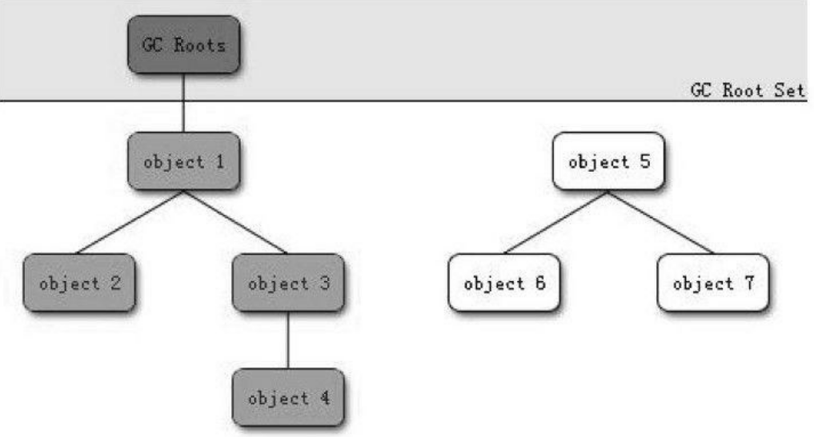
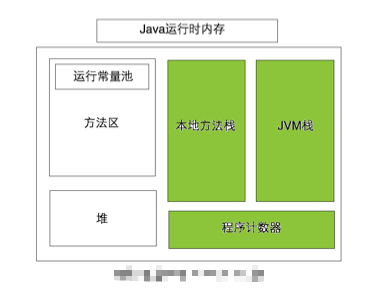

# gc机制
```text
GC机制的诞生时间大于Java。在早期的一些语言也曾使用过GC机制。
经过多年的发展，GC机制已经已经进入了“自动化”时代了，我们为什么还要去了解GC机制呢？
因为深入了解GC机制能更好地排查内存溢出泄露问题。
当GC机制成为高并发的瓶颈时，我们可以通过监控和调节GC过程，采取合适的优化方案。
普通的程序员也可以从GC机制中学习到它们优秀的策略。
```
 

## 判断对象是否存活的方法
### 引用计数算法 (Reference Counting)
```text
给对象中添加一个引用计数器,每当有一个地方引用它时,计数器值就加1;
当引用失效时,计数器值就减1;任何时刻计数器为0的对象就是不可能再被使用的。
ava已经摈弃了这种方案。因为很难解决对象之间的互相循环引用的问题。j
例如有两个对象互相引用，这个时候两个对象都不能被访问，但是互相引用导致引用计数不为0。
```

### 可达性分析算法( Reachability Analysis) / 根搜索算法( GC Root Tracing)
```text
目前主流编程语言(java,C#等)中,都是称通过可达性分析来判定对象是否存活的。
该算法的基本思路就是通过一系列的“GC Roots”对象作为起始点,
从这些节点开始向下搜索(搜索所走过的路径称为引用链),
当一个对象到 GC Roots 没有任何引用链相连(用图论的话来说,就是从GC Roots到这个对象不可达)时,则证明此对象是不可用的。
如下图所示，对象object 5、object 6、object 7虽然互相有关联,
但是它们到GC Roots是不可达的,所以它们将会被判定为是可回收的对象。
```




## GCRoot 的类型 、Java中可作为 GC Root 的对象 
```text
1、虚拟机栈中 引用的对象 
每个方法执行的时候，jvm都会创建一个相应的栈帧，
栈帧中包含这个方法内部使用的所有对象的引用 (这就是虚拟机栈中的引用对象)
一旦该方法执行完后 ，该栈 帧就会从虚拟机栈中弹出。
这样一来，没有任何 GCRoot 指向这些临时对象,所以这些对象在下次gc时就会披回收掉。
public static void testGC(){
    BeanXX bean = new BeanXX("localParameter"); // 局部变量
    bean = null;
}

2、持久代(方法区)中 类静态属性引用的对象  
Class Dog {
    private static Object obj; // static
}

3、持久代(方法区)中 常量引用的对象
Class Dog {
    private final Object obj; //  final
} 
4、本地方法栈中JNI(即一般说的Native方法)引用的对象 
```

## 垃圾收集算法
以下是常用的 垃圾回收算法 

### 引用计数回收法（ Reference Counting GC ）
```text
引用计数法的原理很简单，即记录每个对象被引用的次数。
每当创建一个新的对象，或者将其它指针指向该对象时，引用计数都会累加一次；
而每当将指向对象的指针移除时，引用计数都会递减一次，
当引用次数降为0时，删除对象并回收内存。
```

### 标记-清除 算法 ( Mark and Sweep GC )
```text
首先标记出所有需要回收的对象，标记完成后统一回收被标记过的对象。
缺点：
1、效率不高。标记和清除过程效率都不高。
2、空间问题。标记清除后会产生大量不连续的内存碎片。
```


### 标记整理 算法
```text
标记过程与 “标记-清除”算法一样。
然后让所有存活的对象向一端移动，最后直接清理掉端边界以外的内存。
```


### 拷贝回收 算法 ( Copying GC )
```text
将内存均分为两块，每次只用其中一块。
当着一块的内存用完了，就将还存活的对象复制到另一块内存上。
然后将已经使用过的这块内存一次性清理掉。

优点： 实现简单，运行高效。
缺点： 浪费内存，可用内存较少。
```


### 分代收集 / 逐代回收 算法 ( Generational GC )
```text
该算法是目前大部分JVM的垃圾收集器采用的算法。
核心思想是根据对象存活的生命周期将内存划分为若干个不同的区域。
然后根据各个年代的特点采用适当的收集算法。
```




## Android用的垃圾回收算法
```text
Android系统采用的是 标注并删除( Mark and Sweep ) 或 拷贝GC ( Copying GC ) 。 

如果在编译dalvik虚拟机的命令中指明了"WITH_COPYING_GC"选项，
则编译"/dalvik/vm/alloc/Copying.cpp"源码  ( 拷贝GC算法的实现 )
否则编译"/dalvik/vm/alloc/HeapSource.cpp"  ( 标注与清理GC算法 )
```


## 内存划分类型
内存被分为下面三个区域 。 Enden、form survicor space、to survivor space。


### 新生代
```xml
绝大多数最新被创建的对象会被分配到这里。对象从这个对象消失的过程称为”minor GC”。
特征：
（1）GC的发生相对比较频繁和迅速高效。
（2）包含了许多短周期对象。
```

### 老年代
```xml
(1)、从新生代存活下来的对象会被拷贝到这里，它的空间比新生代要大
(2)、GC操作不是很频繁，但是耗时比新生代中的GC要长。 内存占用的增长比较缓慢。
对象从老年代消失的过程称为”major GC”或者”full GC”。
```


### 永久代 (方法区/持久代)
用来存放类常量和字符串常量(并不是用来存储那些从老年代存活下来的对象)。它也会发生GC操作。


## 内存分配与回收机制
### 对象优先在Eden分配
对象一般在新生代Eden区中分配，当Eden区没有足够的空间进行分配时，虚拟机将发起一次Minor GC 。

### 大对象直接就进入老年代
大对象(类似很长的字符串或数组 需要大量连续内存空间的对象)。

### 长期存活的对象将进入老年代
虚拟机给每个对象定义了一个对象年龄计数器。对象再Survivor区中每熬过一次Minor GC,年龄就会增加1岁。当年龄增加到一定程度(默认配置15岁)，对象就会被移动到老年代中。

### 动态对象年龄判定
并不是一定要达到规定的年龄，对象才会被移动到老年代中。
如果Survivor空间中相同年龄 所有对象的大小的总和大于Survivor空间的一半，年龄>=该年龄的对象就会直接被移动到老年代中。

### 空间分配担保

在执行Minor GC之前，虚拟机先检查老年代最大可用的连续空间是否大于新生代所有对象总空间，如果ok，那么此次Minor GC可以安全进行。否则，虚拟机会查看HandlePromotionFailure设置值是否允许担保失败。如果允许，那么会继续检查老年代最大可用的连续空间是否大于历次晋升到老年代对象的平均大小，如果大于，将尝试着进行一次Minor GC，(尽管此次 Minor GC是有风险的)；如果小于，或者HandlePromotionFailure设置不允许冒险，就改为执行 Full GC（不执行 Minor Gc）。


## 拓展知识点
### Java中引用的类型
```xml
1、强引用
类似Object obj= new Object();
只要强引用还存在，GC永远不会回收掉被引用的对象。

2、软引用
可用SoftReference实现软引用。
系统内存不足时，会把软引用关联的对象加入回收范围并进行回收，回收后如果内存还是不足才会抛出内存溢出异常。

3、弱引用。
可用WeakReference实现。
当GC执行时，无论当前内存是否充足，都会将若引用关联的对象回收掉。

4、虚引用
可用PhantomReference实现。
为一个对象设置虚引用的唯一目的就是希望对象被回收时系统能提供一个系统通知。
```

### finalize()
```text
finalize() 的发明是为了向 c/c++ 程序员妥协。
在Java中使用finalize()方法反而会带来更多的不确定性。
所以在Java中不推荐使用这个方法，不建议对象进行自我拯救。
类似于“关闭外部资源”之类的工作可以交给try-finally或其他方式完成。
```


### 被GC判断为”垃圾”的对象一定会回收吗
```xml
在可达性分析算法中不可达的对象,也并非是“非死不可”的,
这时候它们暂时处于“缓刑”阶段,要真正宣告一个对象死亡,至少要经历 两次标记过程。
如果对象在进行可达性分析后发现没有与GC Roots相连接的引用链,那它将会被第一次标记并且进行一次筛选,
筛选的条件是此对象是否有必要执行finalize()方法。
当对象没有覆盖finalize()方法,或者finalize()方法已经被虚拟机调用过,虚拟机将这两种情况都视为“没有必要执行”。(即意味着直接回收)。
如果这个对象被判定为有必要执行finalize()方法,那么这个对象将会放置在一个叫做F-Queue的队列之中,
并在稍后由Finalizer线程(虚拟机建立的、低优先级)去触发finalize()方法。

finalize()方法是对象逃脱死亡命运的最后一次机会,稍后GC将对F-Queue中的对象进行第二次小规模的标记,
如果对象要在finalize()中成功拯救自己——只要重新与引用链上的任何一个对象建立关联即可,
譬如把自己(this关键字)赋值给某个类变量或者对象的成员变量,那在第二次标记时它将被移除出“即将回收”的集合;
如果对象这时候还没有逃脱,那基本上它就真的被回收了。
任何一个对象的finalize()方法只能被系统自动调用一次。所以对象自我拯救的次数有限。
```
