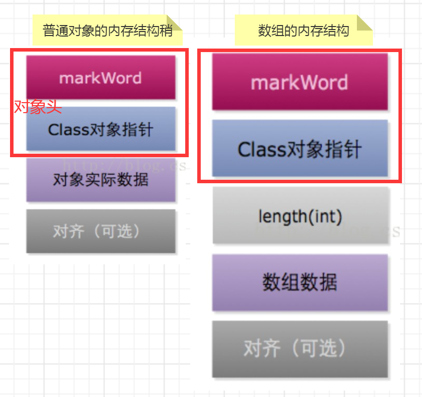

# 对象内存布局

```text
在HotSpot虚拟机中，对象在内存中存储的布局分为对象头Header、实例数据Instance Data、对齐填充Padding。

// 对象头 
object header , 包括了关于堆对象的布局、类型、GC状态、同步状态和标识哈希码的基本信息。Java对象和vm内部对象都有一个共同的对象头格式。

// 实例数据
Instance Data ,主要是存放类的数据信息，父类的信息，对象字段属性信息。

// 对齐填充
Padding, 为了字节对齐，填充的数据，不是必须的。
对齐填充并不是必然存在的，无特别含义，起着占位符的作用，
HotSpotVM的自动内存管理系统要求对象起始地址必须是8字节的整数倍，也就是对象的大小必须是8字节的整数倍，
对象头正好是8字节的倍数，所以当对象实例数据部分没有对齐，就需要通过对齐填充来补全。

对于Java和C、C++、C#这类高级语言，因为编译器的存在，编译器或虚拟机会自动帮我们进行字节对齐补白。无需手动去处理。
```



## 为什么要进行内存对齐
```text
// 平台原因
不是所有的硬件平台（例如某些嵌入式系统中使用的低端微处理器）都能访问任意地址上的任意数据，某些硬件平台只能访问对齐的地址，否则会出现硬件异常。

// 性能原因
如果数据存放在未对齐的内存空间中，则处理器访问变量时需要做两次内存访问，而对齐的内存访问仅需要一次访问。
显然，内存对齐在某些情况下可以减少读取内存的次数以及一些运算，性能更高。
另外，由于内存对齐保证了读取 b 变量是单次操作，在多核环境下，原子性更容易保证。

但是内存对齐提升性能的同时，也需要付出相应的代价。由于变量与变量之间增加了填充，并没有存储真实有效的数据，所以占用的内存会更大。
这也是一个典型的空间换时间的应用场景。
```


## 如何解决 内存对齐 带来的内存浪费问题
```text
有内存对齐就会有内存浪费的情况，所以为了减少内存浪费，并达到内存对齐的目的，JVM就会将字段重新排列。

struct  A{
    int i ;
    char c ;
    short s ;
};

struct  B{
    char c ;
    int i ;
    short s ;
};

// 打印结果
sizeof( struct A));--- > 8
sizeof( struct B)); ---->12
从上面例子可以看到，包含相同变量的两个结构体，由于声明变量的顺序不同，最后为结构体申请的内存大小也不同。

JVM为了优化内存空间利用率，
①按照类型的大小从小到大顺序，那么可以减少一些补白空间
②将相同类型的字段组合在一起，减少一些补白操作，提升了整个空间利用率。
```


