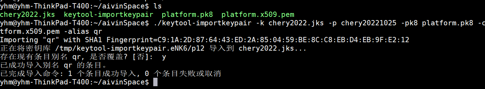

# 系统签名
```text
一、需求场景：
APP需要调用系统层级的一些api时，需要系统签名。所以需要将普通签名转为系统签名。

二、原理：借助 keytool-importkeypair 工具将系统信息导入到原来的签名文件中。

三、需求文件：
1、platform.pk8          (找系统商要)
2、platform.x509.pem     (找系统商要)
3、keytool-importkeypair（https://github.com/getfatday/keytool-importkeypair）
4、chery2022.jks        （原来的签名文件）

四、 制作系统签名相关命令
在Linux 环境下，将上述所说的4个文件放到同一个文件夹下，执行以下命令，执行完毕后，将替换后的同名签名文件就是系统签名文件。
./keytool-importkeypair -k chery2022.jks -p pwd12345678 -pk8 platform.pk8 -cert platform.x509.pem -alias qr
备注： chery2022.jks 是原来的签名文件名，pwd12345678 是密码，qr是别名 。
```



# 常用adb命令
因为车机都是自定义系统，APP也基本都会内置到系统中。在调试阶段，一般需要用adb进行一些操作。

##  adb 启动APP
```text
adb shell am start  com.szlanyou.cheryaiot/com.szlanyou.cheryaiot.ui.activity.LoginActivity
```


## 数据库的存储路径
```text
data/data/com.dfl.aiot/databases
```


##  查询apk的位置
```text
find ./ -name "*apk"
ps -A               //(列出所有包名)
adb shell ps       //查看所有进程列表
```

## 查询指定包名的APP被内置在哪个目录
```text
adb shell pm path com.iflytek.autofly.voicecoreservice  //找到apk路径
```

## 查询指定包名的APP进程是否在运行
```text
adb shell "ps|grep  com.dfl.voicerecog"      //查看进程是否运行
```


## 停止指定的APP
```text
//根据包名彻底杀死进程，进程不会重启
adb shell am force-stop com.szlanyou.cheryaiot

adb shell "ps -ef |grep voice"   // 根据关键字查询进程号
adb shell kill -9  xxx   // 杀死指定的进程，xxx是进程号 (这种方式杀死后，进程会重启)
```


## 清除APP缓存
```text
adb shell pm clear com.szlanyou.cheryaiot
```


## 删除文件(夹)
```text
rm // 删除文件
rm -rf xxx.apk   //强制删除文件
rm dir -rf com.dfl.aiot   // 强制删除文件夹
```


## 推送和拉取文件
```text
// 拉取文件到电脑
adb pull   /storage/emulated/0/Android/data/com.dfl.aiot/cache/asrdata.txt    D:\fucktest\log\

// 推送文件到车机
adb push D:\fucktest\aiot-v0.1.14-debug.apk /vendor/app/DflAIOT/
```


## adb方式进行授权
```text
// 授权
adb shell pm revoke com.szlanyou.cheryaiot  android.permission.SYSTEM_OVERLAY_WINDOW
```