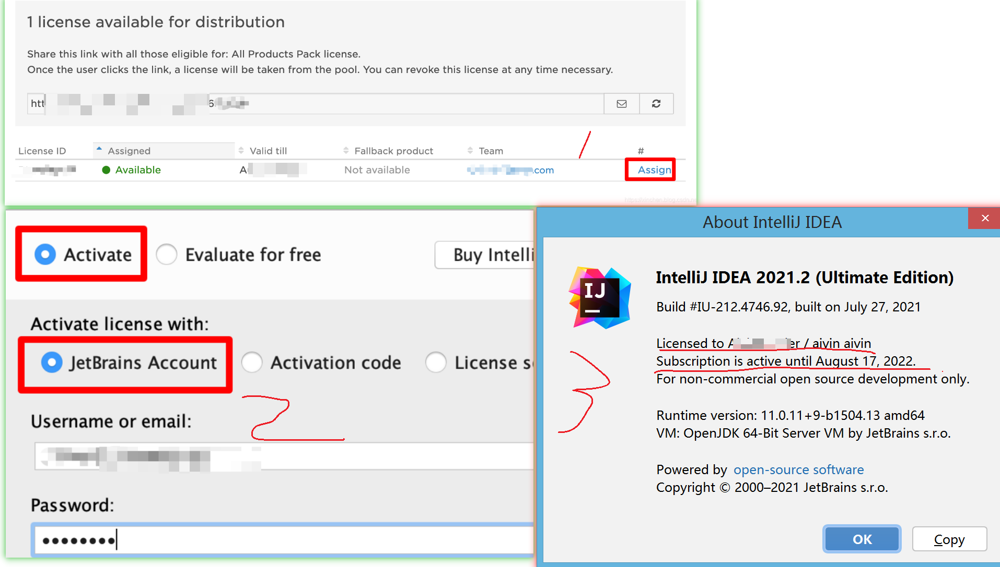
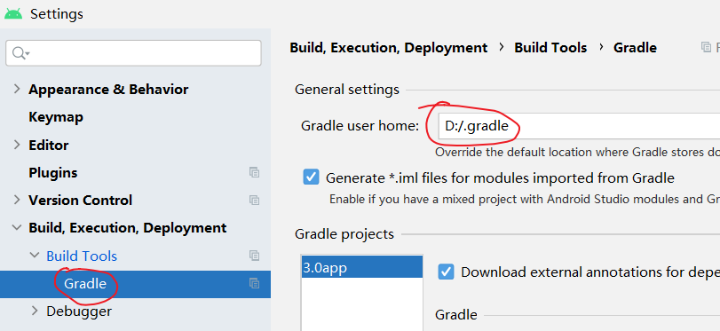
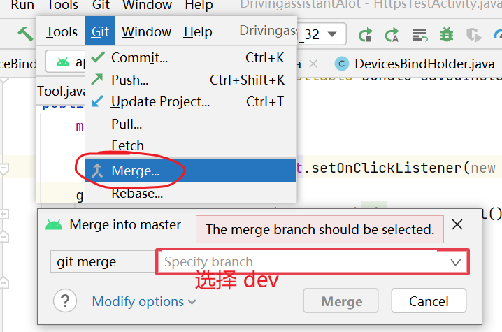
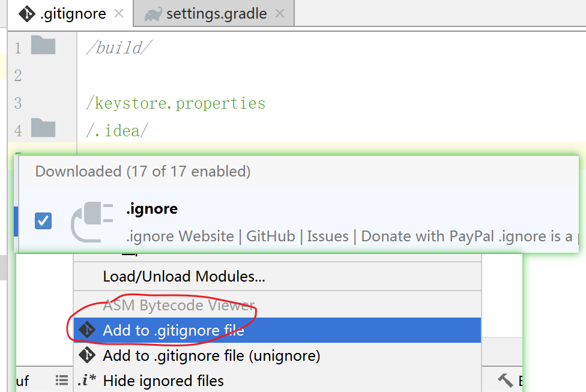
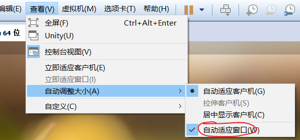

#  IntelliJ IDEA
```text
IntelliJ IDEA 下载地址为
https://www.jetbrains.com/idea/download/#section=windows

IntelliJ IDEA 商业版 License 免费申请。
申请地址为 https://www.jetbrains.com/shop/eform/opensource?product=ALL
一般是一周左右就可以通过。
申请条件是自己的开源项目， github 和gitee上的都可以。
我用的就是托管在 gitee上的开源项目。

许可证的有效周期为一年 
They are valid for one year. 
You will receive an automatic email reminder shortly before the license expiration date.

根据收到的邮件进入授权页面，点击 Assign 授权给你指定的账号。
然后打开 IntelliJ IDEA 就行使用即可。
```



# Androidstudio 
安装或更新后插件后都需要重启 Androidstudio 。
[Androidstudio下载](https://developer.android.com/studio/index.html)

## Androidstudio 自动代码补全配置
```text
通过输入快捷键，自动补全模板代码，
例如 输入 "todo" , 就可以自动生成 "// TODO: 2021/2/4  " 

ctrl + J  快速查看 Live Templates
打开 "设置 -> Editor -> Live Templates"，
可以看到默认已经有很多"Live Templates" ，可以进行修改。

导入原有的模板：
将文件替换即可 （C:\Users\kaifa4k\.AndroidStudio2.2 是你自己的安装路径）
C:\Users\kaifa4k\.AndroidStudio2.2\config\templates
```

## CodeGlance
代码快速定位 插件


## [Android-Resource-Usage-Count](https://plugins.jetbrains.com/plugin/9885-android-resource-usage-count)
显示 Android 资源使用的次数。


## [翻译插件ECTranslation](https://github.com/Skykai521/ECTranslation)
原理是调用了有道词典的API 。可以自定义 快捷方式，我目前设置的是 alt + m
```text
快捷键设置
Preferences -> Keymap -> 搜索Translate - > 右键 add Keyboard Shortcut. 输入你想要的快捷键。
```
 


## Android Parcelable code generator
自动生成 Parcelable接口相关的代码。
```text
public class FtpThumDownListInfo implements Parcelable{
    /**当前这个指针 指向的文件需要下载*/
    private int gotoDownFileIndex = 0;
    /**需要下载的文件列表- 这个列表会分批次增加 */
    private List<FTPFile> ftpNeddLoadList =null  ;
    /**下载好的文件的byte[]*/
    private List<FTPFile> ftpDowndBytesList =null  ;

    //以下代码是 用插件自动生成的  start
    protected FtpThumDownListInfo(Parcel in){
        this.gotoDownFileIndex = in.readInt();
        this.ftpNeddLoadList = new ArrayList<FTPFile>();
        in.readList(this.ftpNeddLoadList, FTPFile.class.getClassLoader());
        this.ftpDowndBytesList = new ArrayList<FTPFile>();
        in.readList(this.ftpDowndBytesList, FTPFile.class.getClassLoader());
    }

    /**
     * 内容接口描述，默认返回0就可以了
     */
    @Override
    public int describeContents(){
        return 0;
    }

  
    @Override
    public void writeToParcel(Parcel dest, int flags){
        dest.writeInt(this.gotoDownFileIndex);
        dest.writeList(this.ftpNeddLoadList);
        dest.writeList(this.ftpDowndBytesList);
    }

    /**
       实例化静态内部对象
     * 接口对象名必须为CREATOR.
     * 必须按成员变量声明的顺序读取数据
     */
    public static final Parcelable.Creator<FtpThumDownListInfo> CREATOR = new Parcelable.Creator<FtpThumDownListInfo>()  {
        @Override
        public FtpThumDownListInfo createFromParcel(Parcel source)  {
            return new FtpThumDownListInfo(source);
        }

        @Override
        public FtpThumDownListInfo[] newArray(int size)  {
            return new FtpThumDownListInfo[size];
        }
    };

    // 以下代码是 用插件自动生成的 end
}


//赋值
Bundle mBundle = new Bundle();
mBundle.putParcelable("picBean",picBean);  
intentToMatch.putExtras(mBundle);
//获取：
RecommendPicBean picBean = (RecommendPicBean)getIntent().getParcelableExtra("picBean");
```


## 无线调试 ADB WIFI
```text
华为M2 ，无Root
1、 确保电脑和手机在同一个局域网
2、插上USB线 连上adb
3、adb tcpip 5555 ( 5555为端口号，可自由指定）
4、adb connect 192.168.x.x:5555

// 如果是想同时连接多个设备
> adb devices   // 找到设备号

adb -s 设备号 指令  // 使用 -s 参数指定设备号
```

##  布局查看器
```text
可以用 Androidstudio 自带工具查看 DecorView的布局。
Tools -> Layout Inspector
```

## 生成文档 JavaDoc
```text
找到工具栏上的 Tools，选择 Generate JavaDoc
如果出现编码错误提示，则在 Other command line arguments 中添加 -encoding utf-8 -charset utf-8
```

## 单行注释
```text
androidstudio 单行注释默认是从第一列开始的。
如果需要改成从代码列开始，可以配置：
Settings → Editor → Code Style → JAVA. Select "Code Generation" tab 
然后把 "Line comment at first column"去掉即可，注意要找到"Code Generation" tab页才行 。
```

## 多行注释快捷键
```text
Ctrl+Shift+/   

// idea将单行注释替换为多行注释
匹配正则
// +(.*$)   ---------->       /**\n   * $1\n   */
```
 
## 代码折叠
```text
可以把相关的代码放在一组 region 中，
这样这组代码就可以收起和展开。

// region 布局测试
...... 这是代码...
// endregion 布局测试
``` 


## 配置作者模板
```text
/** 
 * @author Aivin
 * created on ${DATE}
 * des: 
 */
```


## BookMark 书签
```text
做项目难免来回查看某个文件的某个方法，某些文件可能访问率很高，
为了加快开发效率楼主推荐使用 favorites  文件 , bookmark 代码行 ,

favorites 的添加就再文件单击右键 add to favorites 即可。
添加书签 // 单击 f11 (笔记本需要 fn ) 
查看书签 //  shift+f11 (笔记本需要 fn ) 

比较遗憾的是，目前(20211122) Androidstudio还不支持导出或同步书签，以便分享到其他同事。
```

## androidstudio 快速删除无用的 import
```text
Code --> Optimize Imports
```


## 修改 .android /  .gradle 的默认位置
```text
C:\Users\你的名字 
下默认会有  .android 和 .gradle 文件夹， 会占用大量的C盘空间。
.android  是Android SDK生成的 AVD(Android Virtual Device Manager)，即模拟器存放路径 。
你如果不用模拟器，删掉这个文件夹即可。
1、修改 .android 默认路径会稍微麻烦一点。
我不适用模拟器，懒得做笔记了，需要的去百度一下即可。

2、修改 .gradle 的默认路径比较简单 ，在 Androidstudio 中指定路径就可以了。
.gradle 是Androidstudio 默认缓存 gradle 的路径。
```



 


# git操作
## 配置全局信息
```text
git config --global user.name "aivin666@qq.com"
git config --global user.email "aivin666@qq.com"
git config --list //查看当前用户信息
```

## 拉取指定分支
```text
git clone  -b 分支名称  https://xxxx.git 
```


## 拉取指定历史版本
```text
1、找到历史版本，获取对应的版本编号
2、git checkout xxxxx
```


## git 文件状态
```text
Git中文件大概分为三种状态：已修改（modified）、已暂存（staged）、已提交（committed）

修改：Git可以感知到工作目录中哪些文件被修改了，然后把修改的文件加入到 modified 区域

暂存：通过 add 命令将工作目录中修改的文件提交到暂存区，等候被 commit

提交：将暂存区文件commit至Git目录中永久保存
```


## git合并
```text
分支合并
Androidstudio上，如何操作将 dev 分支 合并到  testUI2 分支：
1、将当前分支切换到 testUI2,(意思是准备将其他分支合并到 testUI2)
2、按下图进行 merge 操作。
3、执行 merge 后，此时dev的内容会被合并到本地的 testUI2 上，然后用 push 将 testUI2 的本地内容推送到服务器。
```



## git 的 HEAD 概念
```text
HEAD 是Git中非常重要的一个概念，你可以称它为指针或引用，
HEAD 可以指向任意一个节点，并且指向的节点始终为当前工作目录 ，也就是你所看到的代码 就是HEAD指向的 节点 。
```


## [添加个人私钥到网站](http://git.mydoc.io/?t=154712)
这种情况下无需配置密码 - window10下测试
```text
1、生成对应的文件
ssh-keygen -t rsa -C 'aivin666@qq.com'
2、将 id_rsa.pub 里面的内容填写到网站上。
3、测试是否成功 。
ssh -T git@gitee.com
```

##  配置密码方式  Ubuntu下测试
https模式，每次提交都需要输入密码。
```text
1、在一个新目录 初始化
git init

2、将远程代码拉倒本地
git pull https://gitee.com/hnyer/java_android.git

3、关联远程端仓库
master 是远程端的一个支路。
git remote add master https://gitee.com/hnyer/java_android.git
// git remote rm master , 删除关联

4、 将本地指定的版本推送到远程端指定的版本
的一个maser是远程的 ，第二个是本地的
git push -u master master

5、以后不用每次都用参数 u ,直接 git push 即可
```

## Ubuntu下 SSH 配置 码云
```text
1、进入 /home/用户名/.ssh 目录下 生成公钥
ssh-keygen -t rsa -C "your_email@example.com"

2、将 id_rsa.pub 文件中的内容填入码云网站中 。
3、即可正常拉取 、提交 
```
 
## git 有时会把本地代码覆盖掉
```text
一般我们 git 更新不会覆盖掉我们本地的代码 ,但是有时 androidstudio 出bug ， git pull 后，
会把本地代码删掉。此时可以通过 Androidstudio 的 localHistory 找回代码。
```


## gitignore 文件
```text
1、如果不清楚添加规则，可以借用插件 .gitignore 进行鼠标添加

2、有时会遇到修改了忽略文件后，规则并没有生效的现象。
原因是.gitignore只能忽略那些原来没有被追踪的文件，如果某些文件已经被纳入了版本管理中，
则修改.gitignore是无效的。那么解决方法就是先把本地缓存删除（改变成未被追踪状态），然后再提交。
git rm -r --cached ./  (注意那个小数点) 
``` 


 

## idea 中 git pull 和 update project 的区别
```text
git pull 是 git fetch + git merge FETCH_HEAD 的缩写。
git pull 就是先 fetch ，然后执行 merge 操作，如果加 —rebase 参数，就是使用 git rebase 代替 git merge。

Idea 的 update project 就是你可以选择到底是 merge 还是 rebase 的 git pull。 
是 idea 封装的一个工具。
```


## git fetch 和 git pull 的区别
```text
git fetch ：相当于是从远程获取最新版本到本地，但不会自动 merge
git pull ：相当于是从远程获取最新版本并 merge 到本地 。
git fetch 更安全一些，因为在 merge 前，我们可以查看更新情况，然后再决定是否合并。
```


## git push 命令
```text
git push 用于将本地的分支版本上传到远程并合并。
git push <远程主机名> <本地分支名>:<远程分支名>    //完整命令
git push <远程主机名> <本地分支名>        // 如果本地分支名与远程分支名相同，则可以简写
```


## Merge branch ‘master’ of XXXXX 
```text
经常可以在 git 版本控制工具的时候，可以在提交记录中看到 Merge branch ‘master’ of XXXXX  这一条记录，
这使我们的提交记录看起来很凌乱。

我们合并的时候选择 rebase 模式 而不是 merge 模式既可。
```


##  git rebase 和 git merge 的区别
```text
git rebase 和 git merge , 他们两种合并所产生的log是不一样。
rebase 模式相对简洁很多 ，merge 会如实第记录所有提交，看起来会显得繁杂。
两者模式各有优势，可能不同的公司有不同的选择。
```


# gitbook
## windows 安装gitbook
```text
安装gitbook过程中请优先连接VPN，如果没有请考虑更换淘宝源等方式。

npm uninstall -g gitbook  // 卸载 gitbook
npm uninstall -g gitbook-cli
npm cache clean --force   //清除npm缓存
npm install gitbook -g  // 安装gitbook
npm install -g gitbook-cli
gitbook -V  // 查看版本
gitbook ls  // 列出本地所有的gitbook版本

//注意
安装新版本的 nodejs后，再去安装gitbook 会出现很多问题，比较折腾。没有必要去安装最新版本的 node
所以为了省事，可以直接安装 node-v10.15.0-x64.msi 即可 。https://nodejs.org/dist/
gitbook 的安装流程就是两句命令
npm install -g gitbook-cli  // 先安装 cli
gitbook -V  // 输入查看版本的命令后，如果没有安装，就会去自动安装，耐心等待即可。
```

##  在国内为了加速访问速度，一般会更换成淘宝的下载源
```text
// 设置 淘宝镜像源
npm config set registry https://registry.npm.taobao.org
npm config get registry  // 查看 使用的 镜像源
npm install -g cnpm --registry=https://registry.npm.taobao.org
```

## gitbook常用的使用命令
```text
gitbook install // 安装依赖包
gitbook init //新建定义好的文件
gitbook serve // 本地服务器测试
gitbook build // 编译成html格式
```


## 安装错误
```text
如果遇到 “ Error: ENOENT: no such file or directory ... ” 这个错误 ，
把.gitbook\versions\3.2.2\lib\output\website\copyPluginAssets.js
修改成   confirm：false 

如果遇到  fs\polyfills.js:287 if (cb) cb.apply(this, arguments) ...
根据报错信息，找到 polyfills.js ，注释 62-64 行即可 
Node.js：v14.15.4. 
CLI version: 2.3.2
GitBook version: 3.2.3
```
 
## gitbook 热更新 (Windows)
```text
https://github.com/GitbookIO/gitbook-cli/issues/67
暂时没找到优雅的办法。给出粗暴的方案，检测到奔溃后又重启。
将下面的命令做成一个 xx.bat ，通过这个文件启动即可。
@echo off
:start
call gitbook serve
@goto start
```

## gitbook 留言评论
```text
使用 Valine 插件可以实现 (20210204)。
Valine 是一款无后端评论系统。
https://valine.js.org/

Valine 是基于 leancloud 实现的(Valine的评论数据保存在这里)    
需要申请 leancloud 的账号，因为国内监管问题，
如果你不想实名认证和域名备案，请使用国际版 (20210204)。。
https://console.leancloud.app/apps
```

# 虚拟机
```html
VMware Workstation 12序列号
5A02H-AU243-TZJ49-GTC7K-3C61N

//安装完VmTools重启之后仍不能全屏显示
检查VmTools是否安装成功: 将主机的一个文件拖到虚拟机，如果可以托进去说明已经安装成功，否则没有。
如果还没有全屏显示，就设置成"自动适应窗口"。
```



#  windows 系统
如果用的是正版的win10系统，会经常提示更新，但是如果你不想强制你更新，
可以 使用 [Windows Update Blocker]( https://www.sordum.org/9470/windows-update-blocker-v1-6/)将更新模块禁止掉。

## 电脑浏览器模拟手机浏览器
pc端谷歌浏览器模拟微信浏览器，然后利用音频抓取插件抓取音频。
因为有些网页做了限制“请在微信客户端打开链接” 。
```text
1、电脑端谷歌浏览器安装插件 " user agent switcher "
2、在插件中模拟微信浏览器的 UA ( userAgent )
mozilla/5.0 (linux; android 5.1.1; mi note pro build/lmy47v) applewebkit/537.36 (khtml, like gecko) version/4.0 chrome/37.0.0.0 mobile mqqbrowser/6.2 tbs/036215 safari/537.36 micromessage/6.3.16.49_r03ae324.780 nettype/wifi language/zh_cn
3、然后浏览器安装插件“猫抓”，进行视屏抓取。
```

## win10 双屏显示
```text
按 Windows 徽标键  + P 
然后在弹出的选项中选择 拓展。
```


## win10 iso 镜像
```text
https://windows10.pro/microsoft-com-software-download-windows10-iso/
或者在我阿里云盘里有保存。
win10_21h1_china_ggk_chinese(simplified)_x64.iso
```

 
# ps
## 常用快捷键：
```text
移动工具  V
裁剪工具  C
shift+ctrl+alt+s 保存切片
放大视图 Ctrl+【+】
缩小视图 【Ctrl】+【-】
切图： ctrl + alt + shift + a
```

## 制作圆角矩形图片
[参考资料](http://jingyan.baidu.com/article/1974b289b4a5e8f4b1f774a7.html)
 

## 图片渐变、透明度渐变
[参考资料](http://jingyan.baidu.com/article/bea41d43769fa2b4c51be69f.html)


## PS里怎么样将白色背景去掉，变成透明的背景？
[参考资料](https://zhidao.baidu.com/question/117581064.html)
```text 
要先解压图层锁定
打开图片，单纯白色背景的话则只需使用工具栏中的魔棒工具在白色部位点一下，跟着delete键删除，此时就是透明的背景图片了，但关键的是要选择合适的保存方式。点文件-存储为web和设备所用格式，在弹窗选择附图红框处的PNG格式就可以了。
方法一:用擦除工具组中的魔棒擦除,点选白色
方法二:
1、用选择工具中的魔棒工具选白色(勾选连续的).
2、然后反选,复制
3、再粘贴成新层
4、册掉背景层
5、完
```

 
# xUtils 

```text
https://github.com/wyouflf/xUtils3
compile 'org.xutils:xutils:3.5.0'

// 1、在Application 初始化
// import org.xutils.x;
x.Ext.init(this);
x.Ext.setDebug(false);

// get请求
private void loadData( ) {
    String API = Ipconfig.KEY_WORKNEWS_DetailItem;
    API = API.replace("{pageSize}" ,"10") ;
    RequestParams params = new RequestParams(API);
    Callback.Cancelable cancelable = x.http().get(params,
            new Callback.CommonCallback<String>() {
                @Override
                public void onSuccess(String result) { }

                @Override
                public void onError(Throwable ex, boolean isOnCallback) {   }

                @Override
                public void onCancelled(CancelledException cex) {   }

                @Override
                public void onFinished() {   }
            });
}

// post 请求
private void requestHost(String name, String pwd1 ) {
    String API = Ipconfig.KEY_userRegister;
    RequestParams params = new RequestParams(API);
    params.addBodyParameter("userName",name);
    params.addParameter("password",pwd1);
    x.http().post(params, new Callback.CommonCallback<String>() {
        public void onSuccess(String result) {   }
    });


 // 文件上传
String api ="http://xxx" ;
RequestParams params = new RequestParams(api) ;
params.setMultipart(true);
params.addBodyParameter("userId", MyApplication.getUserId(activity));
params.addBodyParameter("file", new File( filePath));
Callback.Cancelable cancelable
        = x.http().post(params,
        new Callback.CommonCallback<String>() {
            @Override
            public void onSuccess(String result) {   }
        });
// 文件下载
RequestParams requestParams = new RequestParams();
requestParams.setSaveFilePath(filePath);
requestParams.setUri(url);// 文件url
x.http().get( requestParams, new Callback.ProgressCallback<File>() {
    @Override
    public void onSuccess(File result) {   }
    @Override
    public void onLoading(long total, long current, boolean isDownloading) {
        float percent = 100f* current /  total  ;
    }        
```

 
# butterknife
```text
butterknife 常用的功能就是 findview 绑定 和 click 绑定。
https://github.com/JakeWharton/butterknife
```

##  butterknife 添加依赖
```text
Butterknife requires Java 8,
compileOptions {
    sourceCompatibility JavaVersion.VERSION_1_8
    targetCompatibility JavaVersion.VERSION_1_8
}

dependencies {
// 在 基础库中添加
  implementation 'com.jakewharton:butterknife:10.2.3'
}

dependencies {
// 在项目根目录的 build.gradle 中添加插件依赖
    classpath 'com.jakewharton:butterknife-gradle-plugin:10.2.3'
  }

// 在需要使用的 module 中添加
apply plugin: 'com.jakewharton.butterknife'  
// 哪个 module 使用，就在哪个 module 中添加，而不是添加在在基础module中，否则注解是无效的。
annotationProcessor 'com.jakewharton:butterknife-compiler:10.2.3'
```

##  butterknife 使用示范
```text
@BindView(R2.id.wkExpandOhterFunc)
public WkExpandLayout wkExpandLayout ;

setContentView(R.layout.lib_login_activity_login);
ButterKnife.bind(this);

@OnClick({R2.id.changeStateBtn })
public  void onViewClicked(View view){
    int id = view.getId();
    if (id == R.id.changeStateBtn) {
         // todo 
    }
}
```


 

# EventBus、
```text
缺点： 不容易跟踪调试代码。逻辑不是很连贯。
https://github.com/greenrobot/EventBus
compile 'org.greenrobot:eventbus:3.1.1'
// 绑定
@Override
public void onStart() {
    super.onStart();
    EventBus.getDefault().register(this);
}

// 解绑
@Override
public void onStop() {
    super.onStop();
    EventBus.getDefault().unregister(this);
}

// 发送
EventBus.getDefault().post(new MessageEvent());

// 接收
@Subscribe(threadMode = ThreadMode.MAIN)
public void onEventBusMsgCome(WkEventBean bean) {
   switch (bean.getCode()){
       case WkEventBean.CODE_1:
           String msg = (String) bean.getData() ;
           WkLog.d("UI received =   "+msg);
           break;
       default:
           break;
   }

public class WkEventBean {
public static  final int CODE_1 = 1;
public static  final int CODE_2 = 2;
public WkEventBean(int code , Object data){
   this.code = code ;
   this.data =data ;
}

private int code ;
private Object data ;

public int getCode() {
   return code;
}
}       
```
 


#  [RxJava 2.x](https://github.com/ReactiveX/RxJava)
要在Android中使用RxJava2,  需要依赖 [Rxjava2.x](https://github.com/ReactiveX/RxJava) 、 [RxAndroid](https://github.com/ReactiveX/RxAndroid)

```text
异步事件处理框架。
continued support for Java 6+ & Android 2.3+
基于观察者设计模式。

RxJava1.x 跟 RxJava2.x 不能共存 ，会冲突。
```

## RxJava组成元素
RxJava基本组成元素 | 说明
-|-
被观察者 | 数据源  发送数据
观察者  |  接收到（处理后的数据）
建立订阅关系 |  
操作符 | 可以对数据进行过滤、转换等处理
线程切换 |  指定发送和接收的线程


## RxJava 常用类

常用类 | 作用
-|-
Observable| 被观察者 <br>
ObservableEmitter| 用来发出事件的，它可以发出三种类型的事件  <br> x.onNext() <br> x.onComplete() <br> x.onError() <br> 发射规则如下： <br>  1、上游可以发送无限个onNext ，下游也可以接收无限个onNext   <br><br> 2、当上游发送了一个onComplete后（只能发一次）, 上游onComplete之后的事件将会继续发送, 而下游收到onComplete事件之后将不再继续接收事件  <br><br> 3、当上游发送了一个onError后（只能发一次）, 上游onError之后的事件将继续发送, 而下游收到onError事件之后将不再继续接收事件  <br><br> 4、上游可以不发送onComplete或onError.  <br><br> 5、onComplete 和 onError 只能发送一个 , 不能都发送
ObservableOnSubscribe |
Observer| 观察者
Disposable| x.dispose() 切断订阅关系。 <br>  调用dispose()后 ，观察者接收不到数据，但是数据源还可以继续发送
CompositeDisposable| Disposable 容器 <br> x.add(...)  <br> x.clear()
Flowable | Rxjava2 新增的 。数据发送 。我们可以用Flowable + Subscriber 来解决 收发速度不一致问题
Subscriber| 与Flowable搭配， 数据接收。
Subscription|  切断订阅关系 <br> Subscription.cancel()  <br>  观察者请求数据源发送多少个数据 <br> subscription.request(Long.MAX_VALUE)
FlowableEmitter | 返回 观察者 能处理多少个数据 <br>flowableEmitter.requested()
Action |
BiConsumer |
BiFunction |
Predicate|
BiPredicate|
BooleanSupplier|
Cancellable|
Consumer |
Function |
Function3|
Function4|
Function5|
Function6|
Function7|
Function8|
Function9|
IntFunction|
LongConsumer|
Schedulers | 调度器。 <br>  当数据源和观察者在同一个线程时，这是一个同步的订阅关系 。 <br>  数据源每发送一个事件后必须等到观察者接收处理完了以后才能接着发送下一个。  <br>  当处于不同线程时 ,就是异步的订阅关系, 这个时候数据源可以自由发送数据。  <br>//CPU计算密集型线程 默认线程数等于处理器的数量  <br>  Schedulers.computation()   <br>  // 使用指定的Executor作为调度器 <br>  Schedulers.from()  <br>  // io操作的线程 <br>  Schedulers.io()  <br>  // 常规新线程 <br>  Schedulers.newThread()  <br>  // Android主线程 <br>  AndroidSchedulers.mainThread()  <br>  // 在当前线程执行 ，不过需要等队列中的其他任务完成后才执行 <br>  Schedulers.trampoline()  <br>  
BackpressureStrategy| 背压策略 抗压力策略  <br>   背压是指在异步场景中，数据源发送事件速度远快于观察者的处理速度的情况下， <br> 一种告诉 数据源 需要降低发送速度的策略 。  <br>    // 缓存区大小128，超过大小继续发就会报错 <br>      BackpressureStrategy.ERROR   <br>   // 默认128，超过大小继续发就会 提示缓冲满了 <br>   BackpressureStrategy.MISSING   <br>   // 默认大小128 ，大于128时就会修改为无限大。直到OOM <br>   BackpressureStrategy.BUFFER    <br>   // 默认128 ，超过128后来的数据会被丢掉 <br>   BackpressureStrategy.DROP   <br>   // 默认128 ，超过128就会只会保留最后的一个数据。  最后总个数 是 129 <br>   BackpressureStrategy.LATEST  <br>   
SingleEmitter | 用来发射一条单一的数据，且一次订阅只能调用一次 <br>  singleEmitter.onSuccess()  <br>   <br>  // onSuccess与onError只可调用一个  ，否则会报异常 <br>  singleEmitter.onError()
Subject | 主题 , 不支持背压控制  <br>  一种特殊的存在 ，同时是 数据接收者 和 发送者
AsyncSubject|无论输入多少参数，永远只输出最后一个参数  ,  <br> 如果因为发生了错误而终止，AsyncSubject将不会发射任何数据
BehaviorSubject| 会发送离订阅最近的上一个值，没有上一个值的时候会发送默认值。  <br> 如果遇到错误会直接中断
PublishSubject|一旦一个观察者订阅了该Subject，它会发送所有数据给订阅者。  <br>  如果接收者只关系自己订阅的信息 ，可以用ofType来过滤  <br>  订阅者只会接受订阅之后的来自PublishSubject发射的数据。
ReplaySubject|无论何时订阅，都会将所有历史订阅内容全部发出
Processor|  rxjava2.x新增的 ，作用与Subject一样 。 <br> 支持背压控制
AsyncProcessor |
BehaviorProcessor |
PublishProcessor |
ReplayProcessor |
Transformer | 转换器 ，  实际上就是Func1<Observable , Observable>，  <br>  换句话说就是提供给他一个Observable它会返回给你另一个Observable
ObservableTransformer |
SingleTransformer |
CompletableTransformer |
FlowableTransformer |
MaybeTransformer |


## RxJava2.0中的观察者模式

RxJava2.0中的观察者模式| 说明
-|-
Observable / Observer | 不支持背压，及无法处理发送数据速度不协调的问题。  <br>  
Flowable/ Subscriber|
Single/ SingleObserver| 只发射一条单一的数据，或者一条异常通知，  <br>  不能发射完成通知，其中数据与通知只能发射一个。  <br>  // 可以指定Schedulers实现异步处理 ，如果不被订阅是不会被调用的  <br> Single.create  <br>   <br> // 接收传入的参数 ，是一种特殊的create() ，只会在当前线程里执行 , 不管是否被 订阅均会被调用  <br> Single.just  <br>   <br> // 仅仅用来连接Single顺序执行的，比如顺序执行检查网络，检查内存 ，注意：如果某个Single调用了onError()会导致被中断  <br> Single.concat  <br>   <br> // 将多个Single整合为一个  <br> Single.zip  <br>   <br> //   <br> Observable.just().zipWith()  <br>   <br> //创建一个自定义的操作符，用来处理数据发送者 。  <br> 就是对当前Observable进行操作，然后再返回它   <br> Single.compose  <br>   <br> //   <br> Single.subscribe  <br>   <br> // 返回一个错误， 一般用于调试  <br> Single.error  <br>   <br> // 用于一对0~多的返回  <br> Single.just( ... ).flatMap()  <br>   <br> // 一般map()是用于一对一的返回  <br> Single.just( ).map()  <br>   <br> // 它支持将Single转化为Observable对象，可以返回多个值  <br> Single.just( ).flatMapObservable()  <br>   <br> //  类似于concat ，如果有中断 ，后面都会中断  <br> Single.merge()  <br>   <br> //   <br> Single.just().mergeWith()  <br>   <br> // 用于指定异步任务的线程  <br> Single.just().subscribeOn()  <br>   <br> // 相当于try catch中的return，具体意思就是当函数抛出错误的时候给出一个返回值  <br> Single.just().onErrorReturn()  <br>   <br> // 指定回调所在线程  <br> Single.just().observeOn()  <br>   <br> // 超时设置  <br> Single.just().timeout()  <br>   <br> //   <br>  Single.just( ).toString()
Completable/ CompletableObserver|只发射一条完成通知，或者一条异常通知， <br> 不能发射数据，其中完成通知与异常通知只能发射一个
Maybe/ MaybeObserver|可发射一条单一的数据，以及发射一条完成通知，  <br>  或者一条异常通知，其中完成通知和异常通知只能发射一个，  <br>  发射数据只能在发射完成通知或者异常通知之前，否则发射数据无效。


##  RXjava2操作符
所谓的操作符就是一些被Rxjava封装好的方法或API ，使用这些操作符就可以完成线程调度，数据过滤等功能 。


操作符类型 | 说明
-|-
create()|创建被观察者对象
just()|快速的创建被观察者对象
fromArray()|将数组中的数据转换为Observable对象
fromIterable()|将List中的数据转换为Observable对象
empty()| 用于测试 ，仅发送Complete事件  
error()|用于测试 ，仅发送Error事件
never()|不发射数据，也永远不会结束
defer()|直到有观察者订阅时，才创建被观察者对象&发送事件  <br>  每次订阅后，都会得到一个刚创建的最新的Observable对象
timer()| 延迟指定时间后，发送1个数值0
interval()|  每隔指定时间就加n并发送出去
range()|连续发送一个事件序列，可指定范围
rangeLong()|跟 range()类似，支持数据类型为Long
intervalRange()|每隔指定时间 就发送 事件，可指定发送的数据的数量
map()  | 将传入数据处理后返回 。<br> 输入和输出是一对一
flatMap()| 输入和输出可以是 一对多 <br> 不能保证 输出的顺序和输入的顺序一致
concatMap| 输入和输出可以是一对对 <br>  输出和输入顺序 严格一致
buffer()|每次取n个事件放到缓存区中，n可配置
filter()| 将符合自定义条件的事件过滤出来
ofType()|过滤 特定数据类型的数据
skip()| 跳过正序的前 n 项
skipLast()| 跳过正序的后 n 项
distinct()| 去掉序列中重复的事件
distinctUntilChanged() | 去掉序列中连续重复的事件
take()| 指定观察者最多能接收到的事件数量
takeLast()| 指定观察者只能接收到被观察者发送的最后几个事件
throttleFirst()| 在某段时间内，只发送该段时间内第1次事件
throttleLast()| 在某段时间内，只发送该段时间内 最后1次事件
sample()| 指定时间内 取一次数据 ，其他的数据就会被丢掉
throttleWithTimeout() | 在输出了一个数据后的一段时间内，没有再次输出新的数据，  <br>   则把这个数据真正的发送出去；   <br>  假如在这段时间内有新的数据输出，则以这个数据作为将要发送的数据项，  <br>  并且重置这个时间段，重新计时
debounce () | 跟 throttleWithTimeout() 一样
firstElement() | 仅选取第1个元素
lastElement()  | 仅选取最后一个元素
elementAt()|  接收指定索引的某个元素 ， <br>  索引越界也不会报异常
elementAtOrError()| 接收指定索引的某个元素 ， <br>  索引越界 会报异常
all()| 判断发送的所有数据是否都满足自定义的条件 , true false
takeWhile()| 判断发送的每项数据是否满足 自定义条件   <br>  若满足条件则发送 ,不满足不发送
skipWhile()| 一直跳过，直到满足自定义条件
skipUntil()| -
takeUntil()| 一直发送 ，直到某个条件
sequenceEqual()| 两个数据源的数据是否相同
isEmpty()| 数据源的数据是否为空
contains()| 数据源中是否包含指定数据
defaultIfEmpty( obj)| 在不发送任何有效事件（ Next事件）、仅发送了 Complete 事件的前提下，发送个默认值obj
amb()| 当有多个数据源需要发送数据时 ， <br>  只发送 先发送数据的Observable的数据，而其余 Observable被丢弃。
concat()|组合多个被观察者一起发送数据，合并后 按发送顺序串行执行
concatArray()| 跟concat()类似
merge()|组合多个被观察者一起发送数据，合并后 按时间线并行执行  <br>  被观察者数量≤4
mergeArray()| 被观察者数量 > 4
mergeWith()|
delay()|使被观察者延迟一段时间再发送事件
concatDelayError()| 使用concat()，一旦某个被观察者发出onError事件，其他被观察者就会终止发送。 <br> 为了让其他被观察者继续发送，可以使用这个操作符
concatArrayDelayError()|
mergeDelayError()|
combineLatestDelayError()|
reduce()|把被观察者需要发送的事件聚合成1个事件、发送
collect()|将被观察者发送的数据事件收集到一个数据结构里
startWith()| 在被观察者发送事件前，追加发送一些数据
startWithArray()|
count()|统计被观察者发送事件的数量
subscribe()| 订阅， 连接观察者 和 被观察者
zip()|多个数据源Observable 发送数据，经过自定义组合处理后，观察者再收到 。 <br> <br> 1、组合数据时严格按照顺序从多个数据源中拿数据。<br> 2、最后观察者收到的数据个数 跟发送最少数据的数据源的数据个数相同。
x.zipWith()|
combineLatest()|如果子流1在等待其他流发射数据期间又发射了新数据，  <br> 则使用子流最新发射的数据进行合并
x.concatMap()|
x.scan()|
x.window()|
subscribeOn()| 指定发送事件的线程  <br>  只有第一次指定有效，其余的指定线程无效
unsubscribeOn()| 取消订阅
observeOn()|指定接收事件的线程  <br>  每次指定均有效
doOnEach() |每发送一次就会调用一次
doOnNext () |执行 next之前调用
doAfterNext()  |执行 next之后调用
doOnError() |
doOnComplete()|
doOnTerminate()|
doFinally()|
doOnSubscribe() |观察者订阅时调用
onErrorReturn()| 遇到错误时，发送1个特殊事件 & 正常终止
onErrorResumeNext()| 拦截的错误 是Throwable 类型
onExceptionResumeNext()|拦截的错误 是 Exception类型
retry()| 当捕捉到错误时，被观察者会重新发射数据
retryUntil()|遇到错误，重新发射，直到...
retryWhen()|
repeat()| 无条件地、重复发送事件
repeatWhen()|
repeatUntil()|
publish()|
share()|
connect()|


## 补充知识点
### 链式调用
```text
MsgInfo msgInfo = new MsgInfo();
// 链式调用
msgInfo.setOwnerId("100011002")
        .setStatus(MsgInfo.Status.SENDING)
        .setTime(System.currentTimeMillis());

// 普通调用
msgInfo.setOwnerId("100011002");
msgInfo .setStatus(MsgInfo.Status.SENDING) ;
msgInfo .setTime(System.currentTimeMillis());

// 链式调用的关键在于方法的返回值！
public MsgInfo setStatus(int status) {
    this.status = status;
    // 注意返回的是 this
    return this;
}
```


 
# [Retrofit 2.x](https://github.com/square/retrofit)
```text
一个支持 RxJava方式调用的网络请求框架
A type-safe HTTP client for Android and Java  by Square, Inc.
requires at minimum Java 7 or Android 2.3.

Retrofit 提供2种风格的网络请求方式：
1、传统风格 (略过不看)
采用Callback 接口  
2、RxJava 风格 (流行)
采用Observable接口
```
 
## Retrofit2 + Rxjava2  依赖
```text 
// rxjava核心库
compile 'io.reactivex.rxjava2:rxjava:2.0.1'
// Android 支持 Rxjava
compile 'io.reactivex.rxjava2:rxandroid:2.0.1'
// Android 支持 Retrofit
compile 'com.squareup.retrofit2:retrofit:2.1.0'
// 衔接 Retrofit & RxJava
compile 'com.jakewharton.retrofit:retrofit2-rxjava2-adapter:1.0.0'
// 支持Gson解析
compile 'com.squareup.retrofit2:converter-gson:2.1.0'
```

注解|作用
-|-
@GET| get请求
@POST| post请求
@DELETE| delete请求
@HEAD| head请求
@OPTIONS| options请求
@PATCH| patch请求
@Headers|	添加请求头
@Path	| get请求 ，user/{password}  格式
@Query|	get请求 ， user/password?password=xxx 格式
@FormUrlEncoded	| 用表单数据提交
@Field|	 post需要  post请求需要 ， 替换参数

```text
//定义请求接口
public interface BlogService {
    // get 方式
    @GET("getAllMusicInfoGson")
    Call<ResponseBody> getBlogByGet(@Query("pageNum") int pageNum);
    // post 方式
    @FormUrlEncoded
    @POST("getAllMusicInfoGson")
    Call<ResponseBody> getBlogByPost(@Field("pageNum") int pageNum);
}


//简单使用
Retrofit retrofit = new Retrofit.Builder()
        .baseUrl("https://www.aivin666.cn/AivinInfo/")// url根目录
        .build();

BlogService service = retrofit.create(BlogService.class);
//Call<ResponseBody> call = service.getBlogByGet(2);//get方式
Call<ResponseBody> call = service.getBlogByPost(2);//post方式
call.enqueue(new Callback<ResponseBody>() {
    @Override
    public void onResponse(Call<ResponseBody> call,
     Response<ResponseBody> response) {
        try {
            String reslut = response.body().string();
            tvHttpResult.setText(reslut);
            Log.i(TAG , reslut) ;
        } catch (Exception e) { }
    }

    @Override
    public void onFailure(Call<ResponseBody> call, Throwable t) {  }
});
```

 
# Retrofit_RxJava_OkHttp 
```text 
Retrofit + RxJava + OkHttp
Retrofit 负责请求的数据和请求的结果
RxJava 负责异步，各种线程之间的切换
OkHttp 负责请求的过程

// rxjava 核心库
compile 'io.reactivex.rxjava2:rxjava:2.1.14'
// Android 支持 Rxjava
compile 'io.reactivex.rxjava2:rxandroid:2.0.1'
// retrofit 核心库
compile 'com.squareup.retrofit2:retrofit:2.4.0'
// retrofit json 转换器
compile 'com.squareup.retrofit2:converter-gson:2.3.0'
//  衔接 Retrofit & RxJava
compile 'com.squareup.retrofit2:adapter-rxjava2:2.3.0'
// okhttp 核心库
compile 'com.squareup.okhttp3:okhttp:3.10.0'
// okhttp log 拦截器
compile 'com.squareup.okhttp3:logging-interceptor:3.8.1'
```
 
 
##  RxJava 订阅者
```text
public class HttpSubscriber<T> implements Observer<T> {
    private PicInfoSubscriberListener subscriberOnListener;
	private Context context;
    private Disposable disposable;
    public HttpSubscriber( PicInfoSubscriberListener subscriberOnListener, Context context) {
        this.subscriberOnListener = subscriberOnListener;
		this.context = context;
    }

    @Override
    public void onSubscribe(@NonNull Disposable d) {
        disposable = d;
    }

    @Override
    public void onComplete() {
        if( (subscriberOnListener == null) ||  (context == null))  {
            if(disposable != null && !disposable.isDisposed()){
                //切断订阅关系
                disposable.dispose();
            }
        }
    }

    @Override
    public void onError(Throwable e) {
        if(subscriberOnListener != null && context != null)  {
            if (e instanceof SocketTimeoutException) {
                subscriberOnListener.onError(-1001, "网络超时，请检查您的网络状态");
            } else if (e instanceof ConnectException) {
                subscriberOnListener.onError(-1002, "网络链接中断，请检查您的网络状态");
            } else if(e instanceof MyException){
                subscriberOnListener.onError(((MyException)e).getCode(), ((MyException)e).getMsg());
            } else  {
                subscriberOnListener.onError(-1003, "未知错误:" + e.getMessage());
            }
        }  else  {
            if(disposable != null && !disposable.isDisposed()){
                disposable.dispose();
            }

        }
    }

    @SuppressWarnings("unchecked")
    @Override
    public void onNext(T t) {
        if(subscriberOnListener != null && context != null)  {
            // 收到想要的订阅信息 ，然后通过回到接口 发送到需要数据的地方
            subscriberOnListener.onSucceed((List<PicBean>) t);
        }  else  {
            if(disposable != null && !disposable.isDisposed()){
                disposable.dispose();
            }
        }
    }
}
```

 
## 定义 发布者 的能力接口
```text 
/**
 *  最终的访问地址是 主地址 + 尾地址 http://xxx/getAllPicInfoGson?pageNum=6
 *  此处填写 尾地址
 */ 
@GET("getAllPicInfoGson")
Observable<List<PicBean>> getPicListByGet(@Query("pageNum") int pageNum );

@FormUrlEncoded
@POST("getAllPicInfoGson")
Observable<List<PicBean>> getPicListByPost(  @Field("pageNum") int pageNum );
``` 
 
## 封装发布者
```text
/**
 *  封装 图片模块的http接口
 */
public class PicInfoApi {
    private final String TAG="PicInfoApi" ;
    private static PicInfoApi picInfoApi;
    private PicInfoService picInfoService;
    private PicInfoApi()  {
        final String BASE_URL_PANDA = "https://www.aivin666.cn/AivinInfo/";
        picInfoService = HttpClient.getInstance(BASE_URL_PANDA).createApi(PicInfoService.class);
    }

    public static PicInfoApi getInstance() {
        if(picInfoApi == null) {
            picInfoApi = new PicInfoApi();
        }
        return picInfoApi;
    }

    public void getPicListByGet (Observer <List<PicBean> >subscriber , int pageNum) {
        // 通过操作符 map(...) 将接收的数据经过处理后再返回
        Observable observable = picInfoService.getPicListByGet(pageNum)  .flatMap( function );
        toSubscribe(observable, subscriber);
    }

    public void getPicListByPost (Observer<List<PicBean>> subscriber , int pageNum) {
        // 通过操作符 map(...) 将接收的数据经过处理后再返回
        Observable   observable = picInfoService.getPicListByPost(pageNum) .flatMap( function );
        toSubscribe(observable, subscriber); // 将观察者 和订阅者 关联起来
    }

    private  void toSubscribe( Observable<List<PicBean>> o, Observer<List<PicBean>> s){
       o.subscribeOn(Schedulers.io()) // 运行在 io 线程中
                .unsubscribeOn(Schedulers.io())//  取消订阅
                .observeOn(AndroidSchedulers.mainThread())// 指定接收事件的线程
                .subscribe(s);// 订阅
    }


    /***
     *  配合 操作符 map 使用
     *  Function<List<PicBean>, List<PicBean>>  第一个参数是输入数据类型 ， 第二个参数是输出类型 <br>
     *   List<PicBean> apply(List< PicBean> list)
     *   第一个   List<PicBean>  是返回数据类型 ， 第二个 List<PicBean>  是输入的数据类型
     *
     */
    private Function function = new Function<List<PicBean>,  Observable<List<PicBean> >     >() {
        @Override
        public Observable<List<PicBean> >   apply(List<PicBean> list) throws Exception {

            // 可以在这个函数里面进行数据过滤等处理
            if(list != null && list.size() > 0)  {
                Log.i(TAG , " 数据处理="+ list.size()) ;
            }else{
                Log.i(TAG , " 数据处理  没有获取到数据") ;
            }
            return Observable.fromArray(list) ;
        }
    };
```

## 进行http访问的相关配置
```text
public class HttpClient {
    private static String token = "";
    private static Retrofit retrofit;
    private static HashMap<String, HttpClient> clients = new HashMap<>();

    private HttpClient(String url) {
        retrofit = new Retrofit.Builder()
                .baseUrl(url) // 设置接口主地址
                .client(getHttpRequestClient())// 配置 HTTP 请求客户端
                .addConverterFactory(GsonConverterFactory.create())// 配置json 转换器
                // 添加支持 - 返回值定义为Observable对象
                .addCallAdapterFactory(RxJava2CallAdapterFactory.create())
                .build();
    }

    public <T> T createApi(Class<T> clazz) {
        return retrofit.create(clazz);// 获取接口实例
    }

    public static HttpClient getInstance(String url){
        if(!clients.containsKey(url))  {
            HttpClient httpClient = new HttpClient(url);
            clients.put(url, httpClient);
        }
        return clients.get(url); // 一个主地址 对应一个client
    }


    /**
     *  定制 http 访问访问器
     */
    private OkHttpClient getHttpRequestClient() {
        HttpLoggingInterceptor logging = new HttpLoggingInterceptor( new OkHttpLogTool());
        // 打印获取到的信息。 （不设置不打印）
        logging.setLevel(HttpLoggingInterceptor.Level.BODY);
        //设置缓存路径
        String cacheDir = MyApplication.getInstance().getExternalCacheDir().getAbsolutePath() ;
        File httpCacheDirectory = new File(cacheDir , "OKHttpResponses");
        //设置缓存 大小
        Cache cache = new Cache(httpCacheDirectory, 50 * 1024 * 1024);
        // 自定义拦截器
        Interceptor interceptor = new Interceptor() {
            @Override
            public Response intercept(Chain chain) throws IOException {
                Request request = chain.request()
                        .newBuilder()
                        .addHeader("token", token)
                        .build();

                // 无网络时 ，使用缓存
                if (!NetUtil.isNetworkConnected(MyApplication.getInstance())) {
                    request = request.newBuilder()
                            .cacheControl(CacheControl.FORCE_CACHE)
                            .build();
                }

                Response response = chain.proceed(request);
                if (NetUtil.isNetworkConnected(MyApplication.getInstance())) {
                    // 有网络时 设置缓存超时时间0个小时
                    int maxAge = 0 * 60;
                    response.newBuilder()
                            .addHeader("Cache-Control", "public, max-age=" + maxAge)
                            // 清除头信息，因为服务器如果不支持，会返回一些干扰信息，不清除下面无法生效
                            .removeHeader("Pragma")
                            .build();
                } else {
                    // 无网络时，设置超时为1周
                    int maxStale = 60 * 60 * 24 * 7;
                    response.newBuilder()
                            .addHeader("Cache-Control", "public, only-if-cached, max-stale=" + maxStale)
                            .removeHeader("Pragma")
                            .build();
                }
                return response;
            }

        };

        OkHttpClient httpClient = new OkHttpClient.Builder()
                .addInterceptor(logging)
                .cache(cache)
                .addInterceptor(interceptor)
                .build();

        return httpClient;
    }
}
```
 
## 如何使用
```text
private int pageNum = 6 ;
private void testUrlGet() {
    PicInfoApi.getInstance().getPicListByGet(  new HttpSubscriber<List<PicBean>>(new PicInfoSubscriberListener () {
        @Override
        public void onSucceed(List<PicBean> data) {
          // 获取到数据
        }

        @Override
        public void onError(int code, String msg) {   }
    },  this) , pageNum);
}


private void testUrlPost( ){
    PicInfoApi.getInstance().getPicListByPost(  new HttpSubscriber<List<PicBean>>(new PicInfoSubscriberListener () {
        @Override
        public void onSucceed(List<PicBean> data) {   }

        @Override
        public void onError(int code, String msg) {   }
    },  this) , pageNum);
}
```


 

# [react-native](https://reactnative.cn/)
将 reate-native 的相关笔记删除。体验不如 Flutter ，跨平台请使用 flutter。


#  Hierarchyviewer 
借助[ViewServer](https://github.com/romainguy/ViewServer) 这个工具可以在任何手机上使用 hierarchyviewer。
```text
注：在 android device monitor 可以找到 hierarchyviewer。 
检验手机是否开启了View Server：

adb shell service call window 3
//View Server处于关闭状态
返回：Result: Parcel(00000000 00000000 '........')"
//View Server处于开启状态
返回值：Result: Parcel(00000000 00000001 '........')"  
```


# 抓包工具
```text
对于一般的公司和个人来说，抓包难度越来越大。
暂时没有深入研究。
1、高版本的Android系统，例如7.0以上会抓包更难。
2、APP做了证书合法性检验。例如检测到非法证书无法启动APP。
3、https 传输 并对传输内容进行了加密。抓到后并不是明文。

常用工具有 
小茶壶 charles https://www.charlesproxy.com/download/
HttpCanary  https://github.com/MegatronKing/HttpCanary    
Fiddler
```


# 反编译 
keystore 、
```text
// apktool
http://ibotpeaches.github.io/Apktool/install/
解压apk文件，获取其中的图片、布局文件 ，必须用apktool打开。
apktool.bat d -f test.apk  test
直接用解压软件打开的会显示乱码。

// dex2jar 
https://sourceforge.net/projects/dex2jar/files/
直接用解压软件解开,获得dex。
用 dex2jar 将classes.dex转变成jar包。
dex2jar.bat  classes.dex  //在当前文件夹里生成classes_dex2jar.jar 

// jd-gui
http://java-decompiler.github.io/
用 jd-gui打开jar包，查看class 文件。
```
 


# Mac 系统 
```text
复制粘贴  command +c v
xcode 全局查找   command + shift + f
commit+shift+J   快速定位文件   // xcode
shift+ option + 全屏按钮  --》 最大化
command +  🔼箭头  // 返回上一个目录
command + F3            //回到桌面
command + tab          //程序切换  

贴图工具 //  安装 snap 软件
图片浏览软件，用 kantu  看图 。

//   Xcode打包 应用
https://www.yisu.com/zixun/80031.html
首先我们打开要打包的工程文件，comm＋shift＋K清空，再comm＋B编译一下，
1、product -->  scheme  -->  editor scheme 把debaug改成release，点击close。
2、product -->     archive
```

 
   
 