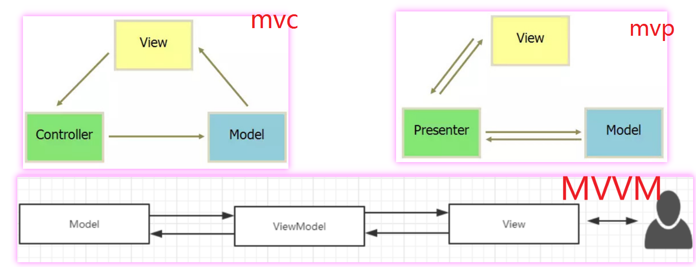

# 常用架构

## MVC 架构
```xml  
1979年，Trygve Reenskaug 在Smalltalk-80系统上首次提出了MVC的概念，
最初的时候叫做Model-View-Controller-Editor。

MVC并不是一种设计模式，不在23种经典设计模式中。
可以理解为 MVC是一种架构模式，一种架构可能 运用到了多种设计模式。
```

### Model 模型
适合做一些业务逻辑处理，比如数据库存取操作，网络操作，复杂的算法，耗时的任务等都在model层处理。

### View 视图
处理数据显示的部分，XML布局可以视为V层，显示Model层的数据结果。

### Controllor 控制器
处理用户交互问题。

 

### mvc 优点 、缺点
```text
// 优点
1、实现了分层开发 ,降低了代码的耦合
// 缺点
1、增加了代码编写的复杂性
2、MVC中 允许 M 层 和 V 层进行交互 ，解耦合不够彻底  
```

 
 

## MVP 架构
### Model  
业务逻辑和实体模型层

### View
视图展示层。 V层没有任何的逻辑部分又不用主动监听数据，被称之为“被动视图”。

###  Presenter
负责view和model层的交互。

### mvp 特点
于mvc相比，mvp有以下特点
```text
1、 M 层和 V 层只能通过 P 层进行交互
2、V 层和 P 层通过接口进行交互
3、一个复杂的 V 层可以对应多个 P
```

 

### mvp 优点 、缺点
```text
// 优点
1、相对mvc解耦更彻底
// 缺点
1、多了很多接口文件。
繁多的接口，繁琐的接口通信 ,
在实际的开发过程中，很难严格遵循。
```

 
##  MVVM 、 MV-VM 架构
MVVM架构在一定程度上减少了MVP存在的以下缺点。
```text
1、P 层与 V 层是通过接口进行交互的，接口粒度不好控制。
粒度太小，就会存在大量接口的情况，使代码太过碎版化;
粒度太大，解耦效果不好。

2、V 层与 P 层还是有一定的耦合度。
一旦 V 层某个UI元素更改，那么对应的接口就必须得改，
数据如何映射到UI上、事件监听接口这些都需要转变，牵一发而动全身。

3、复杂的业务同时也可能会导致 P 层太大。虽然可以 一个 V 对应 多个 P 。
```

### MVVM模块

模块 | 说明
-|-
M Model|  数据提供 
V View| 视图展示  
VM ViewModel |  M 和 V 绑定 ， 监听数据变化，一旦有改变，就响应到另一方

 

### mvvm的缺点
```text
2、引入新框架，增加学习成本。
3、通过 数据绑定的方式 ，出现问题 ，不容易调试。
```

###  MVVM 实现数据绑定、完全解耦的原理
```text
在安卓中，DataBinding 是 谷歌提供的一个工具，
可以将 V 和 M 进行数据绑定 。

能实现数据绑定的原因，我猜测是框架采用了 观察者模式 实现数据驱动，
DataBinding 具体源码我暂时还未看过，只能是猜测 。

其他方向，例如前端也有类似的框架，例如 Vue.js
```
#### [DataBinding](https://developer.android.google.cn/topic/libraries/data-binding/index.html)
#### 完全解耦的方案中 ，如何管理生命周期
可以使用 谷歌的 LiveData 。
LiveData 具有生命周期感知能力，意指它遵循其他应用组件（如 Activity、Fragment 或 Service）的生命周期。
这种感知能力可确保 LiveData 仅更新处于活跃生命周期状态的应用组件观察者。

## 总结
```text
1、MVC中 允许 M 层 和 V 层进行交互 ，耦合太高，不合理。
2、MVP 中 ， P 层与 V  层还是有一定的耦合度。还不够完美。
3、MVVM ，通过数据绑定的方式，实现数据监听 ，完全解耦。
```

