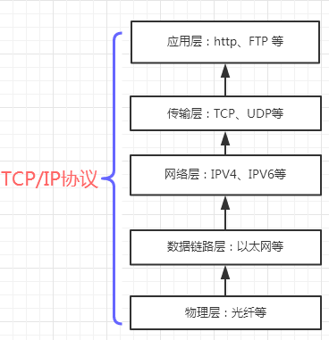
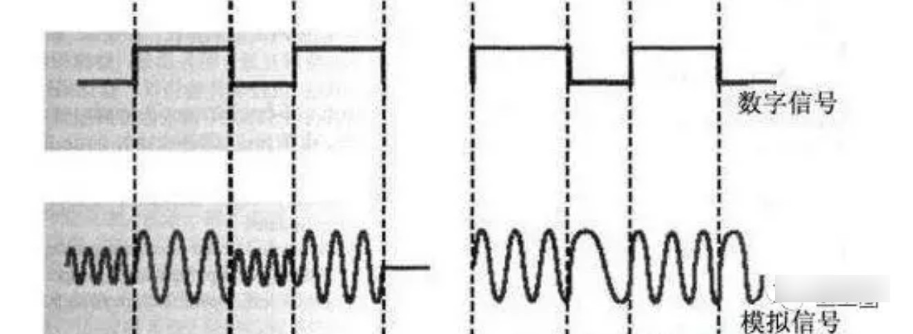
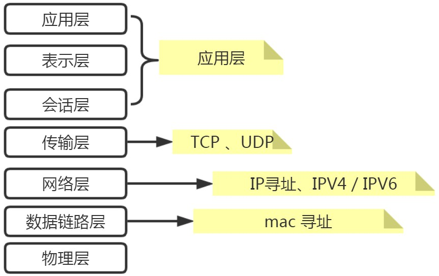

#  http 、https 方式
```text
1、http是基于 TCP/IP 的应用层协议 。
2、 采用 “一问一答” 模式 ，并不会保持长连接。
3、HTTP允许传输任意类型的数据对象。传输的类型由Content-Type加以标记。
```

## HTTP Content-type
[HTTP Content-type 手册](http://tool.oschina.net/commons)

文件扩展名	| Content-Type
-|-
.*（ 二进制流，不知道下载文件类型）|	application/octet-stream
.txt	|text/plain
.xml	|text/xml
.css	|text/css
.html	|text/html
.js	|application/x-javascript
无文件的表单提交|application/x-www-form-urlencoded
有文件的表单提交|multipart/form-data
json格式的请求|application/json


## 建立、断开 http连接
http建立连接，底层是通过 Tcp协议 经过了3次握手、断开经过4次挥手。具体请查看tcp的相关知识。

##  TCP/IP协议族



## https请求
即使采用了 HTTPS，也可以实现中间人攻击，或者进行数据解密等，但是，目前 HTTPS 目前使用的加密算法需要巨大的计算量才能破解
```text
HTTPS 的目的主要有三个，
一个是数据的保密性，你给别人送个邮包，但邮包是打了封印的，快递员不知道包里装的是啥。
第二是数据的完整性，快递员不知道邮包是啥，但可以调包啊，HTTPS 发现了调包的数据，可以拒收。
第三就是身份验证，HTTPS 可以保证邮包被正确的送到指定的接收方，而不是第三方。 
```

## https相关术语
###  SSL 、TLS
```text
SSL（Secure Sockets Layer） , 网景公司设计的。
到了1999年，SSL 因为应用广泛，已经成为互联网上的事实标准。
IETF 就在那年把 SSL 标准化。
标准化之后的名称改为 TLS (Transport Layer Security ) ,
这两者可以视作同一个东西的不同阶段。
```

### 证书认证
```text
单向证书认证: 任何客户端都可以访问服务器
双向证书认证: 被允许的客户端才能访问服务器
```
 

###  对称加密 、非对称加密
```text
对称加密：加密和解密时使用的是同一个秘钥
// 对称加密
常见的 对称加密算法 有 DES、3DES、Blowfish、IDEA、RC4、RC5、RC6 、 AES 。
在数据传送前，发送方和接收方必须商定好秘钥。
用同一个秘钥进行加密和解密。如果一方的秘钥遭泄露，那么整个通信就会被破解。

非对称加密：用公钥加密，私钥解密
https 在内容传输的加密上使用的是对称加密，非对称加密只作用在证书验证阶段。
// 非对称加密
常见的非对称加密算法有: RSA、ECC 、Diffie-Hellman、El Gamal、DSA 
秘钥自己私下保管，公钥可以公开 ，别人通过公钥加密的信息发给你，只有通过私钥才能解密。
不用担心别人把秘钥泄露而导致整个通信被破解。
```

###  公钥 、私钥
```text
公钥：负责加密 ，在网络上传输
私钥：负责解密 ，本地保管，别人无法获取
```

### md5   
```text
md5 不是对称和非对称算法。而是一种机制，一般用来做一致性校验。
对任何文件或内容 都生成 一串 32位的字符。不能根据字符反推。
比如一个很大的文件，下载完成之后要验证下 md5和给出的是否一致，如果不一致 说明你下载出错了或者文件被别人修改过。
虽然MD5 有很小很小的概率发生碰撞(可以忽略不计)，是一种非常优秀的算法。
```

 
 
## http 与 https 有什么区别
```text

http是超文本传输协议，信息是明文传输。
https 多了 SSL/tls 层。使用了加密算法(对称加密和非对称加密) ,
大大增加了数据的传输安全。

网景公司设计了 SSL 协议用于对HTTP协议传输的数据进行加密，从而就诞生了HTTPS。
(https 在内容传输的加密上使用的是对称加密，非对称加密只作用在证书验证阶段。)
``` 

## http 各个版本之间的区别
```text
// HTTP/0.9 
是第一个版本的HTTP协议 。
只支持 GET 请求方式 。
 

// HTTP/1.0
开始支持客户端通过POST方法 。
需要使用 keep-alive 参数来告知服务器端要建立一个长连接。

// HTTP/1.1
默认支持长连接。

// http1.2 
使用了多路复用的技术，做到同一个连接并发处理多个请求，而且并发请求的数量比HTTP1.1大了好几个数量级。

// http2.0
使用 HPACK 算法对 header 的数据进行压缩， 在网络上传输就会更快。
服务器可以对客户端的一个请求发送多个响应。

// HTTP3.0 
HTTP2.0 解决了很多 1.1的问题，但HTTP/2仍然存在一些缺陷，
这些缺陷并不是来自于HTTP/2协议本身，而是来源于底层的TCP协议，
我们知道TCP链接是可靠的连接，如果出现了丢包，那么整个连接都要等待重传，
HTTP/1.1可以同时使用6个TCP连接，一个阻塞另外五个还能工作，
但HTTP/2只有一个TCP连接，阻塞的问题便被放大了。
由于TCP协议已经被广泛使用，我们很难直接修改TCP协议，
基于此，HTTP/3选择了一个折衷的方法——UDP协议。
```

# ftp
## 第三方工具[ftp4j](http://www.sauronsoftware.it/projects/ftp4j/download.php)
### ftp登录
```text
public void run(){
     //标记是否登录成功
    boolean loginError = false ;
    try {
        mFTPClient.setType(FTPClient.TYPE_BINARY);
        //中文文件名 乱码处理
        mFTPClient.setCharset("GBK");
        //登录成功后FTP服务器返回的欢迎语句
        String[] welcome = mFTPClient.connect(FTP.HOST_IP, FTP.HOST_PORT);
        mFTPClient.login(FTP.HOST_USER, FTP.HOST_PASSWORD);
        mHandler.sendEmptyMessage(FTP.MSG_CMD_CONNECT_OK);
    }catch (Exception e) {
        loginError = true ;
    }
    if(loginError && FTP.mDameonRunning){
        mHandler.sendEmptyMessageDelayed(FTP.MSG_CMD_CONNECT_FAILED, 2000);
    }
}
```


### ftp删除文件（夹）
```text
public void run(){
    try {
        if (isDirectory)  {
            //删除文件夹
            mFTPClient.deleteDirectory(realivePath);
        } else {
            //删除文件
            mFTPClient.deleteFile(realivePath);
        }
        mHandler.sendEmptyMessage(FTP.MSG_CMD_DELE_OK);
    } catch (Exception ex) {
        mHandler.sendEmptyMessage(FTP.MSG_CMD_DELE_FAILED);
    }
} 
```


### ftp断开连接
```text 
if (mFTPClient != null){
    try {
        mFTPClient.disconnect(true);
    } catch (Exception ex) {
        ex.printStackTrace();
    }
}
```


### ftp文件下载
```text
if(! localFile.exists()){
    long fileSize = ftpFile.getSize() ;
    if(fileSize > 0){
        mFTPClient.download( ftpFile.getName(), new File(localFilePath),  
                             new DownloadFTPDataTransferListener(ftpFile.getSize()));
    }else{
        //文件异常的情况  下载发生异常the size of file muset be larger than zero.
    }
}
```

### ftp 获取文件列表
```text
@Override
public void run(){
    try {
        mFTPClient.changeDirectory(FTP.FTPSMAllPICDIR);
        FTPFile[] ftpFiles = mFTPClient.list();
        synchronized (mLock){
            mFileList.clear();
            //数组拷贝到list中去
            mFileList.addAll(Arrays.asList(ftpFiles));
        }
        mHandler.sendEmptyMessage(FTP.MSG_CMD_LIST_OK);
    } catch (Exception ex) {
        mHandler.sendEmptyMessage(FTP.MSG_CMD_LIST_FAILED);
    }
}//
```


### ftp 文件上传（进度条）
```text
try {
    File file = new File(path);
    mFTPClient.upload(file, new DownloadFTPDataTransferListener( file.length()));
} catch (Exception ex) {
    return false;
} 
```

### ftp 连接守护进程
```text
//在子线程中定时判断
if (mFTPClient != null && !mFTPClient.isConnected()){
    try {
        //解决中文件名乱码问题
        mFTPClient.setType(FTPClient.TYPE_BINARY);
        mFTPClient.setCharset("GBK");
        mFTPClient.connect(FTP.HOST_IP, FTP.HOST_PORT);
        mFTPClient.login(FTP.HOST_USER, FTP.HOST_PASSWORD);
        Thread.sleep(FTP.MAX_DAMEON_TIME_WAIT);
    } catch (Exception ex) {
    }
}
```


### FTP 传输进度 回调
```text
public class DownloadFTPDataTransferListener implements  FTPDataTransferListener{
    /**已经传送量*/
    private int totolTransferred = 0;
    /**数据总量*/
    private long fileSize = -1;

    public DownloadFTPDataTransferListener(long fileSize){
        if (fileSize <= 0) {
            throw new RuntimeException( "the size of file muset be larger than zero.");
        }
        this.fileSize = fileSize;
    }

    @Override
    public void aborted()  {}

    @Override
    public void completed(){  }

    @Override
    public void failed()  {  }

    @Override
    public void started()  {  }

    @Override
    public void transferred(int length){
        totolTransferred += length;
        float percent = (float) totolTransferred / this.fileSize;
    }
}
```

### 使用场景
```text
FtpManager ftpManager = new FtpManager();
//然后 ftp 的相关操作 要放到子线程中去执行。 建议使用线程池。
```
 

# sockt  tcp_udp
进行tcp通信时，需要注意处理 粘包的问题。然后控制好休眠时间 和 接收的 buffer[] 大小。

##  TCP标志位 (位码)

标记 | 含义
---|---
SYN|synchronous 建立联机
ACK|acknowledgement 确认
PSH|push传送
FIN|finish结束
RST|reset重置
URG|urgent紧急

## 术语
### Sequence number
顺序号码
### Acknowledge number
确认号码
### MSL
Maximum Segment Lifetime ，报文最长存活时间

## tcp相关问题
### 为什么连接的时候是三次握手，2次不行吗?
为了让服务器、客户端端彼此知道 自己+对方的 接收、发送功能正常。 自己模拟一下就知道至少需要三次。


### 为什么连接的时候是三次握手，关闭的时候却是四次挥手？
```text 
关闭连接时，当Server端收到FIN报文时，很可能并不会立即关闭SOCKET， 
所以只能先回复一个ACK报文，告诉Client端，"你发的FIN报文我收到了"。
只有等到我Server端所有的报文都发送完了，我才能发送FIN报文，因此不能一起发送。
故需要四步挥手。 （为了争取一段缓冲时间，完成正在进行的数据传输）
```


### 为什么客户端在TIME-WAIT状态必须等待2MSL (Maximum Segment Lifetime) 的时间？
```text
为了保证客户端发送的最后一个ACK报文段能够到达服务器。
因为这个ACK报文段有可能丢失，因而使处在LAST-ACK状态的服务器收不到对已发送的FIN+ACK报文段的确认。
服务器会超时重传这个FIN+ACK报文段。而客户端就能在2MSL时间内收到这个重传的FIN+ACK报文段。
接着客户端重传一次确认，重新启动2MSL计时器。
最后客户端和服务器都正常进入到CLOSED状态。   
```
   

##  粘包处理
目前不是最优方法，速度有点慢。想到高效的方法再补充。
```text
public class AirUnPackTools{
    /**帧头*/
    private static final byte packHead1= (byte) 0xDD;
    /**是否在有效数据之内*/
    private static boolean isContinue = false ;
    private static byte mlastByte =(byte) 0x00 ;
    /**byte索引 ， 用来指示 关键字 和 长度 */
    private static  int mByteIndex = 0;
    /**当前帧的长度*/
    private static  int mFrameLengh =0 ;
    /**临时list*/
    private static List<Byte>  lastBytesList = new ArrayList<>() ;
    /**数据段 数据长度 */
    private static  int mbyteCount = 0;
    /**遥控器返回的消息类型 = 0x55 ,5a ,5b ， 00为默认状态，无意义*/
    private static byte msgType =0x00 ;
    
    public static DronePacket320 unPackageofGround(byte mByte){
        DronePacket320 packetGround  = null ;
        //判断是否是帧开头
        switch (mByte)  {
            case packHead1:
                // 连续出现2个DD ，说明这是帧头
                if(mlastByte == packHead1 )  {
                    lastBytesList.clear();
                    lastBytesList.add(packHead1) ;
                    mByteIndex = 0;
                    isContinue = true ;
                }
                break;
        }

        if(isContinue) {
           boolean reslut =  getUnpackagedFrame(mByte);
            if(reslut)  {
                packetGround = new DronePacket320() ;
                packetGround.msgType = msgType ;
                packetGround.bytes =  listToBytesArray(lastBytesList) ;
            }else{
                packetGround = null ;
            }
        }else{
            packetGround = null ;
        }
        mlastByte =  mByte ;
        return  packetGround ;
    }

    public static byte [] listToBytesArray(List<Byte> list)  {
        byte[] bytes = new byte[list.size()] ;
        for(int i= 0; i<list.size() ;i++)  {
            bytes[i] = list.get(i) ;
        }
        return  bytes;
    }

    private static boolean getUnpackagedFrame( byte mBytes ){
        mByteIndex ++ ;

        if(mByteIndex == 2)   {  // 帧类型
            lastBytesList.add(mBytes) ;
            msgType  =mBytes;
            return  false ;
        }else  if(mByteIndex == 3)  {  //长度
            lastBytesList.add(mBytes) ;
            mbyteCount = 0;
            mFrameLengh = MyStringUtils.byte1ToInt(mBytes) ;
            return  false ;
        } else{
            mbyteCount ++ ;
            lastBytesList.add(mBytes) ;
            if(mbyteCount == mFrameLengh +1 )  {
                //数据段+校验位读取完毕 ，返回组装标记true
                isContinue =false ;
                return  true ;
            }else {
                return  false ;
            }
        } //end  else
    }//
}
```


```text  
public class DronePacket320{
    public short msgType;
    public byte[] bytes;
}

//使用
for (int i = 0; i < bytesGet.length; i++){
    DronePacket320 packetAir = AirUnPackTools.unPackageofGround(tcpResultBean.reslut[i]);
    if (packetAir != null){
        //处理格式化后的数据...
    }
}
```


## 第三方库 netty
用来连接tcp、接收 和发送数据的

```text
public interface MyNettyCallBack{
    /**tcp成功建立连接*/
    public static final int Key_State_connect=1 ;
    /**tcp断开*/
    public static final int Key_State_disConnect=2 ;
    /**tcp正在重连*/
    public static final int Key_State_isReConnect=3 ;
    /**连接发生异常*/
    public static final int Key_State_error=4;
    /**连接手动关闭*/
    public static final int Key_State_close=5;
    /**连接正常-正在接收数据*/
    public static final int Key_State_recevieData=6;
    /**服务器返回信息给客户端*/
    public void sendMsgToUser(byte[] reslut , int state ,String stateMsg) ;
}
```


```text
public class NettyTcpTools{
    private int port;
    private String host;
    private SocketChannel socketChannel;
    private Bootstrap bootstrap;
    private boolean isConnect = false;
    /**是否需要重连*/
    private boolean isRepeate = false;
    /**用来区分是用户主动断开还是异常导致断开<br>用户主动断开的话就不用去重连*/
    private  boolean isStopByUser =false ;
    /**通信管道*/
    private ChannelFuture future = null;
    /**状态回调*/
    private MyNettyCallBack myNettyCallBack ;
    /**线程池工具*/
    private MyThreadPoolTools myThreadPoolTools ;

    public NettyTcpTools(String host , int port){
        this.port = port;
        this.host = host;
        bootstrap = new Bootstrap();
        bootstrap.channel(NioSocketChannel.class);
        //保持长连接
        bootstrap.option(ChannelOption.SO_KEEPALIVE, true);
        //自动调整下一次缓冲区建立时分配的空间大小，避免内存的浪费
        bootstrap.option(ChannelOption.RCVBUF_ALLOCATOR, new AdaptiveRecvByteBufAllocator(1024, 1024 * 32, 1024 * 64));
        bootstrap.group( new NioEventLoopGroup());
        bootstrap.remoteAddress(host, port);
        bootstrap.handler(new ChannelInitializer<SocketChannel>() {
            @Override
            protected void initChannel(SocketChannel socketChannel) throws Exception {
                //超时处理
                socketChannel.pipeline().addLast(new IdleStateHandler(3, 3, 3 ,TimeUnit.SECONDS));
                //接收服务器信息
                socketChannel.pipeline().addLast(  new NettyClientHandler());
            }
        });
    }

    private void gotoConnectTcp(){
        closeThreadPool();
        myThreadPoolTools= new MyThreadPoolTools();

        Runnable task = new Runnable() {
            @Override
            public void run() {
                isStopByUser = false ;
                try {
                    if (future != null)  {
                        boolean isActive = future.channel().isActive() ;
                        boolean isOpen = future.channel().isOpen() ;
                        MyLogUtils.mLog_iNormal("连接测试：isActive=" + isActive +"  isOpen="+ isOpen);
                       /* 这个地方注意了： 如果 没有关闭，会导致多个tcp连接
                        使用 网络调试助手.exe 进行调试查看*/
                        future.channel().close();
                    }

                    future = bootstrap.connect(new InetSocketAddress(host, port)).sync();
                    if (future.isSuccess())  {
                        socketChannel = (SocketChannel) future.channel();
                        sendMsgToUser(null ,MyNettyCallBack.Key_State_connect ,"connect server  Success");
                        isConnect = true;
                        return;
                    }
                } catch (Exception cause) {
                    sendMsgToUser(null ,MyNettyCallBack.Key_State_error ,"error2:"+cause.toString());
                }
                //连接状态在此处处理
                repeateTcp();
            }
        };
        if (myThreadPoolTools == null) {
            myThreadPoolTools= new MyThreadPoolTools();
        }
        myThreadPoolTools.addTask(task);
    }

    public  void startTcpTools(){
      gotoConnectTcp();
    }

    private void closeThreadPool(){
        if(myThreadPoolTools!=null)  {
            myThreadPoolTools.shutdownThreadPool();
            myThreadPoolTools=null ;
        }
    }

    public void nettySendBytes(final  byte[] bytesSend)  {
        Runnable runnable = new Runnable() {
            @Override
            public void run() {
                if (isConnect)  {
                    ByteBuf buf = Unpooled.buffer(bytesSend.length);
                    buf.writerIndex();
                    buf.writeBytes(bytesSend);
                    socketChannel.writeAndFlush(buf);
                }
            }
        } ;
        if (myThreadPoolTools == null) {
            myThreadPoolTools= new MyThreadPoolTools();
        }
        myThreadPoolTools.addTask(runnable);
    }

    public class NettyClientHandler extends SimpleChannelInboundHandler<ByteBuf>{
        @Override
        protected void channelRead0(ChannelHandlerContext channelHandlerContext,ByteBuf byteBuf) throws Exception  {
            //这里是接受服务端发送过来的消息
            byte[] result  = new byte[byteBuf.readableBytes()];
            byteBuf.readBytes(result);
            /*这种方式会定长读取，后面有很多00 00 00
            byte[] bytes = byteBuf.array();*/
            sendMsgToUser(result ,MyNettyCallBack.Key_State_recevieData ,"channelRead0");
        }

        /**这里是断线要进行的操作*/
        @Override
        public void channelInactive(ChannelHandlerContext ctx) throws Exception  {
            super.channelInactive(ctx);
            ctx.close() ;
            if(!isStopByUser)  {
                sendMsgToUser(null ,MyNettyCallBack.Key_State_disConnect ,"channelInactive");
                repeateTcp();
            }
        }

        /**这里是出现异常的话要进行的操作*/
        @Override
        public void exceptionCaught(ChannelHandlerContext ctx, Throwable cause) throws Exception {
            //ctx.close() ;
            sendMsgToUser(null ,MyNettyCallBack.Key_State_error ,"error1:"+cause.toString());
            repeateTcp();
        }

        /**用来处理读写超时的 自定义操作*/
        @Override
        public void userEventTriggered(ChannelHandlerContext ctx, Object evt) throws Exception  {
            super.userEventTriggered(ctx, evt);
            if (evt instanceof IdleStateEvent) {
                IdleStateEvent event = (IdleStateEvent) evt;
                if (event.state().equals(IdleState.READER_IDLE)) {
                    // 在指定的时间内没有收到服务器的反馈信息
                } else if (event.state().equals(IdleState.WRITER_IDLE)) {
                    //在指定的时间内没有像服务器发送过信息
                } else if (event.state().equals(IdleState.ALL_IDLE)) {
                    //在指定的时间内 既没有收到过信息 也没有发送过信息
                }

            }
        }
    }

    // 设置消息回调接口，用来获取从服务器返回的消息。
    public void setMyNettyCallBack(MyNettyCallBack myNettyCallBack)  {
        this.myNettyCallBack =  myNettyCallBack ;
    }

    private void sendMsgToUser(byte[] result , int state ,String sendMsgToUser)  {
        if (myNettyCallBack != null) {
            myNettyCallBack.sendMsgToUser(result ,state ,sendMsgToUser);
        }
    }
   
   // tcp重连
    private void repeateTcp()  {
        if(isStopByUser)    {
           return;
        }
        if (!isRepeate) {
            if (isConnect)  {
                isConnect = false;
                //断线监听在此处处理
            }
            isRepeate = true;
            sendMsgToUser(null ,MyNettyCallBack.Key_State_isReConnect ,"repeateTcp");
            try {
                TimeUnit.SECONDS.sleep(5);
            } catch (InterruptedException e) {
                e.printStackTrace();
            }
            isRepeate = false;
            startTcpTools();
        }
    }

  // 关闭 tcp连接
    public void nettyToolsClose()  {
        resetState();
        closeThreadPool();
        if (future != null && future.channel() != null)  {
            if (future.channel().isOpen())  {
                sendMsgToUser(null ,MyNettyCallBack.Key_State_close ,"close");
                future.channel().close();
            }
        }
    }

    private void resetState()  {
        isConnect = false;
        isRepeate=false;
        isStopByUser = true ;
    }
}
```

## 拓展知识
### 数字信号 、模拟信号
模拟信号和数字信号之间是可以相互转换的。



```text
模拟信号：时间连续，幅值连续。
数字信号：时间离散，幅值离散。

在电学中，将连续变化的电压、电流等物理量称为模拟信号，而离散变化的电压、电流则称为数字信号。
模拟信号在日常生活中很常见，譬如家用的220V交流电压、环境温度及光线的变化、蓄电池的放电、人的说话声，这些皆为模拟信号。

数字信号的波形如上图所示，是一个由一系列高低电平组成的离散变化的物理量。数字信号在生活中较少见。
数字信号就是一系列的“0”和“1”的组合。

咱们自然界中各种事物变化，都是模拟信号，比如，随着时间的流逝，太阳缓缓升起，
在这里，时间是连续变化的，太阳的位置也是连续变化的，每一个时间点，对应于一个太阳的位置。
现在，咱们为了研究太阳位置的变化规律，要将这个时间与太阳的位置变化关系交给计算机研究。
有个问题：咱们的时间是连续的，可以无限分下去的，同样的，太阳的位置点也可以有无穷多个，咱们该如何把这么多的数据存储起来呢？
并且，对于咱们的研究来说，真的需要将这么多的数据存储下来吗？
所以咱们要进行离散化的处理，比如早晨8点到10点，每隔5分钟，咱们记录一个太阳的位置，这样，储存的数据是不是大大减少了？
现在，对于这个问题，咱们的时间变量，变成了每隔五分钟一个，咱们的太阳位置，也相对应的变成了离散化的，
也就是说，时间是离散化的，幅值也是离散化的。变成了一个数字信号，也就可以交给计算机处理啦。
```


###  OSI ( Open System Interconnection ) 七层模型

```text
// 物理层
物理设备、例如网线、电缆、集线器等.

// 链路层
数据链路层，负责对于底层物理信号识别成某种信息。为了匹配物理层电气特征。
将比特组合成字节,再将字节组合成帧,使用链路层地址 (以太网使用MAC地址)来访问介质,并进行差错检测。

链路层就像同城跑腿（网络层是跨城跑腿，类似邮局快递等），你把货交给他，告诉他地址，他直接送达。
链路层识别mac地址，链路联通后，交换机学习各端口的mac地址，建立mac地址转发表，然后链路层就开始工作了。

// 网络层
就是通常说的IP层。这一层就是我们经常说的IP协议层。IP寻址、IPV4 / IPV6 等。

本层通过IP寻址来建立两个节点之间的连接，为源端的运输层送来的分组，选择合适的路由和交换节点，
正确无误地按照地址传送给目的端的运输层。

网络层按理来说，数据链路层已经能够起到信息识别的作用了，为何还需要网络层呢？
关键就在于数据链路层所能识别出的信息，能够很好的被机器理解。但不能很好的被人所理解。所以需要构建一层来方便人来进行处理。

为什么有了MAC地址，还需要IP地址？
历史原因：以太网诞生于因特网之前，在IP地址之前MAC地址就已经在使用了。两者结合使用，是为了不影响已存在的协议
分层实现：对网路协议进行分层以后，数据链路层的实现不需要考虑数据之间的转发，网络层的实现不需要考数据链路层的影响。
分工合作：IP地址是会随着主机接入网络的不同而发生改变的，而MAC一般不会改变。这样的话，我们可以使用IP地址进行寻址，当数据报和目的主机处于同一网络时，就使用MAC地址进行数据交付。

// 传输层
对网络层的进一步封装，TCP 、UDP  就是这一层。

// 会话层
负责建立和断开通信连接（数据流动的逻辑通路）。
例如要根据你自己的逻辑，来决定什么时候要进行数据连接、数据重连、连接断开等。

// 表示层
主要负责数据格式的转换。将设备固有的数据格式转换为网络标准传输格式，不同设备对同一比特流解释的结果可能会不同。
例如同样的一串 byte[]数据，不同的APP采用的不是同一套解析协议，所以要根据不同的协议转为APP能识别的信息。

// 应用层 
有些分层版本中，将 会话层+表示层+ 应用层 =  统一称为应用层。 
因为会话层和表示层没有办法完全抽象成公共层，一般都是和应用层一起实现。

就是各个公司开发的不同的应用。例如 HTTP超文本传输、  HTTPS  FTP文件传输 、SMTP邮件传输 等不同侧重方向的传输协议。
```
 

# usb 通信
## [AOA](https://developer.android.com/adk/index.html )协议
```text 
Google推出的 Android开放配件协议AOA（Android Open Accessory Protocol）及配件开发工具包ADK（Accessory Development Kit）
提供了Android设备与Android配件通过USB或蓝牙进行通信的API，
为基于Android系统的智能设备控制外设提供了条件。
利用Android，系统可以连接从家用电器到重型机械、机器人等多种设备。
```

当前项目用到的是 android 的[AOA协议](http://www.hackermi.com/2015-04/aoa-analyse/)。遥控器作为主机供电，移动设备（手机、平板）作为从机。
使用方法请自行查阅相关文档。

## 使用场景一 ：android设备作为从机
[参考资料](http://www.hackermi.com/2015-04/aoa-analyse/)


这种模式是Android定义的一种新的通讯模式，它将usb配件作为协议交互的主要角色，配件内置USB Embedded Host端，可以为Android手机供电，并且识别Android手机，建立数据通道。使得配件成为一个简化版的PC Host端。


## usb通信demo
### MusbAccessoryManager.java
```text
/**
 * usb 操作管理类
 */
public class MusbAccessoryManager{
	private Context mCtx;
	/**文件操作符*/
	private ParcelFileDescriptor fileDescriptor;
	/**输入流*/
	private FileInputStream inputStream;
	/**输出流*/
	private FileOutputStream outputStream;
	/**读线程*/
	private AccessoryReadThread readThread;
	/**写线程*/
	private AccessoryWriteThread writeThread;
	/**解析线程*/
	private BytesDataRepackThread repackThread ;
	/**usb 通信是否在进行*/
	private boolean enableThread;
	/**发送队列*/
	private BlockingQueue<MyBytesTransfer> outQueue;
	/**读取队列*/
	private BlockingQueue<byte[]> readQuene;
	/**回调接口 - 状态标记*/
	private IOperateResultCallBack iUsbResultCallBack ;
	/**回调接口 - byte[] 传输*/
	//private IBytesTransferInterface iGetBytesInterface ;
	/**解析后的数据对象 回调-*/
    private IUsbPackageTransferInterface iusbpackageTransInterface ;
	/**读入流 时的休眠间隔  微秒*/
	private final long READ_STRING_SLEEPTIME= 20L;
	/**写入流 时的休眠间隔*/
	private final long WRITE_STRING_SLEEPTIME= 60L;
	/**解析 byte[] 时的休眠间隔*/
	private final long REPACKAGE_SLEEPTIME= 0L;
	/** 调整读取大小*/
	private byte[] buffer= new byte[2048 * 3] ;

	public MusbAccessoryManager(Context context  , IOperateResultCallBack iUsbResultCallBack ,
								IUsbPackageTransferInterface iusbpackageTransInterface)	{
		this.mCtx = context;
		fileDescriptor = null;
		inputStream = null;
		outputStream = null;
		readThread = null;
		writeThread = null;
		repackThread =null ;
		enableThread = false;
		this.iUsbResultCallBack= iUsbResultCallBack;
		this.iusbpackageTransInterface = iusbpackageTransInterface;
		outQueue = new LinkedBlockingQueue< >(Integer.MAX_VALUE);
		readQuene = new LinkedBlockingQueue<>(Integer.MAX_VALUE) ;
	}

	/**
	 * 添加数据 到发送队列
	 */
	public void addMessage(MyBytesTransfer msg)	{
		try	{
			outQueue.put(msg);
		}catch (Exception e)	{
			MyLogUtils.mLog_iNormal("usb设备== 发送异常1 ="+e.getMessage());
		}
	}

	/**
	 * 打开USB通信
	 */
	public void OpenAccessory(UsbAccessory accessory)  {
		if (!enableThread)		{
	    	fileDescriptor = ((UsbManager) mCtx.getSystemService(Context.USB_SERVICE)).openAccessory(accessory);
	    	if (fileDescriptor != null)	{
	    		FileDescriptor fd = fileDescriptor.getFileDescriptor();
	    		inputStream = new FileInputStream(fd);
	    		outputStream = new FileOutputStream(fd);

	    		if (inputStream == null || outputStream == null)	{
					// 读取流异常
					iUsbResultCallBack.onResultCallBack(MyStateConfig.STATE_2);
					return;
				}
				//连接成功
				iUsbResultCallBack.onResultCallBack(MyStateConfig.STATE_14);
    			enableThread = true;
    			readThread = new AccessoryReadThread(inputStream);
    			readThread.start();
    			writeThread = new AccessoryWriteThread(outputStream);
    			writeThread.start();
				repackThread = new BytesDataRepackThread() ;
				repackThread.start();
	    	}else{
				toastMsg("fileDescriptor==null "   ) ;
			}
		}
    }//


	/**
	 * 关闭连接、清空队列、停止线程
	 */
    public void CloseAccessory()  {
    	try	{
			if (fileDescriptor != null)		{
				fileDescriptor.close();
			}
			if (outputStream != null)		{
				outputStream.close();
			}
			if (inputStream != null)	{
				inputStream.close();
			}
		}catch (Exception ie)	{
			ie.printStackTrace();
		}
		outQueue.clear();
		readQuene.clear();
		enableThread = false;
    	fileDescriptor = null;
    	outputStream = null;
    	inputStream = null;
    }

    /**
     读取子线程
     */
	private class AccessoryReadThread extends Thread  {
    	private FileInputStream inStream;

    	public AccessoryReadThread(FileInputStream stream) 	{
			  this.inStream = stream;
	   	}
    	@Override
    	public void run() 	{
			while (enableThread) 	{
				try {
					int realReaded = inStream.read(buffer);
					// 将Buffer中有效的数据拷贝出来
					if(realReaded>0) 	{
						byte [] realBytes = MyStringUtils.subBytes(buffer, 0 , realReaded) ;
						readQuene.put(realBytes);
					}
				} catch (Exception e) {
					com.walkera.base.utils.MyLogUtils.mLog_iNormal("usb设备== 接收异常="+e.getMessage());
					MyApplication.usbReadStreamState=  MyStateConfig.STATE_8;
					//发生异常，继续执行
					continue;
				}
				MyApplication.usbReadStreamState=  MyStateConfig.STATE_9;
				try {
					TimeUnit.MICROSECONDS.sleep(READ_STRING_SLEEPTIME);
				} catch (InterruptedException e) {
					e.printStackTrace();
				}
			} // end while

    	} // end run
    }//

	/**
     *发送子线程
	 */
	private class AccessoryWriteThread extends Thread 	{
		private FileOutputStream outStream;
		public AccessoryWriteThread(FileOutputStream outputStream) 	{
			this.outStream = outputStream;
		}

		@Override
		public void run()  {
			MyBytesTransfer msg;
			while (enableThread){
				try{
					if (outStream != null)	{
						msg = outQueue.poll();
						if (msg != null)	{
							sendByteDataToServer(msg.bytes );
							msg = null;
						}else{
						}
					} else{
						MyApplication.usbWriteStreamState=  MyStateConfig.STATE_11;
						outQueue.clear();
					}
					MyApplication.usbWriteStreamState=  MyStateConfig.STATE_10;
					try {
						Thread.sleep(WRITE_STRING_SLEEPTIME);
					} catch (InterruptedException e) {
						e.printStackTrace();
					}
				}catch (Exception ex)
				{
					com.walkera.base.utils.MyLogUtils.mLog_iNormal("发送测试3=  msg="+ex.getMessage());
					MyApplication.usbWriteStreamState=  MyStateConfig.STATE_11;
				}
			}
		}

		/**
		 * 将数据发送给服务器
    */
		private void sendByteDataToServer(byte[] buffer) {
	    	try	{
	    		if (outStream != null)	{
					iUsbResultCallBack.onResultCallBack(MyStateConfig.STATE_13);
					outStream.write(buffer, 0, buffer.length);
					outStream.flush();
		    	}
	    	}catch (IOException ex)	{
				iUsbResultCallBack.onResultCallBack(MyStateConfig.STATE_12);
	    	}
	    }//
	}

	/**
	 * 解析 重组包 子线程
	 */
	private class BytesDataRepackThread extends Thread{
		@Override
		public void run()	{
			while (enableThread)	{
				if(readQuene!=null)		{
					byte[] realBytes =	readQuene.poll() ;
					if(realBytes!=null)	{
						rePackageForBytes(realBytes) ;
					}
				}
				try	{
					Thread.sleep(REPACKAGE_SLEEPTIME);
				} catch (InterruptedException e){
					e.printStackTrace();
				}

			} //  while
		}//end run
	}

	/***
	 * 重组包 ， 将遥控器 、 飞控、视屏数据分开 .
   */
	private void rePackageForBytes(byte[] bytes)	{
		if(bytes!=null)	{
			int size =bytes.length ;
			for(int i=0 ; i< size ;i++)	{
				MyBytesTransfer myBytesTransfer = MyUsbUnPackTools.unPackageofUsb(bytes[i]) ;
				if(myBytesTransfer!=null)	{
					iusbpackageTransInterface.transferUsbPackageBean(myBytesTransfer);
				}
			}
		} // end if
	} //

	private void toastMsg(String msg){
		Toast.makeText(mCtx, msg ,Toast.LENGTH_SHORT) .show();
	}
}
```

### UsbMsgClient.java
```text
/**
 * 功能描述：  负责 用usb方式的通信方式 给其他部件提供发送和接收数据的功能  
 */
public class UsbMsgClient{
    private Context mCtx ;
    /**usb管理类*/
    private UsbManager usbmanager ;
    /**usb 操作管理类*/
    private MusbAccessoryManager mubAccessoryManager;
    /**对外暴露的接口 ，以便其他模块获取 对应的数据*/
    private IUsbMsgBackInterface iUsbMsgBackInterface ;

    /**
     * @param iUsbMsgBackInterface   对外暴露的接口 ，以便其他模块获取 对应的数据
     * @param iUsbResultCallBack  usb 返回状态码
     */
    public UsbMsgClient (Context mCtx ,IUsbMsgBackInterface iUsbMsgBackInterface ,IOperateResultCallBack iUsbResultCallBack)  {
        this.mCtx = mCtx;
        this.iUsbMsgBackInterface= iUsbMsgBackInterface ;
        usbmanager=((UsbManager) mCtx.getSystemService(Context.USB_SERVICE)) ;
        mubAccessoryManager = new MusbAccessoryManager(mCtx , iUsbResultCallBack   ,iusbpackageTransInterface);
        discoverAccessories();
    }//

    /**回调 来自usb的数据*/
    private IUsbPackageTransferInterface iusbpackageTransInterface = new IUsbPackageTransferInterface()  {
        @Override
        public void transferUsbPackageBean(MyBytesTransfer myBytesTransfer)  {
            if(myBytesTransfer != null)    {
                // 4759图传  -  3678飞控    - 5869 遥控器
                if( Arrays.equals(myBytesTransfer.msgType, MyStateConfig.VEDEO_DATA_RECEIVE))  {  //视屏数据
                    iUsbMsgBackInterface.getUsbVedioByte(myBytesTransfer);
                }else if(Arrays.equals(myBytesTransfer.msgType, MyStateConfig.FC_DATA_RECEIVE))  {
                    //飞控数据
                    iUsbMsgBackInterface.getUsbFcByte(myBytesTransfer);
                }else if(Arrays.equals(myBytesTransfer.msgType, MyStateConfig.RC_DATA_RECEIVE))  {
                    //遥控器数据
                    iUsbMsgBackInterface.getUsbRcByte(myBytesTransfer);

                }
            }
        }
    } ;

    /**
     * 扫描usb设备 发现从设备
     */
    private void discoverAccessories()  {
        UsbAccessory[] list = usbmanager.getAccessoryList();
        if (list != null && list.length!=0)  {
            openTheAccessory(list[0]);
        }else  {
            //MyToastTools.toastWarning(mCtx ,mCtx.getString( R.string.v5_str_1));
        }
    }//

    /**
     * 连接 指定设备
     */
    private void openAccessory(UsbAccessory accessory)  {
        mubAccessoryManager.OpenAccessory(accessory);
        // 延时 n秒 发送打开session命令
        new Handler().postDelayed(new Runnable()  {
            @Override
            public void run()  {
                byte[] openSession = { (byte)0xDD , (byte)0xDF  ,(byte)0x06 ,(byte)0x00 } ;
                sendBytesToDevices(openSession);
            }
        } , 2000) ;
    }

    /**
     * 连接USB设备
     */
    private void openTheAccessory(UsbAccessory accessory)  {
        if (accessory == null)  {
            MyToastTools.toastWarning(mCtx ,mCtx.getString( R.string.v5_str_2));
        }else {
            if (usbmanager.hasPermission(accessory))  {
                openAccessory(accessory);
            }else  {
                com.walkera.base.utils.MyLogUtils.mLog_iNormal("usb设备== 无权限1");
            }
        }
    }

    /**
     * 通知遥控器关闭
     */
    private void closeSession()  {
        byte[] closeSession = { (byte)0xDD , (byte)0xDF  ,(byte)0x07 ,(byte)0x00 } ;
        sendBytesToDevices(closeSession);
    }

    /**
     * 关闭usb收发工具
     */
    public void closeUsbMsgClinet()  {
        closeSession();
        new Handler().postDelayed(new Runnable()  {
            @Override
            public void run()  {
                closeAccessory();
            }
        }, 500);
    }

    /**
     * 断开设备
     */
    private void closeAccessory(){
        if (mubAccessoryManager != null)  {
            mubAccessoryManager.CloseAccessory();
        }
    }

    /**
     * 发送数据
     */
    public void sendBytesToDevices( byte[] data )  {
        if (mubAccessoryManager != null)  {
            mubAccessoryManager.addMessage(new MyBytesTransfer(data , MyStateConfig.STATE_6,null));
        }
    }
}
```


### MyStateConfig.java
```text
public class MyStateConfig{
    /**请求usb访问的自定义权限*/
    public static final String ACTION_USB_ACCESSORY_PERMISSION = "com.wk.USB_ACCESSORY_PERMISSION";
    /**当前参数无意义 */
    public final  static int STATE_NULL = -100 ;
    /**所有的状态的初始化状态 */
    public final  static int STATE_0 = 0 ;
    /** usb退出 */
    public final  static int STATE_1 =1 ;
    /** usb连接异常 , 读取流异常 */
    public final static int STATE_2 =2 ;
    /** usb 权限被拒绝了 */
    public final static int STATE_3 =3;
    /**接收usb byte 正式*/
    public final static int STATE_4 =4;
    /**接收usb byte 测试*/
    public final static int STATE_5 =5;
    /**发送的bytes[]*/
    public final static int STATE_6 =6;
    /**接收到的byte[]*/
    public final static int STATE_7 =7;
    /**usb输入流异常*/
    public final static int STATE_8 =8;
    /**usb输入流正常*/
    public final static int STATE_9 =9;
    /**usb输出流正常*/
    public final static int STATE_10 =10;
    /**usb输出流异常*/
    public final static int STATE_11 =11;
    /**发送失败*/
    public final static int STATE_12 =12;
    /**发送成功*/
    public final static int STATE_13 =13;
    /**Usb连接成功*/
    public final static int STATE_14 =14;
    /**属于相机数据 */
    public final  static int STATE_15 = 15 ;
}
```

### xml中的一些配置、usb插入、拔出监听
请参考官网

### 使用
```text
/**usb收发工具*/
private UsbMsgClient usbMsgClient ;
//初始化usb数据接收器
usbMsgClient = new UsbMsgClient( mContext ,iUsbMsgBackInterface ,iUsbResultCallBack) ;
//发送byte[]数据
usbMsgClient.sendBytesToDevices(code);
//关闭连接
usbMsgClient.closeUsbMsgClinet();

/**
 * 接收 usb 返回数据
 */
private IUsbMsgBackInterface iUsbMsgBackInterface = new IUsbMsgBackInterface(){
    /**视屏数据*/
    @Override
    public void getUsbVedioByte(MyBytesTransfer vedioData)  {
        //解码...
    }

    /**飞控数据*/
    @Override
    public void getUsbFcByte(MyBytesTransfer fcData)  {
        //解析飞控数据
    }

    /**遥控器数据*/
    @Override
    public void getUsbRcByte(MyBytesTransfer rcData)  {
        //解析遥控器数据
    }
} ;

/**
 * 接收 usb 操作、状态码
 */
private IOperateResultCallBack iUsbResultCallBack = new IOperateResultCallBack(){
    @Override
    public void onResultCallBack(int state ){
        //状态码
    }
};
```

 

# 私有协议
## 参数类型对应的字节数

类型 | 对应字节数 | 备注
-|-|-
bit | 1/8 |
byte | 1 |  
char | 1 (char在java中是2个字节)|  
boolean | 1 |  
uint8  | 1 |
uint8_t  | 1  |
uint16  | 2  |
uint16_t  | 2  |
int16  | 2  |
short | 2 |
int | 4 |
float | 4 |  
int32   | 4  |
uint32_t  | 4  |
double | 8 |  
long | 8 |

# 心跳机制
在私有协议中，我们常常需要用心跳来判断对方是否已经掉线。比如持续20秒收不到约定的信号，判断为对方掉线。
```text 
public abstract class HeartBeatTask implements Runnable {
	private String taskName  ;
	public HeartBeatTask( ){
		taskName = "beatTask_"+System.nanoTime() ;
	}  
 
	public String getTaskName() {
		return taskName;
	}
}
 
public class WkHeartBeatTool {
private ScheduledExecutorService mScheduledExecutorService;
private HashMap<String, Future > map  ;

public WkHeartBeatTool() {
    initTool();
}


public int getTaskNum(){
    return map==null? 0 : map.size() ;
}

private void initTool() {
    mScheduledExecutorService = Executors.newScheduledThreadPool(5);// 线程池大小  5
    map = new HashMap<String, Future>() ;
}

public void startTheBeatAction(HeartBeatTask task , int period){
    if(map.containsKey(task.getTaskName())){
        System.out.println("心跳正在进行，无需重复添加");
        return ;
    }
    Future  future = mScheduledExecutorService.scheduleAtFixedRate( task , 0, period, TimeUnit.MILLISECONDS);
    map.put(task.getTaskName() , future) ;
}

public void shutDownTheBeatAction(HeartBeatTask task ){
    Future future = map.get(task.getTaskName()) ;
    if(future!=null){
        future.cancel(true) ; 
        map.remove(task.getTaskName()) ;
    }else{
        System.out.println("你指定的这个心跳任务已经不存在，无需关闭");
    }
}

public void startDelayedAction( HeartBeatTask task , int delayTime){
    mScheduledExecutorService.schedule( task, delayTime ,TimeUnit.MILLISECONDS );
}

public void shutDownAll() {
    if (mScheduledExecutorService != null) {
        mScheduledExecutorService.shutdownNow();  // 强制关闭
        mScheduledExecutorService = null;
    }

    map.clear();
    map=null ;
}

}
 
WkHeartBeatTool heartBeatTool = new WkHeartBeatTool() ;
HeartBeatTask task1 = new HeartBeatTask() {
  public void run() { ...}
};

heartBeatTool.startTheBeatAction(task1, 1000) ;// 开始心跳
heartBeatTool.shutDownTheBeatAction(task1) ;// 停止心跳
heartBeatTool.startDelayedAction(task1, 5 * 1000) ;// 发送延时任务
int sum = heartBeatTool.getTaskNum() ;// 获取 心跳任务总数
heartBeatTool.shutDownAll() ;// 关闭所有任务 并销毁工具
```
